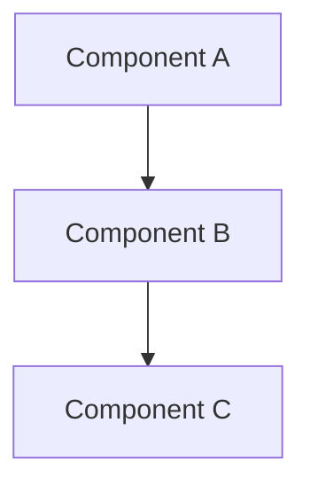

# Tutorial NNN: [Spec Title]

- **Spec:** [link to `context/spec/NNN-<slug>/`]
- **Status:** Draft | Reviewed
- **Author:** [Name]
- **Date:** YYYY-MM-DD
- **Prerequisites:** [Comma-separated list of prior tutorials this one assumes the reader has read, e.g. `001-<slug>`. Use `none` for the very first tutorial.]

---

## Overview

[One or two paragraphs. Narrative tone. Explain what this increment adds to the running project from the reader's perspective, and what the reader will learn by following this tutorial. Avoid implementation jargon in the opening — bring the reader in gently.]

---

## Concepts already covered (referenced, not re-taught)

[Auto-populated from prior tutorials' `concepts.md` files: list the concept slugs from earlier increments that this increment *actually re-uses*, with one-line reminders and a link to where each was introduced. Format:]

- **<kebab-slug>** — One-line reminder of what it is. (See [tutorial NNN](../NNN-<slug>/tutorial.md#<kebab-slug>).)
- **<kebab-slug>** — One-line reminder. (See [tutorial NNN](../NNN-<slug>/tutorial.md#<kebab-slug>).)

[Leave this section empty — or omit it entirely — if this is the first tutorial.]

---

## What's new this increment

[Bulleted summary mirroring `concepts.md` for this increment, but showing **only the human-readable titles** — slugs are internal dedup keys and don't appear in reader-facing text. Each title links down to the phase section in the Walkthrough where it's introduced.]

- [**Human-readable Title 1**](#phase-section-anchor) — One-line teaser of what the concept does.
- [**Human-readable Title 2**](#phase-section-anchor) — One-line teaser.

---

## Diagram

[Embed a markdown mermaid block when the increment introduces something *structural* — a new graph topology, a control flow, a multi-component sequence, or a new data shape. Skip this section entirely when the increment is purely additive prose with no structural change.]



---

## Walkthrough

[**One unified teaching artifact organized by *conceptual depth*, NOT by chronological execution order.** The walkthrough is depth-first / core-outward: the deepest concept of the increment is the root, and the next layers add concepts in order of foundational importance. UI specifics, project plumbing, and other peripheral concepts come last under a "For completeness" heading. **Do not** narrate the code in the order it executes — runtime order privileges accident over importance, and a learner doesn't learn a paradigm by reading a chronological tour of `__main__.py`.]

[Each section opens with a **design question** the reader could plausibly ask if they were building this from scratch — Socratic style. Three beats per section: **pose → present → apply**.]

- **Pose** the design question: *"How would we organize a turn-based multi-agent program with branching state?"*, *"How do nodes share data without each one knowing about all the others?"*, *"How does a real human participate inside an LLM-driven graph?"*.
- **Present** the framework / technology feature that answers it, by name. *"LangGraph offers `StateGraph` — a typed-state container with a topology of nodes and edges, compiled into something we can iterate one super-step at a time."* Be explicit: the reader should walk away knowing *both* the design problem *and* the named feature that solves it.
- **Apply** the feature with a 3–10-line illustrative snippet from the codebase, plus prose explaining how the project uses it. Use semantic code references (path + named function/class/method) — never `path:LINE`. Where multiple concepts compose into one design pattern, name the composition explicitly. Name concepts inline by their **human-readable title** (e.g. *"we lean on **replay-safe interrupt placement** here…"*); never show slugs in the tutorial body.

[Section ordering, deepest-to-most-peripheral:]

1. **The central paradigm / spine** (the root of the conceptual tree — e.g. for a LangGraph increment: "The state graph: structure, state, branching").
2. **Structural concepts that flow from the spine** (shared state representation, control-flow primitives).
3. **Execution-mechanics concepts** (checkpointing, streaming, persistence — the things that make the spine run).
4. **External integrations** (LLM calls, HTTP endpoints, IaC providers).
5. **Error recovery and edge cases** (validation retry, fallbacks).
6. **Observability** (tracing, logging — how we see what the system does).
7. **Decorative / secondary** concepts (UI specifics, async-bridge plumbing) — light treatment.
8. **For completeness** — peripheral plumbing (env config, stdio reconfig) — briefest treatment.

[Typical total section count: 5–8. Each section's heading names the **design problem** or **concept layer** it covers (e.g. "The state graph: structure, state, branching"), **not** a phase of runtime execution.]

### [Section 1 — the central paradigm; e.g. "The state graph: structure, state, branching"]

[Pose the design question this section answers: *"How would we organize a turn-based multi-agent program with branching state?"*.]

[Present the framework feature by name: *"LangGraph offers `StateGraph`…"*. Name explicitly — the reader leaves knowing what the technology is, not just what the code does.]

```python
# src/<module>.py — <enclosing function or class name>
# Short illustrative snippet (3–10 lines) showing the feature in this project.
# Use semantic references (path + named code element) — NEVER `path:LINE`.
```

[Apply: prose explaining how this project uses the feature. Name concepts inline by their human-readable titles. Where concepts compose, call it out: *"Because we already established **<Title A>**, we can now do **<Title B>**, which combines with **<Title C>** to deliver…"*. For tutorials past the first, also name which previously-introduced concepts from prior tutorials are being composed with.]

### [Section 2 — the next-most-foundational layer]

[Same shape: Pose → Present → Apply.]

[…continue with as many sections as the increment's depth structure has, typically 5–8 total. End with peripheral / completeness material under headings like "Decorating with a TUI" or "For completeness — project plumbing".]

---

## Try it

[Hands-on pointer. Tell the reader exactly which command to run, what to type or click, and what observable change in behaviour confirms the increment works. Reference any slice tests or smoke tests that exercise the new behaviour.]

---

## Where to go next

[Pointer to the next thing the reader should look at — typically the next tutorial in the chain, but may also point at related ADRs or CRs that explain *why* certain patterns landed where they did.]

- Next tutorial: [tutorial MMM](../MMM-<slug>/tutorial.md) (if one exists)
- Related ADRs: [link to relevant ADR(s) in `context/adr/`]
- Related CRs: [link to relevant CR(s) in `context/change-requests/`]
