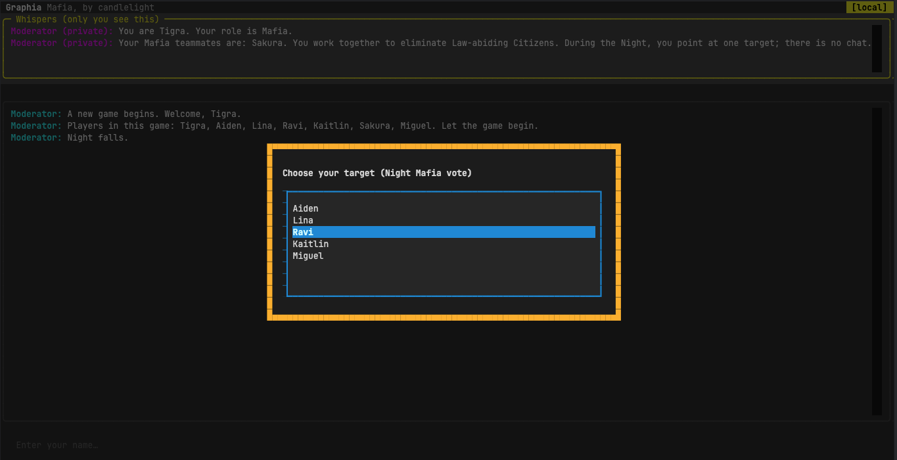
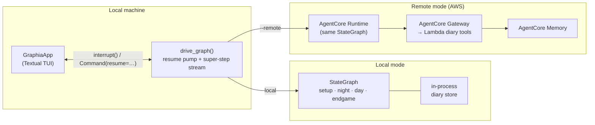

# Graphia

A single-player, console **Mafia** game that doubles as a hands-on reference implementation of advanced **LangGraph** orchestration and **AWS Bedrock AgentCore** deployment patterns — multi-agent state graphs, private per-agent state, human-in-the-loop interrupts, async streaming to a terminal UI, and an optional hosted runtime on AgentCore (Runtime + Gateway + Memory + Observability).

You play one human among six AI townsfolk. Some are Mafia. Survive the nights, argue through the days, and vote to execute the people you suspect — or get executed first.

> **Why it exists:** most multi-agent examples are toy tasks with no real deployment story. Graphia is a genuinely playable game whose source makes each advanced LangGraph and AgentCore concept easy to locate, run, and lift into a real project — both locally and against a hosted cloud runtime.



---

## Highlights

- **One Textual TUI driving one LangGraph `StateGraph`.** Night → Day phase alternation, first-night private Mafia introductions, asynchronous day chat, vote-to-execute, win detection, end-of-game recap.
- **Human-in-the-loop via `interrupt()` / `Command(resume=…)`.** The human's turns pause the graph and resume on input — the same way in local and hosted modes.
- **Two run modes, one codebase.** A no-AWS **local** mode for fast iteration, and a **remote** mode where the same compiled graph runs inside a Bedrock AgentCore Runtime. Selected with a single `--remote` flag.
- **AgentCore surface, demonstrated end-to-end.** Per-game diaries through an AgentCore Gateway-fronted tool surface, AgentCore Memory persistence, and CloudWatch observability with navigable per-session trace trees — all provisioned via Terraform.
- **Spec-driven, fully documented.** Built with the [AWOS](https://github.com/provectus/awos) workflow; every increment leaves behind a spec, a tech plan, a task list, and a learning tutorial under [`context/`](context/).

---

## Working with `make`

The repo-root [`Makefile`](Makefile) is the project's task runner — **prefer `make <target>` over invoking `uv`, `terraform`, `podman`/`docker`, or `aws` directly.** The targets wrap the multi-step workflows (image build → ECR push → Terraform apply → `.env` wiring, and the reverse for teardown), auto-load `.env`, derive the AWS account from your active profile, and run Terraform inside a pinned container via the `./tf` wrapper, so you get the same behaviour regardless of what's installed on your host.

Run `make help` to list everything. The targets you'll use most:

| Target | What it does |
|---|---|
| `make play` | Play a game in **local** mode (no AgentCore). |
| `make play-remote` | Play against the **deployed** AgentCore Runtime. |
| `make deploy` | First-time provision: build image, bootstrap ECR, push, `terraform apply`, wire `.env`. |
| `make redeploy` | Rebuild + push + apply for an existing stack (after code changes). |
| `make destroy` | Tear down the whole AgentCore stack (safe two-step ECR purge). |
| `make build` | Build just the runtime container image. |
| `make inspect-diary` | Pretty-print per-game diary entries from the deployed Memory. |

Direct commands (`uv run python -m graphia`, `terraform …`, `aws …`) still work and are documented below for clarity, but reach for `make` first.

---

## Quick start (local mode)

Requires [uv](https://docs.astral.sh/uv/) and Python ≥ 3.10. LLM calls go through Amazon Bedrock, so you need AWS credentials for a Bedrock-enabled account.

```bash
# 1. Point at a Bedrock-enabled AWS profile (set GRAPHIA_* and AWS_PROFILE in .env, or export):
export AWS_PROFILE=<your-aws-profile>
aws sso login --profile <your-aws-profile>     # if using SSO

# 2. Play (local mode — no AgentCore, runs entirely on your machine).
make play
```

`make play` runs `uv run python -m graphia` under the hood. Graphia is a Textual app — run it in a real terminal, not an IDE "run" console. Each game is fresh-random: role assignment, day-speech order, mafia-pointing fallbacks, and tie-breaks all draw from a non-seeded RNG (and AI dialogue is LLM-generated, which is inherently non-reproducible anyway).

**Controls:** type to speak on your turn; `/vote <name>` to call a vote to execute someone; `Esc` to quit (with a confirmation), `Ctrl+C` to force-quit.

---

## Play offline with Ollama

You can also run the full game entirely offline against a local [Ollama](https://ollama.com) server — zero cloud cost, no AWS account needed:

```bash
# 1. Install Ollama (https://ollama.com), then pull the recommended models:
ollama pull qwen3-coder:30b   # gameplay model (~19 GB download)
ollama pull qwen2.5:3b        # mechanical model (name generation)

# 2. Select the provider in .env:
#    GRAPHIA_LLM_PROVIDER=ollama

# 3. Play as usual:
make play
```

The recommended pair (`qwen3-coder:30b` + `qwen2.5:3b`) is the smoke-verified default. Other models can be configured via `GRAPHIA_OLLAMA_LARGE_MODEL` / `GRAPHIA_OLLAMA_SMALL_MODEL`, but they are **not smoke-verified** — weak models tend to answer in prose instead of making the structured tool call, and the game then falls back to canned lines. That is exactly what `make ollama-smoke ARGS="--models <large>,<small>"` exists to check: run it against any candidate pair before committing to a game with it.

Note that AI dialogue quality depends on the local model and is not guaranteed to match the cloud provider's.

Ollama mode is fully offline by construction: any deployed stack's Memory/Gateway ids in your `.env` (`GRAPHIA_MEMORY_ID`, `GRAPHIA_CAREER_MEMORY_ID`, Gateway ids) are automatically ignored, so there is nothing to hand-edit — career stats persist locally to the stats file, and cloud stats resume as soon as you switch the provider back to `bedrock`.

---

## Remote mode (hosted on AgentCore)

The same game can run against a deployed AgentCore Runtime, provisioned by the Terraform module in [`infra/terraform/`](infra/terraform/README.md) and driven entirely through `make`:

```bash
make deploy        # build image, provision Runtime + Gateway + Memory + Observability, wire .env
make play-remote   # play against the deployed Runtime
make destroy       # tear it all down
```

The AWS account ID is derived from your active profile; no account or profile names are baked into source. See [`infra/terraform/README.md`](infra/terraform/README.md) for prerequisites and the full deploy/destroy walkthrough.

**Terraform runs inside a container — you don't install it.** Every `terraform` invocation goes through the [`infra/terraform/tf`](infra/terraform/tf) wrapper, which auto-detects **Podman or Docker** (either works) and runs a **pinned `hashicorp/terraform:1.13.1`** image, mounting the repo and your `~/.aws` config and forwarding `AWS_PROFILE`. The only host prerequisite for the IaC layer is a container runtime — no local Terraform install, and no "works on my Terraform version" drift: everyone and CI run the exact same Terraform + provider versions. The `make` targets call `./tf` for you, so you rarely invoke it directly.

---

## Testing

```bash
uv run pytest -q
```

The suite is fully mocked at the `ChatBedrockConverse` boundary (an autouse fixture fails loudly if any test reaches real Bedrock), so it runs offline and deterministically.

### AI-quality evals (real model, outside `pytest`)

Beyond the mocked unit suite, several `make` targets exercise the *actual* AI behaviour against a live gameplay model (Bedrock **or** local Ollama) to catch quality regressions the mocked tests structurally can't — e.g. AI players echoing each other into a repetition spiral, or an AI voting to execute itself. `make blunder-eval` additionally accumulates a **repo-committed quality ledger** ([`evals/blunder-ledger.yaml`](evals/README.md)) — each run a provenance-stamped record with per-metric Wilson confidence intervals, so AI quality is a tracked, diffable property ("baby MLOps") rather than a one-off terminal report:

| Target | What it does |
|---|---|
| `make eval-dialogue` | Plays N real-LLM games with a scripted human and scores AI Day-speech repetition (lexical near-duplicate rate). A quick diversity smoke. |
| `make repetition-experiment` | The rigorous, **paired A/B** harness — ranks prompt / context-window / temperature fixes across conditions with a name-masked similarity metric and bootstrap confidence intervals. Design + results: [`repetition-experiment-design.md`](context/spec/009-ai-collusion-awareness/repetition-experiment-design.md). |
| `make blunder-eval` | Plays N games against a chosen provider and counts the AI **self-consistency blunder** family (self-vote, Mafioso peer-vote, third-person self-talk) **plus** repetition, then appends one dated record to [`evals/blunder-ledger.yaml`](evals/README.md). Works for **both** providers; run it per provider for directly comparable records. `ARGS="--provider ollama\|bedrock --games N [--seed S] [--note '...']"`. |

These reach a real model (so they're non-deterministic) and live **outside** `pytest`. The Bedrock path costs tokens; `make blunder-eval` also runs against a local Ollama server (zero cloud cost). Use `eval-dialogue` / `repetition-experiment` to A/B any change to AI dialogue — run on `HEAD`, then on a pre-change checkout, and compare — and `blunder-eval` to build up the committed quality ledger over time.

---

## How it works



- **Graph topology** lives in `src/graphia/graph.py`; nodes are grouped by phase under `src/graphia/nodes/`.
- **State** is one `GameState` `TypedDict` with reducers (`src/graphia/state.py`); "private" messages are a convention carried in message metadata and filtered by the UI.
- **The driver** (`src/graphia/driver.py`) iterates the synchronous graph stream inside a worker thread so it never blocks Textual's event loop, and pumps one resume value per super-step.

**For the detailed, current diagrams** (kept up to date in the per-increment tutorials):

- **Full compiled-graph topology** — every phase, node, and conditional edge of the game loop: [Tutorial 001 → Diagram](context/tutorials/001-playable-skeleton/tutorial.md#diagram).
- **Hosted AgentCore deployment topology** — Client → Runtime → Gateway → Lambda → Memory, end to end: [Tutorial 002 → Diagram](context/tutorials/002-hosted-agentcore-deployment/tutorial.md#diagram).
- **The `/vote` re-prompt control flow** — single-interrupt-per-node loop: [Tutorial 004 → Diagram](context/tutorials/004-robust-vote-input-validation/tutorial.md#diagram).

---

## Repository layout

| Path | What's there |
|---|---|
| [`src/graphia/`](src/graphia/) | The game: graph, nodes, state, driver, Textual UI, config. Entry point: `python -m graphia`. |
| [`infra/terraform/`](infra/terraform/) | Terraform module + `./tf` container wrapper provisioning the AgentCore stack. |
| [`tests/`](tests/) | Pytest suite, all-mocked at the Bedrock boundary. |
| [`context/`](context/) | The AWOS artifacts — see below. |
| [`Makefile`](Makefile) | Task runner (see [Working with `make`](#working-with-make)). |

---

## Built with AWOS (and our extensions)

Graphia is developed with **[AWOS](https://github.com/provectus/awos)** — Provectus's AI workflow for spec-driven development. Each feature flows through a chain of slash commands, every stage reading the previous stage's artifact and writing the next:

`product → roadmap → architecture → spec → tech → tasks → implement → verify → tutorial`

All artifacts live under [`context/`](context/) and are navigable here on GitHub:

- **Product & direction:** [`product-definition.md`](context/product/product-definition.md) · [`roadmap.md`](context/product/roadmap.md) · [`architecture.md`](context/product/architecture.md)
- **Specs** (functional spec + tech considerations + task list per increment): [`context/spec/`](context/spec/) — e.g. [`001-playable-skeleton`](context/spec/001-playable-skeleton/), [`002-hosted-agentcore-deployment`](context/spec/002-hosted-agentcore-deployment/), [`004-robust-vote-input-validation`](context/spec/004-robust-vote-input-validation/)

### Our extensions to AWOS

Three skills were added on top of the base chain and are a core part of how this project stays legible over time. They live in [`.awos/commands/`](.awos/commands/) and write into `context/`:

- **Change Requests** — [`/awos:change-request`](.awos/commands/change-request.md) → [`context/change-requests/`](context/change-requests/). Logged whenever a *previously-agreed requirement* shifts (scope, roadmap order, success criteria). Captured at the business-value level, kept separate from implementation detail. See e.g. [CR 001 — AgentCore + tool-use into scope](context/change-requests/001-agentcore-and-tools-in-scope.md) and [CR 003 — observability trace trees](context/change-requests/003-observability-navigable-trace-trees.md).
- **Architecture Decision Records** — [`/awos:adr`](.awos/commands/adr.md) → [`context/adr/`](context/adr/). Logged whenever an *architectural* choice is made or revised (deployment target, region, data store, vendor trade-off). Each records Context · Alternatives · Decision · Rationale · Consequences, and survives rewrites of the architecture doc. See e.g. [ADR 001 — hosted Runtime + local mode](context/adr/001-hosted-agentcore-with-local-mode.md), [ADR 003 — Bedrock Nova over Claude](context/adr/003-bedrock-nova-over-claude.md), [ADR 005 — Gateway tools via Lambda targets](context/adr/005-gateway-tools-via-lambda-targets.md).
- **Per-increment Tutorials** — [`/awos:tutorial`](.awos/commands/tutorial.md) → [`context/tutorials/`](context/tutorials/README.md). A narrative learning artifact for each completed increment, teaching the concepts it introduced (depth-first, Socratic), with concept dedup against earlier tutorials so nothing is re-taught. See the **[tutorials index](context/tutorials/README.md)** for the reading order; start with [Tutorial 001 — playable skeleton](context/tutorials/001-playable-skeleton/tutorial.md), or jump to [Tutorial 004](context/tutorials/004-robust-vote-input-validation/tutorial.md) for a standalone read on a LangGraph interrupt/resume gotcha.

How they relate: a **CR** records *what* changed in the requirements and *why*; an **ADR** records *how* an architectural question was settled; a **tutorial** explains, after the fact, *how the result works* so a returning reader (or a curious dev) can learn the pattern without reading every commit.

### Also a spec-driven coding experiment

Beyond the LangGraph/AgentCore content, Graphia was a deliberate experiment in **how far the usually-tedious lifecycle paperwork can be automated** when an AI assistant drives a spec-driven workflow. The verdict — at least for a greenfield project like this one — is that the "bureaucratic" steps that teams routinely skip or defer came out roughly **90% automated**:

- **ADRs and CRs** fall out of the moment a decision or a requirement actually changes, captured in the same conversation that made the change — rather than being reconstructed weeks later (when the rationale has evaporated) or never written at all.
- **Documentation and per-increment tutorials** are the clearest win. It's normally hard to remember every gotcha worth writing down — the subtle interrupt/resume contract, the IAM permission that was the *real* root cause behind a flat trace tree, the bug a mocked test structurally couldn't catch. Generated alongside the work, from the spec + the diff + the surprises hit on the way, the tutorials capture those lessons while they're still fresh.
- **The project timeline** ([`context/project-timeline.md`](context/project-timeline.md)) stays current as a side effect of the same flow, instead of being a stale doc nobody updates.

The artifacts in [`context/`](context/) aren't decoration after the fact — they're the running record the workflow produced as the code was written. That's the experiment: keep the engineering legible without the legibility being a chore.

---

## Status

Graphia is built incrementally and is an active personal reference project. Phases 1–2 (playable skeleton + hosted AgentCore deployment) are complete; later phases (long-term cross-game memory, AI provider flexibility, richer night resolution, personas) are tracked in [`context/product/roadmap.md`](context/product/roadmap.md).
