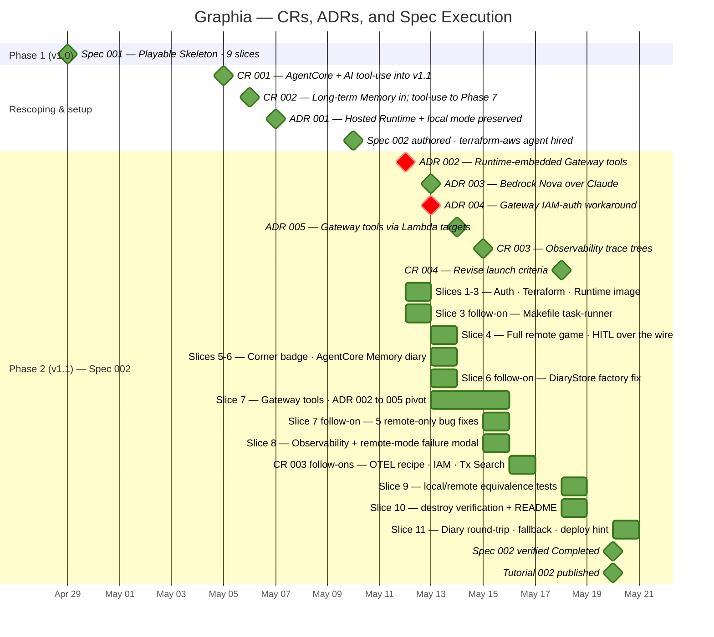
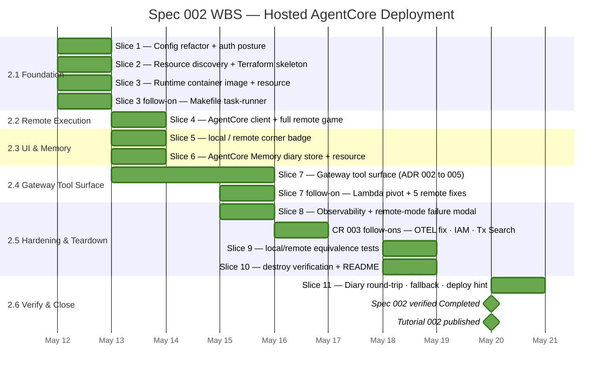

# Graphia — Project Timeline

A high-level history of the project, reconstructed from `git log` and the
`context/` artifacts: how scope changed (Change Requests), how the architecture
was decided (Architecture Decision Records), and how the work was executed (specs
broken into vertical slices). Covers **2026-04-29 → 2026-05-20**.

Graphia is built with the **AWOS spec-driven workflow** — every increment flows
`product → roadmap → architecture → spec → tech → tasks → implement → verify → tutorial`,
with CRs logging scope shifts and ADRs logging architectural decisions along the way.

---

## Timeline

**How to read it.** Each visual channel encodes exactly one thing:

- **Colour = status.** Green = completed / accepted / in effect · Red = superseded · Orange = pending or in-flight (none on this chart now Phase 2 is closed; reserved for the next active phase).
- **Shape = kind.** Diamonds are point events (CRs, ADRs, spec milestones); bars are executed slice work spanning real days.
- **Sections = project phase.** ADRs are listed first within Phase 2, then the slice bars, so a superseded ADR (red diamond) is never mistaken for blocked work.

So the only red marks are the two superseded ADRs (002, 004); the CRs are green because — even though CR 001 and 002 carried `Proposed` for a while — the scope changes were fully executed and have now been formally Accepted. No orange remains until Phase 3 begins.

---

## Work breakdown structure

The timeline above shows *when*; this shows *what* — each spec decomposed into
work areas and the vertical slices under them. Slice level is the leaf here; every
slice decomposes further into the sub-task checklist in its spec's `tasks.md`.

A WBS can be drawn two ways here. **Spec 001** uses a flowchart tree — it shipped
in a single commit, so there is no per-slice schedule to plot. **Spec 002** uses a
*gantt* instead: gantt sections carry the WBS work areas and the slice tasks carry
real dates, so the same breakdown doubles as a schedule. (A gantt nests only two
levels — section → task — so the spec name sits in the title rather than as a
tree root.)

### Spec 001 — Playable Skeleton

```mermaid
flowchart TB
    S1["Spec 001 — Playable Skeleton<br/>Status: Completed · 9 slices"]:::spec
    subgraph G11 ["1.1 Bootstrap & Roster"]
        direction TB
        T1["Slice 1 — App boot, name entry, logging"]:::done
        T2["Slice 2 — Roster + public Moderator intro"]:::done
        T3["Slice 3 — Live AI names via Haiku"]:::done
        T4["Slice 4 — Role assignment + private reveal"]:::done
    end
    subgraph G12 ["1.2 Core Game Loop"]
        direction TB
        T5["Slice 5 — Night 1 end-to-end"]:::done
        T6["Slice 6 — Day 1 speaking + victim reveal"]:::done
        T7["Slice 7 — Vote-to-execute mechanics"]:::done
    end
    subgraph G13 ["1.3 Endgame & Polish"]
        direction TB
        T8["Slice 8 — Win detection + end-of-game screen"]:::done
        T9["Slice 9 — Polish: spectator, Ctrl-C, draw cap"]:::done
    end
    S1 --> G11
    S1 --> G12
    S1 --> G13
    classDef spec fill:#3d85c6,stroke:#0b5394,color:#fff
    classDef done fill:#6aa84f,stroke:#38761d,color:#fff
    classDef pending fill:#e69138,stroke:#b45f06,color:#fff
```

### Spec 002 — Hosted AgentCore Deployment (WBS as a gantt)

Sections are the WBS work areas; tasks are the slices, carrying real dates.

_Colour scheme matches the timeline: green = done. All Spec 002 slice dates are
now actual. The Spec 001 flowchart uses blue for the spec (WBS root) and grey for
a work area (a grouping, not itself executable)._

---

## What was going on — three acts

### Act 1 — Phase 1: a playable skeleton (2026-04-29)

The project began as a complete, end-to-end console Mafia game: a fixed 7-player
lineup, Night→Day phase alternation, single-round kill/execute voting, and
human-in-the-loop turns. This was **Spec 001 — Playable Skeleton** (9 vertical
slices), and it landed as the initial commit — proving the core LangGraph loop
worked before any flexibility or cloud deployment was layered on.

### Act 2 — Rescoping: two Change Requests reshape v1 (2026-05-05 → 05-06)

Two CRs, logged a day apart, redefined what v1 means:

- **CR 001** promoted **Bedrock AgentCore deployment** from an optional future
  item to a **hard v1.1 requirement** — Graphia must demonstrate AgentCore as a
  real production deployment target. It also first introduced AI tool-use as a
  v1.1 feature.
- **CR 002** (next day) added a second AgentCore use-pattern — **long-term,
  cross-game Memory** for career stats — as hard v1.2 scope, and **demoted AI
  tool-use to Phase 7**. The demotion follows Graphia's *design-driven-by-realistic-needs*
  principle: a feature earns a slot only when the game genuinely needs it.

Net result — the roadmap was restructured: **Phase 2** = Hosted AgentCore
Deployment, **Phase 3** = Long-Term Cross-Game Memory, **Phase 7** = AI Tool-Use.
Between the CRs and the first Phase 2 code, the spec was authored and a
specialist **`terraform-aws` agent was hired** (2026-05-10) to own the IaC.

### Act 3 — Phase 2: hosting Graphia on AgentCore (2026-05-12 → 05-20)

**Spec 002 — Hosted AgentCore Deployment** shipped slice by slice over nine days:

- **ADR 001** set the foundational shape: run the same LangGraph topology in two
  modes — a hosted AgentCore Runtime *and* a no-AWS local mode.
- **Slices 1-3** (05-12) delivered the config/auth refactor (AWS credential chain
  replaces the bearer token), the Terraform module skeleton, and the Runtime
  container image (~330 MB, multi-stage).
- **Slice 3 follow-on** (05-12) turned the Makefile into the project task-runner
  and added an ECR force-delete safeguard — work surfaced by the first real
  deploy/destroy cycle.
- **Slice 4** (05-13) was the headline: a full game played end-to-end against the
  hosted Runtime, with `interrupt()` / `Command(resume=…)` HITL turns
  round-tripped over the wire. A subtle bug — AgentCore routing by an unstable
  session id — caused an infinite "enter your name" loop until session ids were
  pinned via `uuid5`.
- **ADR 003** (05-13) swapped the model family — forced, not chosen: every viable
  Anthropic Claude model on Bedrock was end-of-life, inference-profile-only, or
  too small, and the `us.*` cross-region profile fanned out to regions where the
  role couldn't auto-subscribe. **Amazon Nova Pro + Lite** invoke directly in
  `us-east-1` with no profile.
- **Slices 5-6** (05-13) added the `[local]`/`[remote]` UI badge and the
  AgentCore Memory-backed diary store behind a `DiaryStore` Protocol.
- **Slice 6 follow-on** (05-13) fixed a silent bug a USER smoke test caught — the
  diary-store factory gated on `remote_mode` instead of `memory_id`, so the
  Runtime fell back to an in-process store and diary writes vanished when the
  microVM cycled.
- **Slice 7** (05-13 → 05-15) was the hard one — see below.
- **Slice 8** (05-15) wired AgentCore Observability and the remote-mode failure
  modal: structured trace events, a 30-day CloudWatch retention policy, and a UI
  surface so a remote-only error reaches the human instead of dying silently.
- **CR 003** (05-15) — written the same day as Slice 8 landed — sharpened the
  observability acceptance criterion from "structured logs exist" to "a navigable
  per-session trace tree exists in CloudWatch Transaction Search". The next day
  (05-16) the trace tree was still flat, which forced three follow-on fixes: the
  Runtime's OpenTelemetry / OpenInference LangChain instrumentation recipe was
  corrected, the execution role gained the missing observability permissions
  (the real root cause), and the Transaction Search log resource policy was
  brought under Terraform management.
- **Slice 9** (05-18) added the local↔remote equivalence test suite — same
  initial state played through both drivers produces the same node sequence and
  end-game state, guarding against silent mode drift.
- **Slice 10** (05-18) closed teardown: a `terraform destroy` cycle verified
  against live AWS state, an `aws-inventory` harness that lists every Graphia
  resource by tag, and a README walkthrough for the deploy/destroy loop.
- **CR 004** (05-18) was authored *by* the first `/awos:verify` pass — three
  §2.1/§2.2 acceptance criteria described error behaviour the delivered design
  intentionally handled differently (collapsed config errors, hint-driven setup
  flow), and §2.4.2 promised a diary write/read **round-trip** but only the
  write half was wired. CR 004 revised the launch criteria *and* planned Slice
  11 to close the §2.4.2 gap.
- **Slice 11** (05-20) added the gameplay-time diary read-back, a graceful
  Memory fallback so a transient Memory outage degrades instead of crashing, and
  a deploy-hint banner that prints the exact next command when remote config is
  missing. With Slice 11 in, **`/awos:verify` flipped Spec 002 to Completed** the
  same day, and **Tutorial 002** — a single depth-first walkthrough covering all
  eleven slices — was published. **107/107 tests pass**, **85/85 task items
  done**, Phase 2 closed.

---

## The Slice 7 saga (2026-05-13 → 05-15)

The single most eventful stretch. ADR 002 had chosen *runtime-embedded* Gateway
tool handlers — one container hosting both the agent and the MCP tool server.

1. **First attempt (05-13)** built a FastMCP server inside the Runtime and the
   Gateway resources around it (`mcp_server`-type targets).
2. **ADR 004 (05-13)** logged a provider-gap workaround: `hashicorp/aws 6.44.0`
   couldn't express the IAM credential provider that `mcp_server` targets need.
3. **The wall:** an AgentCore Runtime's `protocol_configuration` is mutually
   exclusive — `HTTP` (agent stream) vs `MCP` (tool server). One container
   cannot host both.
4. **ADR 005 (05-14)** superseded ADR 002 outright: pivot to **Lambda-target
   Gateway tools** — the canonical AgentCore pattern, no protocol clash. Two
   zip-deployed Lambdas replaced the in-Runtime FastMCP server.
5. **Five remote-only bugs (05-15)**, each invisible to the all-mocked test
   suite, surfaced and were fixed one by one: an `asyncio.run()`-in-running-loop
   crash, an `httpx.Auth` `isinstance` check new in `mcp 1.27+`, Gateway's
   `<target>___<tool>` tool-name namespacing, macOS wheels shipped in the Linux
   Lambda zips, and three UI methods reading an empty local graph state.
6. With Lambda targets working, **ADR 004's workaround became moot** and was
   marked superseded too.

---

## Spec 002 slice ledger

| Date  | Increment                | What shipped                                          | Tests | Tasks   |
| ----- | ------------------------ | ----------------------------------------------------- | ----- | ------- |
| 05-12 | Slices 1-3               | Auth refactor · Terraform skeleton · Runtime image    | —     | 15/59   |
| 05-12 | Slice 3 follow-on        | Makefile task-runner · ECR force-delete safeguard     | —     | 23/67   |
| 05-13 | Slice 4                  | Full game vs hosted Runtime · HITL over the wire      | 42    | 38/67   |
| 05-13 | Nova switch (ADR 003)    | Anthropic Claude → Amazon Nova Pro/Lite               | 41    | —       |
| 05-13 | Slices 5-6               | `[local]`/`[remote]` badge · AgentCore Memory diary   | 62    | 40/66   |
| 05-13 | Slice 6 follow-on        | DiaryStore factory fix · `inspect-diary` utility      | 62    | —       |
| 05-13 | Slice 7 (1st attempt)    | FastMCP server + Gateway resources (ADR 002 shape)    | 83    | 47/66   |
| 05-14 | Slice 7 pivot (ADR 005)  | Lambda-target Gateway tools; FastMCP server removed   | 80    | —       |
| 05-15 | Slice 7 bug fixes        | 5 remote-only defects fixed                           | 83    | 61/76   |
| 05-15 | Slice 8                  | Observability + 30-day retention + failure modal      | 92    | 70/76   |
| 05-16 | CR 003 follow-ons        | OTEL recipe fix · IAM permissions · Tx Search policy  | 93    | —       |
| 05-18 | Slice 9                  | local↔remote equivalence test suite                   | 100   | 76/82   |
| 05-18 | Slice 10                 | `terraform destroy` verification · README walkthrough | 102   | 80/82   |
| 05-18 | CR 004 / Slice 11 plan   | Revised §2.1/§2.2 launch criteria; §2.4.2 read-back   | 102   | 80/85   |
| 05-20 | Slice 11                 | Diary round-trip · Memory fallback · deploy hint      | 107   | 85/85   |
| 05-20 | Spec 002 Verified         | `/awos:verify` flipped Status → Completed             | 107   | 85/85   |
| 05-20 | Tutorial 002              | Full 7-section walkthrough + companion concept ledger | 107   | 85/85   |

_The task denominator drifts (59 → 67 → 66 → 76 → 82 → 85) because each slice's
planning and its follow-on subsections add or revise sub-tasks; the final 85
covers Slices 1-11. The test count dips twice — 42 → 41 at the Nova switch (one
prompt-pinned test referenced a Claude-specific schema and was retired) and
83 → 80 at the ADR-005 pivot (four obsolete FastMCP server-side tests deleted) —
then climbs to 107 as Slices 8-11 add observability, equivalence, and round-trip
coverage._

---

## Two recurring themes from the history

- **Real deploys find what mocked tests can't.** Every Phase 2 slice with cloud
  surface area spawned a "follow-on" of bug fixes that only a real `terraform
  apply` + `--remote` game surfaced: the Slice 3 deploy/destroy cycle, the Slice 6
  vanishing-diary factory bug, the Slice 7 five-bug chain, the Slice 8 flat
  trace tree (fixed by IAM permissions, not by the OTEL recipe — the natural
  first guess), and the §2.4.2 round-trip gap that `/awos:verify` itself caught
  *after* all the slice-level checks were green. The all-mocked pytest suite
  stays green throughout — it guards regressions, not integration reality.
- **The workflow tooling was built alongside the project.** The AWOS commands
  themselves were authored mid-stream: `/awos:change-request` (05-05),
  `/awos:adr` (05-10), `/awos:tutorial` (05-12). The process and the product
  co-evolved.

---

## Change Requests

| CR  | Date       | Title                                                              | Status   |
| --- | ---------- | ------------------------------------------------------------------ | -------- |
| 001 | 2026-05-05 | AgentCore deployment + AI tool-use promoted to v1.1 scope          | Accepted |
| 002 | 2026-05-06 | Long-term AgentCore Memory in; AI tool-use demoted to Phase 7      | Accepted |
| 003 | 2026-05-15 | AgentCore Observability delivers navigable per-session trace trees | Accepted |
| 004 | 2026-05-18 | Revise §2.2 launch error handling and the §2.1 next-step hint      | Accepted |

## Architecture Decision Records

| ADR | Date       | Title                                              | Status                |
| --- | ---------- | -------------------------------------------------- | --------------------- |
| 001 | 2026-05-07 | Hosted AgentCore Runtime with preserved local mode | Accepted              |
| 002 | 2026-05-12 | Runtime-embedded Gateway tool handlers             | Superseded by ADR 005 |
| 003 | 2026-05-13 | Bedrock model family — Amazon Nova over Claude     | Accepted              |
| 004 | 2026-05-13 | Gateway target IAM-auth via CLI workaround         | Superseded by ADR 005 |
| 005 | 2026-05-14 | Gateway tools via Lambda targets                   | Accepted              |

## Specs & tutorials

| Spec | Title                       | Slices | Status    |
| ---- | --------------------------- | ------ | --------- |
| 001  | Playable Skeleton           | 9      | Completed |
| 002  | Hosted AgentCore Deployment | 11     | Completed |

Per-increment learning tutorials live under `context/tutorials/`: `001` and the
final `002` (depth-first walkthrough of all eleven Spec 002 slices, published
2026-05-20). An interim `002-hosted-agentcore-deployment-v2` draft (Slices 1-4 +
the Nova switch, pre-Lambda-pivot) sits next to it as a historical artifact and
will be removed when no longer interesting.

---

## What's next

With Phase 2 closed (Spec 002 verified, Tutorial 002 published), the roadmap's
next item is **Phase 3 — Long-Term Cross-Game Memory & Career Stats**, started
via `/awos:spec`. From the AWOS chain that means: spec → tech → tasks →
implement-by-slice → verify → tutorial, with CRs and ADRs logged along the way.
