# Graphia — Project Timeline

A high-level history of the project, reconstructed from `git log` and the
`context/` artifacts: how scope changed (Change Requests), how the architecture
was decided (Architecture Decision Records), and how the work was executed (specs
broken into vertical slices). Covers **2026-04-29 → 2026-05-27**.

Graphia is built with the **AWOS spec-driven workflow** — every increment flows
`product → roadmap → architecture → spec → tech → tasks → implement → verify → tutorial`,
with CRs logging scope shifts and ADRs logging architectural decisions along the way.

---

## Timeline

> **Interactive (clickable) version:** [open the timeline as a live HTML page](https://rawcdn.githack.com/tigra/graphia/main/context/project-timeline.html) — clicking any milestone or slice bar opens its source artifact on GitHub. (GitHub blocks click-through navigation from mermaid diagrams embedded in markdown, so the HTML rendering is the workaround.)

```mermaid
%%{init: {'theme': 'base', 'themeVariables': {'background': '#2d2d2d', 'textColor': '#e6e6e6', 'sectionBkgColor': '#3c3c3c', 'altSectionBkgColor': '#333333', 'gridColor': '#555555', 'doneTaskBkgColor': '#6aa84f', 'doneTaskBorderColor': '#38761d', 'activeTaskBkgColor': '#e69138', 'activeTaskBorderColor': '#b45f06', 'excludeBkgColor': '#7d5630', 'taskTextColor': '#e6e6e6', 'taskTextLightColor': '#ffffff', 'taskTextDarkColor': '#ffffff', 'taskTextClickableColor': '#9ecbff', 'taskTextOutsideColor': '#e6e6e6'}}}%%
gantt
    title Graphia — CRs, ADRs, and Spec Execution
    dateFormat YYYY-MM-DD
    axisFormat %b %d
    excludes weekends

    section Phase 1 (v1.0)
    Spec 001 — Playable Skeleton · 9 slices             :milestone, done, sp1, 2026-04-29, 0d

    section Rescoping & setup
    CR 001 — AgentCore + AI tool-use into v1.1           :milestone, done, m1, 2026-05-05, 0d
    CR 002 — Long-term Memory in; tool-use to Phase 7    :milestone, done, m2, 2026-05-06, 0d
    ADR 001 — Hosted Runtime + local mode preserved      :milestone, done, a1, 2026-05-07, 0d
    Spec 002 authored · terraform-aws agent hired        :milestone, done, sp2, 2026-05-10, 0d

    section Phase 2 (v1.1) — Spec 002
    ADR 002 — Runtime-embedded Gateway tools             :milestone, crit, a2, 2026-05-12, 0d
    ADR 003 — Bedrock Nova over Claude                   :milestone, done, a3, 2026-05-13, 0d
    ADR 004 — Gateway IAM-auth workaround                :milestone, crit, a4, 2026-05-13, 0d
    ADR 005 — Gateway tools via Lambda targets           :milestone, done, a5, 2026-05-14, 0d
    CR 003 — Observability trace trees                   :milestone, done, c3, 2026-05-15, 0d
    CR 004 — Revise launch criteria                      :milestone, done, c4, 2026-05-18, 0d
    Slices 1-3 — Auth · Terraform · Runtime image        :done, s13, 2026-05-12, 1d
    Slice 3 follow-on — Makefile task-runner             :done, s3f, 2026-05-12, 1d
    Slice 4 — Full remote game · HITL over the wire      :done, s4, 2026-05-13, 1d
    Slices 5-6 — Corner badge · AgentCore Memory diary   :done, s56, 2026-05-13, 1d
    Slice 6 follow-on — DiaryStore factory fix           :done, s6f, 2026-05-13, 1d
    Slice 7 — Gateway tools · ADR 002 to 005 pivot       :done, s7, 2026-05-13, 3d
    Slice 7 follow-on — 5 remote-only bug fixes          :done, fix, 2026-05-15, 1d
    Slice 8 — Observability + remote-mode failure modal  :done, s8, 2026-05-15, 1d
    CR 003 follow-ons — OTEL recipe · IAM · Tx Search    :done, s8f, 2026-05-16, 1d
    Slice 9 — local/remote equivalence tests             :done, s9, 2026-05-18, 1d
    Slice 10 — destroy verification + README             :done, s10, 2026-05-18, 1d
    Slice 11 — Diary round-trip · fallback · deploy hint :done, s11, 2026-05-20, 1d
    Spec 002 verified Completed                          :milestone, done, sp2v, after s11, 0d
    Tutorial 002 published                               :milestone, done, sp2t, after sp2v, 0d

    section Polish & publish (v1.1.x)
    Spec 003 — Reliable game exit (Esc quit modal)       :done, sp3, 2026-05-22, 1d
    Spec 004 — Robust /vote validation + driver fix      :done, sp4, 2026-05-22, 1d
    Tutorial 004 published                               :milestone, done, t4, after sp4, 0d
    Published to GitHub (tigra/graphia) + README         :milestone, done, pub, 2026-05-22, 1d

    section Spec 005 — Play-as-role + determinism posture
    Slices 1-2 — GRAPHIA_ROLE feature + make passthrough :done, sp5s12, 2026-05-23, 1d
    ADR 006 — Test role-pinning via GRAPHIA_ROLE         :milestone, done, a6, 2026-05-23, 0d
    Slices 3-4 — Test-suite migration to GRAPHIA_ROLE    :done, sp5s34, 2026-05-23, 2d
    Slice 5 — Retire GRAPHIA_SEED from production        :done, sp5s5, 2026-05-24, 1d
    Spec 005 verified Completed                          :milestone, done, sp5v, after sp5s5, 0d
    Tutorial 005 published                               :milestone, done, t5, after sp5v, 0d

    section Phase 3 (v1.2) — Spec 006 kickoff
    Spec 006 — Cross-Game Career Stats drafted           :milestone, active, sp6, 2026-05-25, 0d
    Spec 006 tech-considerations                         :milestone, active, sp6t, 2026-05-25, 0d
    ADR 007 — Self-authored long-term Memory records     :milestone, active, a7, 2026-05-25, 0d
    ADR 008 — Client-owned stats via running totals      :milestone, active, a8, 2026-05-25, 0d

    click sp1 href "https://github.com/tigra/graphia/tree/main/context/spec/001-playable-skeleton"
    click m1 href "https://github.com/tigra/graphia/blob/main/context/change-requests/001-agentcore-and-tools-in-scope.md"
    click m2 href "https://github.com/tigra/graphia/blob/main/context/change-requests/002-long-term-memory-for-cross-game-stats.md"
    click a1 href "https://github.com/tigra/graphia/blob/main/context/adr/001-hosted-agentcore-with-local-mode.md"
    click sp2 href "https://github.com/tigra/graphia/tree/main/context/spec/002-hosted-agentcore-deployment"
    click a2 href "https://github.com/tigra/graphia/blob/main/context/adr/002-runtime-embedded-gateway-tool-handlers.md"
    click a3 href "https://github.com/tigra/graphia/blob/main/context/adr/003-bedrock-nova-over-claude.md"
    click a4 href "https://github.com/tigra/graphia/blob/main/context/adr/004-gateway-target-iam-auth-cli-workaround.md"
    click a5 href "https://github.com/tigra/graphia/blob/main/context/adr/005-gateway-tools-via-lambda-targets.md"
    click c3 href "https://github.com/tigra/graphia/blob/main/context/change-requests/003-observability-navigable-trace-trees.md"
    click c4 href "https://github.com/tigra/graphia/blob/main/context/change-requests/004-revise-launch-error-handling-criteria.md"
    click s13 href "https://github.com/tigra/graphia/blob/main/context/spec/002-hosted-agentcore-deployment/tasks.md"
    click s3f href "https://github.com/tigra/graphia/blob/main/context/spec/002-hosted-agentcore-deployment/tasks.md"
    click s4 href "https://github.com/tigra/graphia/blob/main/context/spec/002-hosted-agentcore-deployment/tasks.md"
    click s56 href "https://github.com/tigra/graphia/blob/main/context/spec/002-hosted-agentcore-deployment/tasks.md"
    click s6f href "https://github.com/tigra/graphia/blob/main/context/spec/002-hosted-agentcore-deployment/tasks.md"
    click s7 href "https://github.com/tigra/graphia/blob/main/context/spec/002-hosted-agentcore-deployment/tasks.md"
    click fix href "https://github.com/tigra/graphia/blob/main/context/spec/002-hosted-agentcore-deployment/tasks.md"
    click s8 href "https://github.com/tigra/graphia/blob/main/context/spec/002-hosted-agentcore-deployment/tasks.md"
    click s8f href "https://github.com/tigra/graphia/blob/main/context/spec/002-hosted-agentcore-deployment/tasks.md"
    click s9 href "https://github.com/tigra/graphia/blob/main/context/spec/002-hosted-agentcore-deployment/tasks.md"
    click s10 href "https://github.com/tigra/graphia/blob/main/context/spec/002-hosted-agentcore-deployment/tasks.md"
    click s11 href "https://github.com/tigra/graphia/blob/main/context/spec/002-hosted-agentcore-deployment/tasks.md"
    click sp2v href "https://github.com/tigra/graphia/blob/main/context/spec/002-hosted-agentcore-deployment/functional-spec.md"
    click sp2t href "https://github.com/tigra/graphia/blob/main/context/tutorials/002-hosted-agentcore-deployment/tutorial.md"
    click sp3 href "https://github.com/tigra/graphia/tree/main/context/spec/003-reliable-game-exit"
    click sp4 href "https://github.com/tigra/graphia/tree/main/context/spec/004-robust-vote-input-validation"
    click t4 href "https://github.com/tigra/graphia/blob/main/context/tutorials/004-robust-vote-input-validation/tutorial.md"
    click pub href "https://github.com/tigra/graphia"
    click sp5s12 href "https://github.com/tigra/graphia/tree/main/context/spec/005-play-as-role"
    click a6 href "https://github.com/tigra/graphia/blob/main/context/adr/006-test-role-pinning-via-graphia-role.md"
    click sp5s34 href "https://github.com/tigra/graphia/tree/main/context/spec/005-play-as-role"
    click sp5s5 href "https://github.com/tigra/graphia/tree/main/context/spec/005-play-as-role"
    click sp5v href "https://github.com/tigra/graphia/blob/main/context/spec/005-play-as-role/functional-spec.md"
    click t5 href "https://github.com/tigra/graphia/blob/main/context/tutorials/005-play-as-role/tutorial.md"
    click sp6 href "https://github.com/tigra/graphia/blob/main/context/spec/006-cross-game-career-stats/functional-spec.md"
    click sp6t href "https://github.com/tigra/graphia/blob/main/context/spec/006-cross-game-career-stats/technical-considerations.md"
    click a7 href "https://github.com/tigra/graphia/blob/main/context/adr/007-cross-game-stats-as-long-term-memory-records.md"
    click a8 href "https://github.com/tigra/graphia/blob/main/context/adr/008-client-owned-cross-game-stats.md"
```

**How to read it.** Each visual channel encodes exactly one thing:

- **Colour = status.** Green = completed / accepted / in effect · Red = superseded · Orange = pending or in-flight.
- **Shape = kind.** Diamonds are point events (CRs, ADRs, spec milestones); bars are executed slice work spanning real days.
- **Sections = project phase.** ADRs are listed first within Phase 2, then the slice bars, so a superseded ADR (red diamond) is never mistaken for blocked work.

The red marks are the two superseded ADRs (002, 004); the CRs are green because — even though CR 001 and 002 carried `Proposed` for a while — the scope changes were fully executed and have now been formally Accepted. The orange marks are the Phase 3 kickoff artifacts: Spec 006 is in `Draft` status and ADRs 007/008 are `Proposed` (pending review).

---

## What was going on — six acts

### Act 1 — Phase 1: a playable skeleton (2026-04-29)

The project began as a complete, end-to-end console Mafia game: a fixed 7-player
lineup, Night→Day phase alternation, single-round kill/execute voting, and
human-in-the-loop turns. This was **Spec 001 — Playable Skeleton** (9 vertical
slices), and it landed as the initial commit — proving the core LangGraph loop
worked before any flexibility or cloud deployment was layered on.

### Act 2 — Rescoping: two Change Requests reshape v1 (2026-05-05 → 05-06)

Two CRs, logged a day apart, redefined what v1 means:

- **CR 001** promoted **Bedrock AgentCore deployment** from an optional future
  item to a **hard v1.1 requirement** — Graphia must demonstrate AgentCore as a
  real production deployment target. It also first introduced AI tool-use as a
  v1.1 feature.
- **CR 002** (next day) added a second AgentCore use-pattern — **long-term,
  cross-game Memory** for career stats — as hard v1.2 scope, and **demoted AI
  tool-use to Phase 7**. The demotion follows Graphia's *design-driven-by-realistic-needs*
  principle: a feature earns a slot only when the game genuinely needs it.

Net result — the roadmap was restructured: **Phase 2** = Hosted AgentCore
Deployment, **Phase 3** = Long-Term Cross-Game Memory, **Phase 7** = AI Tool-Use.
Between the CRs and the first Phase 2 code, the spec was authored and a
specialist **`terraform-aws` agent was hired** (2026-05-10) to own the IaC.

### Act 3 — Phase 2: hosting Graphia on AgentCore (2026-05-12 → 05-20)

**Spec 002 — Hosted AgentCore Deployment** shipped slice by slice over nine days:

- **ADR 001** set the foundational shape: run the same LangGraph topology in two
  modes — a hosted AgentCore Runtime *and* a no-AWS local mode.
- **Slices 1-3** (05-12) delivered the config/auth refactor (AWS credential chain
  replaces the bearer token), the Terraform module skeleton, and the Runtime
  container image (~330 MB, multi-stage).
- **Slice 3 follow-on** (05-12) turned the Makefile into the project task-runner
  and added an ECR force-delete safeguard — work surfaced by the first real
  deploy/destroy cycle.
- **Slice 4** (05-13) was the headline: a full game played end-to-end against the
  hosted Runtime, with `interrupt()` / `Command(resume=…)` HITL turns
  round-tripped over the wire. A subtle bug — AgentCore routing by an unstable
  session id — caused an infinite "enter your name" loop until session ids were
  pinned via `uuid5`.
- **ADR 003** (05-13) swapped the model family — forced, not chosen: every viable
  Anthropic Claude model on Bedrock was end-of-life, inference-profile-only, or
  too small, and the `us.*` cross-region profile fanned out to regions where the
  role couldn't auto-subscribe. **Amazon Nova Pro + Lite** invoke directly in
  `us-east-1` with no profile.
- **Slices 5-6** (05-13) added the `[local]`/`[remote]` UI badge and the
  AgentCore Memory-backed diary store behind a `DiaryStore` Protocol.
- **Slice 6 follow-on** (05-13) fixed a silent bug a USER smoke test caught — the
  diary-store factory gated on `remote_mode` instead of `memory_id`, so the
  Runtime fell back to an in-process store and diary writes vanished when the
  microVM cycled.
- **Slice 7** (05-13 → 05-15) was the hard one — see below.
- **Slice 8** (05-15) wired AgentCore Observability and the remote-mode failure
  modal: structured trace events, a 30-day CloudWatch retention policy, and a UI
  surface so a remote-only error reaches the human instead of dying silently.
- **CR 003** (05-15) — written the same day as Slice 8 landed — sharpened the
  observability acceptance criterion from "structured logs exist" to "a navigable
  per-session trace tree exists in CloudWatch Transaction Search". The next day
  (05-16) the trace tree was still flat, which forced three follow-on fixes: the
  Runtime's OpenTelemetry / OpenInference LangChain instrumentation recipe was
  corrected, the execution role gained the missing observability permissions
  (the real root cause), and the Transaction Search log resource policy was
  brought under Terraform management.
- **Slice 9** (05-18) added the local↔remote equivalence test suite — same
  initial state played through both drivers produces the same node sequence and
  end-game state, guarding against silent mode drift.
- **Slice 10** (05-18) closed teardown: a `terraform destroy` cycle verified
  against live AWS state, an `aws-inventory` harness that lists every Graphia
  resource by tag, and a README walkthrough for the deploy/destroy loop.
- **CR 004** (05-18) was authored *by* the first `/awos:verify` pass — three
  §2.1/§2.2 acceptance criteria described error behaviour the delivered design
  intentionally handled differently (collapsed config errors, hint-driven setup
  flow), and §2.4.2 promised a diary write/read **round-trip** but only the
  write half was wired. CR 004 revised the launch criteria *and* planned Slice
  11 to close the §2.4.2 gap.
- **Slice 11** (05-20) added the gameplay-time diary read-back, a graceful
  Memory fallback so a transient Memory outage degrades instead of crashing, and
  a deploy-hint banner that prints the exact next command when remote config is
  missing. With Slice 11 in, **`/awos:verify` flipped Spec 002 to Completed** the
  same day, and **Tutorial 002** — a single depth-first walkthrough covering all
  eleven slices — was published. **107/107 tests pass**, **85/85 task items
  done**, Phase 2 closed.

### Act 4 — Polish, hardening, and going public (2026-05-20 → 05-22)

With Phase 2 closed, two small specs and a public release followed:

- **Spec 003 — Reliable Game Exit Controls** (05-22): `Esc` opens a quit-confirm
  modal; `q` is deliberately left unbound so words starting with "q" can be typed
  in day chat; `Ctrl+C` still force-quits. Fixed an "Esc closes the UI but the
  process hangs" defect — the LangGraph stream thread could be parked mid-Bedrock
  call, so a cancel-pending-future plus a 0.5s daemon `os._exit` fallback
  guarantees a clean exit. Verified Completed.
- **Spec 004 — Robust /vote Input Validation** (05-22): strict slash-command
  parsing (`/voted`, `/votefor` are speech; bare `/vote` shows a usage hint) plus
  a real bug fix — a bad `/vote` *ended the game* because the re-prompt called
  `interrupt()` twice in one node execution, and the driver returns on an empty
  `snapshot.next` before it inspects pending interrupts. Restructured to one
  interrupt per node, re-prompting via a `day_turn_error` state channel and a
  conditional-edge loop; a driver-level regression test (running the real
  `drive_graph`, not a hand-driven `graph.stream`) locks it. Verified Completed;
  **Tutorial 004** published. (No Tutorial 003 — that slot is intentionally left
  open.)
- **Going public** (05-22): the repo was published to
  **github.com/tigra/graphia** with a README (mermaid architecture diagram,
  make-first workflow, AWOS-extension links). Tooling was hardened in passing —
  the Makefile auto-loads `.env`, derives the AWS account from the active profile,
  runs a safe two-step `terraform destroy`, and `make wire-env` now discovers
  deployed resources via the AWS API (no Terraform state needed).

### Act 5 — Determinism posture: GRAPHIA_ROLE feature and the seed retirement (2026-05-23 → 05-24)

**Spec 005 — Play-As-Role via Environment Variable** opened as a small developer
affordance — a `GRAPHIA_ROLE` env var to pin the human's side at launch so the
author could exercise Mafia-only or Law-abiding-only flows without relaunching
until the random deal cooperated. But drafting it exposed a much bigger
question: the test suite was already pinning roles indirectly, via `GRAPHIA_SEED`
magic values like `SEED_MAFIA = 3` and `SEED_LAW_ABIDING = 0` that incidentally
dealt the desired side. That pattern was opaque (the seed value's effect needed
a constant lookup to understand), fragile (any refactor of `assign_roles` would
silently break the seed-→role mapping), and — once `GRAPHIA_ROLE` arrived —
obviously redundant. The spec grew across five slices:

- **Slices 1-2** (05-23): the user-facing feature. `GRAPHIA_ROLE` parsed in
  `GraphiaConfig.load_config()`, applied inside `assign_roles` via a
  **pop-then-shuffle** strategy that preserves the 2-Mafia / 5-Law-abiding
  composition by construction, surfaced via a `make play ROLE=mafia` Makefile
  passthrough, and validated at startup (in `__main__.py`) so invalid values
  raise `SystemExit` on stderr before Textual takes the alternate screen.
- **ADR 006 — Test role-pinning convention** (05-23): captured the architectural
  decision — `GRAPHIA_ROLE` setenv is the role-pinning mechanism in tests;
  magic-seed-for-role is retired. The alternatives (status quo vs the chosen
  convention) and their trade-offs are recorded in the ADR.
- **Slice 3** (05-23): migrated ~33 call sites across 10 test files from
  magic-seed-for-role to `monkeypatch.setenv("GRAPHIA_ROLE", "<role>")`. Several
  sites turned out to have a hidden second dependency on the seed value beyond
  role-pinning (typically a specific day-speech order), and those sites kept the
  seed with a renamed descriptive constant — `SEED_HUMAN_MID_DAY_ORDER`,
  `SEED_DAY1_SPEAKER_ORDER_LETS_AI_INITIATE_VOTE`, etc. — pending Slice 4.
- **Slice 4** (05-23 → 05-24): refactored the 5 remaining seed-dependent test
  sites to monkeypatch the production helper directly (`monkeypatch.setattr(
  graphia.nodes.day, "_shuffle_order", <stub>)`) rather than nudging via
  `GRAPHIA_SEED`. The renamed-descriptive constants disappeared along with their
  setenvs. Architecture.md gained §6 "Determinism Posture & Testing Conventions"
  codifying the three principles: LLM outputs accepted as variable; direct intent
  expression over fragile mechanisms; mechanical-RNG decisions pinned via
  targeted monkeypatching.
- **Slice 5** (05-24): the cleanup arc. With the testing convention in place, a
  grep across the codebase found two surviving `GRAPHIA_SEED` consumers: the
  seed-→role mapping test itself (whose subject was now gone — file deleted) and
  the dual-mode cross-mode byte-equality test in `tests/test_dual_mode_smoke.py`
  (a real regression-guard worth preserving). The byte-equality test moved its
  determinism mechanism into the test body via `random.seed(...)`, and the seed
  was retired from production entirely: `GraphiaConfig.seed`, `GRAPHIA_SEED`
  parsing, and the per-call salt arithmetic (`config.seed + cycle * 1009`-style)
  in `day.py` / `night.py` / `setup.py` are all gone. Production RNG uses
  module-global `random.shuffle` / `random.choice`. ADR-006 was amended to
  cover the production-side retirement and to record why we kept the byte-equality
  test rather than downgrading it to structural equality (the alternative we
  weren't happy with).

Verified Completed (29/29 acceptance criteria); **Tutorial 005** published with
a depth-first Socratic walkthrough of the determinism posture as the conceptual
spine. The full test suite ended at **129 passed, 1 skipped** (down from 132 —
three deletions: the seed-→role mapping test, the unset-path frozen-list
regression test, and the cross-parametrize identity test refactored to a
parsing-layer assertion that needs no RNG). Zero `GRAPHIA_SEED` hits anywhere in
the repo's `*.py` files.

### Act 6 — Phase 3 kickoff: cross-game career stats (2026-05-25)

With Phase 2 closed and the determinism posture codified, Phase 3 — the project
roadmap's headline cross-session AgentCore Memory demonstration — opened with
a complete planning bundle:

- **Spec 006 — Cross-Game Career Stats** (Draft): a persistent career layer for
  the human player — counters for games played, wins by role, day-vote
  initiations, day-ballots cast, and mafia-pointing attempted-vs-successful
  kills, persisted across game sessions. The player sees a one-paragraph
  career-summary greeting on launch, and a post-game stats panel with deltas
  after the Moderator's recap. Abandoned-via-quit games tracked separately.
- **ADR 007 — Cross-Game Stats as Self-Authored AgentCore Long-Term Memory
  Records** (Proposed, pending review): picks the AgentCore Memory mechanism.
  Argues against built-in `SEMANTIC` / `SUMMARIZATION` strategies (LLM
  extraction can't preserve exact integer counters) and against short-term
  events as a rolling aggregate (not the long-term-Memory feature CR 002
  promised). Picks a self-managed (custom) strategy with self-authored records
  via the batch-record APIs, read deterministically by namespace. Also
  corrects a wording bug in architecture.md §2 and ADR 001 that conflated
  "long-term scope" with "long-lived data".
- **ADR 008 — Client-Owned Cross-Game Stats via Running-Total `GameState`
  Counters** (Proposed, pending review): picks the ownership seam. Store I/O
  lives in the UI/client layer (`ui/app.py`), not in graph nodes, keeping the
  LangGraph topology mode-agnostic per ADR 001. Graph nodes maintain
  running-total counters in `GameState` (replace semantics) so the latest
  state snapshot is the authoritative end-of-game source — no need to
  aggregate deltas from the `stream_mode="updates"` consumer.
- **Architecture.md §2** received a small amendment to name ADR 007's
  mechanism explicitly (self-managed long-term Memory strategy + batch-record
  APIs + namespace-deterministic reads).

The artifacts arrived as a parallel-session branch (`claude/status-check-O6zuB`)
that was rebased onto current `main` and fast-forwarded in; both ADRs were
downgraded from `Accepted` to `Proposed` to surface them for deliberate review
before binding the implementation. Tasks breakdown (`/awos:tasks 006`) and
slice-by-slice implementation remain ahead.

---

## The Slice 7 saga (2026-05-13 → 05-15)

The single most eventful stretch. ADR 002 had chosen *runtime-embedded* Gateway
tool handlers — one container hosting both the agent and the MCP tool server.

1. **First attempt (05-13)** built a FastMCP server inside the Runtime and the
   Gateway resources around it (`mcp_server`-type targets).
2. **ADR 004 (05-13)** logged a provider-gap workaround: `hashicorp/aws 6.44.0`
   couldn't express the IAM credential provider that `mcp_server` targets need.
3. **The wall:** an AgentCore Runtime's `protocol_configuration` is mutually
   exclusive — `HTTP` (agent stream) vs `MCP` (tool server). One container
   cannot host both.
4. **ADR 005 (05-14)** superseded ADR 002 outright: pivot to **Lambda-target
   Gateway tools** — the canonical AgentCore pattern, no protocol clash. Two
   zip-deployed Lambdas replaced the in-Runtime FastMCP server.
5. **Five remote-only bugs (05-15)**, each invisible to the all-mocked test
   suite, surfaced and were fixed one by one: an `asyncio.run()`-in-running-loop
   crash, an `httpx.Auth` `isinstance` check new in `mcp 1.27+`, Gateway's
   `<target>___<tool>` tool-name namespacing, macOS wheels shipped in the Linux
   Lambda zips, and three UI methods reading an empty local graph state.
6. With Lambda targets working, **ADR 004's workaround became moot** and was
   marked superseded too.

---

## Spec 002 slice ledger

| Date  | Increment                | What shipped                                          | Tests | Tasks   |
| ----- | ------------------------ | ----------------------------------------------------- | ----- | ------- |
| 05-12 | Slices 1-3               | Auth refactor · Terraform skeleton · Runtime image    | —     | 15/59   |
| 05-12 | Slice 3 follow-on        | Makefile task-runner · ECR force-delete safeguard     | —     | 23/67   |
| 05-13 | Slice 4                  | Full game vs hosted Runtime · HITL over the wire      | 42    | 38/67   |
| 05-13 | Nova switch (ADR 003)    | Anthropic Claude → Amazon Nova Pro/Lite               | 41    | —       |
| 05-13 | Slices 5-6               | `[local]`/`[remote]` badge · AgentCore Memory diary   | 62    | 40/66   |
| 05-13 | Slice 6 follow-on        | DiaryStore factory fix · `inspect-diary` utility      | 62    | —       |
| 05-13 | Slice 7 (1st attempt)    | FastMCP server + Gateway resources (ADR 002 shape)    | 83    | 47/66   |
| 05-14 | Slice 7 pivot (ADR 005)  | Lambda-target Gateway tools; FastMCP server removed   | 80    | —       |
| 05-15 | Slice 7 bug fixes        | 5 remote-only defects fixed                           | 83    | 61/76   |
| 05-15 | Slice 8                  | Observability + 30-day retention + failure modal      | 92    | 70/76   |
| 05-16 | CR 003 follow-ons        | OTEL recipe fix · IAM permissions · Tx Search policy  | 93    | —       |
| 05-18 | Slice 9                  | local↔remote equivalence test suite                   | 100   | 76/82   |
| 05-18 | Slice 10                 | `terraform destroy` verification · README walkthrough | 102   | 80/82   |
| 05-18 | CR 004 / Slice 11 plan   | Revised §2.1/§2.2 launch criteria; §2.4.2 read-back   | 102   | 80/85   |
| 05-20 | Slice 11                 | Diary round-trip · Memory fallback · deploy hint      | 107   | 85/85   |
| 05-20 | Spec 002 Verified         | `/awos:verify` flipped Status → Completed             | 107   | 85/85   |
| 05-20 | Tutorial 002              | Full 7-section walkthrough + companion concept ledger | 107   | 85/85   |

_The task denominator drifts (59 → 67 → 66 → 76 → 82 → 85) because each slice's
planning and its follow-on subsections add or revise sub-tasks; the final 85
covers Slices 1-11. The test count dips twice — 42 → 41 at the Nova switch (one
prompt-pinned test referenced a Claude-specific schema and was retired) and
83 → 80 at the ADR-005 pivot (four obsolete FastMCP server-side tests deleted) —
then climbs to 107 as Slices 8-11 add observability, equivalence, and round-trip
coverage._

---

## Two recurring themes from the history

- **Real deploys find what mocked tests can't.** Every Phase 2 slice with cloud
  surface area spawned a "follow-on" of bug fixes that only a real `terraform
  apply` + `--remote` game surfaced: the Slice 3 deploy/destroy cycle, the Slice 6
  vanishing-diary factory bug, the Slice 7 five-bug chain, the Slice 8 flat
  trace tree (fixed by IAM permissions, not by the OTEL recipe — the natural
  first guess), and the §2.4.2 round-trip gap that `/awos:verify` itself caught
  *after* all the slice-level checks were green. The all-mocked pytest suite
  stays green throughout — it guards regressions, not integration reality.
- **The workflow tooling was built alongside the project.** The AWOS commands
  themselves were authored mid-stream: `/awos:change-request` (05-05),
  `/awos:adr` (05-10), `/awos:tutorial` (05-12). The process and the product
  co-evolved.

---

## Change Requests

| CR  | Date       | Title                                                              | Status   |
| --- | ---------- | ------------------------------------------------------------------ | -------- |
| 001 | 2026-05-05 | AgentCore deployment + AI tool-use promoted to v1.1 scope          | Accepted |
| 002 | 2026-05-06 | Long-term AgentCore Memory in; AI tool-use demoted to Phase 7      | Accepted |
| 003 | 2026-05-15 | AgentCore Observability delivers navigable per-session trace trees | Accepted |
| 004 | 2026-05-18 | Revise §2.2 launch error handling and the §2.1 next-step hint      | Accepted |

## Architecture Decision Records

| ADR | Date       | Title                                                   | Status                |
| --- | ---------- | ------------------------------------------------------- | --------------------- |
| 001 | 2026-05-07 | Hosted AgentCore Runtime with preserved local mode      | Accepted              |
| 002 | 2026-05-12 | Runtime-embedded Gateway tool handlers                  | Superseded by ADR 005 |
| 003 | 2026-05-13 | Bedrock model family — Amazon Nova over Claude          | Accepted              |
| 004 | 2026-05-13 | Gateway target IAM-auth via CLI workaround              | Superseded by ADR 005 |
| 005 | 2026-05-14 | Gateway tools via Lambda targets                        | Accepted              |
| 006 | 2026-05-23 | Test role-pinning via `GRAPHIA_ROLE` (amended Slice 5)  | Proposed              |
| 007 | 2026-05-25 | Cross-game stats as self-authored long-term Memory records | Proposed           |
| 008 | 2026-05-25 | Client-owned cross-game stats via running-total `GameState` counters | Proposed |

## Specs & tutorials

| Spec | Title                                | Slices | Status    |
| ---- | ------------------------------------ | ------ | --------- |
| 001  | Playable Skeleton                    | 9      | Completed |
| 002  | Hosted AgentCore Deployment          | 11     | Completed |
| 003  | Reliable Game Exit Controls          | 3      | Completed |
| 004  | Robust /vote Input Validation        | 4      | Completed |
| 005  | Play-As-Role via Environment Variable | 5      | Completed |
| 006  | Long-Term Cross-Game Memory & Career Stats | —     | Draft     |

Per-increment learning tutorials live under `context/tutorials/`: `001`, the
final `002` (depth-first walkthrough of all eleven Spec 002 slices), `004`
(the LangGraph interrupt/resume-pump gotcha), and `005` (the determinism
posture as the conceptual spine — `GRAPHIA_ROLE` and the seed retirement).
Tutorial `003` was intentionally skipped — that index is left open. An interim
`002-hosted-agentcore-deployment-v2` draft (Slices 1-4 + the Nova switch,
pre-Lambda-pivot) sits alongside as a historical artifact and will be removed
when no longer interesting.

---

## What's next

**Phase 3 — Long-Term Cross-Game Memory & Career Stats** is in flight. Spec
006's functional spec and technical-considerations are drafted; ADR 007
(Memory mechanism: self-managed long-term records) and ADR 008 (ownership
seam: client-owned store + running-total `GameState` counters) are both
`Proposed` and awaiting deliberate review before binding the implementation.
The immediate next step on the AWOS chain is `/awos:tasks 006` (after both
ADRs are reviewed and either Accepted as drafted, amended, or replaced by a
different design path).

The repo is public at **github.com/tigra/graphia**, so future increments ship
in the open.
