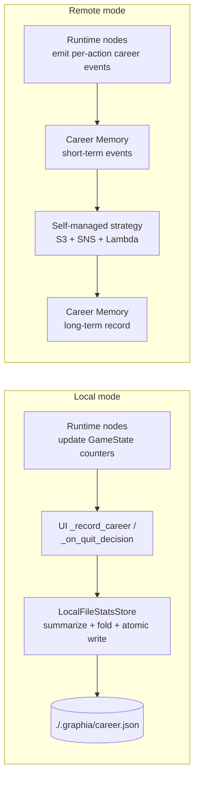
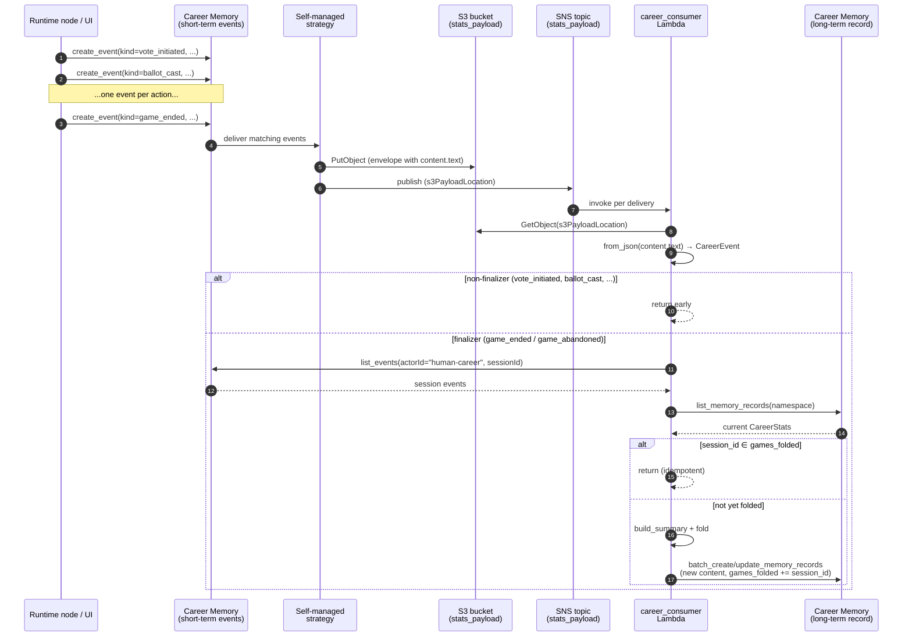
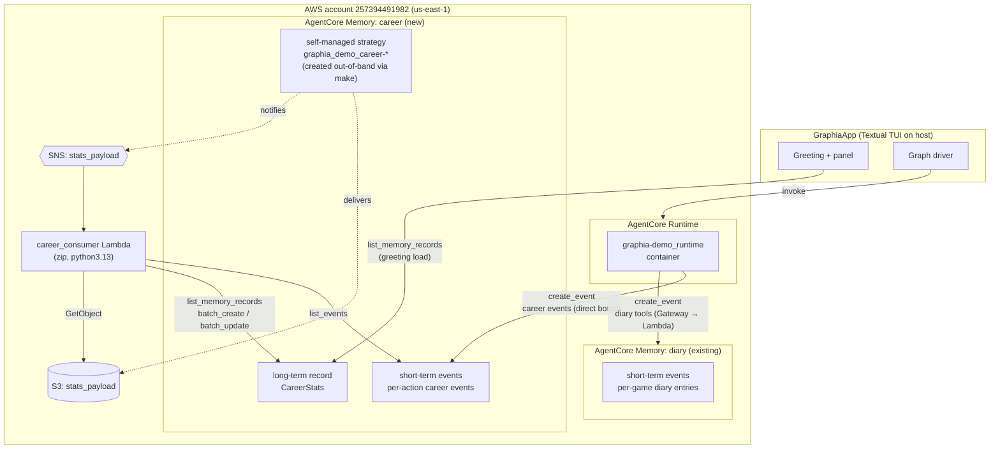
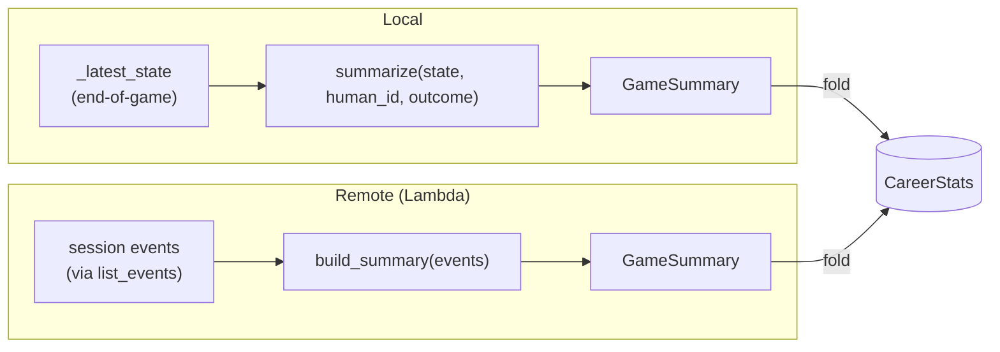
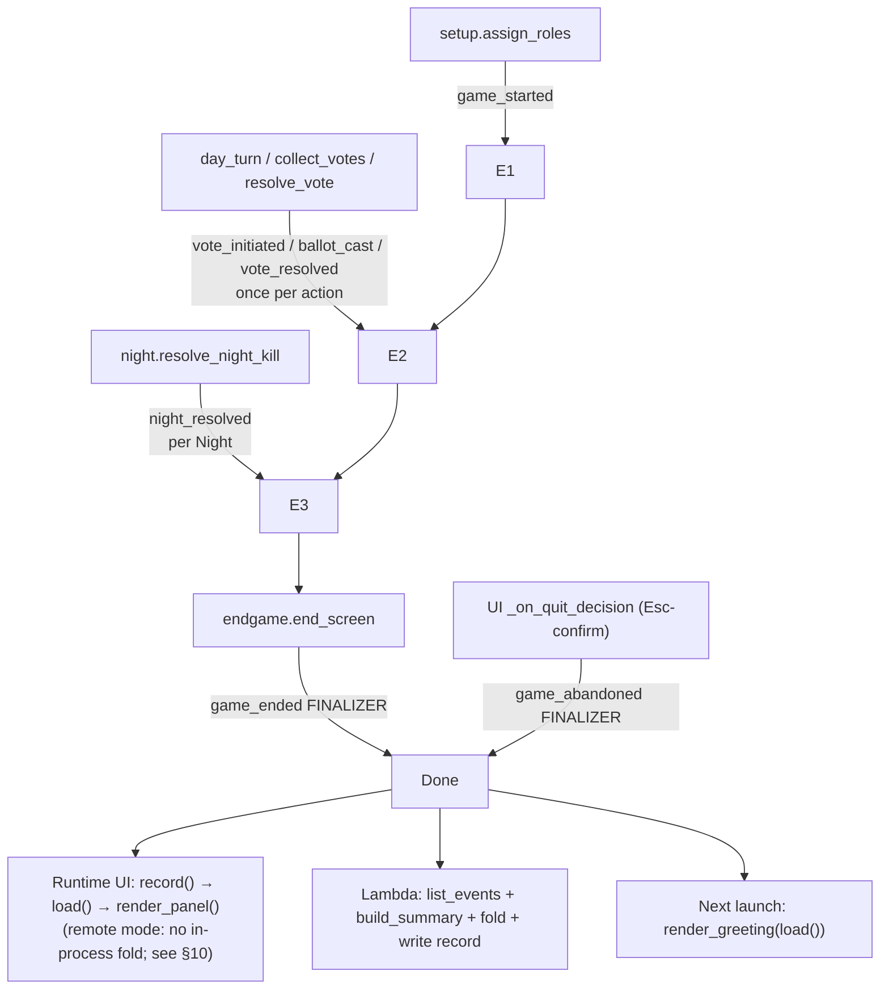
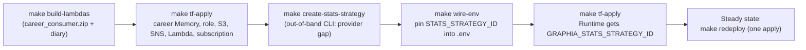

# Architecture: Cross-Game Career Stats

- **Spec:** [`./functional-spec.md`](./functional-spec.md), [`./technical-considerations.md`](./technical-considerations.md)
- **ADRs:** [ADR 008](../../adr/008-self-managed-memory-pipeline.md) (active) supersedes [ADR 007](../../adr/007-two-tier-long-term-memory-stats.md) (kept for history); [ADR 001](../../adr/001-hosted-agentcore-with-local-mode.md) (local + hosted modes) and [ADR 005](../../adr/005-gateway-tools-via-lambda-targets.md) (Lambda packaging pattern) are inherited.
- **Status:** as deployed end of spec 006 / Slice 8.

This doc explains how Graphia accumulates a cross-game career across sessions, in both local and hosted-AgentCore modes. It is the *architecture-level* companion to the technical spec — what the components are, how they connect, and why.

---

## 1. The shape at a glance

Two modes, one observable outcome (a persistent `CareerStats` aggregate the player sees in the greeting and post-game panel). The shapes diverge entirely below the `GameSummary` boundary:



The greeting reads the aggregate (local file or long-term record). In local mode the post-game panel renders from an in-process `fold(load(), summary)` *after* the synchronous file write — load returns the just-written value, so the panel shows the up-to-date aggregate. **In remote mode the panel renders from a read-only `load()` only — no in-process fold, no synthesised "+1 this game".** The player sees the *actually-materialised* state; the Lambda's write catches up asynchronously through the pipeline (typically a 2–3 min lag at the strategy's default trigger settings). The prior shape — folding the just-finished game locally to render the +1 immediately — was deliberately removed in [Slice 8.12](./tasks.md) because it masked a broken write pipeline as a cosmetic delay; see [§10 Failure modes](#10-failure-modes) for the loud-fail posture.

---

## 2. Component map

| Component | What it does | Where it lives |
|---|---|---|
| `GameState.human_*` counters | Per-game per-action counters (votes called, ballots cast, night attempts/successes, victims, executions) | `src/graphia/state.py` |
| `CareerStats` | The persisted rolling aggregate. Frozen dataclass with `games_total`, role splits, win counts, outcome split, lifetime action totals, game-wide totals, `completed_games`/`sum_rounds_completed` (for average length), and the `games_folded: list[str]` idempotency sidecar | `src/graphia/stats_store.py` |
| `GameSummary` | One game's contribution (the delta) | `src/graphia/stats_store.py` |
| `summarize(state, human_id, outcome) -> GameSummary` | Local-mode builder — reads end-of-game state | `src/graphia/stats_store.py` |
| `build_summary(events) -> GameSummary` | Remote-mode builder — reconstructs from a session's events | `src/graphia/career_events.py` |
| `fold(aggregate, summary) -> CareerStats` | Pure aggregation function. **Shared by both modes.** | `src/graphia/stats_store.py` |
| `LocalFileStatsStore` | Local-mode store. `load()` reads the file tolerantly; `record()` folds and atomically writes | `src/graphia/stats_store.py` |
| `AgentCoreCareerEventStore` | Remote-mode store. `load()` lists the long-term record by namespace; `record(summary)` returns `self.load()` unchanged — read-only, **does not write** and **does not fold** (the panel shows actually-persisted state; the Lambda owns the eventual write — see [§10](#10-failure-modes)) | `src/graphia/stats_store.py` |
| `CareerEventEmitter` (Protocol) | Side-effect for the runtime to emit events | `src/graphia/career_events.py` |
| `NoOpCareerEventEmitter` | Used in local mode and tests | `src/graphia/career_events.py` |
| `AgentCoreCareerEventEmitter` | Lazy boto3 `bedrock-agentcore.create_event` wrapper. Used by runtime nodes + the UI quit path in remote mode | `src/graphia/career_events.py` |
| Consumer Lambda | SNS-triggered. Consolidates the session's events into the long-term record on finalizer arrival, with `games_folded` idempotency | `infra/lambda/career_consumer/lambda_function.py` |
| Career Memory + scaffolding | Dedicated AgentCore Memory + self-managed strategy + S3 bucket + SNS topic + IAM roles | `infra/terraform/main.tf` |

---

## 3. Event vocabulary

The runtime emits per-action events whose `kind` field discriminates them. Each event also carries a `session_id` (the LangGraph thread id; one per game).

| Kind | Emitted by | Fields | Effect in `build_summary` / `fold` |
|---|---|---|---|
| `game_started` | `setup.assign_roles` | `human_role` | Early-binds role; the finalizer re-asserts it |
| `vote_initiated` | `day.day_turn` (both branches) | `initiator_is_human: bool` | `votes_called +=1` if human |
| `ballot_cast` | `day.collect_votes` (both branches) | `voter_is_human: bool` | `ballots_cast +=1` if human |
| `vote_resolved` | `day.resolve_vote` (both branches) | `was_executed: bool` | `day_executions +=1` if executed |
| `night_resolved` | `night.resolve_night_kill` (victim-died path) | `victim_died`, `human_was_mafia_picker`, `human_picked_victim` | `night_victims`, `night_attempts`, `night_successes` |
| **`game_ended`** *(finalizer)* | `endgame.end_screen` | `outcome` (`law_abiding_win` / `mafia_win` / `draw`), `human_role`, `rounds` | Triggers Lambda consolidation; sets the outcome dimensions |
| **`game_abandoned`** *(finalizer)* | `ui/app.py._on_quit_decision` | `human_role`, `rounds_so_far` | Triggers Lambda consolidation; folds with `outcome="abandoned"` |

Only the two finalizers cause the consumer Lambda to do work — the rest sit in the session log as the durable per-action history.

---

## 4. Remote-mode write path (sequence)



The Runtime's call to `record()` runs **client-side, locally**, and in remote mode returns the currently-materialised aggregate via `list_memory_records` — *not* a fold-with-the-just-finished-game. The post-game panel therefore shows the state the Lambda has *already* written; if the Lambda hasn't caught up yet (typically a 2–3 min lag) the panel shows pre-game numbers, and the next launch's greeting carries the delta only once the Lambda completes. The in-process fold was removed here deliberately — see [§10 Loud-fail in remote mode](#10-failure-modes).

---

## 5. AWS infrastructure layout



Notes on the diagram:
- **Strategy is out-of-band.** The AWS Terraform provider can't express a self-managed memory strategy, so it's created by `make create-stats-strategy` (an `aws bedrock-agentcore-control update-memory --memory-strategies addMemoryStrategies …` call) and the resulting id is plumbed back via `var.stats_strategy_id`. Terraform owns the bucket + topic + IAM + the Lambda + the SNS subscription.
- **Two distinct IAM roles** in the new infra: `memory_stats` is what the *strategy* assumes to write to S3 and publish to SNS; `career_consumer` is what the *Lambda* assumes to read S3, list events, and write the long-term record. Least-privilege, no overlap.
- **The diary Memory is untouched** by this feature. Diary events keep flowing through their existing Gateway → Lambda path (ADR 005). The career Memory is the new conceptual home for stats; it carries both event tiers (raw per-action history + the consolidated record).

---

## 6. The equivalence guarantee

The single most load-bearing property of the design is that local mode and remote mode produce the *same* `CareerStats` for the same sequence of game actions. That's how the suite catches drift between the two paths (`tests/test_pipeline_equivalence.py`).



The equivalence rests on four pieces being **shared**, not duplicated:

1. The `GameSummary` data shape.
2. The `fold(aggregate, summary)` pure function (vendored into the Lambda zip — no parallel implementation).
3. The `CareerStats` shape (including the `games_folded` sidecar — empty in local mode; populated in remote because the Lambda needs idempotency under at-least-once SNS delivery).
4. The LangGraph topology itself: `build_graph` (local mode) and `build_runtime_graph` (the AgentCore Runtime entrypoint) both delegate to a private `_assemble_graph(builder, *, diary_store, career_emitter, game_id, saver)` helper in `src/graphia/graph.py`. Per-action emitter wiring lands in both modes by construction, instead of by hand-mirroring. This is a [Slice 8.11](./tasks.md) refactor — earlier in spec 006 the two graphs were verbatim copies with the runtime-side one carrying a docstring saying "mirror this here if the local graph evolves," and the discipline failed exactly as docstrings of that shape always do (Slice 8.4's emitter plumbing was added to `build_graph` but missed `build_runtime_graph`, so the deployed Runtime emitted nothing for several deploy cycles).

`summarize` and `build_summary` are the two ends; both produce the *same* `GameSummary` for the same game.

---

## 7. Idempotency

SNS gives at-least-once delivery. A `game_ended` finalizer can be delivered to the Lambda more than once (network retry, Lambda re-invocation, etc.). Without protection, every replay would fold the same game in twice.

The defence is a sidecar set inside the long-term record itself: `CareerStats.games_folded: list[str]`. The Lambda's flow on every finalizer is:

```
current = list_memory_records(namespace)           # the one career record
if event.session_id in current.games_folded:
    return                                          # already folded; drop
summary = build_summary(list_events(sessionId))
new = fold(current, summary)
new = replace(new, games_folded=[*current.games_folded, event.session_id])
batch_create_or_update(new)
```

The set lives *with* the record, not in a sidecar database, so there's no second source of truth to keep in sync.

Local mode leaves `games_folded` empty — the local file-write under a `threading.Lock` already guarantees exactly-once folding per game.

---

## 8. Lifecycle — what runs when



Three things happen at game end in remote mode:
1. The UI renders the post-game panel from a synchronous `record(summary) → load()` call — showing the actually-materialised aggregate, *not* a synthesised "+1 this game".
2. The Lambda consolidates the session into the long-term record (asynchronous, ~2–3 min at the strategy's default trigger settings).
3. On the *next* app launch, the greeting reads the record the Lambda wrote.

The async gap between (1) and (3) is bounded by minutes-to-days (between game-ends), never a practical problem. *Local mode* differs: `record()` is a synchronous fold-and-atomic-write, so the post-game panel reflects the just-finished game immediately, and there is no gap.

---

## 9. Deploy + first-run dance

The provider gap forces a multi-step bring-up the first time. After the first time, `make redeploy` reads `STATS_STRATEGY_ID` from `.env` (pinned by `wire-env`) and does only one apply.



All four steps are wrapped by `make deploy` (which ends with `make deploy-stats`), so the user runs a single command. The convergence + idempotency mean re-running `make deploy` is safe.

After any deploy, **`make verify-pipeline`** ([`tools/verify_pipeline.py`](../../../tools/verify_pipeline.py)) walks the live deploy and prints a green/red line per stage: runtime image tag matches git HEAD, `.env` carries `GRAPHIA_CAREER_MEMORY_ID`, the `human-career` actor exists in career memory, at least one ACTIVE `SELF_MANAGED` strategy is attached, the Lambda's latest log stream has no `ParamValidationError` / `AttributeError` / `[ERROR]` markers, and `make_stats_store(load_config()).load()` returns the same record `list_memory_records` does. Exits non-zero on first failure so `make redeploy && make verify-pipeline` composes into a single verify-after-deploy step. This was added in [Slice 8.15](./tasks.md) after the parade of live-deploy bugs (Slices 8.10–8.13) made post-mortem-by-CLI-call too costly to keep doing by hand.

---

## 10. Failure modes

- **Lost finalizer delivery.** If SNS never delivers the `game_ended`/`game_abandoned`, the record never updates. The greeting will simply be one game behind on the next launch. Acceptable for v1; a CloudWatch alarm on Lambda errors / DLQ is a future hardening item.
- **Lambda throws on a single event.** Errors are logged and swallowed per-record; SNS retries the message; if it keeps failing the message ends up in (a future) DLQ. The runtime doesn't notice or block.
- **Clock skew on local host.** Causes AWS signature failures at deploy time (`SignatureDoesNotMatch`) — not at game-time. Sync the host clock.
- **Strategy delivery filtering.** AgentCore's self-managed strategy delivers *all* events on its Memory; consumer-side filtering is unnecessary because the career Memory is dedicated and its only events are career events. (This is why the dedicated Memory was chosen over a shared one — no cross-feature event drift to worry about.)
- **Eventual consistency on greeting.** `list_memory_records` reads can briefly lag the Lambda's `batch_update`. In practice the gap between two app launches dwarfs the AgentCore consistency window, so the player never observes it.
- **Loud-fail in remote mode (no silent fallback).** Per [Slices 8.10–8.12](./tasks.md), `AgentCoreCareerEventEmitter.emit()` and `AgentCoreCareerEventStore.load()` no longer catch boto3 errors — IAM gaps, network failures, and `ParamValidationError`s propagate and crash the call site loud, instead of silently writing zeros that look indistinguishable from "no history yet." The corollary: `make_stats_store(config)` selects the remote store strictly on `config.career_memory_id` being set, and there is *no automatic fallback to `LocalFileStatsStore`* when the remote store fails. Remote mode is opt-in (via `GRAPHIA_CAREER_MEMORY_ID`) and stays opt-in once chosen; `make verify-pipeline` is the canonical health check.

---

## 11. Where to look in the code

| If you want to change… | Look at… |
|---|---|
| What counters a game contributes | `state.py` (the `GameState` fields), the node where the in-state counter is bumped, and `career_events.py` (the matching event kind) |
| How the local file is shaped | `stats_store.py` — `_career_to_json` / `_career_from_json` |
| What the Lambda does on a finalizer | `infra/lambda/career_consumer/lambda_function.py` |
| What gets emitted at game end | `nodes/endgame.py` (normal end) and `ui/app.py._on_quit_decision` (abandoned) |
| The greeting / panel wording | `stats_store.py` — `render_greeting` / `render_panel` |
| Equivalence between modes | `tests/test_pipeline_equivalence.py` (and the shared `fold` + `GameSummary` + `CareerStats` in `stats_store.py`) |
| AWS infrastructure for the career feature | `infra/terraform/main.tf` (search for `career`) and `Makefile` (`build-lambdas`, `create-stats-strategy`, `deploy-stats`) |
