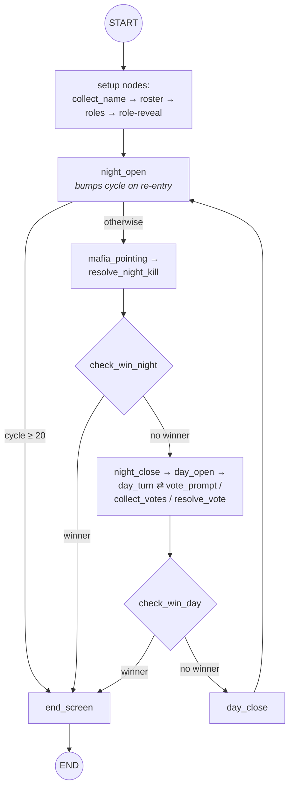
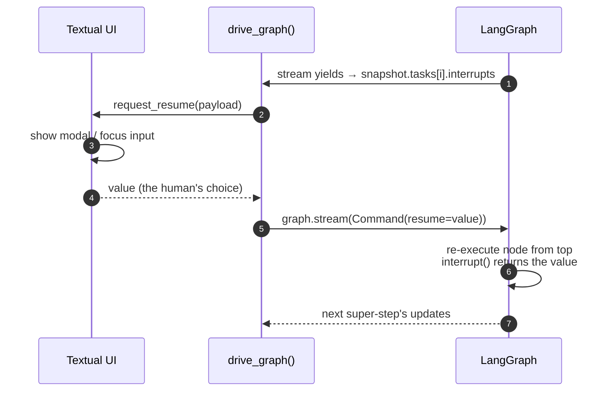

# Tutorial 001: Playable Skeleton

- **Spec:** [`context/spec/001-playable-skeleton/`](../../spec/001-playable-skeleton/)
- **Status:** Draft
- **Author:** Poe (on behalf of the project owner)
- **Date:** 2026-05-11
- **Prerequisites:** none

---

## Overview

Graphia's first increment delivers a complete, playable single-session Mafia game in the terminal — seven players (one human, six AI), Night kills, Day discussion, vote-to-execute, decisive endings. From the player's seat it's just a small text game. From the implementation's seat it's something more interesting: every phase of that game — name entry, role reveal, Night pointing, Day round-robin, vote tally, win check — is a node in a single **LangGraph `StateGraph`**, and the human sits *inside* that graph as one of the actors.

The central design question of this increment is: *how do you organise a turn-based program in which multiple actors (a moderator, AI players, and a real human) act on shared state, with branching control flow, while still being able to pause for human input, log every super-step, and survive a crash?* The answer this tutorial teaches is the LangGraph **state graph paradigm** — typed shared state, nodes that return state diffs, conditional edges, replay-safe `interrupt()`, a sqlite checkpointer that captures every super-step, and a Bedrock-backed LLM bound to flat Pydantic schemas via `with_structured_output`.

The tutorial is organised **core-outward**. We start with the state graph itself, descend into the data shape it operates on, then layer on the execution mechanics that make it run (cycle loop, interrupts, streaming, checkpointing), the LLM integration that gives the AI players a voice, and only at the end touch the Textual UI and project plumbing — those are decorations on the graph, not the lesson.

---

## What's new this increment

- [**Typed state with field-level reducers**](#the-state-graph-structure-state-branching) — One `TypedDict` for the whole game; per-field reducers decide how each field merges across super-steps.
- [**Conditional edges with a routing function**](#the-state-graph-structure-state-branching) — Branching control flow declared once at compile time; a router function picks the next node.
- [**One function, two node names for fan-out**](#the-state-graph-structure-state-branching) — The same pure-read win check is registered twice so each fan-out site owns its own conditional edge.
- [**Day → Night cycle-closing edge**](#closing-the-loop-day-night-as-a-graph-cycle) — A static edge from `day_close` back to `night_open` turns the graph into a cycle; the cycle counter bumps on re-entry.
- [**Replay-safe interrupt placement**](#humans-inside-an-autonomous-graph-interrupt-and-resume) — `interrupt()` is the first statement of every human-facing node, because resume re-executes the whole node.
- [**Resume via Command payload**](#humans-inside-an-autonomous-graph-interrupt-and-resume) — Re-enter the graph with `Command(resume=value)`; the value lands as the return of the prior `interrupt()`.
- [**Streaming graph updates**](#observing-and-persisting-execution-stream--checkpoint) — `graph.stream(stream_mode="updates")` yields one `{node_name: update}` diff per super-step.
- [**Per-game sqlite checkpointer**](#observing-and-persisting-execution-stream--checkpoint) — `SqliteSaver` writes a row per super-step against a per-thread sqlite file.
- [**Side-channel state snapshots**](#observing-and-persisting-execution-stream--checkpoint) — `graph.get_state(run_config)` reads live state outside the stream.
- [**LLM client singletons**](#bringing-in-the-llm-structured-output-and-self-correction) — One `ChatBedrockConverse` per model (Sonnet for gameplay, Haiku for mechanical), configured once.
- [**Flat structured-output schemas**](#bringing-in-the-llm-structured-output-and-self-correction) — Pydantic schemas stay flat (no discriminated unions) because Bedrock Converse rejects tagged unions.
- [**Single retry on validation error**](#bringing-in-the-llm-structured-output-and-self-correction) — One corrective retry, then a deterministic fallback so the game never stalls.
- [**Regional inference-profile prefix**](#bringing-in-the-llm-structured-output-and-self-correction) — Model IDs prefixed `us.anthropic.…` route through the US regional inference family.
- [**Async-to-thread sync-stream bridge**](#decorating-with-a-tui) — A producer thread iterates the sync stream; a queue hands chunks to the async UI loop.
- [**Dual public/private log panes**](#decorating-with-a-tui) — Two `RichLog` panes; `additional_kwargs={"private_to": ...}` routes whispers to the private pane.
- [**Interrupt payload → modal dispatch**](#decorating-with-a-tui) — The driver dispatches on `payload["kind"]` to choose the right modal (name, point, vote).
- [**Message-ID dedup on render**](#decorating-with-a-tui) — The driver tracks rendered message ids so a message that surfaces in two chunks never renders twice.
- [**`.env` config with typed validation**](#for-completeness--project-plumbing-and-observability) — `python-dotenv` plus a frozen `GraphiaConfig` dataclass.
- [**UTF-8 stdio reconfig at entry**](#for-completeness--project-plumbing-and-observability) — Reconfigure stdio to UTF-8 *before* importing anything that may print.
- [**JSONL super-step trace logger**](#for-completeness--project-plumbing-and-observability) — One JSONL line per super-step to `GRAPHIA_LOG_FILE`.

---

## Diagram

A high-level shape of the compiled graph — eighteen nodes collapsed to the seven things you actually need to see to understand the design.



`check_win_night` and `check_win_day` are the same Python function registered under two different node names — the diagram shows them as separate diamonds because that's what the graph sees.

---

## Walkthrough

### The state graph: structure, state, branching

**How would we organise a turn-based program with multiple actors, branching control flow, and a need to pause for a real human in the middle?**

We could try to do it with coroutines and hand-rolled message passing, but each phase would have to know about the next, and pausing for the human would mean threading a "give me input" callback through the whole stack. Instead, we lean on LangGraph's **`StateGraph`** — a typed-state container with a topology of nodes and edges, compiled into something we can iterate one super-step at a time. Each node is a plain Python function that takes the current state and returns a *partial* update. The compiled graph handles the merging and the routing.

In `graphia.graph.build_graph` you can see the whole game declared up front:

```python
# src/graphia/graph.py — build_graph
builder: StateGraph = StateGraph(GameState)
builder.add_node("collect_name", collect_name)
builder.add_node("generate_roster", generate_roster)
# ... eighteen nodes in all ...
builder.add_node("check_win_night", check_win_condition)
builder.add_node("check_win_day", check_win_condition)
builder.add_node("end_screen", end_screen)
```

Three things from that snippet are worth their own concepts.

The first is **typed state with field-level reducers**. Every node returns a dictionary; the graph merges that dictionary into the shared state using the reducer declared on each field. We'll go deeper on this in the next section.

The second is **conditional edges with a routing function**. Static edges (`add_edge(a, b)`) are the boring case — go from a to b unconditionally. Branching control flow is declared by `add_conditional_edges` paired with a small router function returning the next node's key. The Day-turn router is a good example:

```python
# src/graphia/nodes/day.py — route_day_turn_or_vote
def route_day_turn_or_vote(state: GameState) -> str:
    if state.get("active_vote"):
        return "vote_prompt"
    if state.get("day_rounds", 0) >= DAY_MAX_ROUNDS:
        return "day_close"
    return "day_turn"
```

The router is pure — it inspects state and returns a label. The graph maps that label to a real destination via a dict passed alongside the router:

```python
# src/graphia/graph.py — build_graph
builder.add_conditional_edges(
    "day_turn",
    route_day_turn_or_vote,
    {"vote_prompt": "vote_prompt",
     "day_turn": "day_turn",
     "day_close": "day_close"},
)
```

The third is **one function, two node names for fan-out**. `check_win_condition` is a pure, read-only function that inspects alive counts and either sets `winner` or returns an empty update. We need to run it at *two* sites — after every Night kill and after every Day execution — and each site needs its own conditional edge to either branch to `end_screen` or fall through. LangGraph requires every node name to be unique, so we register the same function twice, under two distinct names:

```python
# src/graphia/graph.py — build_graph
builder.add_node("check_win_night", check_win_condition)
builder.add_node("check_win_day", check_win_condition)
# ...
builder.add_conditional_edges("check_win_night", route_after_win_night, {...})
builder.add_conditional_edges("check_win_day",  route_after_win_day,  {...})
```

This is the pattern to reach for whenever you need the same pure-read decision at multiple fan-out sites — share the function, fork the node identity.

### Shared state without spaghetti

**How do nodes share data without each one knowing about all the others?**

Every node returns a partial update; the graph applies it via a per-field **reducer**. The reducer is declared as part of the state type, using `Annotated[T, reducer]`. LangGraph ships `add_messages` for chat histories; `operator.add` works for lists you want to *append*; any field without an annotation uses replacement semantics (the new value wins).

The whole game's state shape lives in one place:

```python
# src/graphia/state.py — GameState
class GameState(TypedDict, total=False):
    messages: Annotated[list[AnyMessage], add_messages]
    players: dict[str, PlayerState]
    human_id: str
    phase: Literal["setup", "night", "day", "end"]
    cycle: int
    night_picks: dict[str, str]
    day_order: list[str]
    day_turn_index: int
    day_rounds: int
    day_votes_called: int
    active_vote: ActiveVote | None
    kill_log: Annotated[list[KillRecord], operator.add]
    winner: Literal["law_abiding", "mafia", "draw"] | None
```

Three flavours of reducer are in use here, and the choice for each field tells you something about the gameplay:

- `messages` uses `add_messages` — a chat log that grows monotonically and deduplicates by message id.
- `kill_log` uses `operator.add` — kills are append-only history; nodes contribute their record without rewriting the whole list.
- Everything else replaces — `players`, `phase`, `cycle`, `day_order`, `active_vote` are all single-writer fields where the producing node owns the new value.

This is why a node like `resolve_night_kill` can just return `{"players": updated, "kill_log": [record], "messages": [announcement]}` — three different reducers fire on those three fields, and no other node had to be in the loop.

A side note worth absorbing: **"private" channels are a convention, not a feature**. There is no separate private state. Whispers to the human ride the same `messages` list as the rest, tagged with `additional_kwargs={"private_to": player_id}`, and the UI silently drops anything not addressed to itself. The graph doesn't know there's a UI.

### Closing the loop: Day → Night as a graph cycle

**How does the same graph run a Night phase, then a Day phase, then a Night phase again, and so on, until somebody wins?**

A graph can have cycles. The Day → Night loop is closed by a single static edge:

```python
# src/graphia/graph.py — build_graph
builder.add_edge("day_close", "night_open")
```

That's the entire loop topology. What makes it work is the **Day → Night cycle-closing edge** together with one piece of node-local cleverness: `night_open` is responsible for noticing whether it's being entered for the first time or as a re-entry from the Day side, and only bumps the cycle counter on re-entry.

```python
# src/graphia/nodes/night.py — night_open
prior_phase = state.get("phase")
current_cycle = state.get("cycle", 1)
if prior_phase == "day":
    cycle = current_cycle + 1
else:
    cycle = current_cycle
```

This avoids a common cycle-graph pitfall: putting the counter increment on the edge, or in `day_close`, would either require a synthetic edge type or split the rule across two nodes that don't otherwise know about each other. Concentrating it in `night_open` keeps the invariant *"the cycle counter advances every time we enter a Night that isn't the first one"* in one place.

The same node also enforces the 20-cycle draw safety cap from the functional spec, by setting `winner="draw"` and letting `route_after_night_open` short-circuit to `end_screen`. That's the cycle pattern composed with **conditional edges**: nothing exotic, just two well-understood primitives interlocking.

### Humans inside an autonomous graph: interrupt and resume

**How does a real human participate, on their own clock, inside a graph that is otherwise running on its own?**

The naïve answer would be: thread some kind of input callback through every node that might prompt the human. The LangGraph answer is much nicer: any node can call `interrupt(payload)`, which pauses the graph mid-super-step and surfaces the payload to whatever is driving it. The driver collects the human's response, then re-enters the graph with `Command(resume=value)`; that value becomes the return of the prior `interrupt()` call.

The crucial subtlety is **replay-safe interrupt placement**. When the graph resumes, it does *not* pick up exactly where `interrupt()` returned — it re-executes the entire node from the top, with the previous interrupt's return value pre-supplied. So any work the node does *before* its `interrupt()` will run twice. The convention is to make `interrupt()` the very first statement of any human-facing node:

```python
# src/graphia/nodes/setup.py — collect_name
def collect_name(state: GameState) -> dict:
    value = interrupt({"kind": "name"})
    name = value.strip() if isinstance(value, str) else ""
    if not name:
        name = "Player"
    # ... build the human PlayerState, return the state update ...
```

The complementary half is **resume via Command payload**. The driver's job is to pump that resume value back in:

```python
# src/graphia/driver.py — drive_graph (resume loop)
interrupts = [i for t in snapshot.tasks for i in (t.interrupts or ())]
if not interrupts:
    # graph paused at a super-step boundary, not at an interrupt
    payload = None
    continue
resume_value = await request_resume(interrupts[0].value)
payload = Command(resume=resume_value)
```

Two further composition notes. First, when interrupt-replay would be too disruptive — for example a `day_turn` that has already decided which player's turn it is — the safe move is to make each unit of work its own super-step. `day_turn` runs *one* player's turn per invocation; the re-execution of pure read-only bookkeeping (whose turn is it?) is cheap and idempotent.

Second, when the interrupt payload's shape varies (name? pointing target? yes/no vote?), the driver dispatches on a `kind` field. That's the **interrupt payload → modal dispatch** concept — we'll meet it again in the UI section.



### Observing and persisting execution: stream + checkpoint

**Once we have a graph, how do we observe it running, and how do we resume it after a pause?**

Two primitives, used together:

**Streaming graph updates** — `graph.stream(payload, run_config, stream_mode="updates")` is an iterator that yields one chunk per super-step. Each chunk is a `{node_name: update}` dict — exactly the partial state update the node returned. The driver iterates this in a worker thread (we'll see why in the TUI section):

```python
# src/graphia/driver.py — _producer
for chunk in graph.stream(payload, run_config, stream_mode="updates"):
    loop.call_soon_threadsafe(queue.put_nowait, chunk)
```

This is what makes the trace logger possible — every super-step is observable as a structured event, not buried inside a single fat `invoke()` return.

**Per-game sqlite checkpointer** — `SqliteSaver` writes a row to a sqlite file at every super-step boundary, keyed by `thread_id`. That's what makes `interrupt()` actually pausable: the resume call re-enters at the right checkpoint with the right state. The wiring lives in `build_graph`:

```python
# src/graphia/graph.py — build_graph
config.checkpoint_dir.mkdir(parents=True, exist_ok=True)
thread_id = datetime.now(timezone.utc).strftime("%Y%m%dT%H%M%S")
db_path = config.checkpoint_dir / f"{thread_id}.sqlite"
conn = sqlite3.connect(str(db_path), check_same_thread=False)
saver = SqliteSaver(conn)
# ...
graph = builder.compile(checkpointer=saver)
```

Two non-obvious choices here. First, the sqlite connection is opened *directly*, not via `SqliteSaver.from_conn_string`'s context manager — the manager would close the connection on exit, but the graph needs to keep writing for the whole game. Second, the thread id is a fresh ISO timestamp per launch — each run gets its own file, and old files are safe to delete. There is no cross-session save/load story; checkpoints exist to make `interrupt()` work and to give us a postmortem trail.

Because we already have **typed state with field-level reducers** and **streaming graph updates**, we can also do a third thing: **side-channel state snapshots**. The UI thread can ask the graph for its current state at any point, without consuming the stream:

```python
# src/graphia/ui/app.py — _check_spectator_transition
snapshot = self._graph.get_state(self._run_config)
players = snapshot.values.get("players")
me = players.get(self._human_id)
if me is None or getattr(me, "is_alive", True):
    return
self._spectator = True
```

`graph.get_state(run_config)` returns a snapshot object whose `.values` is the merged state at the last checkpoint and whose `.tasks` carries pending interrupts. The driver uses it after each `consume_stream` to find pending interrupts; the UI uses it to detect that the human just died (flip into spectator mode) and to ask *"what cycle are we in?"* without threading that information through every interrupt payload. It is a small affordance, but a very handy one — once you internalise that state is queryable from outside, several UI concerns become trivial.

### Bringing in the LLM: structured output and self-correction

**How do AI players make decisions while staying schema-safe — so the rest of the graph can keep treating their output as plain data?**

The trick is `with_structured_output(Schema)` on a LangChain chat model. Bind a Pydantic schema to the call, and the model is forced to return an instance of that schema. The graph code never sees raw text — it sees a typed object whose fields are already validated.

We use two model instances. **LLM client singletons** are configured once per model, in `graphia.llm`:

```python
# src/graphia/llm.py — get_sonnet / get_haiku
def get_sonnet() -> ChatBedrockConverse:
    global _sonnet
    if _sonnet is None:
        _sonnet = ChatBedrockConverse(
            model=_SONNET_MODEL_ID,
            region_name=load_config().aws_region,
            temperature=0.7,
        )
    return _sonnet
```

Sonnet 4.5 is the gameplay model (pointing, day speech, ballots); Haiku 4.5 handles mechanical work (the start-of-game name generation). Two models, not five — behavioural variation comes from prompts and temperature, not model count.

The `_SONNET_MODEL_ID` constant is worth pausing on. It begins `us.anthropic.…`, not `anthropic.…` — that's the **regional inference-profile prefix**. The `us.` prefix routes inference through the US regional family rather than a single regional endpoint, which is what AgentCore-friendly accounts and the project's chosen region need (`us-east-1` as of writing).

Pydantic schemas stay deliberately **flat**:

```python
# src/graphia/llm.py — DayAction
class DayAction(BaseModel):
    kind: Literal["speak", "vote"]
    text: str | None = None
    target_id: str | None = None

    @model_validator(mode="after")
    def _check_kind(self) -> "DayAction":
        if self.kind == "speak":
            if self.text is None or not self.text.strip():
                raise ValueError("speak requires non-empty text")
        else:  # kind == "vote"
            if self.target_id is None or not self.target_id.strip():
                raise ValueError("vote requires non-empty target_id")
        return self
```

The "obvious" design would be a discriminated union — `Speak | CallVote` with a tag field. Bedrock Converse rejects that schema shape. So we keep `kind`, `text`, and `target_id` all at the top level and enforce the mutual exclusion at the validator. **Flat structured-output schemas** is a generally good idea with Bedrock Converse: when in doubt, flatten.

Even with a strict schema, an LLM occasionally returns something that can't be validated, or names a target that isn't on the alive roster. The pattern is **single retry on validation error**: invoke once, validate; on failure, re-invoke with a corrective message inserted into the conversation; on a second failure, fall back to something deterministic so the game never stalls. The Mafia-pointing call shows the full pattern:

```python
# src/graphia/nodes/night.py — _ai_pick_target
llm = get_sonnet().with_structured_output(Pointing)
try:
    first: Pointing = llm.invoke(base_messages)
    if first.target_id in valid_ids:
        return first.target_id
except Exception:
    pass

retry_messages = [
    *base_messages,
    HumanMessage(content=f"Invalid target_id. Must be one of: {valid_ids_list}. Try again."),
]
try:
    second: Pointing = llm.invoke(retry_messages)
    if second.target_id in valid_ids:
        return second.target_id
except Exception:
    pass

# Fall back to a deterministic random choice so the game doesn't stall.
rng = random.Random(seed + cycle + mafia_index)
return rng.choice(alive_law_abiding).id
```

The composition matters: **flat schemas** keep Bedrock happy, **single retry on validation error** absorbs the occasional miss, and the deterministic fallback keeps the **state graph** moving forward no matter what the LLM does.

### Decorating with a TUI

The Textual UI is a thin layer over everything above — three concepts cover its load-bearing bits.

**Async-to-thread sync-stream bridge.** Textual owns the asyncio event loop. `graph.stream` is synchronous and would block that loop if called directly. The driver pushes the stream into a worker thread via `asyncio.to_thread`, and pipes its chunks back through an `asyncio.Queue`:

```python
# src/graphia/driver.py — _producer + _consume_stream
def _producer(graph, payload, run_config, loop, queue):
    for chunk in graph.stream(payload, run_config, stream_mode="updates"):
        loop.call_soon_threadsafe(queue.put_nowait, chunk)
    loop.call_soon_threadsafe(queue.put_nowait, _SENTINEL)

# ... and on the consumer side:
producer_task = asyncio.create_task(
    asyncio.to_thread(_producer, graph, payload, run_config, loop, queue)
)
while True:
    item = await queue.get()
    if item is _SENTINEL:
        break
    # ... dispatch the chunk to on_message / record trace / ...
```

This is the load-bearing pattern that lets the UI keep painting while the LLM call is in flight. The Phase-3 roadmap item is to switch to native `graph.astream` and drop the worker thread; until then, the bridge is the right shape.

**Dual public/private log panes.** Two `RichLog` widgets — public and private — and a routing rule based on `additional_kwargs["private_to"]`:

```python
# src/graphia/ui/app.py — _handle_graph_message
extra = getattr(msg, "additional_kwargs", {}) or {}
private_to = extra.get("private_to")
if isinstance(private_to, str) and private_to:
    if private_to == self._human_id:
        self._write_private(msg)
    # silently drop messages addressed to a different player
    return
self._write_public(msg)
```

A Mafia teammate intro tagged `private_to=<human_mafia_id>` shows up in the human's private pane; the same node also emits the same kind of message tagged for the *other* Mafia, and the UI quietly drops it. That's how the graph can model "everyone sees their own role privately" without having a notion of identity beyond a tag on a message.

**Interrupt payload → modal dispatch.** The interrupt payload's `kind` field is the protocol between the graph and the UI:

```python
# src/graphia/ui/app.py — _request_resume
if kind == "name":
    return await self._prompt_via_input("Enter your name…")
if kind == "day_turn":
    text = await self._prompt_via_input(...)
    return text.strip() or "…"
if kind == "point":
    target_id = await self.push_screen_wait(PointingModal(options=...))
    return target_id
if kind == "vote":
    result = await self.push_screen_wait(VoteModal(target_name=..., error=...))
    return result
```

Each branch ends by returning a string (or any JSON-able value) which becomes the `Command(resume=value)` payload. The UI doesn't know what nodes exist; it only knows the *kinds* of prompt it can render.

The final TUI concept is small but worth knowing about: **message-ID dedup on render**. A `messages`-bearing super-step can occasionally re-surface a message that an earlier chunk already delivered. The driver carries a `seen_message_ids: set[str]` and silently drops repeats before calling `on_message`. The UI is therefore exactly-once on render, not "at-least-once and you sort it out".

### For completeness — project plumbing and observability

Three pieces of necessary scaffolding, none of them load-bearing for the lesson.

**UTF-8 stdio reconfig at entry.** Before anything else can run — including any module-level imports that might print — `__main__.py` reconfigures `stdin/stdout/stderr` to UTF-8 with `errors="replace"`. This isolates the rest of the program from the host's default code page (Windows CP1252, ancient Linux locales, etc.).

```python
# src/graphia/__main__.py — module top-level
for _stream in (sys.stdin, sys.stdout, sys.stderr):
    try:
        _stream.reconfigure(encoding="utf-8", errors="replace")
    except (AttributeError, OSError):
        pass
```

**`.env` config with typed validation.** `python-dotenv` loads `.env` at startup; a frozen `GraphiaConfig` dataclass exposes the values and raises `SystemExit` with a human-readable error when a required variable (the Bedrock bearer token) is missing — no Python traceback in the user's face.

```python
# src/graphia/config.py — load_config
bearer_token = os.environ.get("AWS_BEARER_TOKEN_BEDROCK")
if not bearer_token:
    raise SystemExit(
        "AWS_BEARER_TOKEN_BEDROCK is not set. "
        "Add it to your .env file or export it in your shell before launching Graphia."
    )
```

**JSONL super-step trace logger.** `StreamTraceLogger.record(event)` appends one JSONL line — UTC-timestamped — to `GRAPHIA_LOG_FILE`. The driver emits a line for each chunk it consumes, capturing node name, the keys the chunk updated, and the current cycle/phase pulled via `graph.get_state(run_config)`. That file is the postmortem artefact and the educational reference: when something surprises you in play, the log answers *"what just happened on this turn?"* in the order it happened.

```python
# src/graphia/driver.py — _consume_stream (trace excerpt)
snapshot = graph.get_state(run_config)
logger.record({
    "node": node_name,
    "keys": list(update.keys()) if isinstance(update, dict) else [],
    "cycle": snapshot.values.get("cycle"),
    "phase": snapshot.values.get("phase"),
})
```

---

## Try it

```bash
GRAPHIA_SEED=1234 uv run python -m graphia
```

Play a full game in a real terminal (Textual needs a TTY — PyCharm's "Run" pane won't work). You should see:

- A name prompt, then a roster of seven names introduced by the Moderator.
- A private "You are X. Your role is …" message in the bordered Whispers pane.
- "Night falls." in the public pane, then either (Mafia) a pointing modal and a kill announcement, or (Law-abiding) just the kill announcement.
- A Day phase with each alive player taking a turn in random order; the human's turn shows a `/vote <name>` hint and accepts free text.
- Either a clean win for one side or a 20-cycle draw, followed by a "Press any key to exit."

Tail `./.graphia/graphia.log` in another window — every super-step is one JSONL line with node name, updated keys, cycle, and phase. That's **streaming graph updates** + **JSONL super-step trace logger** at work.

To convince yourself of replay safety: launch the game, type your name, Ctrl-C, then check that `./.graphia/checkpoints/<thread_id>.sqlite` exists. The graph saved state at the `interrupt()` boundary; a re-launch would *not* resume from that file (Graphia uses a fresh thread id per launch), but the file's presence demonstrates that **per-game sqlite checkpointer** is doing its job.

The slice-numbered test files (`tests/test_slice2_roster.py` … `tests/test_slice9_polish.py`) exercise each acceptance criterion end-to-end with the LLM stubbed; `uv run pytest -q` runs the whole suite in seconds.

---

## Where to go next

- The roadmap's next item (Phase 2: AI character sheets and personalities) will give each AI player a distinct voice; expect tutorial 002 to introduce *prompt composition*, *per-player system prompts*, and *style-level behavioural variation* on top of the same state graph.
- Related ADR: [`context/adr/001-hosted-agentcore-deployment.md`](../../adr/001-hosted-agentcore-deployment.md) — context for the Bedrock region and inference-profile choice, and the eventual move to AgentCore Runtime hosting.
- Related CRs: anything in [`context/change-requests/`](../../change-requests/) that touches the Phase-1 scope you just played through.
