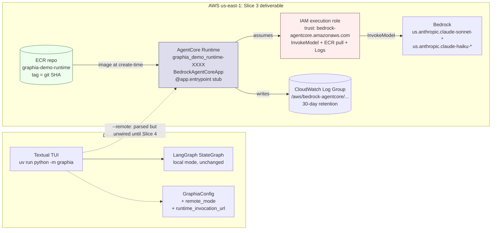

# Tutorial 002: Hosted AgentCore Deployment (interim — Slices 1–3)

- **Spec:** [`context/spec/002-hosted-agentcore-deployment/`](../../spec/002-hosted-agentcore-deployment/)
- **Status:** Draft
- **Author:** Alexey Tigarev
- **Date:** 2026-05-12
- **Prerequisites:** [`001-playable-skeleton`](../001-playable-skeleton/tutorial.md)

> **Heads-up — interim tutorial.** Spec 002 has 10 vertical slices; this tutorial covers what Slices 1–3 (plus the post-smoke follow-on) have delivered. Slices 4–10 are still ahead. As of this tutorial, **`--remote` is parsed but does not yet connect to the deployed Runtime** — that wire-up lands in Slice 4. Re-run `/awos:tutorial 002` once Slice 10 is verified to refresh the tutorial against the full spec.

---

## Overview

Spec 001 left Graphia as a single-process console program — `uv run python -m graphia` boots a LangGraph state graph in the developer's terminal, persists checkpoints to a local sqlite file, and calls Bedrock via the developer's credentials. Phase 2 (this increment) takes that same compiled graph and moves it into an AWS-managed compute surface: **Amazon Bedrock AgentCore Runtime**, a serverless container service in the Bedrock family designed for hosting agent workloads.

The interesting design problem this increment opens is: **how does a Python program become an AWS-managed container, while keeping the same LangGraph topology and the same `ChatBedrockConverse` clients that worked locally?** The central technology that answers it is **AgentCore Runtime** (the deployment target) combined with the `bedrock-agentcore` Python SDK (the in-process contract) and a Terraform module backed by `hashicorp/aws 6.44` (the IaC layer that ties them together). The tutorial teaches that stack from the core outward — the AgentCore deployment contract first, then the IAM/auth seam that lets the workload talk to Bedrock, then the Terraform posture, then the build-and-release loop, then the small application-level seam that prepares the local client to talk to the deployed Runtime in Slice 4.

What you can do at the end of Slice 3: run `make deploy` and end up with an AgentCore Runtime in `us-east-1` running a stub Python handler, reachable by ARN, observable in CloudWatch, redeployable in one `make redeploy`. The local game still plays exactly as before.

---

## Concepts already covered (referenced, not re-taught)

- **`env-config-via-dotenv-with-validation`** — `python-dotenv` loads `.env`; `GraphiaConfig` is the typed dataclass exposing values. (See [tutorial 001](../001-playable-skeleton/tutorial.md).) Spec 002 *extends* the dataclass with `remote_mode` and `runtime_invocation_url`.
- **`utf8-stream-reconfig-at-entry`** — `__main__.py` reconfigures stdio to UTF-8 before any imports. (See [tutorial 001](../001-playable-skeleton/tutorial.md).) Still runs first; spec 002 only adds an argparse step *after* it.
- **`chatbedrockconverse-singleton`** — Sonnet and Haiku singletons configured once and reused. (See [tutorial 001](../001-playable-skeleton/tutorial.md).) The same singletons run inside the AgentCore Runtime workload — but now find their credentials via the IAM execution role instead of a bearer token.
- **`regional-inference-profile-prefix`** — Bedrock model IDs use the `us.anthropic.…` regional profile prefix. (See [tutorial 001](../001-playable-skeleton/tutorial.md).) The Runtime's IAM policy scopes `bedrock:InvokeModel` to exactly those profile ARNs.

---

## What's new this increment

- [**Managed-container Runtime as the deployment target**](#the-agentcore-runtime-contract) — AgentCore Runtime is a scale-to-zero, `linux/arm64`-only managed container surface.
- [**Bedrock-AgentCore Python entrypoint**](#the-agentcore-runtime-contract) — A single decorated function becomes the agent's invocation contract.
- [**Explicit host binding for Podman compatibility**](#the-agentcore-runtime-contract) — `app.run(host="0.0.0.0")` bypasses the SDK's `/.dockerenv` heuristic.
- [**Workload credentials via IAM execution role**](#bedrock-credentials-inside-a-managed-workload) — The Runtime assumes a role; `ChatBedrockConverse` finds it via boto3's default credential chain.
- [**Standard-credential-chain auth in `GraphiaConfig`**](#bedrock-credentials-inside-a-managed-workload) — Bearer-token demoted to legacy fallback; profile name never hardcoded in source.
- [**AgentCore resources in the AWS provider**](#declaring-the-deployment-in-terraform) — `aws_bedrockagentcore_agent_runtime` (note `_agent_` infix); no `invocation_url` attribute; clients invoke via ARN.
- [**Required tags via provider `default_tags`**](#declaring-the-deployment-in-terraform) — One tag map; every taggable resource inherits.
- [**Single name prefix with regex-aware variants**](#declaring-the-deployment-in-terraform) — `local.name_prefix` drives all resource names; underscore variant for AgentCore Runtime.
- [**ECR force-delete safeguard**](#declaring-the-deployment-in-terraform) — Default-off; two-step override because the provider reads `force_delete` from prior state.
- [**Terraform run inside a pinned container**](#running-terraform-reproducibly) — `./tf` wrapper auto-detects Podman/Docker, uses `hashicorp/terraform:1.13.1`.
- [**Multi-stage uv-driven Dockerfile**](#the-build--push--apply-loop) — Cache-efficient layer ordering: dep install before source copy.
- [**Makefile as project-wide task-runner**](#the-build--push--apply-loop) — Orchestrates `./tf` + container runtime + AWS CLI; defaults from `git config` and `git rev-parse`.
- [**Image-driven Runtime deploys**](#the-build--push--apply-loop) — `var.image_tag` (= git SHA) is the handle AgentCore reads.
- [**Bootstrap-then-apply first deploy**](#the-build--push--apply-loop) — Targeted ECR apply → push → full apply solves the chicken-and-egg.
- [**Dual-mode config with contradiction check**](#the-localtoremote-seam-partial) — `GraphiaConfig.remote_mode` + `runtime_invocation_url`; raises only on inconsistent state.
- [**Argparse → env → typed config bridge**](#the-localtoremote-seam-partial) — CLI flag promotes via env var to the dataclass, preserving the dataclass as single source of truth.

---

## Diagram



---

## Walkthrough

### The AgentCore Runtime contract

**Pose.** How does a Python program become an AWS-managed container workload that other AWS services can invoke? Specifically — what's the *minimum* code change a developer writes to take an already-working agent and host it on AgentCore Runtime?

**Present.** **Bedrock AgentCore Runtime** is a managed container service in the Bedrock family. It takes a `linux/arm64` container image from ECR, runs it on Graviton infrastructure, fronts it with a service-managed HTTP endpoint, scales to zero between invocations, and routes inbound calls to an entry-point Python callable inside the container. The in-process contract is the **`bedrock-agentcore` SDK**: a `BedrockAgentCoreApp` instance, a function decorated with `@app.entrypoint`, and a single `app.run()` call. The SDK bundles Starlette + Uvicorn internally and hides them — no Flask, no FastAPI, no manual ASGI server wiring at the application layer.

**Apply.** The whole Runtime entry-point lives in `src/graphia/runtime/__main__.py` — module body and `__main__` block:

```python
# src/graphia/runtime/__main__.py — module-level
from bedrock_agentcore import BedrockAgentCoreApp

app = BedrockAgentCoreApp()


@app.entrypoint
def handler(payload: dict) -> dict:
    return {"echo": "stub", "received": payload}


if __name__ == "__main__":
    app.run(host="0.0.0.0")
```

Three concepts compose here. **Managed-container Runtime as the deployment target** says the unit of deployment is a container image, and the platform is fixed: `linux/arm64`, Graviton. The Dockerfile (next sections) and the build pipeline both treat that as a constant. **Bedrock-AgentCore Python entrypoint** says the SDK gives the developer one decorator and one `run()` call as the entire deployment contract. **Explicit host binding for Podman compatibility** is a small but load-bearing detail: the SDK auto-detects "am I in a container?" by checking for `/.dockerenv`, and binds to `127.0.0.1` if it can't find the marker file. Podman doesn't create `/.dockerenv` — so without `host="0.0.0.0"`, the container would bind to localhost and external probes (including AgentCore's own health-checks) would get "empty reply from server". Binding explicitly is runtime-agnostic and makes the network contract visible at the call site.

What this stub does today: respond `{"echo": "stub", "received": <payload>}` to any invocation. Slice 4 replaces the body with `BedrockAgentCoreApp(build_graph())` so the real LangGraph state graph (the topology from spec 001) runs here instead.

### Bedrock credentials inside a managed workload

**Pose.** Spec 001's **`chatbedrockconverse-singleton`** called Bedrock with the developer's credentials — a bearer token in `.env` for the workshop path, or a profile resolved via boto3's default chain on a developer machine. Inside a deployed AgentCore Runtime, *nobody types a token*. So: how does the same singleton get authenticated when it's not the developer's machine making the call?

**Present.** AgentCore Runtime workloads run under an **IAM execution role** that the service assumes for them. The role's trust principal is `bedrock-agentcore.amazonaws.com`; its inline policy lists exactly the actions the workload is allowed to perform — `bedrock:InvokeModel` (and the streaming variant) against the regional inference-profile ARNs the agent uses, ECR pull on the workload's own image, CloudWatch log write on the workload's own log group. When the container boots, the SDK exposes the role's credentials through the standard AWS environment-variable conventions, and `boto3` finds them via its **default credential chain** — the very same chain a developer's local `boto3` walks through `AWS_PROFILE`, SSO cache, instance metadata, etc. The `ChatBedrockConverse` singletons need *no code change* to work in either environment; the *credential source* is what differs.

**Apply.** The Bedrock statement of the role's inline policy lives in `infra/terraform/main.tf` inside `data.aws_iam_policy_document.runtime_inline`:

```hcl
# infra/terraform/main.tf — data.aws_iam_policy_document.runtime_inline (BedrockModelInvoke statement)
statement {
  sid     = "BedrockModelInvoke"
  effect  = "Allow"
  actions = [
    "bedrock:InvokeModel",
    "bedrock:InvokeModelWithResponseStream",
  ]
  resources = local.bedrock_invoke_resources
}
```

`local.bedrock_invoke_resources` (in `infra/terraform/locals.tf`) lists four ARNs — the foundation-model and US regional inference-profile ARNs for Sonnet and Haiku. The **regional inference-profile prefix** concept from spec 001 carries straight through: the IAM policy scopes invoke to those exact `us.anthropic.…` profile ARNs, so least-privilege is enforced at the IAM layer rather than relying on the client code to pick the right model ID. **Workload credentials via IAM execution role** is the new concept on top: the *role itself* is what binds workload identity to Bedrock authorisation.

Meanwhile, the local `GraphiaConfig` is updated to reflect the new auth posture. Inside `src/graphia/config.py`'s `load_config()`:

```python
# src/graphia/config.py — load_config (auth resolution + contradiction check)
bearer_token = os.environ.get("AWS_BEARER_TOKEN_BEDROCK") or None
# ...
remote_mode = _env_truthy("GRAPHIA_REMOTE")
runtime_invocation_url = os.environ.get("GRAPHIA_RUNTIME_URL") or None

if remote_mode and not runtime_invocation_url:
    raise SystemExit(
        "Remote mode requested (--remote / GRAPHIA_REMOTE=1) but "
        "GRAPHIA_RUNTIME_URL is not set. ..."
    )
```

**Standard-credential-chain auth** says boto3's default chain is now the canonical path — bearer-token is kept as an *optional* legacy fallback (the field is `str | None`), no longer required, and the profile name is never hardcoded in source (it comes from `AWS_PROFILE` in the user's environment). The earlier `SystemExit("AWS_BEARER_TOKEN_BEDROCK is not set")` from spec 001 is gone.

### Declaring the deployment in Terraform

**Pose.** AgentCore Runtime, ECR repo, IAM role, IAM inline policy, CloudWatch log group — five AWS resources that have to come up together, in the right order, with consistent names and tags. How do we declare them reproducibly so a fresh contributor (or CI) can stand up an identical stack with one command?

**Present.** `hashicorp/aws` provider v6.18+ added native AgentCore support; this module pins v6.44.0 exactly. The Runtime resource is **`aws_bedrockagentcore_agent_runtime`** — note the `_agent_` infix in the Terraform name, even though the CloudFormation type is `AWS::BedrockAgentCore::Runtime` (no "Agent"). Same resource, different naming convention. The resource also exposes **no `invocation_url` attribute**; clients invoke via the `agentRuntimeArn` against the `InvokeAgentRuntime` data-plane API.

**Apply.** Four concepts manage cross-resource consistency. **Required tags via provider `default_tags`** lives in `main.tf`'s provider block:

```hcl
# infra/terraform/main.tf — provider "aws"
provider "aws" {
  region = var.region

  default_tags {
    tags = local.common_tags
  }
}
```

`local.common_tags` (in `locals.tf`) is the canonical four-tag set: `Project=Graphia`, `ManagedBy=Terraform`, `Environment=var.environment`, `Owner=var.owner`. Every taggable AWS resource in the module inherits these — no per-resource `tags = …` repetition, no drift where one resource forgets a tag, no casing inconsistency. Resources that can't accept tags (IAM inline policy attachments) silently skip.

**Single name prefix with regex-aware variants** handles the AgentCore Runtime name quirk. In `infra/terraform/locals.tf`:

```hcl
# infra/terraform/locals.tf — locals (naming helpers)
name_prefix  = substr("graphia-${var.environment}", 0, 80)
runtime_name = substr(replace("${local.name_prefix}_runtime", "-", "_"), 0, 48)
```

ECR, CloudWatch, and IAM all accept the `graphia-demo-runtime` form. AgentCore Runtime's control plane enforces `[a-zA-Z][a-zA-Z0-9_]{0,47}` — letters / digits / underscores, max 48 chars, no dashes. So `runtime_name` is derived by `s/-/_/g` then truncating. One prefix; tooling cross-correlates ECR/IAM names to the Runtime name by `s/-/_/g`. AgentCore appends a service-side 10-char suffix at create time (e.g. `graphia_demo_runtime-C3WHk2BtFS`).

**ECR force-delete safeguard** is the operational concept that keeps the developer from a footgun. `var.ecr_force_delete` defaults to `false`, so `terraform destroy` *refuses* to drop the ECR repo while it still contains images:

```hcl
# infra/terraform/main.tf — aws_ecr_repository.runtime (safeguard line)
force_delete = var.ecr_force_delete
```

To override (intentional teardown), the path is **two-step**: first a targeted apply with `-var ecr_force_delete=true` to flip the attribute in state, then the destroy. Why two-step? Because the AWS provider reads `force_delete` from *prior state* at destroy time, not from the current config or `-var` — a known Terraform/provider gotcha. The two-step procedure is documented in `infra/terraform/README.md`.

**AgentCore resources in the AWS provider** ties these together: with the resource quirks (`_agent_` infix; no `invocation_url`), the regex-aware name variant, and the consistent tags, the five resources go up cleanly under one `make deploy`.

### Running Terraform reproducibly

**Pose.** Even with a clean Terraform module, "works on my Terraform 1.12 but not on your 1.13" is a real failure mode — providers, syntax, and behaviour drift across point releases. How do we make sure every contributor (and CI) runs the same exact Terraform binary?

**Present.** The module ships a **`./tf` wrapper script** that detects which container runtime is installed (Podman first, Docker as fallback), pulls a pinned `hashicorp/terraform:1.13.1` image, mounts the project directory plus the developer's `~/.aws` SSO cache, forwards `AWS_PROFILE` / `AWS_REGION`, and `exec`s the user-supplied terraform command inside the container. Every `./tf init`, `./tf plan`, `./tf apply` runs against the *same* terraform + provider versions on every machine.

**Apply.** The wrapper sits at `infra/terraform/tf`. Its key choice is **runtime auto-detection** in the runtime-selection block:

```bash
# infra/terraform/tf — runtime selection block
if command -v podman >/dev/null 2>&1; then
    RUNTIME=podman
elif command -v docker >/dev/null 2>&1; then
    RUNTIME=docker
else
    echo "error: install Podman or Docker" >&2; exit 1
fi
```

This pattern — never hardcode `podman` or `docker` in project source; auto-detect at invocation — recurs in the Makefile (next section). Both runtimes are first-class supported; the contributor's environment picks. **Terraform run inside a pinned container** says the Terraform binary itself is project-controlled: bumping versions is a one-line edit to the wrapper, not a coordinated upgrade across every contributor's machine.

### The build → push → apply loop

**Pose.** Python code lives in `src/graphia/`; AWS-managed compute pulls a container image from ECR. What's the loop that gets a code change from `git commit` into a running AgentCore Runtime — idempotently, observably, and discoverably?

**Present.** Four concepts compose the loop. **Multi-stage uv-driven Dockerfile** builds the image. **Makefile as project-wide task-runner** orchestrates the steps (build → ECR auth → push → terraform apply). **Image-driven Runtime deploys** gives Terraform a handle (the image tag) that AgentCore reads to decide when to roll. **Bootstrap-then-apply first deploy** resolves the chicken-and-egg of "the Runtime needs an image in ECR, but the ECR repo is itself Terraform-managed."

**Apply.** The Dockerfile (`Dockerfile` at the repo root) uses two stages to keep the runtime image lean:

```dockerfile
# Dockerfile — builder stage (uv-driven dep install)
FROM python:3.13-slim-bookworm AS builder
COPY --from=ghcr.io/astral-sh/uv:0.5.11 /uv /uvx /usr/local/bin/
WORKDIR /app
COPY pyproject.toml uv.lock ./
RUN uv sync --frozen --no-dev --no-install-project
COPY src ./src
RUN uv sync --frozen --no-dev
```

Layer ordering matters: `pyproject.toml` + `uv.lock` are copied *before* `src/`, so a source edit only invalidates the project-install layer, not the dep-install layer. Rebuilds after a code change finish in seconds. The final stage just copies the `.venv` and sets `CMD ["python", "-m", "graphia.runtime"]`. The whole image is ≈ 330 MB.

The Makefile (`Makefile` at the repo root) ties build, push, and Terraform together under named composite targets:

```makefile
# Makefile — workflow composites
deploy: tf-init tf-ecr-bootstrap push tf-apply
	@cd $(TF_DIR) && ./tf output runtime_invocation_url

redeploy: push tf-apply
	@echo "Redeploy complete with image tag $(TAG)."
```

This is the **Makefile as project-wide task-runner** concept. The Makefile orchestrates multiple tools — `./tf` for Terraform, `podman`/`docker` for image builds, `aws` for ECR login — and defaults pull from the developer's environment: `OWNER ?= $(shell git config user.email)`, `TAG ?= $(shell git rev-parse --short HEAD)`, `ENVIRONMENT ?= demo`. Contributors and CI invoke the same thing; `make help` lists every target. The same runtime-agnostic auto-detect (`CONTAINER ?= $(shell command -v podman …)`) shows up here too — both `./tf` and the Makefile honour the "Podman or Docker, never hardcoded" policy.

**Image-driven Runtime deploys** is the Terraform-side half. The AgentCore Runtime resource interpolates `container_uri = "${aws_ecr_repository.runtime.repository_url}:${var.image_tag}"` — the *tag string* is what Terraform tracks. `make redeploy` passes `-var image_tag=$(git rev-parse --short HEAD)`, so every commit's image is identifiable in CloudWatch logs by its git SHA, and bumping the tag is what tells AgentCore to roll the deployment. Pushing the same SHA twice with the same `image_tag` is a no-op from Terraform's perspective.

The **bootstrap-then-apply first deploy** resolves the chicken-and-egg: AgentCore Runtime validates the image at create-time, so the image must already be in ECR. But the ECR repo is itself a Terraform-managed resource. The first deploy runs as `tf-init → tf-ecr-bootstrap → push → tf-apply` — the `tf-ecr-bootstrap` step is a targeted apply (`./tf apply -target=aws_ecr_repository.runtime`) that creates only the repo, leaving the Runtime resource for the final step. Subsequent deploys collapse to `push + tf-apply` (`make redeploy`).

### The local-to-remote seam, partial

**Pose.** Slice 4 will wire the local Textual UI to talk to the deployed Runtime over the wire. To prepare, the local app needs a way to know "am I playing locally or remotely?" — and the answer has to flow from a CLI flag the user types through to the typed configuration the rest of the codebase reads. How do we open that seam *without* changing what local mode does today?

**Present.** Two concepts cooperate. **Argparse → env → typed config bridge** routes `--remote` through `os.environ["GRAPHIA_REMOTE"] = "1"` *before* `GraphiaConfig.load_config()` is called, so the typed dataclass remains the single source of truth — no parallel "is the flag set?" check spreads through the codebase. **Dual-mode config with contradiction check** gives the dataclass two new fields (`remote_mode`, `runtime_invocation_url`) and one invariant: raise only when the state is genuinely contradictory.

**Apply.** The argparse bridge sits in `src/graphia/__main__.py`'s `__main__` block:

```python
# src/graphia/__main__.py — __main__ block
if __name__ == "__main__":
    args = _parse_args()
    if args.remote:
        os.environ["GRAPHIA_REMOTE"] = "1"
    GraphiaApp().run()
```

The flag is parsed, promoted to an environment variable, and `GraphiaApp().run()` proceeds normally. Inside `GraphiaApp`, the very first thing that happens is `load_config()` — which now reads `GRAPHIA_REMOTE` and `GRAPHIA_RUNTIME_URL` and either succeeds with `remote_mode=True` or raises a clear error pointing the user at `terraform output runtime_invocation_url`. Local mode (no flag) is unchanged; the dataclass `remote_mode` field defaults to `False` and nothing downstream cares yet.

Why "partial"? Because *nothing in the driver or graph yet branches on `remote_mode`*. Slice 4 will add a sibling `_remote_producer` in `src/graphia/driver.py` that invokes the deployed Runtime via the `bedrock-agentcore` SDK's client. Until then, `--remote` is a flag you can type without effect. The seam exists; the wire-up follows.

---

## Try it

```bash
# 0. Authenticate.
aws sso login --profile my-aws-profile
export AWS_PROFILE=my-aws-profile

# 1. First-time deploy. Builds the image, bootstraps ECR, pushes, then applies.
make deploy

# 2. Inspect what landed.
cd infra/terraform && ./tf output && cd ../..
# runtime_invocation_url = "arn:aws:bedrock-agentcore:us-east-1:<acct>:runtime/graphia_demo_runtime-XXXXXXX"
# ecr_image_uri          = "<acct>.dkr.ecr.us-east-1.amazonaws.com/graphia-demo-runtime:<git-sha>"
# cloudwatch_log_group   = "/aws/bedrock-agentcore/graphia-demo-runtime"

# 3. Confirm local mode still works (it should, unchanged).
uv run python -m graphia

# 4. Tear down when you're done (default-safeguarded; see infra/terraform/README.md for force-delete two-step).
make destroy
```

What "working" looks like:

- `./tf output runtime_invocation_url` returns an ARN with the AgentCore-generated 10-character suffix (e.g. `graphia_demo_runtime-C3WHk2BtFS`).
- The AWS console (Bedrock → AgentCore → Runtimes) shows the runtime as `ACTIVE`.
- The image in ECR has a tag equal to `git rev-parse --short HEAD`.
- CloudWatch has a log group `/aws/bedrock-agentcore/graphia-demo-runtime` with `retention_in_days = 30`.
- Local mode (`uv run python -m graphia` without `--remote`) plays a full game identically to spec 001.

A code-cycle redeploy is `make redeploy`: it builds the new image with the new git SHA, pushes, and applies — the Runtime rolls because `var.image_tag` changed.

---

## Where to go next

- Next tutorial: **003 (TBD)** — will cover Slice 4's "real graph hosted; HITL across the wire" once that slice is verified.
- Related ADRs:
  - [ADR 001 — Hosted AgentCore Runtime with Preserved Local Mode](../../adr/001-hosted-agentcore-with-local-mode.md) — *why* both modes are first-class.
  - [ADR 002 — Runtime-Embedded Gateway Tool Handlers](../../adr/002-runtime-embedded-gateway-tool-handlers.md) — *why* Slice 7's Gateway sits in front of the Runtime rather than separate Lambdas.
- Related CRs:
  - [CR 001 — AgentCore + tools in scope](../../change-requests/001-agentcore-and-tools-in-scope.md) — the upstream scope shift that brought AgentCore into v1.x.
  - [CR 002 — Long-term Memory in scope](../../change-requests/002-long-term-memory-in-scope.md) — Phase 6's Memory work.
- Pre-spec research: [`infrastructure-research.md`](../../spec/002-hosted-agentcore-deployment/infrastructure-research.md) — the AWS account survey + Terraform-coverage findings that landed before the tech spec.