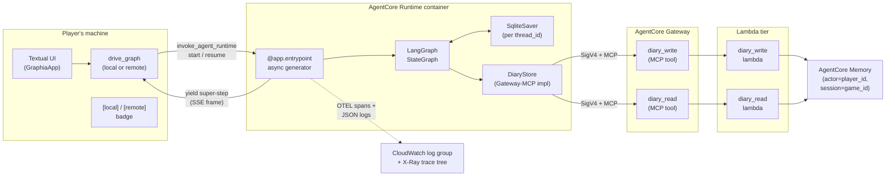

# Tutorial 002: Hosted AgentCore Deployment

- **Spec:** [`context/spec/002-hosted-agentcore-deployment/`](../../spec/002-hosted-agentcore-deployment/)
- **Status:** Draft
- **Author:** Poe (on behalf of the project owner)
- **Date:** 2026-05-20
- **Prerequisites:** `001-playable-skeleton`

---

## Overview

Spec 001 produced a playable single-player Mafia game running on the developer's laptop — one `python -m graphia` process, one local SQLite checkpointer, one LLM client. Spec 002 takes that same game and makes it deployable: the entire LangGraph graph now also runs as a hosted **Bedrock AgentCore Runtime** workload, with per-game diaries persisted through an **AgentCore Gateway**-fronted MCP surface into **AgentCore Memory**, the whole stack provisioned by **Terraform**, and a navigable per-game **OTEL trace tree** captured in CloudWatch.

The interesting design problem is composition: a Phase-1 game built around a single in-process LangGraph has many places where "where the state lives" and "how the agent reaches its tools" are implicit. Phase 2 turns each implicit choice into an explicit seam — a `DiaryStore` Protocol, a dual-mode driver, a Gateway-fronted MCP tool surface — so the same gameplay code drives both `python -m graphia` *and* `python -m graphia --remote`. The central technology is **AgentCore Runtime** itself: a managed-container Python contract that absorbs the same `graph.stream()` you already wrote in spec 001, plus a small set of conventions (start/resume payloads, async-generator-as-SSE, IAM execution role) that make HITL work across the wire.

This tutorial teaches the design **core-outward**. It starts at the deployment surface (the AgentCore contract), works outward through the dual-mode driver, the diary-store abstraction, the Terraform module that stands it all up, the observability that makes a running game inspectable, and finally the small refinements (failure modal, equivalence tests, introspection tools) that make remote mode comfortable to live with. By the end you should be able to point at any line of the Slice-1-through-Slice-11 code and explain *why* it composes with everything else.

---

## Concepts already covered (referenced, not re-taught)

This tutorial builds on the LangGraph foundation laid out in tutorial 001 — those concepts are not re-introduced here; the Walkthrough cites them by name where they compose with new pieces.

- **Typed state with field-level reducers** — the single `GameState` `TypedDict` and its reducers still describe the whole game's state; both modes drive the *same* state shape. (See [tutorial 001](../001-playable-skeleton/tutorial.md).)
- **Replay-safe interrupt placement** — every human-input node still has `interrupt()` as its first statement; in remote mode the interrupt happens server-side and arrives over SSE. (See [tutorial 001](../001-playable-skeleton/tutorial.md).)
- **Resume via `Command` payload** — both the local driver and the remote client pump `Command(resume=value)` to land at the previously-paused `interrupt()`. (See [tutorial 001](../001-playable-skeleton/tutorial.md).)
- **Per-game SQLite checkpointer** — `SqliteSaver` still backs the graph; in remote mode it lives inside the Runtime container, keyed on the same `thread_id` the client sends with every payload. (See [tutorial 001](../001-playable-skeleton/tutorial.md).)
- **Streaming graph updates** — `graph.stream(..., stream_mode="updates")` is the producer side in both modes; one super-step = one chunk in either transport. (See [tutorial 001](../001-playable-skeleton/tutorial.md).)
- **Async-to-thread sync-stream bridge** — local mode still bridges the sync LangGraph stream to Textual's async loop the way spec 001 did; remote mode shares the same consumer surface. (See [tutorial 001](../001-playable-skeleton/tutorial.md).)
- **Interrupt-payload dispatch to modal** — the human-input dispatcher in the UI is unchanged; what differs is where the interrupt came from on the wire. (See [tutorial 001](../001-playable-skeleton/tutorial.md).)
- **`.env` config with typed validation** — `GraphiaConfig` is still the single source of truth, now with `remote_mode`, `runtime_invocation_url`, `memory_id`, `gateway_url`, and `cloudwatch_log_group` fields. (See [tutorial 001](../001-playable-skeleton/tutorial.md).)

One spec-001 concept is **retired**: `regional-inference-profile-prefix`. The model surface migrated to **Nova direct on-demand in us-east-1** (no inference profile, no `us.` prefix); see the new concept of the same name below.

---

## What's new this increment

These are the concepts introduced or extended by spec 002. Each title links down to the Walkthrough section where it is taught.

**Deployment surface**

- [**Managed-container Runtime as the deployment target**](#1-the-deployment-paradigm-agentcore-runtime-as-a-managed-container-surface) — the spine: a scale-to-zero `linux/arm64` container that the platform invokes for you.
- [**Bedrock-AgentCore Python entrypoint**](#1-the-deployment-paradigm-agentcore-runtime-as-a-managed-container-surface) — `BedrockAgentCoreApp` + `@app.entrypoint` + `app.run()` is the full contract.
- [**Async-generator entrypoint streams super-steps as SSE**](#1-the-deployment-paradigm-agentcore-runtime-as-a-managed-container-surface) — one yielded dict per super-step lands as one SSE frame on the wire.
- [**Start vs resume payload contract**](#1-the-deployment-paradigm-agentcore-runtime-as-a-managed-container-surface) — `{"action": "start" | "resume", "thread_id", …}` is the invocation shape.
- [**Explicit host binding for Podman compatibility**](#1-the-deployment-paradigm-agentcore-runtime-as-a-managed-container-surface) — `app.run(host="0.0.0.0")` overrides the SDK's `/.dockerenv` heuristic.
- [**Workload credentials via IAM execution role**](#1-the-deployment-paradigm-agentcore-runtime-as-a-managed-container-surface) — the Runtime assumes an IAM role; boto3 inside the container picks the creds up automatically.

**Driver and UI mode-agnosticism**

- [**boto3 `invoke_agent_runtime` is the client-side path**](#2-crossing-the-wire-keeping-the-driver-mode-agnostic) — the SDK ships server-side primitives; clients go through boto3 directly.
- [**Mode-agnostic consumer via shared chunk shape**](#2-crossing-the-wire-keeping-the-driver-mode-agnostic) — one queue, two producers, one consumer.
- [**Standard-credential-chain auth in `GraphiaConfig`**](#2-crossing-the-wire-keeping-the-driver-mode-agnostic) — bearer token demoted; `AWS_PROFILE` / SSO is the canonical path.
- [**Nova direct on-demand in us-east-1**](#2-crossing-the-wire-keeping-the-driver-mode-agnostic) — Nova Pro + Lite, no inference profile, no cross-region routing.
- [**Dual-mode config with contradiction check**](#2-crossing-the-wire-keeping-the-driver-mode-agnostic) — config raises only on inconsistency, not on missing fields.
- [**Argparse → env → typed config bridge**](#2-crossing-the-wire-keeping-the-driver-mode-agnostic) — `--remote` promotes itself to env so `load_config()` is the single source of truth.
- [**Corner-docked mode badge**](#2-crossing-the-wire-keeping-the-driver-mode-agnostic) — `[local]` / `[remote]` overlay; the player always knows where the game lives.

**Per-game state on AWS**

- [**DiaryStore Protocol with two implementations**](#3-per-game-state-when-there-is-no-local-sqlite-the-diarystore-protocol) — one Protocol, two backings, identical call sites in `night_close`.
- [**Diary store factory with precedence**](#3-per-game-state-when-there-is-no-local-sqlite-the-diarystore-protocol) — Gateway-MCP wins over direct Memory wins over in-process.
- [**Gateway-fronted MCP diary tools**](#3-per-game-state-when-there-is-no-local-sqlite-the-diarystore-protocol) — agent → Gateway (MCP) → Lambda → Memory; the Runtime never touches Memory directly.
- [**AgentCore Memory event model for diaries**](#3-per-game-state-when-there-is-no-local-sqlite-the-diarystore-protocol) — one event per diary entry, `actor_id=player_id`, `session_id=game_id`, JSON body.
- [**Night-close diary write/read round-trip with graceful fallback**](#3-per-game-state-when-there-is-no-local-sqlite-the-diarystore-protocol) — Night 2+ reads its own prior entries, then writes; each call try/except-guarded.

**Infrastructure as Code**

- [**Terraform run inside a pinned container**](#4-standing-it-up-terraform-in-container-makefile-composites-image-driven-deploys) — `./tf` wrapper picks Podman or Docker, pins `hashicorp/terraform:1.13.1`.
- [**AgentCore resources in the AWS provider**](#4-standing-it-up-terraform-in-container-makefile-composites-image-driven-deploys) — `aws_bedrockagentcore_agent_runtime` and its quirks.
- [**Required tags via provider `default_tags`**](#4-standing-it-up-terraform-in-container-makefile-composites-image-driven-deploys) — one tag map, every taggable resource.
- [**Single name prefix with regex-aware variants**](#4-standing-it-up-terraform-in-container-makefile-composites-image-driven-deploys) — `local.name_prefix` plus `replace()`/`substr()` for stricter regexes.
- [**ECR force-delete safeguard**](#4-standing-it-up-terraform-in-container-makefile-composites-image-driven-deploys) — destroy refuses to drop a non-empty ECR by default.
- [**Multi-stage uv-driven Dockerfile**](#4-standing-it-up-terraform-in-container-makefile-composites-image-driven-deploys) — install deps before source so source edits don't bust the cache.
- [**Makefile as project-wide task-runner**](#4-standing-it-up-terraform-in-container-makefile-composites-image-driven-deploys) — every workflow is a named `make` composite.
- [**Image-driven Runtime deploys**](#4-standing-it-up-terraform-in-container-makefile-composites-image-driven-deploys) — bumping the image tag is what rolls the Runtime.
- [**Bootstrap-then-apply first deploy**](#4-standing-it-up-terraform-in-container-makefile-composites-image-driven-deploys) — targeted apply for ECR before the full apply.
- [**Gateway + Lambda + zip-build pipeline**](#4-standing-it-up-terraform-in-container-makefile-composites-image-driven-deploys) — Makefile pattern rule + Gateway target resources for the MCP tools.
- [**CloudWatch vended log + trace delivery**](#4-standing-it-up-terraform-in-container-makefile-composites-image-driven-deploys) — `aws_cloudwatch_log_delivery_*` resources route APPLICATION_LOGS + TRACES.
- [**Makefile deploy next-step hint**](#4-standing-it-up-terraform-in-container-makefile-composites-image-driven-deploys) — every deploy ends pointing at `make play-remote`.

**Observability**

- [**Per-invocation OTEL root span**](#5-seeing-what-happened-the-nested-trace-tree-and-structured-logs) — one root span per `start`/`resume`; LangChain spans nest under it.
- [**OTEL baggage `session.id` for trace-tree grouping**](#5-seeing-what-happened-the-nested-trace-tree-and-structured-logs) — `thread_id` written to `session.id` → GenAI Observability groups one game's spans.
- [**OpenInference LangChain instrumentor for trace tree**](#5-seeing-what-happened-the-nested-trace-tree-and-structured-logs) — generic ADOT does not instrument LangChain; OpenInference does.
- [**ContextVar thread_id binding for log filtering**](#5-seeing-what-happened-the-nested-trace-tree-and-structured-logs) — every log record carries the right `thread_id`.
- [**Runtime IAM observability permissions**](#5-seeing-what-happened-the-nested-trace-tree-and-structured-logs) — `logs:*` + `xray:*` on the execution role; the missing piece in CR 003.

**Error surface, equivalence, introspection**

- [**Failure modal as the remote error surface**](#6-when-things-go-wrong-the-failure-modal-as-the-error-surface) — modal shows log group + thread-id filter; chosen over pre-launch refusal in CR 004.
- [**Dual-mode equivalence smoke test**](#7-local-mode-preserved--dual-mode-equivalence--introspection) — full-game public-output match across modes.
- [**`inspect-diary` CLI for Memory introspection**](#7-local-mode-preserved--dual-mode-equivalence--introspection) — `make inspect-diary` walks AgentCore Memory after a remote game.

---

## Diagram

The remote leg is the structurally new piece — both UI and graph already existed in spec 001. This diagram shows where the wire is and what crosses it.



---

## Walkthrough

The walkthrough is depth-first. The deepest concept of this increment — the AgentCore Runtime as a managed-container deployment surface — is Section 1. Each subsequent section adds a layer that composes with everything before it. The local-mode story and the introspection-and-recovery rounding-out come last, even though chronologically the local-mode work was done first; they make less sense before you understand what we are preserving local-mode parity *with*.

### 1. The deployment paradigm: AgentCore Runtime as a managed-container surface

**How would we host a stateful, human-in-the-loop LangGraph workload on AWS without writing our own HTTP server, autoscaling, idle suspension, and credential plumbing?**

We use **Bedrock AgentCore Runtime** — a managed-container deployment target for agent workloads. The Runtime takes one `linux/arm64` container image from ECR and runs it on a scale-to-zero compute fabric. The platform handles invocation routing, idle suspension after periods of inactivity, autoscaling under load, and presents the workload with workload credentials via the standard boto3 environment variables. The unit we ship is a container; the unit we invoke is a Python function. This is **managed-container Runtime as the deployment target** — the spine of the whole spec.

Inside the container, the Python contract is intentionally minimal. We instantiate one `BedrockAgentCoreApp`, decorate one handler with `@app.entrypoint`, and call `app.run()`:

```python
# src/graphia/runtime/__main__.py — module-level setup + handler()
from bedrock_agentcore.runtime import BedrockAgentCoreApp

app = BedrockAgentCoreApp()

@app.entrypoint
async def handler(payload: dict) -> AsyncIterator[dict]:
    action = payload.get("action")
    thread_id = payload["thread_id"]
    ...

if __name__ == "__main__":
    app.run(host="0.0.0.0")
```

The decorator + `app.run()` are the **Bedrock-AgentCore Python entrypoint**: behind the scenes the SDK bundles Starlette + Uvicorn, registers the handler as an HTTP endpoint, and binds to the port AgentCore expects. We do not write any of that. The one Podman-specific subtlety is **explicit host binding for Podman compatibility**: the SDK auto-detects "running inside a container" by checking for `/.dockerenv`, which Podman does not create. Without `host="0.0.0.0"` the SDK would silently bind to localhost-only inside a Podman container, and the platform would never reach the workload. Passing the host explicitly defeats the heuristic.

Now look at the handler signature: `async def … -> AsyncIterator[dict]`. That is **async-generator entrypoint streams super-steps as SSE**. The SDK inspects the handler via `inspect.isasyncgenfunction`; when it sees an async generator, it wraps every yielded dict as one SSE `data:` frame on the wire. We don't think about SSE at all — we just `yield chunk` once per LangGraph super-step. Because we already established **streaming graph updates** in spec 001 (one super-step = one `{node_name: update}` dict), we can hand each chunk straight to the client without reshaping it. The composition is what makes this clean: spec 001's chunk shape *is* the SSE event shape.

The handler dispatches on a payload field rather than two separate endpoints. This is the **start vs resume payload contract**: `{"action": "start", "thread_id", "initial_state"}` boots a new game; `{"action": "resume", "thread_id", "resume_value"}` lands at the previously-suspended `interrupt()`. Same `thread_id` on every call — that is how the in-container `SqliteSaver` (still **per-game SQLite checkpointer** from spec 001) lands on the same checkpoint file across the boundary. The client side of this contract is **boto3 `invoke_agent_runtime` is the client-side path** (Section 2); the server side is one Python function that branches on `action`.

The container needs AWS credentials to call Bedrock and Gateway-MCP. We do **not** mount a bearer token. The platform assumes an IAM role on our behalf and exposes the credentials via the standard `AWS_*` environment variables — **workload credentials via IAM execution role**. boto3's default credential chain inside the container picks them up without any code. The role is provisioned by Terraform with a least-privilege inline policy (`bedrock:InvokeModel`, `bedrock-agentcore:*` for the diary tools, plus the observability permissions we will get to in Section 5) and trust policy on `bedrock-agentcore.amazonaws.com`. The agent code is unaware of how it got authenticated — that is the point.

### 2. Crossing the wire: keeping the driver mode-agnostic

**Once the graph runs server-side, how does the UI consume it without growing a parallel rendering pipeline for the remote case?**

The trick is to make the *transport* the only thing that changes. Local mode iterates a `graph.stream()` generator on a worker thread; remote mode invokes `boto3.client("bedrock-agentcore").invoke_agent_runtime(...)` and reads SSE frames off its response. Both ends emit the same shape: a dict whose single key is a node name and whose value is the state update from that super-step. So the consumer reads one `asyncio.Queue` of `{node_name: update}` dicts and never asks where they came from. This is **mode-agnostic consumer via shared chunk shape** — the most load-bearing piece of the dual-mode design.

```python
# src/graphia/driver.py — drive_graph
queue: asyncio.Queue[dict | None] = asyncio.Queue()
producer = (
    _produce_remote(client, queue, thread_id, initial_state)
    if config.remote_mode
    else _produce_local(graph, queue, thread_id, initial_state)
)
asyncio.create_task(producer)
async for chunk in _consume_stream(queue):
    await _dispatch(chunk)  # same code in both modes
```

On the client side, the `bedrock_agentcore` SDK ships server-side primitives only; calling a deployed Runtime from outside the container goes through plain boto3. This is **boto3 `invoke_agent_runtime` is the client-side path** — the SDK's `RuntimeClient` from earlier speculative documentation does not actually exist; we wrap `boto3.client("bedrock-agentcore").invoke_agent_runtime` ourselves and stream its response body. SigV4 is handled by boto3 transparently from the local AWS profile.

The same AWS credentials story applies on the client too: **standard-credential-chain auth in `GraphiaConfig`** means `load_config()` no longer demands a bearer token. The bearer field is kept as an optional fallback so we don't break anyone who already had one wired, but the canonical path is `AWS_PROFILE` pointing at the SSO profile the rest of the team uses. The profile name is never hardcoded in the source — it is read from the environment.

Switching modes is a single argparse flag. We don't want two parallel "is remote?" booleans, one per call site, drifting out of sync — instead, **argparse → env → typed config bridge**: argparse parses `--remote`, immediately writes `os.environ["GRAPHIA_REMOTE"] = "1"`, *then* calls `load_config()`. The dataclass remains the single source of truth, and downstream code only ever checks `config.remote_mode`.

```python
# src/graphia/__main__.py — main()
args = parser.parse_args()
if args.remote:
    os.environ["GRAPHIA_REMOTE"] = "1"
config = load_config()  # picks remote_mode up from env, validates
```

`GraphiaConfig` validates **only inconsistencies**, never absences. If `remote_mode=True` and `runtime_invocation_url` is missing, it raises — but a config with neither field set is fine and produces a local game. This is **dual-mode config with contradiction check** — the rule is *don't make the developer satisfy every field; only catch the configurations that cannot possibly work*. The same rule applies to the optional `memory_id`, `gateway_url`, and `cloudwatch_log_group` fields.

One more piece on the UI side: a `[local]` or `[remote]` badge in the top-right corner. The **corner-docked mode badge** mounts in `GraphiaApp.compose()`, reads `config.remote_mode`, and never changes again for the life of the app. It is decorative, but cheap and high-value — a player running two terminal windows side by side never confuses them.

Finally, the Bedrock LLM surface itself migrated since spec 001. The model singletons are now **Nova direct on-demand in us-east-1**: `amazon.nova-pro-v1:0` for gameplay reasoning and `amazon.nova-lite-v1:0` for mechanical work, invoked directly against the foundation-model ARN. This retires spec 001's `regional-inference-profile-prefix` — no more `us.anthropic.…` profile, no more cross-region inference call. The same `with_structured_output(<flat-Pydantic>)` and **single-retry-on-validation-error** patterns from spec 001 still apply; only the model id changed.

### 3. Per-game state when there is no local SQLite: the DiaryStore Protocol

**The LangGraph checkpointer survives via `SqliteSaver` inside the Runtime — but spec 002 also promises that each AI's diary entries persist into AgentCore Memory. How does the same gameplay code drive both an in-process map and a Gateway-fronted AWS service?**

We hide the storage behind a Protocol. **DiaryStore Protocol with two implementations** is a tiny interface — `write(game_id, player_id, night_index, content)` plus `read(game_id, player_id) -> list[DiaryEntry]` — implemented by `InProcessDiaryStore` (a dict-of-lists keyed by `(game_id, player_id)`) and by `AgentCoreMemoryDiaryStore` / `GatewayMCPDiaryStore` (the remote-mode siblings that talk to AWS). The graph node `night_close` accepts one of them and calls it the same way no matter which it received:

```python
# src/graphia/diary_store.py — DiaryStore and DiaryEntry
@dataclass(frozen=True)
class DiaryEntry:
    night_index: int
    content: str

class DiaryStore(Protocol):
    def write(self, game_id: str, player_id: str, night_index: int, content: str) -> None: ...
    def read(self, game_id: str, player_id: str) -> list[DiaryEntry]: ...
```

Picking the right store is a factory call. **Diary store factory with precedence** is `make_diary_store(config)` — it checks `gateway_url` first (Gateway-MCP path, used inside the deployed Runtime), then `memory_id` (direct-Memory path, useful for tests or local development against a real Memory resource), then falls back to `InProcessDiaryStore`. The precedence is deliberate: the deployed Runtime always has both `gateway_url` and `memory_id` set, and we want it to go through the Gateway (so the agent sees governance) rather than calling Memory directly.

The remote-mode store does *not* call AgentCore Memory directly from the agent. It calls **Gateway-fronted MCP diary tools** — `graphia-diary-write___diary_write` and `graphia-diary-read___diary_read`, exposed by AgentCore Gateway over MCP. The store wraps each call in a SigV4-signed httpx request (Gateway uses `AWS_IAM` authorizer), hits the Gateway URL, and Gateway routes the call to one of two Python 3.13 Lambdas. The Lambdas then talk to AgentCore Memory. Topology:

```
Runtime → Gateway (MCP) → Lambda → AgentCore Memory
```

There are two distinct payoffs from this indirection. First, it is the **AgentCore Gateway-Fronted Tool Surface** the roadmap promises — the agent calls tools the way a real product's agent would, through the same governance layer (IAM, policy, audit). Second, the Lambda is the right place to put the Memory-specific encoding so the agent never has to think about it. That encoding is the **AgentCore Memory event model for diaries**:

```python
# infra/lambda/diary_write/lambda_function.py — handler()
client.create_event(
    memory_id=memory_id,
    actor_id=player_id,
    session_id=game_id,
    payload=[{
        "blob": json.dumps({
            "kind": "diary_entry",
            "game_id": game_id,
            "player_id": player_id,
            "night_index": night_index,
            "content": content,
        }),
    }],
    metadata={"kind": "diary_entry", "night_index": f"{night_index:04d}"},
)
```

Memory's event model is `(actor, session) -> [events]`. We use `actor_id=player_id` and `session_id=game_id` — so one player's diary across one game is one Memory session. `list_events()` returns events in metadata order; we zero-pad `night_index` to four digits in metadata so the natural sort matches numeric order. The JSON `blob` carries the full diary entry shape; on read, the same Lambda decodes it back into `DiaryEntry` objects. The Runtime's `DiaryStore` and the Lambda's logic share the *same* `AgentCoreMemoryDiaryStore` implementation under the hood — there is one source of truth for the Memory encoding, used both in-Runtime (when `gateway_url` is unset, e.g., local-dev-against-real-Memory) and inside the Lambda.

Integration into the game happens in one place: `night_close`. The same node code runs in both modes — only the injected `diary_store` differs. That is the payoff. The body is the **night-close diary write/read round-trip with graceful fallback**:

```python
# src/graphia/nodes/night.py — night_close()
if diary_store is not None and game_id is not None and cycle >= 2:
    for player in survivors:
        if player.is_human:
            continue
        try:
            entries = diary_store.read(game_id=game_id, player_id=player.id)
            logger.info("Read %s prior diary entries for player %s on night %s.", len(entries), player.id, cycle)
        except Exception:
            logger.exception("Diary read failed for player %s on night %s; continuing.", player.id, cycle)

if diary_store is not None and game_id is not None:
    for player in survivors:
        if player.is_human:
            continue
        try:
            diary_store.write(game_id=game_id, player_id=player.id, night_index=cycle, content=placeholder)
        except Exception:
            logger.exception("Diary write failed for player %s on night %s; continuing.", player.id, cycle)
```

Three things compose here. First, the **DiaryStore Protocol** lets us write one node body that drives both modes — the local-mode store fails closed via the same Protocol-typed exception (it doesn't, in practice, but if it did, the same handler catches it). Second, the read-back is gated on `cycle >= 2` because Night 1 has no prior entries — we picked the gate so the read path is genuinely exercised every Night 2+ without burning a no-op call on Night 1. Third, each call is wrapped in its own try/except: persistence must never crash gameplay. If Memory is briefly unreachable, the game continues without that entry rather than losing a whole session — the **persistence-never-crashes-gameplay** stance is what CR 004 codified in §2.4.5 of the spec.

### 4. Standing it up: Terraform-in-container, Makefile composites, image-driven deploys

**The Runtime, Gateway, two Lambdas, Memory, ECR repository, IAM roles, log groups, and X-Ray delivery are eight or nine AWS resources knit together by a handful of ARNs. How do we make standing the whole stack up one command — and tearing it down one command — without depending on what is installed on the developer's laptop?**

We run Terraform itself inside a pinned container, and we drive that container from a Makefile. **Terraform run inside a pinned container** is a small wrapper script (`./tf`) that auto-detects Podman or Docker, pulls a pinned `hashicorp/terraform:1.13.1` image, mounts the project directory + the SSO cache, forwards `AWS_PROFILE`, and execs `terraform` inside. Every developer runs the same Terraform version, the same backend init, against the same plugin lockfile. "Works on my Terraform version" cannot happen.

```bash
# ./tf — sketch of the wrapper
runtime=$(command -v podman || command -v docker)
$runtime run --rm -v "$PWD:/work" -w /work/infra/terraform \
  -v "$HOME/.aws:/root/.aws:ro" -e AWS_PROFILE \
  hashicorp/terraform:1.13.1 "$@"
```

Inside the container, the Terraform module is one directory (`infra/terraform/`) with one AWS provider. The provider's `default_tags` block applies `{Project, ManagedBy, Environment, Owner}` to every taggable resource without per-resource repetition — **required tags via provider `default_tags`** — and every resource's name derives from `local.name_prefix = "graphia-${var.environment}"`. Some resources have stricter naming regexes than others: the AgentCore Runtime resource, for instance, allows only alphanumeric and underscore. So we keep one prefix and derive the variants:

```hcl
# infra/terraform/locals.tf — name prefix and variants
locals {
  name_prefix         = "graphia-${var.environment}"
  name_prefix_runtime = replace(local.name_prefix, "-", "_")
}
```

This is **single name prefix with regex-aware variants**. The benefit is more than tidiness — when you destroy and re-apply, every resource still keeps the right name, every tag still matches, and the resource graph is uniformly searchable.

The AgentCore resources themselves have a couple of quirks worth knowing — **AgentCore resources in the AWS provider**: the Terraform resource is named `aws_bedrockagentcore_agent_runtime` (with `_agent_` infix) even though CloudFormation calls it `AWS::BedrockAgentCore::Runtime`, and the resource exposes no `invocation_url` attribute. Clients invoke against the `agentRuntimeArn`, which we expose as an output and consume from the `.env`.

The Runtime resource interpolates its container URI from a variable:

```hcl
# infra/terraform/main.tf — aws_bedrockagentcore_agent_runtime.this
resource "aws_bedrockagentcore_agent_runtime" "this" {
  agent_runtime_name = local.name_prefix_runtime
  role_arn           = aws_iam_role.runtime.arn
  agent_runtime_artifact {
    container_configuration {
      container_uri = "${aws_ecr_repository.runtime.repository_url}:${var.image_tag}"
    }
  }
}
```

This is **image-driven Runtime deploys**: bumping `var.image_tag` is what tells AgentCore to roll. `make redeploy` always passes the current git SHA (`git rev-parse --short HEAD`) as the tag — so a redeploy after committing is a deterministic, content-addressed roll, and a redeploy *without* committing is a no-op. The image itself is built by a **multi-stage uv-driven Dockerfile**: a uv builder stage installs deps from `pyproject.toml` + `uv.lock` before copying source, so source edits don't bust the dep-install cache; the final stage copies only the `.venv` and the source.

The bootstrap path has a chicken-and-egg problem. The Runtime needs an image. The image needs an ECR repo. The ECR repo needs to be applied by Terraform. We resolve this with **bootstrap-then-apply first deploy**: a targeted apply (`./tf apply -target=aws_ecr_repository.runtime`) creates *only* the ECR repo, then `make push` pushes the first image, then a full `make deploy` applies the rest with `image_tag` already set. `make bootstrap` is the named composite that runs the targeted apply.

The Gateway side has its own build pipeline. Each diary tool ships as a Python 3.13 Lambda; the **Gateway + Lambda + zip-build pipeline** is a Makefile pattern rule that, for each Lambda, pip-installs `manylinux2014_x86_64` wheels into a staging directory, copies the handler in, and zips everything with the handler at the zip root. Terraform then wires `aws_bedrockagentcore_gateway` (MCP protocol, AWS_IAM authorizer) and two `aws_bedrockagentcore_gateway_target` resources whose `tool_schema` blocks declare the call signatures Gateway publishes over MCP — `(game_id, player_id, night_index, content)` for write, `(game_id, player_id)` for read.

The ECR repository carries a destroy-time safeguard. **ECR force-delete safeguard** is `var.ecr_force_delete = false` by default, so `make destroy` refuses to drop the repo while it still has images. Override is two-step — a targeted apply to flip the flag, then destroy — because the AWS provider reads `force_delete` from the prior state, not from the in-flight plan. The safeguard is also what lets us safely run a destroy-and-reapply cycle to validate the module — which Slice 10 does, end-to-end, from a clean slate.

Last in the IaC story: observability wiring. **CloudWatch vended log + trace delivery** is declarative — `aws_cloudwatch_log_delivery_source` (APPLICATION_LOGS, TRACES) plus `aws_cloudwatch_log_delivery_destination` (CloudWatch Logs for logs, X-Ray for traces) plus the connecting `aws_cloudwatch_log_delivery` resources. We do *not* create the runtime's log group ourselves — AgentCore creates `/aws/bedrock-agentcore/runtimes/<runtime-id>-DEFAULT` for us; we only declare where its telemetry flows. A separate `aws_cloudwatch_log_resource_policy` grants `xray.amazonaws.com` write access to `aws/spans` and `/aws/application-signals/data` so Transaction Search works; one Makefile target rounds out the post-apply CLI steps the resource policy alone cannot do.

All of this hides behind a small set of **Makefile as project-wide task-runner** composites. `make bootstrap` does the targeted-ECR first apply. `make build` rebuilds the image. `make push` pushes to ECR. `make deploy` runs the full apply. `make redeploy` rebuilds + pushes + applies in one shot with the current git SHA. `make destroy` tears the stack down (respecting the safeguard). `make play-remote` launches a `--remote` game. `make inspect-diary` runs the introspection tool we will get to in Section 7. And, per CR 004, every deploy ends with a **Makefile deploy next-step hint** — an echoed *"Next: launch a game against the deployed Runtime with: make play-remote"* — so the developer never has to remember the launch command.

### 5. Seeing what happened: the nested trace tree and structured logs

**With the graph running across a wire, how do we inspect what one game's super-steps did — not in aggregate, but as a single navigable conversation?**

We want one trace tree per game session, where each LangGraph node is a child span of the per-invocation root span, and each LangChain call inside a node is a child of the node's span. The platform gives us most of this for free, but two pieces have to be wired by us — and the second was the subject of CR 003, the most painful debugging episode of the spec.

The first piece is the **per-invocation OTEL root span**. The Runtime SDK does not open one by default — without it, every LangChain call becomes its own top-level span and the trace tree fans out flat. We open one explicitly in `handler()`, named `graphia.runtime.invocation`, and keep it active while `graph.stream()` runs:

```python
# src/graphia/runtime/observability.py — runtime_invocation_span()
@contextmanager
def runtime_invocation_span(thread_id: str) -> Iterator[Span]:
    tracer = trace.get_tracer(__name__)
    with tracer.start_as_current_span(RUNTIME_ROOT_SPAN_NAME) as span:
        span.set_attribute("graphia.thread_id", thread_id)
        yield span
```

Because we already established **streaming graph updates**, every LangChain call inside `graph.stream()` happens *inside* this context manager — and every LangChain span produced by the OpenInference instrumentor (next paragraph) nests under it. One invocation, one tree.

The second piece is the part that nearly cost the increment. **OpenInference LangChain instrumentor for trace tree** says: generic AWS Distro for OpenTelemetry instruments boto3, urllib3, and a few standard things, but it does **not** know about LangChain or LangGraph. To get nested LangChain spans we need to install `openinference-instrumentation-langchain` and let AgentCore's auto-loader pick it up via the `opentelemetry_instrumentor` setuptools entrypoint. Without it, we still get one root span — but it has no children, and the trace tree is a flat list of HTTP spans from boto3 with no agent reasoning visible. That was the symptom CR 003 documented.

The third piece groups invocations into per-game sessions. **OTEL baggage `session.id` for trace-tree grouping** writes the LangGraph `thread_id` into the OTEL baggage's `session.id` key:

```python
# src/graphia/runtime/observability.py — stamp_trace_thread_id()
def stamp_trace_thread_id(thread_id: str) -> None:
    ctx = baggage.set_baggage("session.id", thread_id)
    context.attach(ctx)
```

AWS's OTEL configurator reads `session.id` baggage and promotes it onto every span emitted while the baggage is in scope. The GenAI Observability console then groups spans by `session.id` and lets us click into one game's full tree.

The logging side is structured the same way. **ContextVar thread_id binding for log filtering** is a tiny piece of glue: `bind_thread_id(thread_id)` writes to a module-level `ContextVar`, and a `ThreadIdLogFilter` reads it on every `LogRecord` so the JSON-formatted CloudWatch line carries `thread_id` as a top-level field. A `{ $.thread_id = "<thread>" }` CloudWatch filter then selects exactly one game's logs:

```python
# src/graphia/runtime/observability.py — ThreadIdLogFilter
class ThreadIdLogFilter(logging.Filter):
    def filter(self, record: logging.LogRecord) -> bool:
        record.thread_id = _THREAD_ID.get(None) or ""
        return True
```

The full structured shape is `{ts, level, logger, thread_id, message, ...extra}`, written one JSON object per line by `JsonLogFormatter`. Any `logger.info(..., extra={"event": "graph_step", "node": node_name})` call lands those keys verbatim into the JSON; CloudWatch then lets us filter on `$.event = "graph_step" && $.node = "night_close"` for surgical post-mortem queries.

All of the above is moot without IAM. **Runtime IAM observability permissions** is the lesson CR 003 paid for in production debugging. The Runtime's execution role needs `logs:CreateLogGroup`, `logs:DescribeLog*`, `logs:CreateLogStream`, `logs:PutLogEvents`, `xray:PutTraceSegments`, and `xray:PutTelemetryRecords` for the platform to be allowed to create the runtime's service log group on first invocation and for X-Ray to accept the trace export. The original Slice-7 inline policy only granted a single broad `cloudwatch:*` action, and the platform-managed log-group creation failed silently; traces were rejected at the X-Ray endpoint, also silently. The runtime appeared to work — the game played to completion — and the trace tree was empty. The fix landed in `infra/terraform/main.tf`'s `runtime_inline` policy document and re-applied without a Runtime roll (the platform picks up role changes immediately).

### 6. When things go wrong: the failure modal as the error surface

**If the deployed Runtime is unreachable, or the local SSO session has expired, or the platform throws a transient error mid-game — how does the human player learn what happened in a way they can actually act on?**

The honest answer is: not through a pre-launch refusal. Phase 2 originally specified §2.2.4 / §2.2.5 to require `--remote` to *refuse to start* with specific named messages when the SSO session was expired or no runtime was reachable. Slice 8 delivered a different design and CR 004 ratified it: a **Failure modal as the remote error surface**. When an exception bubbles out of the remote-mode driver, the Textual app pushes a `FailureModal` screen that shows three things — the captured `thread_id`, the CloudWatch log group name from `config.cloudwatch_log_group`, and a copy-pasteable `{ $.thread_id = "…" }` filter expression. The player has, in two terminal selections, everything they need to walk into CloudWatch and find the failing game.

```python
# src/graphia/ui/failure_modal.py — FailureModal.compose()
yield Label("Remote game error")
yield Static(error_summary)
yield Label(f"CloudWatch log group: {log_group}")
yield Label(f"Filter: {{ $.thread_id = \"{thread_id}\" }}")
```

Why is this better than a pre-launch refusal? Two reasons. First, the failure cases the original spec named — expired SSO, no runtime reachable — both reach the player *anyway*: an expired SSO triggers a boto3 credential error inside `invoke_agent_runtime`, an unreachable runtime triggers a `ResourceNotFoundException`. Both raise. Both surface through the modal with their stack traces visible in the captured log group. Second, the original spec cautioned against hardcoding the named messages — the AWS SDK's error strings evolve, and any pre-launch check that compares against a hardcoded string is one SDK version away from misfiring. The modal does not pretend to know; it shows what actually happened and points at the canonical post-mortem coordinate.

The composition with Section 5 is what makes this work. Because **per-invocation OTEL root span** + **OTEL baggage `session.id`** + **ContextVar thread_id binding** all key on the same `thread_id` the modal displays, the player who copy-pastes the filter expression lands directly on the relevant slice of CloudWatch *and* the relevant trace tree in GenAI Observability — with no further mapping required.

### 7. Local mode preserved, dual-mode equivalence, introspection

**With this much new machinery, how do we keep `python -m graphia` a working game — and how do we prove the remote leg adds nothing the player can see?**

Local mode is preserved by the factory default. `make_diary_store(config)` with no `gateway_url` and no `memory_id` returns `InProcessDiaryStore`; `GraphiaConfig` with `remote_mode=False` makes `drive_graph()` take the local branch. There is no separate "local mode" code path — there is one set of nodes and one driver, and the seams resolve to the simpler implementations by default. The **corner-docked mode badge** renders `[local]` and the player gets the spec-001 experience.

Equivalence is proven by a smoke test. **Dual-mode equivalence smoke test** is `test_local_and_remote_full_game_produce_identical_public_output`: it runs a complete game in each mode with identical `GRAPHIA_SEED`, identical scripted LLM responses, and identical scripted human inputs, then asserts that the public message log, the `kill_log`, and the winner are identical across the two runs. To avoid hitting real AWS, the test monkeypatches `graphia.driver.AgentCoreClient` with a `FakeAgentCoreClient` that captures the in-process compiled graph at `build_graph()` time and proxies remote `.stream()` calls into it — so the "remote" run genuinely exercises the dual-mode driver, the chunk-shape conversion, the SigV4 path of `GatewayMCPDiaryStore` (against a `FakeMemoryClient`), and every seam we built, without any network. If the equivalence test ever fails, the dual-mode story is genuinely broken.

The third piece — after a real remote game lands — is post-mortem introspection. **`inspect-diary` CLI for Memory introspection** is `python -m graphia.tools.inspect_diary`, wrapped behind `make inspect-diary`. It uses the `bedrock-agentcore` SDK's Memory client to walk the actor → session → event tree, decode each event's JSON blob, and print a table (or `--json` dump) of every diary entry it finds. After a remote game ends, `make inspect-diary` is what proves the round-trip really wrote and (for Night 2+) really read — it is the live counterpart to the smoke test's assertion.

The Slice-11 read-back exists for exactly this proof. Before Slice 11, the gameplay path only *wrote* diaries; the read half of the **DiaryStore Protocol** existed and was unit-tested but no game node ever called it. `/awos:verify` of the spec caught this gap, and the Slice-11 read-back closes it: every Night 2+, each surviving AI player reads its own prior entries via `diary_store.read()`. Phase 6 will consume the content; the Slice-11 read is intentionally placeholder usage (it logs the count and discards) — the acceptance criterion §2.4.2 is *path correctness*, not content semantics. With Slice 11, both halves of the Protocol are exercised in production code, and `make inspect-diary` plus the trace tree in CloudWatch will show both.

---

## Try it

The instructions below are anchored to commit **`45e30e8`** — the commit that flipped spec 002's status to `Completed`. As Phase 3+ work continues, the repository may evolve away from these exact file paths and Makefile targets; checking out this commit gives you the same code the tutorial describes.

```bash
git checkout 45e30e8
```

**Prerequisites once:**

- Podman or Docker installed and running (the `./tf` wrapper auto-detects either).
- AWS SSO configured for the deployment account, with `AWS_PROFILE` set to the right profile. The profile name is never hardcoded — `aws sso login --profile <yours>` and `export AWS_PROFILE=<yours>` is the only project-side step. Region `us-east-1`.
- `.env` populated from `.env.example` — `make wire-env` after the first deploy fills in the auto-discoverable fields (`RUNTIME_INVOCATION_URL`, `GATEWAY_URL`, `MEMORY_ID`, `GRAPHIA_LOG_GROUP`).

**First-time deploy** (the chicken-and-egg dance, ~5–10 minutes):

```bash
make bootstrap   # targeted ECR-only apply
make push        # build + push the Runtime image
make deploy      # full Terraform apply
make wire-env    # populate .env from terraform outputs
```

Both `deploy` and `redeploy` end with:

```
Next: launch a game against the deployed Runtime with:
  make play-remote
```

That is the **Makefile deploy next-step hint** in action — and the launch command from there is one line:

```bash
make play-remote
```

You should see the Textual UI come up with `[remote]` in the top-right corner (the **corner-docked mode badge**), the moderator prompt the human for a name, and the game stream through normally. Play it to completion — or quit after Night 2 if you only want to verify the round-trip.

**Confirm the round-trip landed:**

```bash
make inspect-diary
```

You should see one row per (game, AI player, night) — one entry for each surviving AI on each Night they survived. For a game that completed Night 2+, the same `game_id` appears in both Night 1 and Night 2 rows, with the night-2 entries written *after* the night-2 read-back (visible in the CloudWatch logs).

**Confirm the trace tree:**

The Runtime invocation URL's log group is surfaced by `terraform output cloudwatch_log_group` (and printed by `make wire-env`). In CloudWatch, the platform-managed log group is `/aws/bedrock-agentcore/runtimes/<runtime-id>-DEFAULT`. Filter on `{ $.thread_id = "<your-thread-id>" }` to see exactly one game's logs. The same `thread_id` is the `session.id` baggage key in GenAI Observability — the trace tree there should show one `graphia.runtime.invocation` root span per `start`/`resume`, with LangChain spans nested underneath.

**Tear it down:**

```bash
make destroy
```

The first attempt will refuse to drop the ECR repository (it has images). Run the override two-step:

```bash
make destroy ECR_FORCE_DELETE=1   # flip the safeguard, then destroy
```

The ECR repo, the Runtime, the Gateway + Lambdas, the Memory resource, the log groups, the IAM roles, and the X-Ray delivery resources all go. Local artifacts under `./.graphia/` are untouched — that is by design; nothing in Terraform state references them.

**Tests:**

```bash
uv run pytest -q                        # ~107 passed; the dual-mode smoke + diary-store tests are part of this
uv run pytest tests/test_dual_mode_smoke.py -q
uv run pytest tests/test_diary_store.py -q
```

The dual-mode smoke is the equivalence proof — if it fails, the seam between local and remote has drifted.

---

## Where to go next

- **Next tutorial:** none yet. Phase 3 (long-term cross-game memory) is the next planned increment; its functional spec will sit in `context/spec/003-<slug>/` once written.
- **Related ADRs:** see `context/adr/` — at minimum ADR 001 (hosted AgentCore deployment in us-east-1), plus any later ADRs covering region migration and the Nova-direct model choice.
- **Related CRs:** CR 001 (long-term memory promoted to Phase 3), CR 002 (tool-use demoted to Phase 7), CR 003 (nested-trace-tree observability and the IAM root cause), CR 004 (failure modal as the error surface, `make play-remote` deploy hint). All under `context/change-requests/`.
- **Live experiment:** with the stack standing, try `make inspect-diary --json | jq` for the full Memory dump, or open the GenAI Observability console and click into one game's trace — the nested tree is the most direct payoff of the whole spec.
