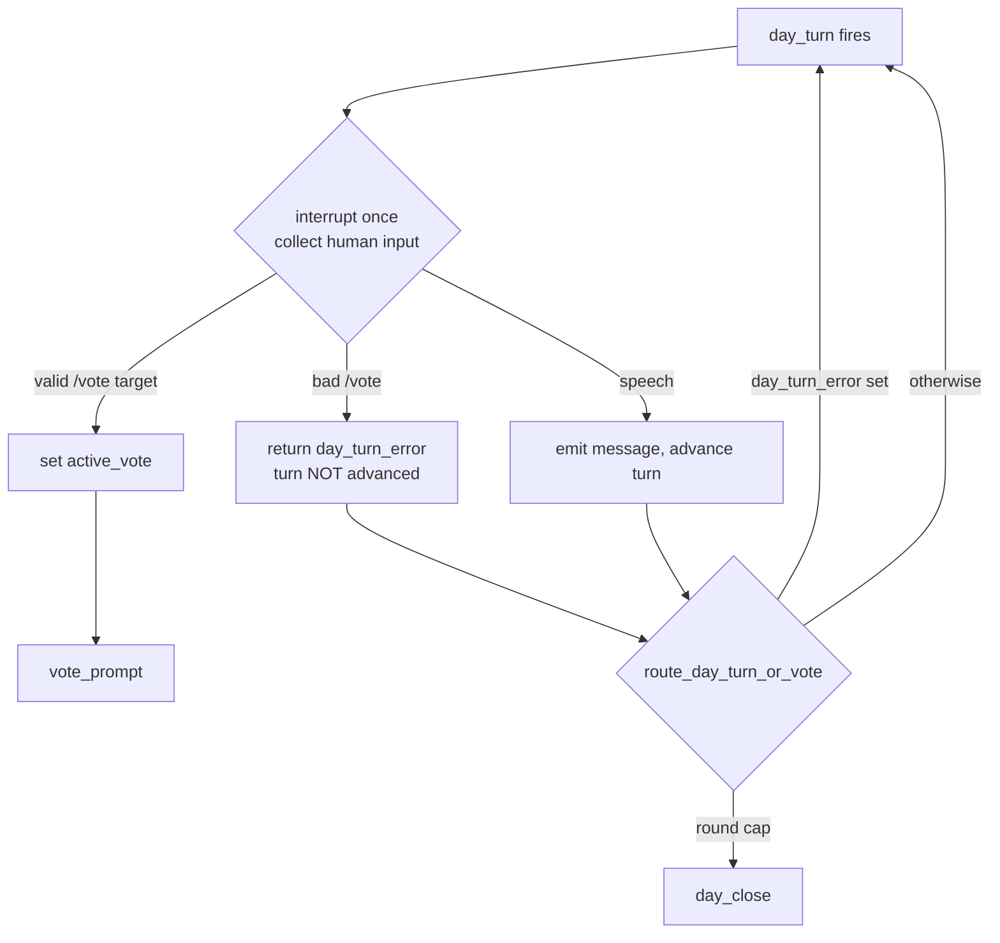

# Tutorial 004: Robust /vote Input Validation

- **Spec:** [`context/spec/004-robust-vote-input-validation/`](../../spec/004-robust-vote-input-validation/)
- **Status:** Draft
- **Author:** Alexey Tigarev
- **Prerequisites:** `001-playable-skeleton`, `002-hosted-agentcore-deployment`

---

## Overview

This increment started as a small input-validation chore — make `/vote zzz` and bare `/vote` show a tidy error instead of misbehaving — and turned into a lesson about the **contract between a LangGraph node and the driver that resumes it**. The interesting design problem: *a single mistyped `/vote` ended the entire game, yet every unit test passed.* The answer lives in how `interrupt()` and the driver's resume loop must agree on exactly how many times a node pauses.

This tutorial teaches that contract core-outward: first the one-interrupt-per-node rule and why violating it is invisible until you run the real driver, then the state-channel re-prompt pattern that fixes it, and finally the two testing techniques that would have caught it.

---

## Concepts already covered (referenced, not re-taught)

- **interrupt-replay-first-statement** — A human-facing node calls `interrupt()` as its first statement because resume re-executes the whole node. (See [tutorial 001](../001-playable-skeleton/tutorial.md).)
- **command-resume-payload** — The driver resumes a paused graph by pumping `Command(resume=<value>)`. (See [tutorial 001](../001-playable-skeleton/tutorial.md).)
- **conditional-edges-via-routing-fn** — A routing function inspects state and returns the name of the next node. (See [tutorial 001](../001-playable-skeleton/tutorial.md).)
- **typed-state-with-reducers** — `GameState` is a `TypedDict` of channels; scalar channels replace, not accumulate. (See [tutorial 001](../001-playable-skeleton/tutorial.md).)
- **async-to-thread-bridges-sync-stream** — `drive_graph` runs the synchronous `graph.stream()` in a worker thread feeding an asyncio queue. (See [tutorial 002](../002-hosted-agentcore-deployment/tutorial.md).)

---

## What's new this increment

- [**One interrupt per node execution**](#the-resume-pump-contract) — the rule the bug violated.
- [**Empty `next` can mask a pending interrupt**](#why-the-driver-saw-game-over) — the exact mechanism that ended the game.
- [**Re-prompt via a state channel, not a second interrupt**](#the-fix-re-prompt-through-a-loop) — the fix.
- [**Testing through the real resume pump**](#testing-the-pump-not-just-the-node) — why the unit tests missed it.
- [**Forcing vote outcomes with a seeded ballot queue**](#pinning-both-vote-outcomes) — deterministic both-branch coverage.

---

## Diagram



The bad-`/vote` path loops back to a *fresh* `day_turn` (one interrupt each pass) instead of calling `interrupt()` again inside the same execution.

---

## Walkthrough

### The resume-pump contract

*How many times is a node allowed to pause?* It feels like it shouldn't matter — pause as often as you need, resume each time. But the driver disagrees. Building on **command-resume-payload**, `drive_graph` consumes one super-step, finds the single pending interrupt, asks the UI for one value, and pumps one `Command(resume=…)`:

```python
# src/graphia/driver.py — drive_graph
resume_value = await request_resume(interrupts[0].value)
payload = Command(resume=resume_value)
```

It handles `interrupts[0]` — *one* interrupt per loop turn. This is the **one interrupt per node execution** contract: a node gets exactly one resume per super-step, so it must pause at most once per execution. `interrupt-replay-first-statement` already told us a node re-executes wholesale on resume; this is its corollary on the *driver* side.

### Why the driver saw "game over"

*What does the driver actually check to decide the graph is done?* The original `day_turn` re-prompted a bad `/vote` by looping `interrupt()` a second time inside the same execution. On that second pause, LangGraph reports an empty `snapshot.next` (the node hasn't returned an update) while the interrupt sits on `snapshot.tasks`. And the driver checks `next` first:

```python
# src/graphia/driver.py — drive_graph
if not next_nodes:
    return            # <- read as "graph reached END"
if not interrupts:
    ...
```

So the second in-node interrupt tripped the **empty `next` can mask a pending interrupt** trap: `next_nodes` is empty, the driver returns, and the app treats the session as over. That is the whole "a bad `/vote` ends the game" bug — no game logic involved, purely the pump contract being violated.

### The fix: re-prompt through a loop

*How do we re-prompt without pausing twice?* Turn the retry into a graph loop instead of an in-node loop. `day_turn` now interrupts once; on a bad `/vote` it **returns** an error on a new channel rather than interrupting again:

```python
# src/graphia/nodes/day.py — day_turn (human branch)
remainder = text[len("/vote"):].strip()
if not remainder:
    return {"day_turn_error": "Usage: /vote <name>"}
target_id = _fuzzy_match_alive(players, remainder)
if target_id is None:
    return {"day_turn_error": "No such player. Try again."}
```

`day_turn_error` is a new scalar channel on `GameState` (**typed-state-with-reducers** — it replaces, doesn't accumulate). The routing function then composes with **conditional-edges-via-routing-fn** to loop back to a *fresh* `day_turn`, which surfaces the hint on its single interrupt:

```python
# src/graphia/nodes/day.py — route_day_turn_or_vote
if state.get("day_turn_error"):
    return "day_turn"   # turn not consumed; re-prompt next execution
```

This is **re-prompt via a state channel, not a second interrupt**. Each loop pass is one node execution with one interrupt — the pump contract holds, and the round-cap guard is deliberately skipped while an error is pending so a rejected turn can't close the Day. (Contrast with the already-covered **validation-retry-once-with-feedback** from tutorial 001, which retries a *bounded* LLM call in-node; here the retry is unbounded and human-driven, so it must live in the graph topology, not inside one node.)

### Testing the pump, not just the node

*Why did every unit test pass while the real game broke?* Because the tests hand-drove `graph.stream()` and read interrupts straight off `snapshot.tasks` — they never ran `drive_graph`, so the `next`-before-interrupts ordering was never exercised. The fix ships a **driver-level resume test**: it runs the real `drive_graph()` with stubbed callbacks and asserts the game *continues* after a bad `/vote`.

```python
# tests/test_vote_driver.py
# request_resume returns "/vote zzz" once, then benign speech;
# assert the human is re-prompted (request_resume called again),
# i.e. drive_graph did NOT return early.
```

The lesson: a bug that lives in the orchestration glue can only be caught by a test that drives the glue. Verified to fail on pre-fix code, pass after.

### Pinning both vote outcomes

*How do you test "self-vote that passes" and "self-vote that fails" deterministically?* The spec required both branches proven, not reasoned about. The fake LLM exposes per-schema queues; pre-loading the `Ballot` queue with uniform answers forces the tally:

```python
# tests/test_vote_validation.py
fake._queues[Ballot] = [Ballot(yes=True)] * 20   # every AI votes yes -> pass
# (the fail-branch test uses Ballot(yes=False) and the human votes "n")
```

This **forced-ballot-outcome test** pinned the headline assertion — `check_win_day` fires exactly once after a self-execution — which is what confirmed the user's "self-vote ends the game immediately" report was *legitimate* win-check behaviour, not a bug.

---

## Try it

```
uv run pytest tests/test_vote_validation.py tests/test_vote_driver.py -v
```

Then play and mistype on purpose: start a game, reach your Day turn, type bare `/vote` (see "Usage: /vote <name>"), then `/vote zzz` (see "No such player. Try again.") — the game keeps going both times. `/vote <your-own-name>` opens a real vote.

---

## Where to go next

- Related: the `drive_graph` "empty `next`" fragility is noted as a follow-up hardening candidate in [the spec's technical-considerations §2.4](../../spec/004-robust-vote-input-validation/technical-considerations.md).
- Next spec in flight: `005-play-as-role` (functional spec done; tech next).
