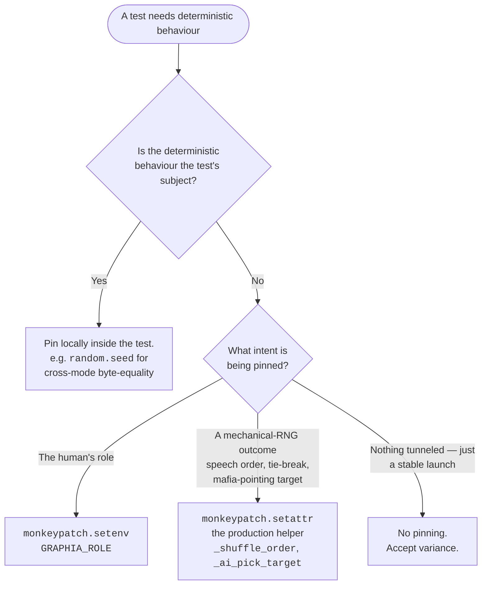

# Tutorial 005: Play-As-Role via Environment Variable

- **Spec:** [`context/spec/005-play-as-role/`](../../spec/005-play-as-role/)
- **Status:** Draft
- **Author:** Alexey Tigarev
- **Date:** 2026-05-24
- **Prerequisites:** [`001-playable-skeleton`](../001-playable-skeleton/tutorial.md), [`002-hosted-agentcore-deployment`](../002-hosted-agentcore-deployment/tutorial.md)

---

## Overview

Spec 005 starts as a small developer affordance — a `GRAPHIA_ROLE` env var that pins the human's role at launch so you can exercise Mafia-only or Law-abiding-only flows without relaunching until the random deal cooperates. But midway through drafting it, a much bigger question surfaced: the project's existing test suite was already pinning roles indirectly, by setting `GRAPHIA_SEED` to magic values like `0` or `3` that happened to deal the desired side. That pattern was opaque (the seed value's effect required a constant lookup to understand), fragile (any refactor of `assign_roles` would silently break the seed-→role mapping), and — once `GRAPHIA_ROLE` arrived — obviously redundant.

So the spec grew. By the time it shipped, spec 005 had introduced the env var, migrated 33 test call sites from magic-seed-for-role to `GRAPHIA_ROLE`, refactored five more tests that pinned mechanical-RNG behaviour to monkeypatch production helpers directly, and finally retired the `GRAPHIA_SEED` env var and the `config.seed` dataclass field from production entirely — moving the one legitimate determinism need (the cross-mode byte-equality test) into the test body via `random.seed(...)`. The interesting design problem isn't the env var; it's the **determinism posture** that organizes everything else. This tutorial teaches the posture core-outward: what it is, why a test reaches for it differently than for a seed, and how the cleanup cascade played out.

---

## Concepts already covered (referenced, not re-taught)

- **env-config-via-dotenv-with-validation** — `python-dotenv` loads `.env`; `GraphiaConfig` exposes typed values and raises on invalid required vars. (See [tutorial 001](../001-playable-skeleton/tutorial.md#python-project-layout).) `GRAPHIA_ROLE` is added to this pattern.
- **interrupt-replay-first-statement** — `interrupt()` goes as the very first statement of any human-facing node because resume re-executes the whole node. (See [tutorial 001](../001-playable-skeleton/tutorial.md#orchestration-langgraph).) Relevant context: `assign_roles` does not interrupt; the role-deck shuffle runs without human input.

---

## What's new this increment

- [**Determinism posture as policy**](#1-the-determinism-posture-as-policy) — accept LLM and RNG variance; pin only when subject-of-test; prefer mechanisms that read at the call site.
- [**Role pin in tests via `GRAPHIA_ROLE` setenv**](#2-direct-intent-expression-in-tests--role) — say what you mean (`monkeypatch.setenv("GRAPHIA_ROLE", "mafia")`) instead of nudging through a magic seed.
- [**Targeted monkeypatch of a production helper for test determinism**](#3-direct-intent-expression-in-tests--mechanical-rng) — patch `_shuffle_order` with a deterministic stub rather than seeding the RNG that drives it.
- [**Role pin as a launch-time developer appliance**](#4-the-user-facing-affordance) — env var threaded through `GraphiaConfig` + `assign_roles`.
- [**Pop-then-shuffle for composition-preserving role pinning**](#4-the-user-facing-affordance) — preserve the 2-Mafia / 5-Law-abiding composition by popping and placing, not by re-running the deal.
- [**Surface config errors before Textual takes the alternate screen**](#4-the-user-facing-affordance) — invoke `load_config()` in `__main__` so `SystemExit` lands on stderr, not in a torn-down TUI.
- [**Make's `$(if VAR,ENV=VAR )` env-prefix idiom**](#4-the-user-facing-affordance) — scope a make-variable into the child process as an env var only when the variable is set.
- [**Retiring an env-var protocol: the cascade**](#5-the-cleanup-arc-and-the-sanctioned-exception) — what changes when you remove a project-wide config knob.
- [**In-test `random.seed` for byte-equal cross-mode parity**](#5-the-cleanup-arc-and-the-sanctioned-exception) — the one place in the codebase that still talks about seeding lives inside the test that needs it.

---

## Diagram

The determinism posture as a decision tree — what mechanism a test should reach for, given what it asserts:



The branches map one-to-one onto the concepts taught below.

---

## Walkthrough

### 1. The determinism posture as policy

**Pose:** Graphia drives an LLM-backed simulation. Two LLMs (a heavyweight for gameplay, a lightweight for AI player names — see [tutorial 001](../001-playable-skeleton/tutorial.md)) produce most of what the player sees. Each call's output varies across runs even at `temperature=0`. And the role deck, day-speech order, mafia-pointing fallback, and tie-breaks all draw from stdlib `random`. **How do you reason about a test suite — and a config surface — when so much of the runtime is irreducibly non-deterministic?**

**Present:** A *determinism posture* — a policy, not a mechanism. The three principles, codified in `context/product/architecture.md` §6 "Determinism Posture & Testing Conventions":

1. **LLM outputs are accepted as variable.** No replay shim, no caching layer, no temperature-zero pretence. Two runs are expected to produce different AI names, different dialogue, different outcomes. Tests assert structural invariants (a vote was opened, exactly one player was executed, the winner field holds a valid value), not verbatim transcripts.
2. **Mechanical decisions also accept variance.** Night-kill tie-breaks, mafia-pointing fallback, day-speech order — all stdlib `random.shuffle` / `random.choice` against module-global RNG. Their outcomes are non-replayable, on the same footing as LLM outputs.
3. **Direct intent expression in tests over fragile mechanisms.** When a test needs a specific behaviour, it pins that behaviour via the cheapest mechanism that reads at the call site — *not* by tunnelling intent through an unrelated mechanism (like setting `GRAPHIA_SEED` to a value that happens to produce the desired role).

**Apply:** This is the spine. The rest of the spec — the `GRAPHIA_ROLE` env var, the test-suite migration, the seed retirement — are concrete instantiations of the third principle. The posture is recorded in two places: the architecture document above, and [ADR-006](../../adr/006-test-role-pinning-via-graphia-role.md) ("Test role-pinning convention: `GRAPHIA_ROLE` replaces magic-seed-for-role"), whose §3 was amended during Slice 5 to also cover the production-side retirement that this same spec drove.

The diagram above is the posture compressed into a decision tree. The remaining sections walk the tree branch by branch, in order of conceptual depth.

### 2. Direct intent expression in tests — role

**Pose:** A test needs the human seated as Mafia for one scenario and Law-abiding for another. **What does it actually write at the call site?**

**Present:** Before this spec, the answer was: pick a `GRAPHIA_SEED` value that happens to deal the desired side. The test file `tests/test_slice4_role_reveal.py` (since deleted, see §5) had constants `SEED_LAW_ABIDING = 0` and `SEED_MAFIA = 3` enumerated empirically — seeds where the role-deck shuffle put the human on each side. Every other role-dependent test imported these constants and did `monkeypatch.setenv("GRAPHIA_SEED", str(SEED_MAFIA))`. That worked, but the call site doesn't say *"the human is Mafia"* — it says *"the seed is 3"*, and the reader has to either trust the constant name or open the definition.

Spec 005 introduces `GRAPHIA_ROLE` as the **direct intent expression** for role pinning: an env var whose value (case-insensitive `mafia` / `law-abiding`) literally is the test's intent.

```python
# tests/test_slice5_night.py — test_night1_human_mafia_picks_target_via_modal
monkeypatch.setenv("GRAPHIA_ROLE", "mafia")
fake_haiku(AI_NAMES)
# … rest of the test sets up state and asserts the modal flow.
```

**Apply:** The migration in Slice 3 walked ~33 such call sites across 10 files. Most were straightforward replacements; a handful turned out to have a hidden second dependency on the seed value (the test happened to rely on a specific day-speech order or tie-break that the seed also pinned) — and those flowed into the next section.

ADR-006 captures this convention as the spec's headline architectural decision. The migration's audit also produced a useful design principle: if a test's *bare* `monkeypatch.setenv("GRAPHIA_SEED", "<value>")` is needed for reasons other than role-pinning, the call should carry an explanatory comment naming what RNG behaviour the specific value pins. Otherwise the value is opaque defensiveness.

### 3. Direct intent expression in tests — mechanical RNG

**Pose:** A test needs a specific day-speech order — say, the human at index 0 so a scripted `/vote` action lands on a known AI on the next super-step. Setting `GRAPHIA_ROLE` doesn't help; the role deal is independent of the speaker order. And the magic-seed pattern would smuggle that intent through the *same* env var that everyone has just stopped using for roles. **Now what?**

**Present:** **Targeted monkeypatching of the production helper that performs the shuffle.** The speech order is computed by `graphia.nodes.day._shuffle_order(players)`, a small module-level function. A test that needs a specific order patches that function directly with a deterministic stub:

```python
# tests/test_slice7_vote.py — test_successful_execution_ends_day_and_reveals_role
def _human_then_law_abiding(players):
    """Speaker order: human at index 0, Law-abiding AI at index 1."""
    alive = [pid for pid, p in players.items() if p.is_alive]
    human_id = next(pid for pid, p in players.items() if p.is_human)
    la_ai_ids = [pid for pid, p in players.items()
                 if p.is_alive and p.role == "law_abiding" and not p.is_human]
    second = la_ai_ids[0]
    rest = [pid for pid in alive if pid not in (human_id, second)]
    return [human_id, second, *rest]

monkeypatch.setattr(day_nodes, "_shuffle_order", _human_then_law_abiding)
```

**Apply:** This is the second concrete instantiation of the posture's third principle. The call site reads as what it does — *"the human speaks first, a Law-abiding AI speaks second"* — and the stub function's name makes the intent visible even without reading its body. There is no `GRAPHIA_SEED` value to chase down, no hidden coupling to how `assign_roles` consumes the RNG.

This pattern is composable with the role pin from §2: a test typically sets `GRAPHIA_ROLE` (because it wants the human on a known side) *and* monkeypatches `_shuffle_order` (because it also wants a known speaker order). Two intents, two mechanisms, both legible at the call site. The principle generalises to any RNG-using helper — Slice 4 also wired in the existing `dynamic_night_pointing` fixture for one test that needed deterministic Night-1 victim selection, monkeypatching at the LLM-fake boundary rather than the `_shuffle_order` boundary.

### 4. The user-facing affordance

**Pose:** Now turn the test mechanism into a developer-facing feature. **A developer wants to launch the actual game with the role pinned. What's the smallest thing that gives them that?**

**Present:** An env var threaded through the project's existing `.env` + `GraphiaConfig` pattern ([env-config-via-dotenv-with-validation](../001-playable-skeleton/tutorial.md#python-project-layout)), applied inside `assign_roles` via a **pop-then-shuffle** strategy, surfaced through the Makefile's `play` recipe via a conditional env-var prefix, and validated at startup before the TUI captures the screen.

The parsing is the simplest part — `load_config()` adds a `human_role` field to `GraphiaConfig`:

```python
# src/graphia/config.py — load_config
role_raw = os.environ.get("GRAPHIA_ROLE")
human_role: str | None = None
if role_raw is not None and role_raw.strip():
    match role_raw.strip().lower():
        case "mafia":
            human_role = "mafia"
        case "law-abiding":
            human_role = "law_abiding"
        case _:
            raise SystemExit(
                f"GRAPHIA_ROLE must be 'mafia' or 'law-abiding' (got {role_raw!r})."
            )
```

The internal token uses the underscore form (`law_abiding`) to match the existing `PlayerState.role` literal; the env var accepts the friendlier hyphenated form. Invalid values raise `SystemExit` with both valid choices in the message — but if that exception fires once the Textual app has already installed its alternate screen, the message vanishes into the screen-tear-down. So `__main__.py` invokes `load_config()` once explicitly, before `GraphiaApp().run()`, so the error lands on stderr in the normal terminal — **surface config errors before Textual takes the alternate screen**:

```python
# src/graphia/__main__.py
load_dotenv()
args = _parse_args()
if args.remote:
    os.environ["GRAPHIA_REMOTE"] = "1"
# Surface invalid GRAPHIA_ROLE / missing GRAPHIA_RUNTIME_URL on stderr
# before Textual takes the screen.
load_config()
GraphiaApp().run()
```

`assign_roles` then branches on `config.human_role`. The interesting design question here is how to honour the pin without breaking the game's role *composition* (always 2 Mafia + 5 Law-abiding). The answer is **pop-then-shuffle**: take the fixed 7-card deck, remove one card matching the pinned role, shuffle the remaining six, and place the pinned card at position 0 (the human's slot, which is the first key inserted into the players dict by `collect_name`):

```python
# src/graphia/nodes/setup.py — assign_roles
deck: list[str] = ["mafia", "mafia", "law_abiding", "law_abiding",
                   "law_abiding", "law_abiding", "law_abiding"]
if config.human_role is None:
    random.shuffle(deck)
    roles = deck
else:
    assert state["human_id"] == next(iter(state["players"]))
    pinned_role = config.human_role
    deck.remove(pinned_role)
    random.shuffle(deck)
    roles = [pinned_role, *deck]
```

Composition is preserved by construction. The unset path is byte-identical to the prior behaviour (one less branch's worth of code, by sharing nothing with the pinned path).

The Makefile passthrough is two characters of GNU Make idiom: `$(if VAR,ENV=VAR )`. Make-variable overrides like `make play ROLE=mafia` are already exported to recipe shells (via the bare `export` directive at the top of the Makefile), but going via `ROLE` instead of `GRAPHIA_ROLE` directly lets the env var be one-shot scoped to the child process and avoids leaking it into other recipe invocations during the same make run:

```makefile
play:
	$(if $(ROLE),GRAPHIA_ROLE=$(ROLE) )uv run python -m graphia $(ARGS)

play-remote:
	$(if $(ROLE),GRAPHIA_ROLE=$(ROLE) )uv run python -m graphia --remote $(ARGS)
```

When `ROLE` is unset, the `$(if …)` collapses to empty and the line is unchanged from before. When set, the line becomes `GRAPHIA_ROLE=<value> uv run …`, which the shell parses as a one-shot env-var prefix. No Makefile-side validation — `load_config()` is the single source of truth for what's accepted, and `make play ROLE=villain` correctly bubbles its `SystemExit` exit code back to make.

**Apply:** Four concepts compose into the feature: the env var as a launch-time appliance (`graphia-role-appliance`), the pop-then-shuffle preservation of composition (`pop-then-shuffle-role-deck`), the startup fail-fast (`fail-fast-load-config-before-tui`), and the Makefile conditional env prefix (`make-conditional-env-prefix`). Each fits Graphia's existing patterns; none of them need new architectural concepts. The work is in choosing the right combination, not in inventing new pieces.

### 5. The cleanup arc and the sanctioned exception

**Pose:** Once `GRAPHIA_ROLE` is the canonical mechanism for role-pinning in tests, what is `GRAPHIA_SEED` actually for anymore? **Is anyone still using it — and is the reason worth keeping the whole env var alive?**

**Present:** A grep across the test suite, after the Slice 3 + Slice 4 migrations, found just two surviving callers. The first was `tests/test_slice4_role_reveal.py` — but its entire subject was the seed-→role mapping itself (`SEED_LAW_ABIDING=0` → Law-abiding human; `SEED_MAFIA=3` → Mafia human). With `GRAPHIA_ROLE` now in place, that test's subject is gone; the file is deleted, full stop. The second was `tests/test_dual_mode_smoke.py`, which asserts byte-equal public logs / kill_log / winner between local-mode and remote-mode runs of the same game. *That* one is a real regression-guard: byte-equality across two independently-driven game runs is a strong cross-mode parity signal, and it genuinely needs RNG determinism.

We considered downgrading the dual-mode test to *structural* equality — same winner, same role-by-player-id mapping, same kill count, but not necessarily the same line-by-line transcript. That would have let us drop `GRAPHIA_SEED` outright. But structural equality is a strictly weaker assertion: a real local-vs-remote divergence that produces the same shape but different content (a different player gets executed at the same vote round, say) would no longer be caught. We weren't happy with that trade — losing a known-strong signal because the env-var-protocol-supporting-it felt out of place is the wrong reason.

So instead: keep the byte-equality, but move its determinism mechanism into the test itself. `random.seed(SEED_DUAL_MODE_DETERMINISTIC_TRAJECTORY)` is called once at the start of each mode's run, inside the test body:

```python
# tests/test_dual_mode_smoke.py — test_local_and_remote_full_game_produce_identical_public_output
random.seed(SEED_DUAL_MODE_DETERMINISTIC_TRAJECTORY)
fake_haiku(AI_NAMES)
local_result = await _run_full_game_collecting(mode="local", …)

random.seed(SEED_DUAL_MODE_DETERMINISTIC_TRAJECTORY)
fake_haiku(AI_NAMES)
remote_result = await _run_full_game_collecting(mode="remote", …)

assert local_result["public_log"] == remote_result["public_log"]
```

This works because both modes share the same Python process and call production's `random`-using helpers in identical order — so resetting the module-global RNG to the same seed at the start of each run produces byte-equal sequences across both runs. The mechanism is local to the test; nothing else in the codebase talks about seeding the RNG. The dual-mode test is the **sanctioned exception** the posture allows: the deterministic behaviour *is* the test's subject (per the decision tree in the diagram above), and the pinning happens at the test's own boundary.

**Apply:** With the dual-mode test relocated, **retiring `GRAPHIA_SEED` from production** became mechanical. The cascade rippled through:

- `GraphiaConfig.seed: int` field — deleted.
- `load_config()`'s `GRAPHIA_SEED` parsing block (the `seed_raw` lookup, int coercion, `time.time_ns()` fallback, error-printing branch) — deleted.
- `src/graphia/nodes/day.py::_shuffle_order(players, seed)` — lost its `seed` parameter; body uses module-global `random.shuffle`. Five call sites in the same module lost their salt-arithmetic locals (`order_seed = config.seed + cycle * 1009`, etc.).
- `src/graphia/nodes/night.py` — three sites that constructed `random.Random(seed + offset)` now call `random.choice(...)` / `random.shuffle(...)` directly.
- `src/graphia/nodes/setup.py::assign_roles` — `random.Random(config.seed).shuffle(deck)` becomes `random.shuffle(deck)` in both branches.
- `tests/conftest.py` — the autouse `monkeypatch.delenv("GRAPHIA_SEED", raising=False)` fixture is removed (nothing left to delenv).
- `tests/test_remote_mode_smoke.py` — three direct `GraphiaConfig(..., seed=0, ...)` constructions drop the `seed=0` kwarg.
- Four stub-helper signatures simplify from `(players, *_)` to `(players)` to match production.
- `README.md`, `CLAUDE.md`, the architecture doc's §6, and ADR-006 — references to `GRAPHIA_SEED` removed or rewritten to describe the new state.

This is the shape of `env-var-retirement-cascade`: removing a project-wide config knob touches a surprising number of files, and the cleanup has to ride through all of them in one logical unit (production changes break the dual-mode test until the test's pin moves, so Subs 5.1 and 5.2 had to land together). The acceptance criterion was simple: `grep -rn 'GRAPHIA_SEED' --include='*.py' .` returns zero hits across the whole repo. It does.

The architecture decision behind the retirement — *why* we kept the dual-mode test's byte-equality instead of weakening it — lives in [ADR-006 §3 Decision](../../adr/006-test-role-pinning-via-graphia-role.md), in the amendment paragraph added when Slice 5 widened the ADR's scope from "testing convention" to also covering production-side retirement. The alternatives we considered (keep `GRAPHIA_SEED`; drop and downgrade; drop and pin in-test) are recorded there, alongside the rationale for the chosen path.

---

## Try it

```bash
# The new launch-time appliance:
make play ROLE=mafia
# → role-reveal reads "Your role is Mafia."

make play ROLE=law-abiding
# → role-reveal reads "Your role is Law-abiding Citizen."

make play ROLE=villain
# → exits with: GRAPHIA_ROLE must be 'mafia' or 'law-abiding' (got 'villain').
# Note that this lands on stderr cleanly — the TUI never opened.

make play
# → random role assignment, just like before. Each run is now non-replayable
# (there is no GRAPHIA_SEED knob), which is the intended new normal.
```

Run `grep -rn 'GRAPHIA_SEED' --include='*.py' .` and observe zero hits. Run `grep -rni 'seed' tests/` and see that every remaining mention is either the sanctioned `random.seed(...)` calls in `tests/test_dual_mode_smoke.py` or English-idiomatic uses of "seed" meaning "populate" (`pre-seeded queue`, `seed the store`).

The full test suite (`uv run pytest -q`) reports **129 passed, 1 skipped**, down from 132 before spec 005 — the three deletions are the seed-→role mapping test, the unset-path frozen-list regression test, and the cross-parametrize identity test (refactored to a parsing-layer assertion that needs no RNG).

---

## Where to go next

- Related ADR: [ADR-006 "Test role-pinning convention: `GRAPHIA_ROLE` replaces magic-seed-for-role"](../../adr/006-test-role-pinning-via-graphia-role.md) — the binding architectural record of the testing-convention decision, amended during Slice 5 to also cover the production-side retirement.
- Architecture: [`context/product/architecture.md`](../../product/architecture.md) §6 "Determinism Posture & Testing Conventions" — the three principles in their canonical form.
- Next tutorial: TBD. The next roadmap phase (Phase 3 "Long-Term Cross-Game Memory & Career Stats") has not been spec'd yet — it would introduce the long-term cross-session AgentCore Memory pattern as a counterpoint to the per-game Memory pattern taught in [tutorial 002](../002-hosted-agentcore-deployment/tutorial.md).
