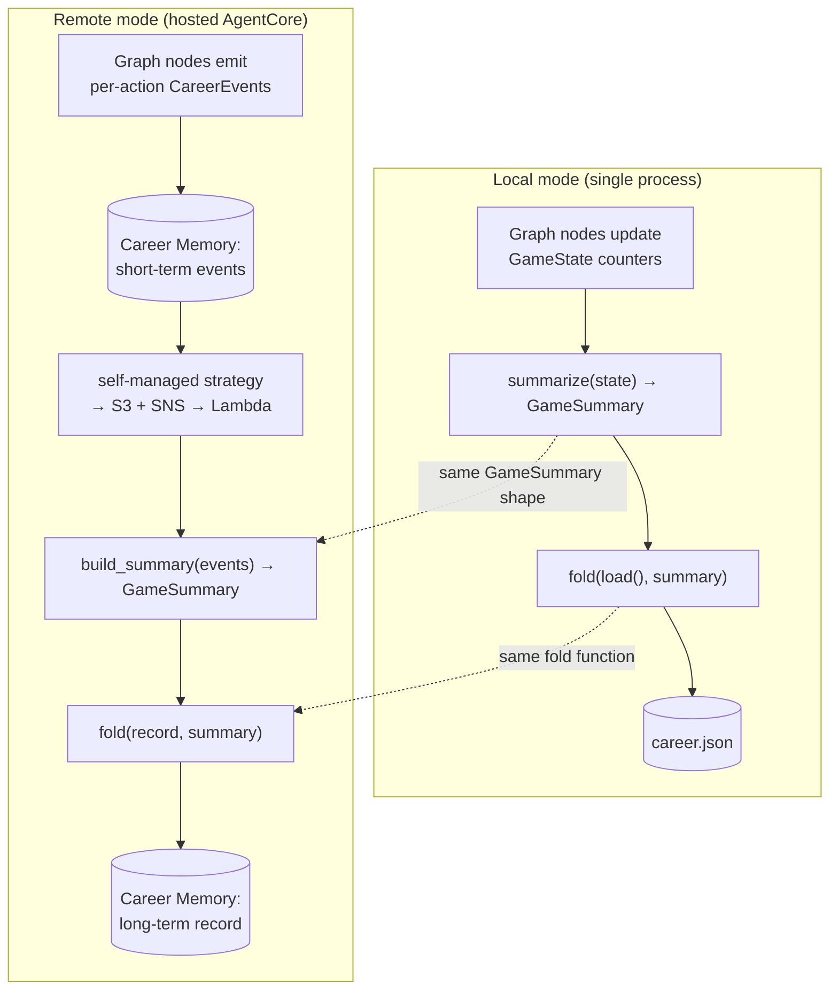

# Tutorial 006: Long-Term Cross-Game Memory & Career Stats

- **Spec:** [`context/spec/006-cross-game-career-stats/`](../../spec/006-cross-game-career-stats/)
- **Status:** Draft
- **Author:** Alexey Tigarev
- **Date:** 2026-06-03
- **Prerequisites:** `002-hosted-agentcore-deployment` (AgentCore Runtime, Memory, the diary store, the Lambda packaging pattern). Helpful but not required: `001-playable-skeleton` (the StateGraph and its `GameState` counters).

---

## Overview

Until this increment, every game of Graphia was an island: when it ended, nothing was remembered. Spec 006 gives the player a **persistent career** — a running tally of games played, win rate by role, kills attempted vs. successful, and game-wide totals — shown as a greeting on launch and a panel after each game.

The interesting design problem isn't the counting. It's this: Graphia runs in **two completely different modes** — a local single-process app, and a hosted AgentCore deployment — and the player's career must be *identical* in both. How do you guarantee that two backends with nothing physically in common (a JSON file on one side; an event log, a Lambda, and a long-term record in the cloud on the other) produce the exact same numbers?

The answer this tutorial teaches is **event sourcing on AWS Bedrock AgentCore Memory's two tiers**, with a **single shared pure function** as the equivalence anchor. Per-action *events* are the source of truth; a long-term *record* is their `fold`ed consolidation. We'll work from that core outward: first the shared pure core that makes both modes agree, then where the events come from in the **LangGraph** graph, then the AgentCore Memory tiers and the asynchronous consolidation pipeline that carries events to the record, and finally the failure posture that the project's live-deploy bug parade beat into the design. Where a production bug shaped the code, it's called out inline.

---

## A candid note before we start: this is deliberately over-engineered

Let's be honest with you up front, because you're here to learn the technology and you deserve the truth about it:

> **A cross-game stats counter does not need any of this.** It's a handful of integers for a single player. The genuinely right-sized implementation is the one local mode already uses — *a single JSON file with a read-modify-write* — and its cloud equivalent would be just as small: one DynamoDB item, or one S3 object, updated directly from the Runtime. No events, no strategy, no SNS, no S3 envelopes, no consumer Lambda, no idempotency sidecar. The project's own ADRs say so plainly: [ADR 007](../../adr/007-two-tier-long-term-memory-stats.md) records that a plain S3/DynamoDB store would be *"trivial… exact, deterministic, and cheap,"* and [ADR 008](../../adr/008-self-managed-memory-pipeline.md) admits its chosen design was *"not driven by lowest cost… nor by lowest implementation effort"* but by *"the project's purpose: faithfully demonstrate the long-term cross-session Memory pattern."*

So why build the elaborate version? **Because Graphia is a reference implementation, and this feature was picked as the vehicle for exercising AWS Bedrock AgentCore Memory's self-managed strategy and its two cooperating tiers end-to-end.** The stats feature is a pretext; the *real* deliverable is a worked, running example of the pattern.

And we should name that plainly: the project has a stated principle — *features land in scope only when the game genuinely needs them* — and **this increment sidesteps it.** The game did not need any of this; we chose the heavy design to demonstrate the technology, and that is a departure from the principle, not an application of it. ADR 008 reaches for a justification — that building the consumer pipeline makes the previously-idle S3/SNS/IAM scaffolding "load-bearing," so the infrastructure now "serves a real need" — but be honest about the circularity there: the only thing that scaffolding serves is the demonstration we decided to build. The genuine need was a stats counter, and the genuine need was already met by rung 1. Everything above it is for our benefit as learners, not the player's.

There's a spectrum of how heavy you could go, and it's worth seeing all three rungs because they're real architectural choices you'll face:

1. **Plain key-value store** (simplest, what the feature needs) — a JSON file locally; a DynamoDB/S3 item remotely. Read, fold in process, write back. Done.
2. **Direct long-term Memory records** (the project's *first* attempt — [ADR 007](../../adr/007-two-tier-long-term-memory-stats.md), since superseded) — the Runtime writes `CareerStats` straight into an AgentCore Memory long-term record via `BatchUpdateMemoryRecords`. This uses Memory, but as a bare key-value store — it *bypasses* the strategy's delivery pipeline, leaving the provisioned S3/SNS/IAM sitting inert.
3. **The full self-managed pipeline** (what this tutorial documents — [ADR 008](../../adr/008-self-managed-memory-pipeline.md)) — events flow through the strategy → S3 → SNS → a consumer Lambda that consolidates into the record. The most moving parts, and the only rung that actually demonstrates the AWS-intended pattern rather than a shortcut around it.

Read the rest of this tutorial as *"how the self-managed two-tier Memory pattern works, taught through a stats feature,"* **not** as *"how you should build a stats feature."* If you ever need cross-game counters in your own project and you're not specifically trying to learn AgentCore Memory, build rung 1 and move on. With that honesty on the table, the design is genuinely instructive — so let's dig in.

---

## Concepts already covered (referenced, not re-taught)

- **`diary-store-protocol-abstraction`** — one `Protocol`, two interchangeable implementations (local in-process vs. AgentCore-backed) selected by a factory. The career store and the career emitter both follow this exact shape. (See [tutorial 002 §3](../002-hosted-agentcore-deployment/tutorial.md#3-per-game-state-when-there-is-no-local-sqlite-the-diarystore-protocol).)
- **`memory-diary-event-shape`** — a unit of state as one `MemoryClient.create_event()` scoped to `(actor_id, session_id)`. Career events reuse this `create_event` shape verbatim. (See [tutorial 002 §3](../002-hosted-agentcore-deployment/tutorial.md#3-per-game-state-when-there-is-no-local-sqlite-the-diarystore-protocol).)
- **`gateway-mcp-target-and-zip-build`** — the Python-Lambda-as-zip packaging pattern with a Makefile build rule. The new consumer Lambda is packaged the same way. (See [tutorial 002 §4](../002-hosted-agentcore-deployment/tutorial.md#4-standing-it-up-terraform-in-container-makefile-composites-image-driven-deploys).)
- **`agentcore-iam-execution-role`** — least-privilege IAM roles with a `bedrock-agentcore` trust principal. The pipeline adds two more. (See [tutorial 002 §4](../002-hosted-agentcore-deployment/tutorial.md#4-standing-it-up-terraform-in-container-makefile-composites-image-driven-deploys).)
- **`test-dual-mode-equivalence`** — a smoke test asserting local and remote produce identical observable output. This increment adds a *stats* equivalence test in the same spirit. (See [tutorial 002 §7](../002-hosted-agentcore-deployment/tutorial.md#7-local-mode-preserved-dual-mode-equivalence-introspection).)
- **`structured-output-flat-pydantic`** — flat schemas (no discriminated unions) because Bedrock Converse rejects them. The career event model extends that flatness to the event bus. (See [tutorial 001](../001-playable-skeleton/tutorial.md#bringing-in-the-llm-structured-output-and-self-correction).)
- **`sqlite-saver-per-thread`** / **`typed-state-with-reducers`** — the per-game `thread_id` (reused here as the event `session_id`) and the `GameState` counters that the emitting nodes read. (See [tutorial 001](../001-playable-skeleton/tutorial.md).)

---

## What's new this increment

- [**Two-tier Memory: events are truth, the record is the fold**](#1-the-shared-core-how-two-backends-agree) — both AgentCore Memory tiers on one dedicated career Memory.
- [**Event-sourced consolidation via a pure fold**](#1-the-shared-core-how-two-backends-agree) — replay a game's events into a summary, fold it into the aggregate.
- [**One shared `fold` for local↔remote equivalence**](#1-the-shared-core-how-two-backends-agree) — the same function on both sides is the parity guarantee.
- [**Flat event wire model**](#1-the-shared-core-how-two-backends-agree) — one dataclass, dispatch on `kind`, forward-tolerant decode.
- [**Service injection via `functools.partial`**](#2-where-events-come-from-the-langgraph-side) — bind the emitter into nodes at assembly time.
- [**One shared `_assemble_graph` kills builder drift**](#2-where-events-come-from-the-langgraph-side) — local and Runtime graphs can't diverge.
- [**Emitter Protocol: no-op vs live**](#2-where-events-come-from-the-langgraph-side) — local mode emits nothing; remote hits Memory.
- [**A dedicated career Memory resource**](#3-the-two-memory-tiers-and-the-self-managed-strategy) — separate from the diary Memory.
- [**Self-managed memory strategy**](#3-the-two-memory-tiers-and-the-self-managed-strategy) — deliver raw events to S3+SNS for app-side consolidation.
- [**SNS-triggered consumer Lambda**](#4-the-asynchronous-consolidation-pipeline) — fold on finalizer only.
- [**`games_folded` idempotency sidecar**](#4-the-asynchronous-consolidation-pipeline) — survive at-least-once SNS delivery.
- [**S3-envelope payload extraction**](#4-the-asynchronous-consolidation-pipeline) — pull the event JSON out of the delivered envelope.
- [**Post-game panel reads materialised state, not a synthesised fold**](#5-reading-back-the-greeting-the-panel-and-the-async-gap) — show what actually persisted.
- [**Loud-fail, no silent fallback in remote mode**](#6-failure-posture-and-the-localdeployed-gap) — crash on a broken setup instead of writing zeros.
- [**Closing the local-vs-Lambda boto3 gap**](#6-failure-posture-and-the-localdeployed-gap) — vendoring + contract/zip tests + a live verification harness.

---

## Diagram

Two modes, one observable outcome (a persistent `CareerStats`). The shapes diverge entirely below the `GameSummary` boundary — and that boundary is exactly where the shared `fold` enforces equivalence.



---

## Walkthrough

### 1. The shared core: how two backends agree

**Pose.** If you had to make two unrelated storage backends produce byte-identical career numbers, where would you put the logic? Not in either backend — anything you write twice will eventually drift. The logic has to live in *one* place both backends call.

**Present.** Graphia models a career as **event sourcing with a pure fold**. A single game's contribution is a `GameSummary` (a small delta); the persisted career is a `CareerStats` aggregate; and the only function that combines them is `fold(aggregate, summary) -> CareerStats`. Both modes converge on those three: local mode builds the `GameSummary` from end-of-game graph state via `summarize`, remote mode rebuilds it from a replayed event log via `build_summary`, and *both* then call the identical `fold`. This is **one shared `fold` for local↔remote equivalence** — and it's load-bearing enough that the Lambda doesn't reimplement `fold`, it *vendors the real one into its zip*.

The two summary builders are the two ends that must meet in the middle. Here's the remote one rebuilding a summary by walking events (`build_summary`, in `src/graphia/career_events.py`):

```python
# src/graphia/career_events.py — build_summary
for event in events:
    match event.kind:
        case "vote_initiated":
            if event.initiator_is_human:
                votes_called += 1
        case "night_resolved":
            if event.human_was_mafia_picker:  night_attempts += 1
            if event.human_picked_victim:     night_successes += 1
            if event.victim_died:             night_victims += 1
        case "game_ended":
            outcome, human_role, rounds = event.outcome, event.human_role, event.rounds
```

**Apply.** That `match` is the whole remote-side aggregation. The local side (`summarize` in `src/graphia/stats_store.py`) computes the *same* `GameSummary` fields from `_latest_state` instead of from events — and a dedicated test (`tests/test_pipeline_equivalence.py`) drives the same game through both paths and asserts the `CareerStats` come out equal. This is the increment's central composition: **two-tier Memory (events are truth, the record is the fold)** + **event-sourced consolidation** + **shared `fold`** together *are* the equivalence guarantee. It also extends a concept from tutorial 002 — `test-dual-mode-equivalence` proved gameplay was identical across modes; here the same idea proves *stats* are.

One supporting decision makes the events portable: the **flat event wire model**. Every event is one frozen dataclass with all kind-specific fields optional, dispatched on `kind` — the same flatness the project already adopted for LLM schemas (`structured-output-flat-pydantic`), now applied to the event bus so a consumer that never imports the originating types can still parse one shape:

```python
# src/graphia/career_events.py — CareerEvent
@dataclass(frozen=True, slots=True)
class CareerEvent:
    kind: str
    session_id: str
    human_role: str | None = None
    initiator_is_human: bool | None = None
    # ...every other kind's fields, all `| None`
```

`to_json` drops the `None`s for a compact payload; `from_json` ignores unknown keys so a future field never breaks an old consumer. `session_id` is the per-game LangGraph `thread_id` you met in tutorial 001 (`sqlite-saver-per-thread`) — the same identifier that scopes the checkpoint now scopes the event stream.

### 2. Where events come from: the LangGraph side

**Pose.** The remote path needs a `CareerEvent` emitted at every statistical moment — a vote called, a ballot cast, a night resolved, the game ending. Those moments already exist as nodes in the graph. How do you make a node emit an event *without* hard-wiring AWS into game logic, and without the local mode touching AWS at all?

**Present.** Two LangGraph patterns answer it. First, an **emitter Protocol with a no-op and a live implementation** — exactly the `diary-store-protocol-abstraction` shape from tutorial 002. `NoOpCareerEventEmitter.emit()` discards everything (local mode, tests — no AWS reached); `AgentCoreCareerEventEmitter.emit()` lazily builds a boto3 client and calls `create_event`. A `make_career_emitter(config)` factory picks one based on whether `career_memory_id` is set:

```python
# src/graphia/career_events.py — make_career_emitter
def make_career_emitter(config: "GraphiaConfig") -> CareerEventEmitter:
    if config.career_memory_id:
        return AgentCoreCareerEventEmitter(
            memory_id=config.career_memory_id, region=config.aws_region)
    return NoOpCareerEventEmitter()
```

Second, **service injection via `functools.partial`**: rather than have a node reach for a module-level emitter singleton, the emitter and the game id are *bound into the node* when the graph is assembled. `_with_career` in `src/graphia/graph.py` wraps a node with `partial(node, career_emitter=..., game_id=...)`, the same trick the diary store already uses for `night_close`. The node body then just emits:

```python
# src/graphia/nodes/day.py — collect_votes (human-ballot branch)
if career_emitter is not None and game_id is not None:
    career_emitter.emit(
        game_id,
        CareerEvent(kind=KIND_BALLOT_CAST, session_id=game_id, voter_is_human=True),
    )
```

**Apply.** Now the crucial composition — and the spot a real bug taught the team a lesson. Graphia has *two* graph builders: `build_graph` for local mode and `build_runtime_graph` for the hosted AgentCore Runtime. When the emitter plumbing first landed, it was added to `build_graph` and the Runtime builder was left to be hand-mirrored — and wasn't, so the deployed Runtime emitted *nothing* for several deploy cycles while every local test passed. The fix was **one shared `_assemble_graph` that kills builder drift**: both builders now delegate to a single private assembler that wires the topology *and* the emitter `partial`s, so the wiring lands in both modes by construction.

```python
# src/graphia/graph.py — _assemble_graph
emit = partial(_with_career, career_emitter=career_emitter, game_id=game_id)
builder.add_node("assign_roles", emit(assign_roles))
builder.add_node("resolve_night_kill", emit(resolve_night_kill))
builder.add_node("day_turn", emit(day_turn))
builder.add_node("collect_votes", emit(collect_votes))
builder.add_node("resolve_vote", emit(resolve_vote))
builder.add_node("end_screen", emit(end_screen))
```

The general lesson — worth internalising if you build multi-mode LangGraph apps — is that a docstring saying *"mirror this change over there too"* is not a mechanism; a shared function is. Two of the seven emitting sites (`game_ended` from `end_screen`, `game_abandoned` from the UI quit path) are **finalizers** — the only two that will cause any consolidation downstream. Every other event just accumulates in the log.

### 3. The two Memory tiers and the self-managed strategy

**Pose.** The runtime is now emitting events into AgentCore Memory. But a stream of raw events isn't a career — somebody has to consolidate them into the rolling aggregate the player sees. AgentCore Memory's built-in *strategies* normally do consolidation with an LLM (summarising a conversation, say). We don't want an LLM guessing at our numbers — we want exact arithmetic. How do you keep using AgentCore Memory but own the consolidation yourself?

**Present.** AgentCore Memory exposes a **self-managed strategy**: instead of running LLM extraction, it *delivers the raw events to you* — to an S3 bucket, with an SNS notification — and your application does the consolidation. That turns AgentCore Memory into a two-tier store under your control: the **short-term tier** holds the per-action events (the durable log), and the **long-term tier** holds one consolidated record (the `CareerStats`). This is the increment's headline AgentCore concept — **two-tier Memory where events are truth and the record is the fold** — and it lives on a **dedicated career Memory resource**, deliberately separate from the existing diary Memory so the strategy only ever delivers career events (no cross-feature drift to filter).

**Apply.** There's one sharp edge worth knowing before you reach for this: the AWS Terraform provider (as of v6.4x) *cannot express a self-managed strategy* — its `CUSTOM` memory-strategy resource only supports the LLM-extraction override. Graphia's workaround mirrors a pattern it already used for other provider gaps: Terraform owns everything it *can* (the dedicated `aws_bedrockagentcore_memory.career`, the S3 bucket, the SNS topic, the two IAM roles, the Lambda, the subscription), and the strategy itself is created **out-of-band** by `make create-stats-strategy` (an `aws bedrock-agentcore-control update-memory ... addMemoryStrategies` call), with the resulting id fed back as `var.stats_strategy_id`. The deploy dance that sequences this (apply → create strategy → wire env → apply again) is wrapped by `make deploy` so it's one command; it builds on the `makefile-as-task-runner` and `image-driven-deploys` patterns from tutorial 002. The full infra layout — two IAM roles (`memory_stats` for the strategy's delivery, `career_consumer` for the Lambda), the bucket, the topic — is mapped in [the spec's architecture doc §5](../../spec/006-cross-game-career-stats/architecture.md#5-aws-infrastructure-layout).

### 4. The asynchronous consolidation pipeline

**Pose.** Events are landing in short-term Memory and the strategy is delivering them to S3 + SNS. Now: what actually reads a finished game's events, computes the summary, and writes the long-term record — and how does it avoid double-counting when the cloud delivers the same message twice?

**Present.** A **SNS-triggered consumer Lambda** (`infra/lambda/career_consumer/lambda_function.py`), packaged exactly like the diary Lambdas from tutorial 002 (`gateway-mcp-target-and-zip-build`) but with its own least-privilege role. SNS delivers one notification per event; the Lambda **returns early on non-finalizer events** (they just sit in the log) and only does real work when it sees a `game_ended` / `game_abandoned`. On a finalizer it lists the whole session, rebuilds the summary with the *shared* `build_summary`, folds, and writes:

```python
# infra/lambda/career_consumer/lambda_function.py — _handle_one_payload
summary = build_summary(session_events)
current, existing_id = _read_career_stats()
if session_id in current.games_folded:
    return                                  # already folded; idempotent drop
folded = fold(current, summary)
new_stats = replace(folded, games_folded=[*current.games_folded, session_id])
_write_career_stats(new_stats, existing_id)
```

**Apply.** That `games_folded` check is the **idempotency sidecar**. SNS guarantees *at-least-once* delivery, so the same finalizer can arrive twice; without protection every redelivery would fold the game in again. The defence is a `games_folded: list[str]` set kept *inside the long-term record itself* — so there's no second database to consult, and the check is just "is this `session_id` already in the record I just read?" Notice this set is part of the shared `CareerStats` shape, populated only in remote mode; local mode leaves it empty because a single file-write under a lock is already exactly-once.

Two more details complete the pipeline. The Lambda has to dig the original event JSON out of what the strategy delivers — **S3-envelope payload extraction**: the SNS message carries an `s3PayloadLocation`, the S3 object is an envelope, and the original `CareerEvent` JSON rides in `currentContext[*].content.text`. `_extract_event_texts` walks that defensively, skipping anything that doesn't match the path so an envelope-shape drift logs a warning instead of crashing. And — a production bug worth flagging — the Lambda calls `list_events(..., includePayloads=True)`; an early version wrote `includePayload` (singular), which boto3 rejected with `ParamValidationError` *after* decoding the events but *before* writing, so the pipeline silently never consolidated. (How that class of bug got caught for good is in §6.) The full write-path sequence is diagrammed in [architecture doc §4](../../spec/006-cross-game-career-stats/architecture.md#4-remote-mode-write-path-sequence).

### 5. Reading back: the greeting, the panel, and the async gap

**Pose.** The pipeline writes the record *asynchronously* — seconds to minutes after the game ends. But the player wants to see their updated numbers in the post-game panel *immediately*. How do you render an up-to-date panel when the durable write hasn't happened yet?

**Present.** The honest answer Graphia settled on: you don't pretend. The remote store's `record()` **reads materialised state, it does not synthesise a fold**:

```python
# src/graphia/stats_store.py — AgentCoreCareerEventStore.record
def record(self, summary: GameSummary) -> CareerStats:
    # `summary` ignored on purpose: persistence flows through the finalizer
    # event + the Lambda. Folding in-process here would tell the panel
    # "+1 game" even when the Lambda never wrote — masking a broken pipeline.
    return self.load()
```

**Apply.** This is **post-game panel reads materialised state, not a synthesised fold**, and it's the single most instructive design reversal in the increment. An earlier version *did* fold the just-finished game in memory (`fold(self.load(), summary)`) so the panel always showed a cheerful "+1 this game." That felt better — until it turned out to be hiding a completely broken write pipeline behind a plausible cosmetic delay for multiple deploy cycles. Removing the in-process fold means the remote panel shows exactly what the pipeline actually persisted: if the Lambda hasn't caught up, the panel shows pre-game numbers and the *next* launch's greeting carries the delta. Local mode differs and is allowed to — its `record()` is a synchronous fold-and-atomic-write, so its panel reflects the game immediately and there's no gap. The greeting itself (`render_greeting` in `src/graphia/stats_store.py`) is mode-agnostic: it just renders whatever `load()` returns, with a first-run welcome line when `games_total == 0`.

### 6. Failure posture and the local→deployed gap

**Pose.** Everything above works on a developer's machine with mocked AWS and passes the whole test suite. Yet this feature shipped broken to the live deploy *four times*. Why — and what changed so it stopped?

**Present.** Two postural shifts. The first is **loud-fail, no silent fallback in remote mode**. Earlier code wrapped `create_event` and `list_memory_records` in `try/except` that swallowed errors — so when the Runtime's IAM role was missing the `CreateEvent` permission, events silently vanished and the career stayed at zero, *indistinguishable from "new player, no history."* The fix was to let boto3 errors propagate:

```python
# src/graphia/stats_store.py — AgentCoreCareerEventStore.load (docstring)
# **AgentCore / boto3 errors propagate** so a broken remote setup
# fails loud instead of silently rendering panels from a zeroed aggregate.
```

The corollary is that `make_stats_store` selects the remote store *strictly* on `career_memory_id` and never auto-falls-back to the local file — a misconfigured remote mode crashes, it doesn't quietly pretend to be local. This is the project's standing "no silent fallback" rule applied here.

**Apply.** The second shift addresses why mocked tests missed it: **closing the local-vs-Lambda boto3 gap**. The developer's boto3 is newer than the snapshot baked into the Lambda's Python 3.13 runtime — so `batch_create_memory_records` existed locally but was *absent* in the Lambda, crashing only in production. And mocked tests that stubbed `client.list_events(**kwargs)` never inspected `kwargs`, so the `includePayload`-vs-`includePayloads` typo sailed through. The seam is now guarded three ways: the Lambda's `requirements.txt` **vendors current boto3 into the zip**; a contract test (`tests/test_boto3_api_contract.py`) walks the boto3 `service_model` to assert every operation+parameter we call actually exists; and a zip-contents test (`tests/test_lambda_zip_contents.py`) opens the built artifact and asserts the vendored APIs are present. Above all of it sits **`make verify-pipeline`** (`tools/verify_pipeline.py`) — a six-stage harness that walks the *real* deploy (image tag vs git HEAD, env wiring, the `human-career` actor exists, an ACTIVE self-managed strategy is attached, the Lambda's latest log stream is free of `ParamValidationError`/`AttributeError`/`[ERROR]`, and a client `load()` matches the raw record) and exits non-zero on the first red. It exists precisely because diagnosing these by hand, one CLI call at a time, got too expensive — the lesson being that a multi-mode cloud feature needs a verification artifact that exercises the deployed reality, not just the mocked unit.

#### For completeness — config plumbing

One field threads it all together: `career_memory_id: str | None` (`GRAPHIA_CAREER_MEMORY_ID`) in `src/graphia/config.py`. It's the single switch every factory keys on — `make_career_emitter` and `make_stats_store` both choose remote vs. local from it — pinned into `.env` by `make wire-env` after the deploy creates the career Memory. Set, you're remote; unset, you're local, no AWS reached.

---

## Try it

**Local mode** (no AWS) shows the whole career loop offline:

```
uv run python -m graphia
```

The first launch greets you with *"Welcome — this is your first game, so there's no history yet."* Finish a game (or quit with `Esc` → yes to record an abandoned game), and the post-game panel shows your deltas; relaunch and the greeting now summarises your history. The local store writes `./.graphia/career.json` — delete it to reset.

**Verify the equivalence and the seams** with the mocked suite:

```
uv run pytest tests/test_pipeline_equivalence.py tests/test_career_consumer_lambda.py tests/test_boto3_api_contract.py -q
```

**Against a live deploy**, after `make deploy` (or `make redeploy`), confirm the whole remote pipeline end-to-end:

```
make verify-pipeline
```

Six green lines mean events are flowing, the strategy is active, the Lambda is healthy, and a client read matches the record.

---

## Where to go next

- **Previous tutorial:** [tutorial 005](../005-play-as-role/tutorial.md) (play-as-role via `GRAPHIA_ROLE`).
- **The decision trail behind this design:** [ADR 008 — self-managed memory pipeline](../../adr/008-self-managed-memory-pipeline.md) (active) and the superseded [ADR 007 — two-tier long-term memory stats](../../adr/007-two-tier-long-term-memory-stats.md), which together explain *why* the direct-batch-write design was abandoned for the event-sourced pipeline.
- **The architecture-level companion:** [spec 006 architecture doc](../../spec/006-cross-game-career-stats/architecture.md) — component map, all eight sequence/topology diagrams, failure modes, and a "where to look in the code" index.
- **What's next on the roadmap:** Phase 4 — AI Provider Flexibility (AWS Profile/SSO credentials, local Ollama). Start its functional spec with `/awos:spec`.
