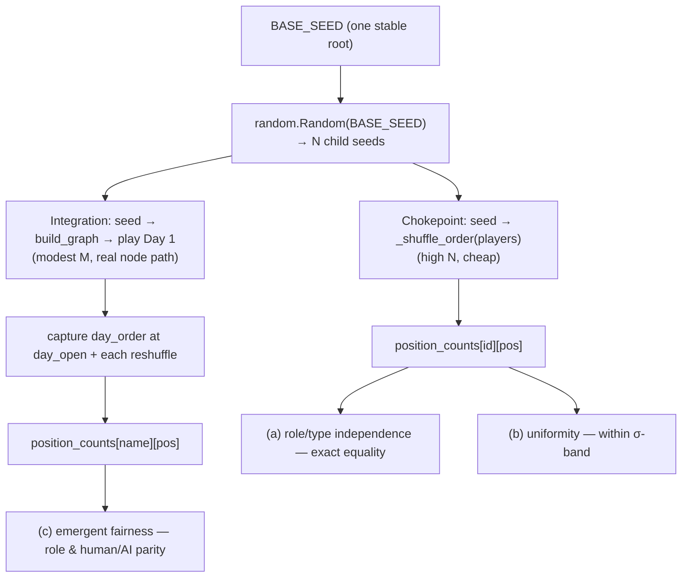

# Tutorial 007: Fair Day Speaking Order

- **Spec:** [`context/spec/007-fair-day-speaking-order/`](../../spec/007-fair-day-speaking-order/)
- **Status:** Draft
- **Author:** Alexey Tigarev
- **Date:** 2026-06-03
- **Prerequisites:** `005-play-as-role` (the determinism posture and in-test seeding). Helpful: `001-playable-skeleton` (the `GameState` channels, `interrupt()`/resume) and `004-robust-vote-input-validation` (forcing outcomes in tests).

---

## Overview

This increment ships **no production code** — it ships *tests*. The Day phase already picks its speaking order with a uniform `random.shuffle`, blind to a player's role or whether they're human or AI; spec 007 adds an automated suite that *proves* that and locks it in, so a future edit can't quietly bias who speaks when (and in a social-deduction game, speaking order is a real advantage — see companion spec 008).

The interesting design problem is purely a **testing** one: **how do you make trustworthy, non-flaky assertions about something deliberately random?** Seed it wrong and the test is either flaky (fails 1 run in 20) or fake (pins the RNG so hard it no longer exercises the real shuffle). The central technique this tutorial teaches is **reproducible seeded sampling** — driving a fixed, derived set of seeds through the real code so the *distribution* is exact and repeatable — combined with the discipline of testing the same invariant at two altitudes. We work from that core outward: first the sampling spine, then the two kinds of fairness claim, then where to aim the tests, then the harness tricks needed to run real games offline, and finally the two gotchas that only showed up once games actually ran.

---

## Concepts already covered (referenced, not re-taught)

- **`determinism-posture-as-policy`** — mechanical RNG is accepted as non-replayable; tests pin a behaviour only when it's the subject, using the cheapest mechanism at the call site. 007 is a direct application. (See [tutorial 005](../005-play-as-role/tutorial.md#1-the-determinism-posture-as-policy).)
- **`in-test-random-seed-for-byte-equality`** — the one place that needs reproducible RNG calls `random.seed(...)` once, locally. 007 extends this from one seed to a *derived many-seed sample*. (See [tutorial 005](../005-play-as-role/tutorial.md#5-the-cleanup-arc-and-the-sanctioned-exception).)
- **`monkeypatch-shuffle-helper-for-determinism`** — pinning a specific order by monkeypatching `_shuffle_order`. 007 deliberately does the opposite: it exercises the *real* `_shuffle_order` and seeds around it. (See [tutorial 005](../005-play-as-role/tutorial.md#3-direct-intent-expression-in-tests--mechanical-rng).)
- **`forced-ballot-outcome-test` / `command-resume-payload`** — driving the graph and answering `interrupt()`s via `Command(resume=…)`; the integration test reuses this to play games unattended. (See [tutorial 004](../004-robust-vote-input-validation/tutorial.md) and [tutorial 001](../001-playable-skeleton/tutorial.md#humans-inside-an-autonomous-graph-interrupt-and-resume).)
- **`structured-output-flat-pydantic`** — `with_structured_output(<schema>)` on the LLM call; the integration test's fake dispatches on exactly that bound schema. (See [tutorial 001](../001-playable-skeleton/tutorial.md#bringing-in-the-llm-structured-output-and-self-correction).)

---

## What's new this increment

- [**Seeded multi-sample from one master seed**](#1-the-core-problem-testing-a-random-thing-without-flaking) — derive N child seeds from one stable root; the sample becomes exact and repeatable.
- [**Structural invariance by same-seed equality**](#2-two-kinds-of-claim-ignores-x-vs-is-uniform) — prove the order ignores role/type by exact output equality when only those vary.
- [**Reproducible statistical uniformity within a σ-justified band**](#2-two-kinds-of-claim-ignores-x-vs-is-uniform) — assert evenness against a tolerance derived from the binomial spread.
- [**Chokepoint + integration two-altitude testing**](#3-where-to-aim-the-tests-the-chokepoint-and-the-whole-game) — guard the producer *and* the assembled game.
- [**Guard-rail tests for an already-correct invariant**](#3-where-to-aim-the-tests-the-chokepoint-and-the-whole-game) — a tests-only spec that pins correct behaviour against future drift.
- [**Unbounded structured-output LLM stub**](#4-making-a-real-game-runnable-in-a-loop-offline) — a fake that answers any number of calls so full games run offline.
- [**Per-game checkpoint isolation under a coarse thread-id clock**](#5-two-gotchas-the-real-games-forced) — give each fast game its own checkpoint dir.
- [**Stable-label aggregation across varying identities**](#5-two-gotchas-the-real-games-forced) — key the cross-game tally on display name, not per-game UUID.

---

## Diagram

The increment's "structure" is its **test design**: one stable seed fans out into two altitudes of evidence that feed three fairness assertions.



---

## Walkthrough

### 1. The core problem: testing a random thing without flaking

**Pose.** `_shuffle_order` calls `random.shuffle`. How do you assert *anything* about its output without writing a test that fails one run in twenty — or one that pins the RNG so tightly it stops testing the real shuffle?

**Present.** The answer is **seeded sampling driven from one stable root**. Python's `random.Random(seed)` is an independent RNG instance; you use one as a *master* to deterministically generate a list of child seeds, then re-seed the module-global RNG with each child immediately before calling the real production helper. The sample is large enough to reason about statistically, yet — because every seed traces back to one fixed `BASE_SEED` — completely reproducible: the same numbers come out on every run, on every machine. This is **seeded multi-sample from one master seed**, and it's the spine the whole suite stands on.

```python
# tests/test_slice_day_order_fairness.py — _child_seeds / _orders_over_seeds
def _child_seeds(base_seed: int, n: int) -> list[int]:
    master = random.Random(base_seed)
    return [master.randrange(2**31) for _ in range(n)]

def _orders_over_seeds(players, child_seeds):
    orders = []
    for seed in child_seeds:
        random.seed(seed)            # production reads the *module-global* RNG
        orders.append(_shuffle_order(players))
    return orders
```

**Apply.** This composes directly with two prior concepts. It's the project's **determinism posture as policy** (tutorial 005) taken to its logical end: mechanical RNG is non-replayable in production, so a test that *needs* replay seeds explicitly and locally. And it generalises **in-test seeding for byte-equality** (also 005) — where one `random.seed(...)` pinned a single trajectory — into a *fan* of trajectories whose aggregate is a distribution. Crucially, it's the opposite move from **monkeypatching `_shuffle_order`** (005): there we *replaced* the shuffle to force one order; here we *exercise the real shuffle* and seed around it, because the shuffle itself is what's on trial. `BASE_SEED = 20250607` is the one knob; everything downstream is a pure function of it.

### 2. Two kinds of claim: "ignores X" vs "is uniform"

**Pose.** "Fair" is actually *two* separate claims. One: the order must not *depend* on role or human/AI type. Two: the order must be *uniform* — no position systematically favoured. These need different tests. How do you prove each?

**Present — independence.** The "ignores role/type" claim is provable *exactly*, with no statistics at all, via **structural invariance by same-seed equality**: run the sample twice over the *same* child seeds, with two player sets that share ids and alive-flags but assign `role`/`is_human` to *different* ids — and assert the two order sequences are byte-identical. If `_shuffle_order` ever consulted role or `is_human`, the sequences would diverge. Equality across 500 seeds is a proof, not a sample.

```python
# tests/test_slice_day_order_fairness.py — test_order_ignores_role_and_human_flag_exactly
orders_a = _orders_over_seeds(players_a, seeds)  # mafia={p0,p1}, human=p0
orders_b = _orders_over_seeds(players_b, seeds)  # mafia={p5,p6}, human=p3
assert orders_a == orders_b
assert len({tuple(o) for o in orders_a}) > 1     # guard: not a constant order
```

That last line matters — equality is trivially true if the "shuffle" always returned the same order, so the test also asserts the sample produced *variety*.

**Present — uniformity.** The "no position favoured" claim *is* statistical, and this is where flakiness usually creeps in. The suite picks its tolerance deliberately, as **reproducible statistical uniformity within a σ-justified band**: for N=7000 draws over 7 positions, each (player, position) cell expects N/7≈1000; the per-cell count is Binomial(N, 1/7) with σ≈29.3, so the ±0.12·(N/7)=120 band is ≈4σ — wide enough that the fixed sample always clears it, tight enough to catch a 1-in-8 skew (~143 off). Because the sample is seeded, "4σ" isn't a flake budget — it's documentation of *why the band is neither flaky-tight nor meaningless*.

A subtlety the reader should not miss: role fairness is **per-capita**, not 50/50. With 2 Mafia of 7, Mafia *should* hold ~2/7 of every position — the test asserts each group's share is proportional to its alive headcount, and that the single human's per-position rate matches a single comparable AI's. A naïve "Mafia get position 0 half the time" assertion would be *wrong*.

### 3. Where to aim the tests: the chokepoint, and the whole game

**Pose.** `_shuffle_order` is one small function. Do you test it in isolation, or test the order as it actually emerges from a running game?

**Present.** Both — this is **chokepoint + integration two-altitude testing**. The chokepoint module hammers `_shuffle_order` directly at high N (cheap, exact). But a unit test on the helper can't catch a refactor that *stops calling it* — or starts re-ordering its result by role downstream. So a second module drives the **real compiled graph** (`build_graph`) through a Day and asserts fairness on the `day_order` channel the game itself produces, at `day_open` and at every round-boundary reshuffle. The chokepoint carries the statistical weight; the integration test guards the *wiring*.

It's also worth naming what this whole spec *is*: **guard-rail tests for an already-correct invariant**. The Slice 1 task was literally "confirm `_shuffle_order` reads only id/is_alive — and do **not** edit it." No production line changed. The value is entirely in freezing correct behaviour so a later commit can't silently regress it — the same instinct behind 004's driver-level regression test, applied to a property rather than a bug.

### 4. Making a real game runnable in a loop, offline

**Pose.** The integration test wants to play ~120 full games — with no Bedrock, no human at the keyboard, and no idea in advance how many AI turns each game will take. The existing `fake_sonnet` fixture serves a *finite* queue of scripted actions. How do you run an open-ended loop?

**Present.** With an **unbounded structured-output LLM stub** — a tiny stateless fake that returns a generic, schema-appropriate value for *any* number of calls, dispatching on the schema the production code bound via `with_structured_output`:

```python
# tests/test_slice_day_order_fairness_e2e.py — _AlwaysSpeakSonnet.invoke
if self._bound_schema is DayAction:
    return DayAction(kind="speak", text="I am still weighing things.")
if self._bound_schema is Pointing:
    candidates = [p.id for p in players.values()
                  if p.is_alive and p.role == "law_abiding" and not p.is_human]
    return Pointing(target_id=candidates[0])
```

Because every AI always *speaks* (never votes), each Day runs cleanly to its 6-round cap, handing back a fresh `day_order` at each reshuffle. This composes with prior concepts: it dispatches on the **flat structured-output schema** (001) the way the real call does, and the human's turns are answered with **`Command(resume=…)`** (001) — the same resume-pump the game uses for a real player. The roster still comes from `fake_haiku`, so no call site reaches AWS and the autouse `safe_llm` net stays satisfied.

### 5. Two gotchas the real games forced

**Pose.** What breaks when you actually run 120 games back-to-back in under a second — things a single-game test never reveals?

**Present — colliding checkpoints.** `build_graph` derives its `thread_id` (and the SQLite checkpoint filename) from `datetime.now()` at *second* precision. Run 120 games in the same wall-clock second and they collide on thread id, so a later game resumes an earlier game's checkpoint — pure non-determinism that has nothing to do with the order under test. The fix is **per-game checkpoint isolation under a coarse thread-id clock**: give each game its own directory.

```python
# tests/test_slice_day_order_fairness_e2e.py — test_emerging_day_order_is_fair_across_games
monkeypatch.setenv("GRAPHIA_CHECKPOINT_DIR", str(tmp_path / f"ckpt-{game_index}"))
```

This is test-harness isolation only — production's thread-id scheme is untouched — but it surfaced a genuine latent edge: two real launches in the same second would share a checkpoint too. Worth a follow-up note in its own right.

**Present — aggregating across churn.** Player ids are fresh UUIDs every game, but the matrix needs to accumulate across all M games. The fix is **stable-label aggregation across varying identities**: key the tally on the player's *display name* (the roster names repeat every game) and re-read each game's role deal to bucket Mafia/Law-abiding correctly, since the deal is reshuffled per game. One more wrinkle the test documents honestly: the deterministic Night-pointing fake kills the same seat-position disproportionately often, so per-seat uniformity is asserted only on well-sampled seats (those alive in ≥half the games), while the robust *aggregate* role/position totals use every placement — and the test asserts at least 4 seats cleared the bar so the check isn't vacuous.

---

## Try it

Run the two modules directly:

```
uv run pytest tests/test_slice_day_order_fairness.py tests/test_slice_day_order_fairness_e2e.py -q
```

You'll see 6 tests pass in a few seconds. Because everything flows from `BASE_SEED = 20250607`, the result is identical on every run — re-run it as many times as you like; the statistical assertions never flake. To *see* a regression get caught, temporarily make `_shuffle_order` biased (e.g. `ids.sort()` instead of `random.shuffle(ids)`) and watch the uniformity test fail loudly; or have it read `is_human` to seat the human last, and watch the exact-equality independence test break.

---

## Where to go next

- **Previous tutorial:** [tutorial 006](../006-cross-game-career-stats/tutorial.md) (cross-game career stats).
- **Companion spec:** [008 — Same-Round Message Visibility](../../spec/008-same-round-message-visibility/functional-spec.md) — *why* fair order matters (later speakers see earlier ones), and the next increment in this Day-phase integrity pair.
- **Foundations this builds on:** the determinism posture in [tutorial 005](../005-play-as-role/tutorial.md) and architecture §6.
