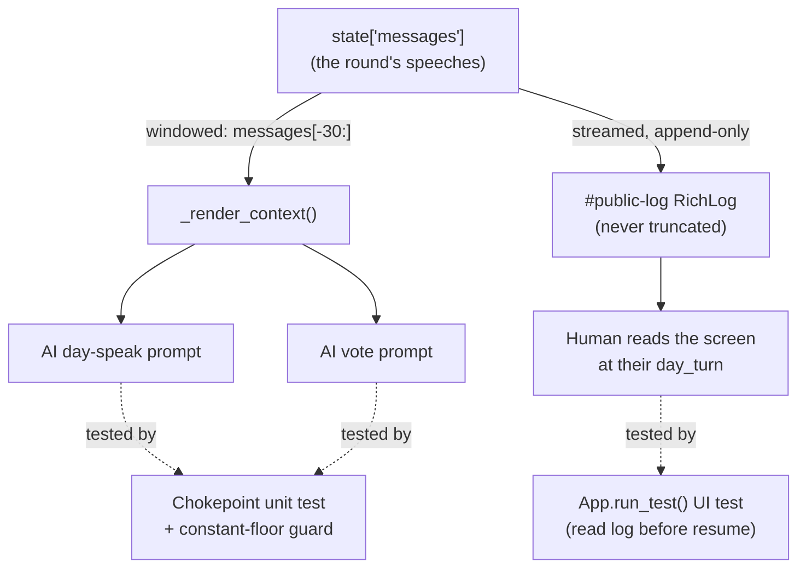

# Tutorial 008: Same-Round Message Visibility

- **Spec:** [`context/spec/008-same-round-message-visibility/`](../../spec/008-same-round-message-visibility/)
- **Status:** Draft
- **Author:** Alexey Tigarev
- **Date:** 2026-06-09
- **Prerequisites:** `007-fair-day-speaking-order` (its companion — *why* order matters is *because* later speakers see earlier ones). Helpful: `005-play-as-role` (the determinism posture, role-pinning and `_shuffle_order` monkeypatching) and `001-playable-skeleton` (the `interrupt()`/resume turn loop and the public/private RichLog panes).

---

## Overview

This increment ships a *one-line* production change and two tests — and is far more interesting than that sounds if you care about how to **pin a guarantee in a test without making it flaky or fake**.

The guarantee is **same-round message visibility**: when a player takes their Day turn, they should actually be shown what the *earlier* speakers said this round, so accusations and defences can build on each other. (That's the information advantage that makes speaking *order* matter — the subject of companion spec 007.) The catch is that "being shown the round" means two completely different things depending on *who* the player is. An AI player sees a *string we assemble and hand to the model*; the human sees *pixels already on the screen*. One guarantee, two mechanisms — and therefore two very different testing problems.

The design problem this tutorial teaches: **how do you guarantee, and lock in with offline tests, something whose delivery mechanism is asymmetric — a bounded prompt window on one side, an unbounded scrollback on the other?** We work core-outward. First the asymmetry itself (the spine). Then the AI side's single chokepoint and why one constant moved two views. Then *why 30* — sizing a window to a domain invariant. Then the two testing quirks that are the real payload of this increment: a **guard assertion that pins a magic constant to a domain floor**, and a UI test that has to **read on-screen state at exactly the right instant — before an interrupt resolves — without racing**.

---

## Concepts already covered (referenced, not re-taught)

- **`chokepoint-plus-integration-altitude`** — test the small producer in isolation *and* the assembled system. 008 reuses the exact shape: a pure chokepoint unit test plus one `App.run_test()` integration test. (See [tutorial 007](../007-fair-day-speaking-order/tutorial.md#3-where-to-aim-the-tests-the-chokepoint-and-the-whole-game).)
- **`guard-rail-tests-no-production-change`** — a suite whose entire value is freezing correct behaviour against future drift. 008 is *almost* this, with one telling difference: it has a single production line (the constant), and the guard rail is aimed at *that constant*. (See [tutorial 007](../007-fair-day-speaking-order/tutorial.md#3-where-to-aim-the-tests-the-chokepoint-and-the-whole-game).)
- **`monkeypatch-shuffle-helper-for-determinism`** — pin a specific Day order by monkeypatching `_shuffle_order`. The UI test uses it to seat the human *last* so every AI speaks first. (See [tutorial 005](../005-play-as-role/tutorial.md#3-direct-intent-expression-in-tests--mechanical-rng).)
- **`role-pinning-via-env-var-in-tests`** — pin the human's role with `GRAPHIA_ROLE` so a random deal can't strand the worker on an unwanted branch. The UI test pins `law-abiding`. (See [tutorial 005](../005-play-as-role/tutorial.md#2-direct-intent-expression-in-tests--role).)
- **`dual-richlog-panes-private-vs-public`** — the `#public-log` pane and the `additional_kwargs["private_to"]` filter that decides what reaches it. The human-side guarantee rides entirely on this pane being append-only. (See [tutorial 001](../001-playable-skeleton/tutorial.md#decorating-with-a-tui).)
- **`structured-output-flat-pydantic`** — `with_structured_output(DayAction)` on the Sonnet call; the UI test's `fake_sonnet` dispatches on exactly that schema to script the AI speeches. (See [tutorial 001](../001-playable-skeleton/tutorial.md#bringing-in-the-llm-structured-output-and-self-correction).)
- **`command-resume-payload` / `interrupt-replay-first-statement`** — the human turn is an `interrupt()` answered by resuming the graph; 008 observes *what that payload does and does not carry*. (See [tutorial 001](../001-playable-skeleton/tutorial.md#humans-inside-an-autonomous-graph-interrupt-and-resume).)

---

## What's new this increment

- [**Asymmetric context: bounded AI, unbounded human**](#1-one-guarantee-two-mechanisms) — the same "see the round" promise delivered two ways, and why each side is tested differently.
- [**One context chokepoint feeds speak and vote**](#2-the-ai-side-one-chokepoint-two-prompts) — `_render_context` is the sole recent-discussion feed for both AI prompts, so one constant change widens both.
- [**Window sized to cover a full round**](#3-why-30-sizing-a-window-to-a-domain-invariant) — *why 30* is an arithmetic argument against a round's worth of messages, not a round number.
- [**Constant-floor guard assertion**](#4-the-testing-payload-i-a-guard-that-pins-a-constant-to-a-domain-floor) — a unit test wires the magic constant to the floor it must clear so a future shrink fails loudly.
- [**Interrupt payload omits discussion**](#5-the-testing-payload-ii-reading-the-screen-before-the-interrupt-resolves) — the human's turn payload carries no discussion; the screen is the channel, so the human side needed no production change.

---

## Diagram

The "structure" of this increment is the **asymmetry**: one guarantee, two delivery paths, two test altitudes.



---

## Walkthrough

### 1. One guarantee, two mechanisms

**Pose.** "A player sees what others said earlier this round." Simple sentence — but how is it actually *delivered*? An AI player is a model behind an API; it sees only the text we put in its prompt. A human is a person looking at a terminal; they see whatever is on the screen. Are these the same guarantee?

**Present.** They are the same *guarantee* but two different *mechanisms*, and naming that asymmetry is the whole increment. This is **asymmetric context: bounded AI, unbounded human**:

- The **AI's** view is **bounded**. Every AI Day turn assembles a "recent discussion" string from the last `_CONTEXT_WINDOW` messages — a deliberate window, because a prompt can't grow without limit.
- The **human's** view is **unbounded**. The human reads the `#public-log` pane, which is appended to as each message streams in and is *never truncated*. By the time it's the human's turn, every earlier message of the round is already on screen.

So the two sides fail in different ways and need different fixes. The AI side can *silently* lose the round's start if the window is too small — that's the real bug this spec targets. The human side already satisfies the spec by construction. That observation alone determines the production work: **change the AI window; touch nothing on the human side.**

**Apply.** This composes directly with prior concepts. The human's pane is the **public RichLog** from tutorial 001's `dual-richlog-panes-private-vs-public`; the same `private_to` filter that hides Mafia whispers is what guarantees every *public* speech lands on screen in order. And the reason we trust "by the time it's the human's turn" is the turn loop from 001 (`interrupt-replay-first-statement`): Day turns run one player per super-step, so all earlier AI speeches for the round have already streamed before the human's `interrupt()` halts the worker.

### 2. The AI side: one chokepoint, two prompts

**Pose.** On the AI side, where exactly does "what the model sees" get decided? If it's scattered across the speak path and the vote path, widening the view is a multi-site change with drift risk.

**Present.** It's a single function. `_render_context` (in `src/graphia/nodes/day.py`) is the **one context chokepoint feeds speak and vote** point — the sole recent-discussion feed for *both* the AI's day-speak prompt and the AI's vote prompt:

```python
# src/graphia/nodes/day.py — _render_context
def _render_context(messages: list) -> str:
    """Render the last ``_CONTEXT_WINDOW`` messages compactly for prompts."""
    if not messages:
        return "(no prior discussion)"
    recent = messages[-_CONTEXT_WINDOW:]
    lines: list[str] = []
    for msg in recent:
        speaker = getattr(msg, "name", None) or msg.__class__.__name__
        ...
```

Both AI node paths call it — the day-speak builder (`_ai_day_action`) and the ballot builder (`_ai_ballot`) each do `context = _render_context(list(state.get("messages", [])))` before formatting their prompt template. Because there's exactly one producer, the *entire* production change for this spec is one line:

```python
# src/graphia/nodes/day.py — module-level constants
_CONTEXT_WINDOW = 30   # was 10
```

**Apply.** This is why the spec is so small — and why a *single* chokepoint unit test can carry the AI-side guarantee for both speaking and voting. It's the producer half of tutorial 007's `chokepoint-plus-integration-altitude`: pin the one function every view flows through, and you've pinned every view. Worth flagging the in-scope side effect: widening the window also widens what an AI sees when it *votes* — intentional, and a net improvement to the ballot decision, but a real behavioural change rather than a pure no-op.

### 3. Why 30? Sizing a window to a domain invariant

**Pose.** Why 30 and not 20, or 100? A magic number with no reasoning behind it is exactly the thing a future maintainer shrinks "to save tokens" and quietly breaks.

**Present.** 30 is chosen against a **domain invariant**, not pulled from the air — this is **window sized to cover a full round**. For the standard 7-player lineup, a full round of Day discussion is at most:

- 7 speeches (one per alive player, fewer after night kills), plus
- 1 day-open announcement, plus
- the odd vote-announcement system message.

That's comfortably under 30. So 30 guarantees the *whole current round* survives the window with headroom — enough slack for a couple of rounds of recent back-and-forth and for the larger lineups a future configurable-roster feature (Phase 5) might introduce, while still keeping the prompt bounded. The number encodes a *claim*: "a round fits."

**Apply.** A claim encoded only in a comment rots. The next section turns this sizing rationale into something a test enforces — which is where the increment gets interesting for a testing-minded reader.

### 4. The testing payload I: a guard that pins a constant to a domain floor

**Pose.** The risk isn't today's value — it's tomorrow's edit. Someone shrinks `_CONTEXT_WINDOW` back to 10 to trim tokens, every existing test still passes (the window is still *non-empty*), and the round's earliest speaker silently falls out of view again. How do you make that specific regression *impossible to merge quietly*?

**Present.** You write a **constant-floor guard assertion** — a pure unit test that ties the magic constant directly to the domain floor it must clear:

```python
# tests/test_slice_day_context_window.py — test_context_window_holds_a_full_round
PLAYER_COUNT = 7
FULL_ROUND_MESSAGES = PLAYER_COUNT + 1  # 7 speeches + 1 day-open announcement

def test_context_window_holds_a_full_round() -> None:
    assert _CONTEXT_WINDOW >= FULL_ROUND_MESSAGES  # i.e. >= 8
```

This is not testing behaviour — it's testing a *design constraint*. The assertion fails the moment anyone sets the window below a round's worth of messages, with a message that points straight at the cause. The floor (`FULL_ROUND_MESSAGES`) is itself expressed in domain terms, so the test reads as documentation: *the window must hold a full round.*

The companion behavioural test in the same file proves the window actually renders the round, using nothing but a hand-built message list — no graph, no LLM, no AWS:

```python
# tests/test_slice_day_context_window.py — test_full_round_every_speaker_line_appears
messages = _build_full_round()          # 1 SystemMessage + 7 named AIMessages
rendered = _render_context(messages)
for i in range(PLAYER_COUNT):
    assert f"P{i}: speech from player {i}" in rendered
assert "P0: speech from player 0" in rendered   # the EARLIEST must survive
```

**Apply.** This sharpens tutorial 007's `guard-rail-tests-no-production-change`. 007's whole spec changed no production code; 008 changes exactly one line — *the constant* — and aims its guard rail at that line. The pattern generalises: any time a magic number encodes a domain claim ("this buffer holds a frame", "this timeout exceeds a round-trip"), a one-line `assert CONSTANT >= DOMAIN_FLOOR` converts the claim from a comment into a tripwire. It's the cheapest possible test and it catches the most likely future mistake. The behavioural test, meanwhile, is a *pure function over a literal list* — the fastest, least flaky kind of test there is, because it removes the graph, the model, and the RNG from the picture entirely.

### 5. The testing payload II: reading the screen before the interrupt resolves

**Pose.** The human side is the awkward one. The guarantee is "earlier messages are *on screen* before the human speaks." You can't inspect a model's prompt here — you have to assert about *rendered terminal state*, captured at exactly the instant the human is prompted and **not one moment later**. And the path to that instant runs through a real role deal, a real night kill, and a real shuffle — all of which use the module-global RNG. How do you make that assertion without it being either flaky or staged?

**Present.** You drive the real app with `App.run_test()` and **neutralise every RNG-sensitive branch with a sanctioned seam**, then poll for the precise moment. First, the determinism seams (all reused from earlier tutorials):

```python
# tests/test_same_round_visibility_ui.py — test_same_round_speeches_visible_at_human_turn
monkeypatch.setenv("GRAPHIA_ROLE", "law-abiding")   # role-pinning-via-env-var-in-tests

def _human_last(players):                           # monkeypatch-shuffle-helper...
    alive = [pid for pid, p in players.items() if p.is_alive]
    human_id = next(pid for pid, p in players.items() if p.is_human)
    ai_ids = [pid for pid in alive if pid != human_id]
    return [*ai_ids, human_id]                       # every AI speaks before the human
monkeypatch.setattr(day_nodes, "_shuffle_order", _human_last)
```

Pinning the human *last* is what makes the test meaningful: every alive AI speaks before the human's `day_turn` interrupt halts the worker, so there is a full round of earlier speeches to assert about. The AI speeches themselves are scripted via `fake_sonnet(day_actions=[...])` dispatching on the `DayAction` schema (`structured-output-flat-pydantic`).

Now the **interrupt payload omits discussion** observation is what makes this side need *no* production code. The human's `day_turn` interrupt carries only routing data — `kind`, `speaker_id`, `speaker_name`, `alive_names` — and pointedly *no* discussion text. The human is not handed the conversation; they read it off the screen. So the test asserts on the screen, polling until the human is actually being prompted *and* all earlier speeches have landed:

```python
# tests/test_same_round_visibility_ui.py — _human_turn_with_all_ai_spoken (inner predicate)
def _human_turn_with_all_ai_spoken() -> bool:
    prompt = app.query_one("#player-input", Input)
    if prompt.disabled:                 # not the human's turn yet
        return False
    flat = _rich_log_text(public_log)   # flatten the RichLog to plain text
    return all(f"{name}:" in flat for name in alive_ai_names_after_night)
```

The `await _wait_for(pilot, _human_turn_with_all_ai_spoken)` poll is the race-safety mechanism: it yields to the Textual event loop each tick until *both* conditions hold, rather than sampling once and hoping the timing lined up. Only then does it snapshot the log and assert the five distinctive earlier speeches are present — and that the human's own name leads no line yet (`assert f"{HUMAN_NAME}:" not in before_submit`), proving we captured the screen *before* the human spoke.

**Apply.** Notice the residual-RNG reasoning, which is the quiet craft here. The role deal still randomly decides *which* AIs are Mafia — but the test never depends on it: exactly one AI dies at night (the fake night-pointing targets the first law-abiding AI), so there are always **5 AI survivors**, and the assertions read the surviving set *from live graph state* rather than hard-coding names. This is the same instinct as tutorial 007's seeded fairness work — exercise the real randomness, but arrange the assertion so its *outcome* is invariant. The result is a UI test that touches the RNG on every run and still never flakes. Together with §4, the increment lands its guarantee at two altitudes — pure-function chokepoint for the AI, real-app integration for the human — exactly the `chokepoint-plus-integration-altitude` split from 007, now applied to *visibility* instead of *order*.

---

## Try it

Run the two new modules directly:

```
uv run pytest tests/test_slice_day_context_window.py tests/test_same_round_visibility_ui.py -q
```

You'll see the chokepoint unit tests and the UI test pass in about a second. To *watch the guard rail work*, edit `_CONTEXT_WINDOW` in `src/graphia/nodes/day.py` down to a value below a full round — say `5` — and re-run: the floor guard `test_context_window_holds_a_full_round` trips immediately with `assert 5 >= 8`, and the behavioural `test_full_round_every_speaker_line_appears` fails alongside it because `P0`'s line has been trimmed out of the rendered context. Restore it to `30` and both go green. The UI test, because its outcome is invariant to the role deal, returns the same result on every run — re-run it as many times as you like.

---

## Where to go next

- **Companion tutorial:** [tutorial 007 — Fair Day Speaking Order](../007-fair-day-speaking-order/tutorial.md). 007 proves the order is *fair*; 008 proves later speakers can actually *see* the earlier ones. Read them as a pair — they're the two halves of "Day-phase discussion integrity."
- **Next spec:** [009 — AI Collusion Awareness](../../spec/009-ai-collusion-awareness/functional-spec.md) (Draft) — the third member of the Day-phase integrity trio.
- **Foundations this builds on:** the determinism posture and in-test seams in [tutorial 005](../005-play-as-role/tutorial.md), and the public/private panes and turn loop in [tutorial 001](../001-playable-skeleton/tutorial.md).
