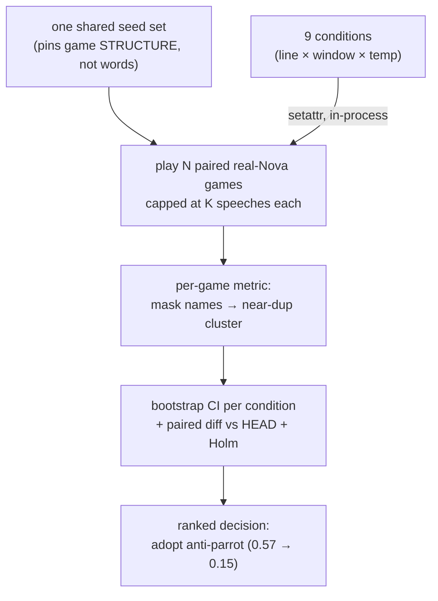

# Tutorial 009: AI Collusion Awareness — or, how one prompt line was actually chosen

- **Spec:** [`context/spec/009-ai-collusion-awareness/`](../../spec/009-ai-collusion-awareness/)
- **Status:** Draft
- **Author:** Alexey Tigarev
- **Date:** 2026-06-10
- **Prerequisites:** `007-fair-day-speaking-order` (the seeded-sampling + statistical-testing posture this builds on) and `005-play-as-role` (the determinism posture, role-pinning, the `_shuffle_order` seam). Helpful: `002-hosted-agentcore-deployment` (the OpenInference/CloudWatch observability the diagnosis mines) and `008-same-round-message-visibility` (the context window this increment trades against).

---

## Overview

This increment ships a **one-line prompt change** — and the line is almost beside the point. What it actually teaches is **how to evaluate and fix a non-deterministic LLM *behavior* with a controlled, statistically honest experiment.**

The story: spec 009 added a nudge to the AI Day-speak prompt ("identical messages can signal collusion") meant to make villagers *suspicious* of copycats. In play it did the opposite — it **primed the model to copy**, collapsing Day chat into players echoing each other and then repeating *about* the echoing. The interesting design problem is the one any LLM engineer eventually hits: *how do you A/B a prompt change when the thing you're measuring — the model's words — is different on every run, and a naive metric and a small sample will lie to you?*

The central technology here isn't LangGraph or AgentCore — it's **experiment design for non-deterministic model output**: a paired A/B harness that hits the real model, a metric that survives the model's tricks, controls for the confounds, and bootstrap statistics that rank fixes with stated uncertainty. We teach it core-outward: first the spine (how to make a non-deterministic A/B *comparable* at all), then the metric, the confound, the statistics, the machinery to run conditions, the diagnosis that started it, and finally the prompt lessons the experiment paid out — including why the rigor was worth it.

---

## Concepts already covered (referenced, not re-taught)

- **`determinism-posture-as-policy`** — mechanical RNG is accepted as non-replayable; tests pin a behaviour only when it's the subject. 009 extends this to a *second* axis of non-determinism — the LLM's *output* — which no seed touches. (See [tutorial 005](../005-play-as-role/tutorial.md#1-the-determinism-posture-as-policy).)
- **`seeded-multi-sample-from-master`** — derive N child seeds from one stable root for a reproducible sample. 009 reuses the exact idea but for a new purpose: pairing conditions. (See [tutorial 007](../007-fair-day-speaking-order/tutorial.md#1-the-core-problem-testing-a-random-thing-without-flaking).)
- **`reproducible-statistical-uniformity`** — assert a distribution within a justified band. 009 trades the σ-band for bootstrap CIs + a paired test, because here the per-unit values are noisy and we're *ranking* conditions, not checking one. (See [tutorial 007](../007-fair-day-speaking-order/tutorial.md#2-two-kinds-of-claim-ignores-x-vs-is-uniform).)
- **`role-pinning-via-env-var-in-tests` / `monkeypatch-shuffle-helper-for-determinism`** — `GRAPHIA_ROLE` and the scripted speaking seam; the eval reuses both to drive real games unattended. (See [tutorial 005](../005-play-as-role/tutorial.md#2-direct-intent-expression-in-tests--role).)
- **`makefile-as-task-runner`** — operations live behind `make` targets; the evals are two more. (See [tutorial 002 (v2)](../002-hosted-agentcore-deployment-v2/tutorial.md).)
- **`openinference-langchain-instrumentation` / `otel-baggage-session-grouping`** — the LangChain spans and session grouping that hosted mode emits to CloudWatch; the diagnosis mines them for content. (See [tutorial 002](../002-hosted-agentcore-deployment/tutorial.md#diagram).)
- **`structured-output-flat-pydantic`** — the AI's turn is a `DayAction` tool call; the eval reads the speech out of exactly that. (See [tutorial 001](../001-playable-skeleton/tutorial.md#bringing-in-the-llm-structured-output-and-self-correction).)

---

## What's new this increment

- [**Paired-seed LLM A/B**](#1-the-spine-making-a-non-deterministic-ab-comparable) — share one seed set across conditions so only the model's words vary.
- [**Real-LLM eval, make-gated outside the suite**](#2-the-vehicle-a-real-model-eval-that-opts-out-of-the-mocked-suite) — a harness that deliberately hits real Bedrock, gated behind `make`.
- [**Name-masked similarity metric**](#3-measuring-the-right-thing-mask-the-names) — mask player names so template echo registers as repetition.
- [**Length-cap confound control**](#4-the-confound-game-length) — cap speeches per game so longer games don't fake a worse score.
- [**Bootstrap CIs + paired-test ranking**](#5-honest-ranking-bootstrap-cis-and-a-paired-test) — rank fixes with stated uncertainty, not point estimates.
- [**In-process factor injection**](#6-running-the-conditions-without-touching-source) — apply each condition via `setattr`, no source edits.
- [**GenAI trace archaeology**](#7-how-we-even-saw-it-mining-the-genai-spans) — recover real prompts/completions from CloudWatch spans.
- [**Prompt-priming backfire**](#8-the-payoff-what-the-experiment-decided-and-why-the-rigor-mattered) — telling the model to notice a pattern made it reproduce the pattern.
- [**Anti-parrot self-instruction**](#8-the-payoff-what-the-experiment-decided-and-why-the-rigor-mattered) — fix the model's own output; removing the bad line alone barely helped.
- [**Rigor reverses the noisy pilot**](#8-the-payoff-what-the-experiment-decided-and-why-the-rigor-mattered) — the cheap A/B called the winner a failure; the rigorous one flipped it.

---

## Diagram

The increment's structure is a pipeline that turns a noisy, non-deterministic signal into a ranked decision.



---

## Walkthrough

### 1. The spine: making a non-deterministic A/B comparable

**Pose.** Tutorial 007 taught how to test a *random* thing — seed the RNG, and the shuffle is reproducible. But the thing under test here is the **LLM's words**, and no seed controls those: run the same game twice and the AIs say different things. So how do you compare "prompt A" against "prompt B" when *every* run differs for two reasons at once — the change you made, and the model's inherent noise?

**Present.** You can't remove the model noise, but you can remove *everything else* and then average the noise away. The technique is a **paired-seed LLM A/B**: pin the game **structure** with a fixed seed set, and reuse the **same seed set across every condition**. Game *i* then has the identical role deal, speaking order, and Night trajectory in condition A and condition B — so the only thing that differs between the two is the prompt (plus residual model noise, which N games average out). That makes the conditions *matched pairs*, which is both more honest and more powerful than comparing unmatched runs.

```python
# src/graphia/tools/repetition_experiment.py — main
seeds = [args.seed + i for i in range(args.games)]   # ONE list, reused for every condition
...
for cond in conds:
    _apply_condition(cond, variants)
    for i, seed in enumerate(seeds):
        outcome = _play_game(seed, args.max_speeches)   # game i has the same structure in every cond
```

**Apply.** This is the project's **determinism posture as policy** (tutorial 005) meeting its second non-determinism axis. 005/007 only ever had *mechanical* RNG to pin; 009 names the distinction explicitly — `random.seed(seed)` fixes the deal and the shuffle, but the dialogue stays free, *by design*, because the dialogue is the dependent variable. It directly reuses **seeded multi-sample from one master** (007): there, N child seeds produced a distribution over a deterministic shuffle; here, the same construct produces N *matched game structures* over a non-deterministic model. Same seam, new job.

### 2. The vehicle: a real-model eval that opts out of the mocked suite

**Pose.** Every test in this project mocks Bedrock — the autouse `safe_llm` fixture fails loudly if any test reaches the real model. That's correct for unit tests. But you cannot measure *real dialogue quality* against a fake that returns `"I am still weighing things."`. Where does a real-model eval live, then?

**Present.** Outside `pytest`, behind a `make` target — a **real-LLM eval, make-gated outside the suite**. `make eval-dialogue` (a quick smoke) and `make repetition-experiment` (the rigorous A/B) both drive real games against real Nova, deliberately bypassing the mocked net, because hitting the live model *is the point*. They're gated behind `make` precisely because they cost tokens and are non-deterministic — the opposite contract from the offline suite.

```python
# src/graphia/tools/repetition_experiment.py — _play_game
random.seed(seed)
os.environ["GRAPHIA_CHECKPOINT_DIR"] = ckpt
graph, thread_id = build_graph(config)          # the REAL graph; real get_large() -> Nova
_drive(graph, run_config, {"messages": []})
_drive(graph, run_config, Command(resume=HUMAN_NAME))   # scripted human, never a real keyboard
```

**Apply.** This composes two prior concepts into a new posture. It's the project's **make-as-task-runner** convention (tutorial 002) extended to evaluation, and it reuses the test seams from **role-pinning via env var** and the **scripted-speaking** approach (005) — `GRAPHIA_ROLE=law-abiding` keeps the human off the Night-point branch, and a small pool of neutral human lines (`HUMAN_LINES`) drives turns unattended. The crucial difference from a unit test: there is no `fake_sonnet` here. The model is real, so the harness is an *evaluation*, not a *test* — it produces a measurement, not a pass/fail.

### 3. Measuring the right thing: mask the names

**Pose.** Look at the failure: *"I've been watching everyone, and it seems like **Jin**'s behavior is suspicious"* followed by *"…it seems like **Aiko**'s behavior is suspicious."* A character-level diff sees two different strings (the names differ) and calls them distinct — but to a human they're the *same sentence*. The repetition is **structural**: one skeleton, the slot swapped. How does a metric catch that?

**Present.** With a **name-masked similarity metric**: before measuring, replace every player name with a single `<NAME>` token, then cluster near-duplicates. Masking collapses the template's variants onto each other so they cluster as the repeats they are. This is the experiment's *primary* metric — the one the decision rule reads.

```python
# src/graphia/tools/repetition_experiment.py — _mask_names / _metrics
def _mask_names(text, names):
    for n in sorted(names, key=len, reverse=True):
        text = re.sub(rf"\b{re.escape(n)}\b", "<NAME>", text, flags=re.IGNORECASE)
    return text
...
masked = [_normalize(_mask_names(s, outcome.names)) for s in sp]
primary = _near_dup_rate(masked, 0.85)   # fraction of speeches with a >=0.85 difflib neighbour
```

**Apply.** The speeches themselves come from the AI's `DayAction` (the **flat structured-output** schema from tutorial 001) — the eval reads `kind="speak"` text straight out of the tool call. Masking is paired with a *threshold sweep* (near-dup at 0.80/0.85/0.90) and a corpus-level **self-BLEU** as cross-checks, so the headline number doesn't hinge on one arbitrary cutoff. The lesson generalises: when a model fails *structurally*, your metric has to normalise away the surface variation the model uses to look diverse.

### 4. The confound: game length

**Pose.** Suppose a candidate fix makes the AIs less decisive, so games run longer before someone is executed. A longer Day produces more speeches — and a longer conversation simply has *more opportunities* to repeat. If you measure the raw rate, that fix looks *worse* for a reason that has nothing to do with dialogue quality. How do you stop game length from contaminating the comparison?

**Present.** **Length-cap confound control**: collect only the first **K = 24** speeches from every game and stop. Every game then contributes the same denominator, so the rate is comparable across conditions; game length is held constant instead of varying with the thing under test.

```python
# src/graphia/tools/repetition_experiment.py — _play_game
for _ in range(300):  # hard budget
    if len(_ai_speeches(graph, run_config, ai_names)) >= max_speeches:
        break        # collected K; stop this game
    ...
speeches = _ai_speeches(graph, run_config, ai_names)[:max_speeches]
```

**Apply.** This confound was not hypothetical — it actively *fooled the pilot*. The quick A/B's reworded condition happened to run ~88 speeches/game vs ~43 for the others, inflating its repetition rate and making the eventual *winning* fix look like a loser (more on that in §8). The cap is reported alongside a **decisiveness guardrail** (early-end count), so a "fix" that only wins by making games drag is visible as such, not silently rewarded.

### 5. Honest ranking: bootstrap CIs and a paired test

**Pose.** With N=10 games per condition and a metric that bounces between 0.0 and 0.5 game-to-game, a single mean is a lie waiting to mislead. (Indeed: a same-config replication in the pilot swung 33% → 47%.) How do you rank nine conditions so the ranking survives the noise?

**Present.** **Bootstrap CIs + a paired test.** Each condition's per-game values are resampled to a 95% confidence interval, never reported as a bare point. Each candidate fix is then compared to the baseline condition with a **paired bootstrap difference** over the matched seeds (§1), and the family of comparisons is **Holm-corrected** for multiplicity.

```python
# src/graphia/tools/repetition_experiment.py — _paired_vs_head
diffs = [c - h for h, c in zip(head, cond)]   # paired on the shared seed set; negative = less repetition
boots = sorted(mean(diffs[_RNG.randrange(len(diffs))] for _ in diffs) for _ in range(n))
lo, hi = boots[int(0.025 * n)], boots[int(0.975 * n)]
p = 2 * min(frac_pos, 1 - frac_pos)           # two-sided bootstrap p
```

**Apply.** This is the natural successor to **reproducible statistical uniformity** (tutorial 007). There, the claim was "a uniform shuffle stays inside a σ-band," and a fixed seed made the band non-flaky. Here the claim is comparative ("fix X repeats less than baseline") over a genuinely noisy per-unit signal, so the σ-band gives way to CIs + a paired test + Holm. The pairing from §1 is what makes the paired bootstrap legal: `zip(head, cond)` only means anything because index *i* is the *same game structure* in both.

### 6. Running the conditions without touching source

**Pose.** The experiment varies three factors — the 009 line (collusion / none / anti-parrot), the 008 window (30 / 15 / 10), and temperature (0.7 / 1.0) — across nine conditions. The pilot applied each by editing source files with `sed` and `git checkout`-ing between runs. That's fragile and slow. How do you switch conditions cleanly, in one process?

**Present.** **In-process factor injection**: apply each condition by `setattr` on the live module globals and by rebuilding the LLM singleton at the chosen temperature — no file edits, no checkout.

```python
# src/graphia/tools/repetition_experiment.py — _apply_condition
day._CONTEXT_WINDOW = cond.window
day.DAY_SPEAK_SYSTEM = variants[cond.line]
llm._large = ChatBedrockConverse(model=llm._LARGE_MODEL_ID,
                                 region_name=load_config().aws_region,
                                 temperature=cond.temp)
```

**Apply.** Two project facts make this clean. The Day node reads `_CONTEXT_WINDOW` and `DAY_SPEAK_SYSTEM` as *module globals* at call time, so reassigning them takes effect immediately. And the gameplay model is a lazily-built singleton (`get_large()`), so replacing `llm._large` swaps the temperature for the next call. The three prompt variants are themselves *derived from the real prompt* (`_line_variants` regex-edits the committed `DAY_SPEAK_SYSTEM`), so the experiment can never drift from the shipped text it's testing.

### 7. How we even saw it: mining the GenAI spans

**Pose.** The regression first showed up in **remote** play — a hosted game. But the local stream-trace log records only node *keys*, not speech text, and Bedrock model-invocation logging was off. So the actual sentences the AIs said were nowhere obvious. How do you recover them after the fact?

**Present.** **GenAI trace archaeology.** Hosted mode already emits OpenInference spans to CloudWatch (the observability from tutorial 002). The LLM calls land as `ChatBedrockConverse` spans whose attributes carry the structured output — so a Logs Insights query over `aws/spans`, filtered to those spans, yields every AI speech as the `DayAction` tool-call arguments.

```text
# CloudWatch Logs Insights over the aws/spans group
fields @message | filter name = "ChatBedrockConverse" and @message like /<session-id>/
# then read: llm.output_messages.0.message.tool_calls.0.tool_call.function.arguments
#            -> {"kind":"speak","text":"..."}   (the speech)
```

**Apply.** This composes directly with **OpenInference instrumentation** and **OTEL baggage session grouping** (tutorial 002): those spans exist *because* hosted mode is instrumented and tagged by session, and here we mine them for *content* rather than latency. The same dig also settled an unrelated confusion — the spans' `llm.model_name` is `amazon.nova-pro-v1:0`, confirming the gameplay model is **Nova**, not the Claude the old `get_sonnet` name implied. When local logs are too thin, the trace store is your transcript.

### 8. The payoff: what the experiment decided, and why the rigor mattered

**Pose.** So — after all that machinery — what was actually wrong with the prompt, and was the rigor worth it over the quick A/B?

**Present — the prompt lessons.** The original 009 line, *"Identical or near-identical messages from different players can hint at collusion,"* is a textbook **prompt-priming backfire**: by telling the model to *attend to* repetition, it made the model *produce* and obsess over repetition (name-masked near-dup **0.57**, vs a **0.20** pre-spec baseline). The fix is an **anti-parrot self-instruction** — point the instruction at the model's *own* output:

```python
# src/graphia/prompts.py — DAY_SPEAK_SYSTEM  (the shipped one-line change)
# before: "Identical or near-identical messages from different players can hint at collusion."
# after:  "Say something new on your turn — don't repeat or echo a point another player has already made."
```

A sharp secondary result: simply *removing* the bad line (`noline`, 0.44) barely helped — Δ−0.13 — while the anti-parrot reword reached **0.15, below baseline**, keeping spec 008's full context window. You don't just stop priming the bad behaviour; you instruct against it.

**Present — the meta-lesson.** Was the experiment worth it? Decisively yes, because **rigor reverses the noisy pilot.** The cheap n=2 A/B had ranked the anti-parrot reword a *failure* (51% near-dup, *worse* than HEAD). The rigorous run — paired (§1), name-masked (§3), length-capped (§4), with CIs (§5) — showed it the **best design-preserving fix**. The three things that flipped the verdict map exactly onto three of the sections above: the pilot was fooled by run-to-run noise (fixed by pairing + N), by the length confound (its reword games ran 2× long), and by names hiding the template echo. A one-line change, but the line you'd have shipped from the quick test was the wrong one.

---

## Try it

The shipped fix is live in local play immediately:

```
make play        # AI villagers now vary their lines instead of parroting
```

To reproduce the experiment (real Bedrock — costs tokens, ~tens of minutes for the full sweep):

```
make eval-dialogue                                  # quick diversity smoke on HEAD
make repetition-experiment ARGS="--games 10"        # the full paired A/B, writes incremental JSON
make repetition-experiment ARGS="--conditions HEAD,antiparrot --games 10"   # just the headline pair
```

Watch the printed table: `HEAD` (the regression) lands near **0.57** name-masked near-dup, `antiparrot` near **0.15** (below the `BASE` anchor at ~0.20), and the paired-vs-HEAD panel shows every fix's bootstrap CI and Holm-adjusted p. The full design, conditions, and committed results are in [`repetition-experiment-design.md`](../../spec/009-ai-collusion-awareness/repetition-experiment-design.md).

---

## Where to go next

- **Companion tutorials:** [008 — Same-Round Message Visibility](../008-same-round-message-visibility/tutorial.md) (the context window this increment trades against) and [007 — Fair Day Speaking Order](../007-fair-day-speaking-order/tutorial.md) (the seeded-sampling + statistical posture this extends from mechanical RNG to LLM output).
- **The experiment design** ([`repetition-experiment-design.md`](../../spec/009-ai-collusion-awareness/repetition-experiment-design.md)) — the pre-registered metric, conditions, power argument, and §13 results, if you want the full method rather than the narrative.
- **Foundations:** the determinism posture in [tutorial 005](../005-play-as-role/tutorial.md) and the hosted-mode observability in [tutorial 002](../002-hosted-agentcore-deployment/tutorial.md) that made the diagnosis possible.
