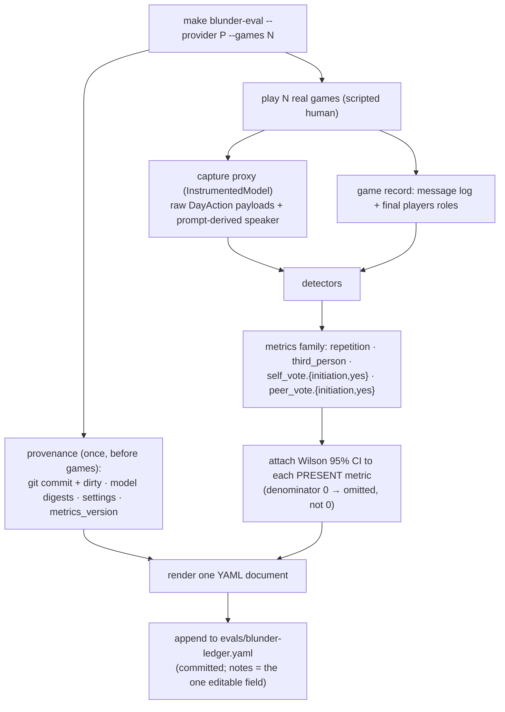

# Tutorial 011: AI Blunder Tracking — turning AI quality into a tracked, trustworthy number

- **Spec:** [`context/spec/011-ai-blunder-tracking/`](../../spec/011-ai-blunder-tracking/)
- **Status:** Draft
- **Author:** Alexey Tigarev
- **Date:** 2026-06-13
- **Prerequisites:** [`009-ai-collusion-awareness`](../009-ai-collusion-awareness/tutorial.md) (the make-gated real-model eval posture, the name-masked repetition measure, paired seeds, and the "rigor reverses the noisy pilot" lesson this increment re-lives) and [`010-local-ollama-provider`](../010-local-ollama-provider/tutorial.md) (the structured-output capture proxy this increment extends, and the provider seam it installs through).

---

## Overview

This increment builds a **measurement system for non-deterministic AI behavior**: a make-gated harness that plays a batch of real games, counts a family of self-consistency *blunders* (an AI voting to execute itself; a mafioso voting to execute a teammate; an AI talking about itself in the third person; repetition), and **appends one record per run to a YAML ledger committed inside the repository.** AI quality stops being an anecdote you noticed once during play and becomes a diffable, history-backed property of the project — *baby MLOps*: measure → commit the record → change something → measure → compare by reading two records.

The interesting design problem isn't *detecting* the blunders — most are exact reads of the game's own message log. It's everything around the number that makes it **trustworthy**: *How do you measure a blunder the game silently rejects before it reaches state? How do you tie a number to the exact code and model that produced it? How do you stop a confidently-wrong rate from a tiny sample?* The "central technology" here is **measurement discipline applied to a stochastic system** — provenance, honest uncertainty, and instrumentation that sees underneath the system's own safety nets.

The tutorial teaches core-outward: first *why a persisted ledger at all*, then *what makes a record trustworthy* (provenance), then the deepest mechanic (*capturing what the game throws away*), then *honest counting and honest uncertainty*, and finally the small human touch. The payoff lands in the statistics section, where the same lesson from spec 009 repeats with real force.

---

## Concepts already covered (referenced, not re-taught)

- **`real-llm-eval-make-gated`** — a harness that deliberately reaches a real model, lives behind `make`, and stays out of the mocked `pytest` suite. `make blunder-eval` is the project's fourth such tool. (See [tutorial 009](../009-ai-collusion-awareness/tutorial.md#2-the-vehicle-a-real-model-eval-that-opts-out-of-the-mocked-suite).)
- **`name-masked-similarity`** — the spec-009 near-dup measure (mask player names, then cluster lines at ratio ≥0.85). 011 *imports* it verbatim as the `repetition` metric — measure reused, not reinvented. (See [tutorial 009](../009-ai-collusion-awareness/tutorial.md#4-the-metric-near-duplicate-speech-after-name-masking).)
- **`in-process-factor-injection`** — applying eval config by assigning module seams (`llm._active_provider`/`_large`/`_small`) rather than editing source. 011 installs its capture proxy through exactly those seams. (See [tutorial 009](../009-ai-collusion-awareness/tutorial.md#6-running-the-conditions-without-touching-source).)
- **`instrument-under-the-fallbacks`** — spec 010's counting proxy that measured raw structured-output *reliability* underneath the game's retry/fallback. 011 generalizes that very proxy from *counting* to *capturing*. (See [tutorial 010](../010-local-ollama-provider/tutorial.md#4-prove-the-transport-the-structured-output-gate).)
- **`rigor-reverses-noisy-pilot`** — 009's finding that a rigorous, well-powered measurement can *overturn* a cheap pilot's verdict. 011 re-lives it literally (n=3 → n=20). (See [tutorial 009](../009-ai-collusion-awareness/tutorial.md#7-the-twist-rigor-reverses-the-pilot).)
- **`llm-provider-strategy-two-tier`** — the provider abstraction the harness runs against either backend unchanged. (See [tutorial 010](../010-local-ollama-provider/tutorial.md#1-the-seam-one-factory-two-providers).)

---

## What's new this increment

- [**Repo-persisted metric ledger (baby MLOps)**](#1-from-anecdote-to-tracked-property-the-ledger) — append-only YAML records, committed, that turn quality into history.
- [**Run provenance for attributability**](#2-a-number-you-can-trust-provenance) — commit + dirty flag + model digests + settings tie each record to exact code/model state.
- [**Measuring the attempt the safety net rejects**](#3-seeing-what-the-game-throws-away) — capture the raw payload to count a blunder the game discards.
- [**Prompt-derived actor attribution**](#3-seeing-what-the-game-throws-away) — read the actor from the invoke prompt, not a re-entrant `get_state()`.
- [**Template-derived parsing as a reword tripwire**](#4-honest-counting-templates-and-absent-zero) — regexes built from the game's own format strings.
- [**Absent ≠ zero**](#4-honest-counting-templates-and-absent-zero) — omit a no-opportunity metric instead of reporting a misleading 0.
- [**Wilson confidence interval per metric**](#5-honest-uncertainty-and-the-payoff) — closed-form reliability bands; and the n=3→n=20 reversal.
- [**The one human-mutable field in an append-only log**](#6-the-human-layer-a-notes-field) — a free-text `notes` carve-out.

---

## Diagram

One run, from games to a committed record:



---

## Walkthrough

### 1. From anecdote to tracked property: the ledger

**Pose.** You watch a game and notice the AI repeating itself, or voting to execute itself. You could open a terminal, run a one-off script, read a number, and… lose it. Every prior quality measurement in this project printed to stdout and evaporated. How do you make "how good is the AI right now?" a question you can answer *historically* — before vs after a prompt change, local vs cloud — without re-running anything?

**Present.** Make the measurement **write to a file you commit.** The increment introduces a **repo-persisted metric ledger** — `evals/blunder-ledger.yaml`, an *append-only* stream where each run is one `---`-separated YAML document. It's deliberately **write-only**: the harness hand-renders YAML and never reads it back, so there's no parser dependency for a format whose only consumer (for now) is a human with a text editor.

```python
# src/graphia/tools/blunder_eval.py — append_record
def append_record(result: EvalResult, run_date: str, ledger_path: Path = LEDGER_PATH) -> Path:
    document = render_record(result, run_date)          # one YAML doc, fixed key order
    ledger_path.parent.mkdir(parents=True, exist_ok=True)
    with ledger_path.open("a", encoding="utf-8") as fh:  # append-only
        fh.write("---\n")
        fh.write(document)
    return ledger_path
```

**Apply.** This is the spine of *baby MLOps*: the loop is **measure → commit the record → change something → measure → compare by reading two records**. The ledger is the deliverable — no dashboard, no comparison command (those would force the parser dependency and are deferred). Everything else in this increment exists to make each line in that file *worth* committing. The harness itself is the fourth in the project's family of **make-gated real-model evals** (referenced from tutorial 009): it reaches a real model, so it lives behind `make blunder-eval`, never inside the mocked suite.

### 2. A number you can trust: provenance

**Pose.** Six months from now you read `repetition: 0.39` in the ledger. From *what code*? *Which model weights*? If you can't answer that, the number is folklore. A committed history of untraceable numbers is barely better than no history. So: what has to travel *with* each rate to make it evidence?

**Present.** A **provenance block**, collected once before any game runs. It pins three things a stochastic measurement can drift on: the **code** (git commit + branch + a clean/dirty flag), the **model** (for a local model, its content **digest** and the server version; for a cloud model, the full id plus an honest "provider-side updates are invisible" caveat), and the **effective settings** actually resolved (games, seed, model names). The collectors are pure and degrade gracefully — an unavailable source records `null`, never crashes the run.

```python
# src/graphia/tools/blunder_eval.py — collect_code_provenance
def collect_code_provenance(repo_root: Path) -> dict[str, object]:
    commit = _git_output(repo_root, "rev-parse", "HEAD")
    branch = _git_output(repo_root, "rev-parse", "--abbrev-ref", "HEAD")
    dirty = bool(_git_output(repo_root, "status", "--porcelain"))   # uncommitted changes?
    return {"commit": commit, "branch": branch, "dirty": dirty}
```

**Apply.** The **dirty flag** is the sharp part. If the working tree has uncommitted changes, the record is *not* reproducible from any commit — so `run_eval` prints a plain stderr warning *up front* and stamps `code.dirty: true`. The run still proceeds (iterating before you commit is normal), but the record can never masquerade as a clean baseline:

```python
# src/graphia/tools/blunder_eval.py — warn_if_dirty
def warn_if_dirty(code: dict[str, object]) -> None:
    if code.get("dirty"):
        print("WARNING: working copy has uncommitted changes — results will not be "
              "attributable to a recorded version (the record is marked code.dirty: true).",
              file=sys.stderr)
```

Two more provenance details earn their place. A **content digest** beats a model *name*: `qwen3-coder:30b` is a moving tag a re-pull can silently change, but its digest is the weights' fingerprint. And a module-level `METRICS_VERSION` stamps every record so that the day a detection *rule* changes, rates measured under the old and new rules are *visibly* incomparable in the ledger — no silent apples-to-oranges. (The Wilson CI added later is *derived*, not a rule, so it pointedly does **not** bump the version.)

### 3. Seeing what the game throws away

**Pose.** Most blunders are easy to count from the finished game's message log. But one isn't: an AI that tries to start a vote **against itself**. The game's turn-handler validates that action and *rejects* it before it ever reaches game state — so the post-game record shows nothing. How do you count an event the system is designed to erase?

**Present.** Intercept it at the only place it's still visible: the **raw LLM output, before the validator runs.** Spec 010 built a proxy (`InstrumentedModel`) that wrapped the tier client to *count* structured-output reliability underneath the game's fallbacks. This increment generalizes that proxy from *counting* to **capturing** — it records each raw structured-output payload as a `CaptureRecord`, turning an *absorbed rejected attempt* into a measurable behavioral signal.

```python
# src/graphia/tools/instrument.py — InstrumentedModel
class InstrumentedModel:
    """Proxy over a tier client: counts and/or CAPTURES raw structured outputs,
    underneath the game's own validation/fallback."""
    def with_structured_output(self, schema, **kwargs):
        return _InstrumentedStructured(
            self._inner.with_structured_output(schema, **kwargs),
            schema, self._stats, self._captures, self._speaker_resolver)
```

The detector then counts, from the raw captures, the `DayAction(kind="vote")` whose target is the speaker's own id — *even though `_accept` discarded it in the live game.* That's the `self_vote.initiation` metric: a number no amount of post-game inspection could produce.

**Apply — the attribution trap.** Counting "target == the *speaker's* id" requires knowing *who was speaking* for each captured payload. The tempting move — call `graph.get_state()` from inside the invoke to read the current speaker — is a trap this project already hit once (a stale mid-stream snapshot caused a real bug in `tests/test_slice7_vote.py`). The robust answer is **prompt-derived attribution**: the day-speech prompt the call was *handed* already names the speaker, so resolve it from there and never touch live graph state.

```python
# src/graphia/tools/blunder_eval.py — make_day_speaker_resolver
def make_day_speaker_resolver(players):
    name_to_id = {p.name: p.id for p in players.values()}
    def resolve(messages):
        text = _joined_human_text(messages)          # the prompt THIS invoke received
        m = _DAY_SPEAKER_RE.search(text)             # "You are {speaker}." — derived from the template
        return name_to_id.get(m.group("speaker")) if m else None
    return resolve
```

Because the speaker is read from the exact prompt that produced the payload, attribution *cannot* desync — there is no shared mutable state to go stale, and no re-entrancy into the running graph. This is the deepest idea in the increment: **to measure what a system rejects, instrument the seam where the action is still raw, and attribute it from data that travels with the action — not from the system's mutable state.**

### 4. Honest counting: templates and absent ≠ zero

**Pose.** The other vote metrics *are* read from the game's message log — who initiated a vote against whom, who balloted yes. That means parsing the moderator's announcement lines. Parsing your own app's output is a classic silent-rot hazard: reword a template, and the parser quietly counts zero forever. How do you make a template change *fail loudly* instead?

**Present.** **Template-derived parsing.** Don't hardcode the announcement format in the detector — *import the game's own format string* and build the regex from it, escaping the literal spans around the `{placeholders}`. Now a reword of the template in `prompts.py` changes the literal spans, the regex no longer matches the fixtures built from that same constant, and the test breaks — exactly where you want the alarm.

```python
# src/graphia/tools/blunder_eval.py — _template_to_regex
def _template_to_regex(template: str, fields: dict[str, str]) -> re.Pattern:
    # split VOTE_INITIATE_ANNOUNCE_TEMPLATE on its {field}s, re.escape the literal
    # spans, substitute named capture groups, anchor ^...$
    ...
```

**Apply — absent ≠ zero.** A subtler honesty problem: in a given batch, *no mafioso ever got the chance to vote on a teammate*. Is `peer_vote.yes` then `0.0`? No — `0.0` would claim "we tested for bussing and saw none," when the truth is "the situation never arose." So a metric whose **denominator is 0 is omitted from the record entirely**, not reported as a rate:

```python
# src/graphia/tools/blunder_eval.py — _facets
def _facets(count: int, denominator: int) -> dict:
    if denominator == 0:
        return {"rate": None, "count": 0, "denominator": 0}   # → run_eval omits it
    return {"rate": count / denominator, "count": count, "denominator": denominator}
```

`run_eval` drops the absent ones, so the ledger only ever shows metrics the run *actually exercised*. "Never tested" and "tested, never happened" stay distinguishable — which matters enormously when you later compare two providers and one simply never surfaced a vote.

### 5. Honest uncertainty — and the payoff

**Pose.** A rate is two numbers pretending to be one. `repetition: 0.45` from 1126 lines and `self_vote.yes: 0.50` from 2 opportunities render identically, but one is bedrock and the other is a coin flip. The denominator is in the record — but a reader has to *do arithmetic in their head* to feel the difference. How do you make reliability visible at a glance?

**Present.** Attach a **Wilson 95% confidence interval** to every present metric. Wilson is the deliberate choice over the bootstrap that spec 009 used for its A/B ranking: it's **closed-form** (no resampling) and **well-behaved at any n** — including the tiny vote denominators where a normal approximation falls apart. It's attached *post-scoring*, to present metrics only, and is derived/supplementary (so it doesn't bump `METRICS_VERSION`).

```python
# src/graphia/tools/blunder_eval.py — wilson_ci
def wilson_ci(count: int, denominator: int, z: float = _CI_Z) -> tuple[float, float]:
    # Wilson score interval; treats each line/ballot as an INDEPENDENT Bernoulli
    # trial — for `repetition` (near-dup correlated within a game) this UNDERSTATES
    # uncertainty: an accepted, documented closed-form-any-n tradeoff.
    ...
```

The caveat in that docstring is the honest part: Wilson assumes independent trials, but repetition's near-dup is correlated *within* a game, so its band is a touch optimistic. The increment writes that down rather than hiding it — a measurement system earns trust by naming its own weaknesses.

**Apply — the reversal.** Here the increment re-lives spec 009's **"rigor reverses the noisy pilot"** lesson, literally. A first self-run used 3 games. Its repetition rates: ollama 0.45, Nova 0.45 — *identical* — inviting the tidy conclusion "repetition is structural, not model-dependent; swapping the brain won't help." Re-run at **20 games with the Wilson bands attached**, and the picture inverts:

| metric | ollama qwen3-coder (n=843 lines) | bedrock Nova (n=1126 lines) |
| --- | --- | --- |
| `repetition` | 0.389 **[0.357, 0.422]** | 0.554 **[0.525, 0.583]** |

The intervals **don't overlap.** Repetition is firmly *provider-dependent*; the n=3 match was noise, and the "structural" conclusion was confidently wrong. The same 20-game run also exposed severe vote-incoherence the tiny sample had barely touched (qwen voting to execute *itself* 63% of the time, mafiosi executing teammates 86%). Sample size plus honest intervals didn't just sharpen the answer — they *reversed* it. That's the entire argument for building this much measurement discipline around a few rates: without it, you ship folklore.

### 6. The human layer: a notes field

**Pose.** The machine records *what* happened. But *why did you run this?* — "after the Moderator-label fix", "qwen felt off today" — is context only a human has, and it's exactly what you want beside the numbers months later. Yet the ledger is supposed to be append-only and immutable. Where does mutable human context fit?

**Present.** Carve out **one** explicitly human-mutable field. A free-text `notes` is set at run time via `--note "…"` *or* hand-edited into the YAML afterward (multi-line renders as a block scalar). It's documented as the single exception to "never rewrite a record" — the machine-measured fields stay frozen; `notes` is yours to amend.

**Apply.** It's a small thing that closes the loop on *baby MLOps*: a record carries both the measurement and the intent behind it, so a future you comparing two ledger entries reads not just "0.55 → 0.39" but *why you expected it to move*. Append-only for the evidence; one mutable margin for the human.

---

## Try it

```
make blunder-eval ARGS="--provider ollama --games 20 --note 'baseline before prompt change Y'"
make blunder-eval ARGS="--provider bedrock --games 20 --note 'cloud comparison'"
```

Then open `evals/blunder-ledger.yaml` and read the two newest records side by side: same metrics and denominators, differing only in provider/model — and now with Wilson bands, you can *see* which differences are real (non-overlapping intervals) and which are noise. Run with a dirty tree and watch the stderr warning fire and `code.dirty: true` land in the record. Drop `--games` to 2 and watch the vote-metric bands blow out to near-`[0, 1]` — the system telling you, honestly, that it doesn't know yet.

---

## Where to go next

- **Kin tutorials:** [009 — AI Collusion Awareness](../009-ai-collusion-awareness/tutorial.md) (the eval posture, the repetition measure, and the original "rigor reverses the pilot") and [010 — Local Ollama Provider](../010-local-ollama-provider/tutorial.md) (the capture proxy this increment extends, and the provider seam it runs against).
- **The baseline this establishes** is a *starting line*, not a fix: the measured blunders (provider-dependent repetition, qwen's vote-incoherence) each become a future evidence-driven change, measured *against* this ledger — which is the whole point of having built it.
- **Roadmap:** with the Day-phase integrity and quality-measurement increments done, the next roadmap item is **Phase 5 — Setup Flexibility** (configurable role counts) and **Richer Night Resolution** — start its functional spec with `/awos:spec`.
