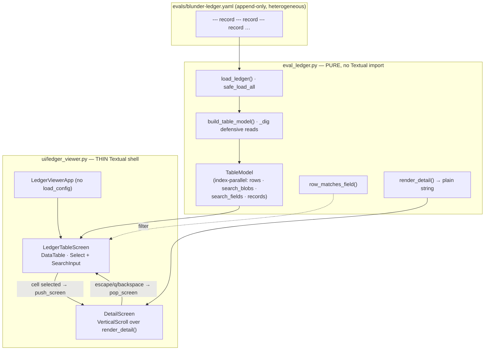

# Tutorial 012: Eval Ledger Viewer

- **Spec:** [`context/spec/012-eval-ledger-viewer/`](../../spec/012-eval-ledger-viewer/)
- **Status:** Reviewed
- **Author:** Alexey Tigarev
- **Date:** 2026-06-14
- **Prerequisites:** `001-playable-skeleton` (the Textual TUI and flat-Pydantic conventions), `011-ai-blunder-tracking` (the quality ledger this viewer reads)

---

## Overview

Spec 011 gave the project a **quality ledger**: an append-only YAML file, committed inside the repo, that grows one record every time an eval run measures the AI's behaviour. That was the *write* half of "baby MLOps". The catch 011 named out loud was that it shipped *no reader* — the only way to consult the history was to scroll a tall, indented file and hold numbers in your head. This increment is the reader.

It is a small **Textual** terminal app — the same TUI framework the game is built on — built around Textual's `DataTable` widget: one row per recorded run, columns for the run's facts and one per watched behaviour, with scrolling, a search that narrows the list, and a drill-down into any run's full record. But the *interesting* design problem isn't the widgets. It's this: **how do you build a legible UI over a file whose records don't all have the same shape, while guaranteeing you never accidentally write to it?** The ledger already mixes early "pre-provenance" records (no git info, no confidence intervals, the game-count under a different key) with later full records — and a viewer that `KeyError`s on the first old record, or that can mutate the very history it's meant to preserve, is worse than no viewer.

The answer Graphia reaches for is a **pure core under a thin shell**: a Textual-free data layer that does *all* the parsing, flattening, formatting and searching and emits nothing but plain strings, with the Textual app a thin presentation layer on top. That split is the root of everything below, so we teach it first and let the framework details (the `DataTable`, the screen stack, the search box) hang off it — deepest idea first, UI decorations last.

---

## Concepts already covered (referenced, not re-taught)

- **Dual-pane / async Textual app** (`async-to-thread-bridges-sync-stream`, `dual-richlog-panes-private-vs-public`) — the game's TUI established Textual as the project's console framework and the constructor-injection (DI) seam for stores. (See [tutorial 001](../001-playable-skeleton/tutorial.md#decorating-with-a-tui).) This viewer is a *second, separate* Textual app reusing the same conventions.
- **Flat structured-output schemas** (`structured-output-flat-pydantic`) — the project's "keep data shapes flat and primitive" habit. (See [tutorial 001](../001-playable-skeleton/tutorial.md).) The ledger's records are flat nested maps for the same reason.
- **Repo-persisted metric ledger** (`repo-persisted-metric-ledger`), **run provenance** (`run-provenance-for-attributability`), **absent ≠ zero** (`absent-not-zero`), **the human-mutable notes field** (`human-mutable-notes-field`), **Wilson CI per metric** (`wilson-ci-per-metric`) — everything spec 011 wrote into each record. (See [tutorial 011](../011-ai-blunder-tracking/tutorial.md).) This increment *renders* those facts; it adds none of its own. In particular 011's **absent ≠ zero** rule reappears here as a rendering rule: a never-exercised metric is a blank cell, a genuine zero is `0.00 … 0/n`.

---

## What's new this increment

- [**Pure data layer under a thin Textual shell**](#1-the-shape-of-the-problem-a-pure-core-under-a-thin-shell) — all logic in a Textual-free module emitting plain strings; the TUI is a thin presentation on top.
- [**A second standalone Textual app**](#1-the-shape-of-the-problem-a-pure-core-under-a-thin-shell) — a separate `App` that needs only a file path; it never calls `load_config`.
- [**Read-only-by-construction multi-document parse**](#2-reading-an-append-only-file-without-trusting-its-shape) — `yaml.safe_load_all`, so the viewer structurally can't mutate or execute anything.
- [**Defensive dotted-get absorbs record heterogeneity**](#2-reading-an-append-only-file-without-trusting-its-shape) — one `_dig` helper makes every field read total, so mixed record shapes never `KeyError`.
- [**Index-parallel table model**](#3-one-model-the-ui-can-trust-index-parallel-lists--one-column-order) — parallel lists that resolve a filtered, selected row back to its raw record.
- [**Column order as a single source of truth**](#3-one-model-the-ui-can-trust-index-parallel-lists--one-column-order) — one `METRIC_ORDER` tuple drives columns, headers, cells, and the detail view.
- [**Cell-cursor pan-into-view over a big table**](#4-rendering-and-navigating-a-table-bigger-than-the-screen) — move the highlight, the cell scrolls fully into view.
- [**Push/pop screen drill-down with cursor restore**](#5-drilling-in-and-coming-back-where-you-left-off) — open a full record, return to the exact cell.
- [**Selector-scoped search without a query syntax**](#6-searching-without-a-query-language) — a field selector picks the haystack; no `field:value` mini-language.
- [**Table-first focus model + boundary-jump nav**](#7-for-completeness-the-focus-model-and-boundary-jump-navigation) — the table navigates the moment it opens; arrows cross widget boundaries.

---

## Diagram

The two layers, and the screen stack inside the thin shell:



---

## Walkthrough

### 1. The shape of the problem: a pure core under a thin shell

**How do you build a terminal UI over a growing data file without trapping all the interesting logic — parsing, formatting, searching — behind a UI you can only test by driving a fake terminal?**

Textual answers the *presentation* question (it gives you `App`, `Screen`, `DataTable`, an event loop). It does not answer the *testability* question — if your parsing and formatting live inside widget callbacks, the only way to assert "an old record with no confidence interval renders a blank cell" is to boot a headless app and read pixels. So Graphia draws a hard line. Everything that is logic-not-pixels lives in a **pure, Textual-free module**, `graphia.eval_ledger`, which imports `yaml` and the standard library and *nothing from Textual*. It emits plain `str` cells and a plain dataclass. The Textual app, `graphia.ui.ledger_viewer`, is the thin layer that turns those strings into a `DataTable`.

The seam between them is one dataclass returned by one function:

```python
# src/graphia/eval_ledger.py — build_table_model
def build_table_model(records: list[RawRecord]) -> TableModel:
    columns = [*_FIXED_COLUMNS, *(label for _, label in METRIC_ORDER)]
    rows, search_blobs, search_fields = [], [], []
    for record in records:
        rows.append(_row_cells(record))
        search_blobs.append(_search_blob(record))
        search_fields.append(_search_fields(record))
    return TableModel(columns=columns, rows=rows, search_blobs=search_blobs,
                      search_fields=search_fields, records=list(records))
```

This is the increment's spine — **a pure data layer under a thin Textual shell**. Once you have it, every later concept is either "something the pure layer computes" or "a Textual feature the shell wires to it", and the test suite splits the same way: `tests/test_ledger_model.py` exercises the pure layer with no Textual at all, while `tests/test_ledger_viewer.py` drives the app through Textual's `Pilot`.

The split has a second consequence worth naming on its own: because the viewer needs *only a ledger file*, it is **a second standalone Textual app** that — unlike the game's `GraphiaApp` — never calls `graphia.config.load_config()`. No AWS credentials, no checkpoint directory, no model env. The `LedgerViewerApp` constructor takes the ledger `Path` (defaulting to `blunder_eval.LEDGER_PATH`, the single source of truth for where the harness writes), which is exactly the constructor-injection seam the game app uses for its stores — so a test can point it at a `tmp_path` ledger. It launches from its own `python -m graphia.ui.ledger_viewer` entry behind `make view-ledger`.

### 2. Reading an append-only file without trusting its shape

**The ledger has been appended to across many versions of the code. Old records lack fields newer ones have. How do you read all of them without a `KeyError` from a missing field crashing the UI — and how do you guarantee that opening a file to *read* it can never *write* to it?**

Two distinct worries, two deliberate choices.

For read-only safety, the parse uses `yaml.safe_load_all` — never `yaml.load`. `safe_load_all` walks the `---`-separated stream and builds **plain data only** (dicts, lists, scalars); it constructs no arbitrary Python objects and runs no code. The viewer is therefore **read-only by construction**: there is no code path through which browsing the ledger could alter or execute it. (A test backs this with a byte-identical assertion after a full filter + drill-down + back session.) This is also the moment the project pays a debt it knowingly took on: spec 011 hand-rendered each record as text precisely so it wouldn't need a YAML *parser* yet, noting that "the reader is the increment that takes on the YAML dependency". This is that increment.

```python
# src/graphia/eval_ledger.py — load_ledger
text = path.read_text(encoding="utf-8")        # FileNotFoundError → []
if not text.strip():
    return []                                  # empty ledger is a normal state
try:
    documents = list(yaml.safe_load_all(text))
except yaml.YAMLError as exc:
    raise LedgerParseError(...) from exc       # friendly message, not a traceback
return [doc for doc in documents if isinstance(doc, dict)]
```

For heterogeneity, the headline risk of the whole spec, the answer is one tiny function used *everywhere* a field is read: **a defensive dotted-get**, `_dig`. It walks a dotted path and returns a default the instant any level is absent or isn't a mapping — so a pre-provenance record with no `settings` block, or a record whose `metrics` omits a vote family, resolves to a blank instead of raising.

```python
# src/graphia/eval_ledger.py — _dig
current = record
for part in dotted_key.split("."):
    if not isinstance(current, dict):
        return default
    nxt = current.get(part, _MISSING)
    if nxt is _MISSING:
        return default
    current = nxt
return current
```

Because *every* read goes through `_dig`, heterogeneity is absorbed in exactly one place. Where the same fact moved keys between versions, a small resolver expresses the fallback once — e.g. `_resolved_games` returns `settings.games ?? run.games`, so a cell, the search blob, and the scoped-search field all agree on the count for an old record. (One subtlety the code calls out: the vote metrics are stored under a **flat dotted string key** — `metrics["self_vote.initiation"]` is a single literal key the harness emits verbatim — so `_metric_facets` tries the flat key first and falls back to a genuinely nested path. The original spec assumed nested maps; the real ledger corrected it during Slice 1.)

### 3. One model the UI can trust: index-parallel lists + one column order

**Once the records are parsed, two things have to stay true as the user filters and selects: the UI must be able to map a highlighted row — possibly inside a filtered subset — back to its original raw record, and the columns, headers, cells, and detail view must never disagree about what metrics exist or in what order.**

The first is solved by the `TableModel` being **index-parallel**: `rows[i]`, `search_blobs[i]`, `search_fields[i]` and `records[i]` all describe the same run *i*. The UI keeps a `_visible_indices` list (which model index each displayed row maps to) that it rebuilds on every filter, so selecting visible row 3 of a filtered set resolves to `records[_visible_indices[3]]` — the correct raw record, even though row 3 on screen might be model record 47.

The second is solved by **one column order as the single source of truth**. `METRIC_ORDER` is a tuple of `(dotted_key, header_label)` pairs, in the harness's detector-family order. The column headers derive from it, each row's metric cells derive from it, and the detail view's metric lines derive from it — so adding a future behaviour metric is *one appended tuple*, with column count, headers, cells and detail all following automatically.

```python
# src/graphia/eval_ledger.py — METRIC_ORDER
METRIC_ORDER = (
    ("repetition", "repetition"),
    ("third_person_self_talk", "self-talk"),
    ("self_vote.initiation", "self-vote init"),
    ("self_vote.yes", "self-vote yes"),
    ("peer_vote.initiation", "peer-vote init"),
    ("peer_vote.yes", "peer-vote yes"),
)
```

This is where 011's **absent ≠ zero** rule becomes a *rendering* rule. `_metric_cell` returns the empty string when a metric's facet map is absent for a run, but renders a genuine zero as `0.00 … 0/108` — so a behaviour the game never gave the AI a chance to commit looks visibly different from one measured at zero. The cell format itself, `rate [ci_low–ci_high] count/denominator`, drops the bracketed band for older records that legitimately lack a Wilson CI. The pure layer emits all of this as plain strings; turning the numbers into right-justified columns is the shell's job (next section).

### 4. Rendering and navigating a table bigger than the screen

**A history of runs is taller than the terminal, and seven-plus columns are wider than it. How do you let the keyboard reach every cell without the fiddly "nudge the viewport one character at a time" feeling?**

Textual's `DataTable` answers this with a **cell cursor**. The screen composes the table with `cursor_type="cell"`, and the widget auto-scrolls the highlighted cell *fully into view* on every move — both axes. So panning a wide table is "move the highlight, the cell comes to you", and the header band stays pinned on vertical scroll for free.

```python
# src/graphia/ui/ledger_viewer.py — LedgerTableScreen.compose
yield DataTable(id="ledger-table", cursor_type="cell")
```

`fixed_columns` is deliberately left at `0` — the whole grid scrolls together, with no frozen identity column. That was the functional choice ("everything scrolls together"); the code notes `fixed_columns=1` as the one-line change that would pin the date column if a later increment wants it.

The only presentation logic in the shell is right-justifying the numeric metric columns so the rates line up under their headers — and even that uses the pure layer's shape to find the split point:

```python
# src/graphia/ui/ledger_viewer.py — LedgerTableScreen._render_row
fixed = len(self._model.columns) - len(METRIC_ORDER)
return [cell if i < fixed else Text(cell, justify="right")
        for i, cell in enumerate(cells)]
```

The fixed columns (the `⚠` dirty marker, Date, Provider, models, Games, Notes) stay plain strings; only the trailing `METRIC_ORDER` columns get wrapped in a Rich `Text`. Rich stays a UI concern; the pure layer never imported it. (The `⚠` dirty marker is its own column rather than row styling — a plain marker cell survives the `clear()`/`add_row` filter rebuild with no extra bookkeeping, is greppable by the search blob, and is assertable in tests, none of which a whole-row style would be.)

### 5. Drilling in and coming back where you left off

**A row can't show everything a record holds — full provenance, exact counts, the complete note. How do you open the whole record and then return the user to the exact spot they were browsing?**

Textual models this as a **screen stack**: `push_screen` lays a new screen over the current one, `pop_screen` removes it and reveals the one beneath. Graphia uses a plain `Screen` (not a modal overlay) for the drill-down, so opening a record and returning is a natural page transition rather than a popup. Selecting a cell stashes its coordinate, resolves the raw record through `_visible_indices`, and pushes a `DetailScreen`:

```python
# src/graphia/ui/ledger_viewer.py — LedgerTableScreen.on_data_table_cell_selected
self._stashed_cursor = event.coordinate
record = self._model.records[self._visible_indices[row]]
self.app.push_screen(DetailScreen(record))
```

The round-trip is closed by `on_screen_resume`, which Textual fires when the `DetailScreen` pops and the table screen becomes active again. It calls `move_cursor` back to the stashed cell, scrolling it into view — so you land on the exact cell you drilled into, **push/pop drill-down with cursor restore**.

The `DetailScreen` itself carries no formatting: it wraps `render_detail(record)` — a long, sectioned plain string the *pure layer* produces (`run → code → provider → settings → quality → metrics → notes`) — in a `VerticalScroll`. Same plain-string contract as the table cells. It also wears a `Header` (the viewer's name plus a "run detail · Esc / Backspace to go back" subtitle) and a `Footer` with the back keys, so a full-window record stays recognisably the same app with a visible way out rather than reading like a separate program.

### 6. Searching without a query language

**You want to filter to "the ollama runs", or "the runs whose note mentions temperature", or "commit abc123". How do you offer scoped search without inventing a `field:value` mini-language the user has to learn (and that matches nothing until they type the colon)?**

Graphia's answer: a **field selector beside the box**, not syntax in the box. A `Select` (defaulting to `All`) chooses *which* field the typed value filters on; the value box only ever holds the value. The keep-test is the pure layer's `row_matches_field`, so the UI stays a thin caller:

```python
# src/graphia/eval_ledger.py — row_matches_field
haystack = blob if field == SEARCH_SCOPE_ALL else fields.get(field, "")
return all(term in haystack for term in value.lower().split())
```

`All` searches the whole free-text `search_blob` (date, provider, both model ids, commit, branch, a dirty/clean keyword, and the full note); a named field scopes to just that field's text. The value is lowercased and split into terms that are **ANDed**, so an empty value keeps every row and multiple words all have to match. Crucially, **because there is no colon parsing**, a model id like `qwen3-coder:30b` is matched literally — the selector does the scoping a prefix syntax otherwise would. Both the `Input.Changed` and `Select.Changed` events re-run one shared `_run_filter`, which rebuilds the visible rows, updates a "Showing X of N" match count, and — when a non-empty query survives zero rows — hides the table and shows a distinct "No runs match '…'" message echoing the query (kept separate from the empty-ledger message).

There's one subtlety the Notes column exists to solve: notes are part of the search blob, so a run can match on note text alone. To stop that looking like a phantom hit, the model surfaces a one-line **Notes preview** as a fixed column (placed *before* the metric block, so it stays in the initial viewport and doesn't disturb the right-justify split). The full, verbatim note is the drill-down's job.

### 7. For completeness: the focus model and boundary-jump navigation

Two peripheral-but-real Textual details finish the picture.

A docked `Input` will, by default, grab focus on mount — which would mean every arrow key is swallowed as search text and the table is unnavigable. So the **table-first focus model**: `on_mount` calls `table.focus()` after populating, a `/` binding moves focus to the search box on demand, and an `on_key` handler intercepts `escape` *only while a search widget is focused* to return focus to the table (stopping the event so the app-level `escape`→quit doesn't fire). The result: the table navigates the instant the viewer opens, search is opt-in, and `escape` means "back out of search" in search but "quit" on the table.

And because the selector and the value box are two separate widgets, arrow keys need to cross between them — **boundary-jump navigation**. A plain `Input` consumes `left` for its own caret, so the screen never sees it. A small `SearchInput(Input)` subclass overrides the left-cursor action and, *only when the caret is at position 0*, posts a message the screen handles to focus the selector; anywhere else inside the text it's a normal caret move. The reverse (`right` on the collapsed selector → focus the input) is handled in the screen's `on_key`, guarded so the dropdown's own arrows aren't stolen while it's open.

---

## Try it

```
make view-ledger
```

You'll see the committed `evals/blunder-ledger.yaml` as a table — one row per recorded run, the `⚠` marker on any dirty-tree run, the six behaviour columns on the right. Things to try:

- **Navigate**: arrow keys move the cell highlight; a wide table pans the cell into view as you go.
- **Drill in**: press Enter on any row → the full record opens; `Esc`/`Backspace`/`q` returns you to the same cell.
- **Search**: press `/`, type `ollama` → the list narrows and "Showing X of N" updates; clear it to restore. Set the selector to `provider` and type `ollama` to scope the match to just the provider field.
- **Empty / alternate ledger**: `make view-ledger ARGS="--path /tmp/none.yaml"` shows "No runs recorded yet." rather than a crash.

The offline tests mirror all of this: `tests/test_ledger_model.py` (pure layer — heterogeneity, cell format, search) and `tests/test_ledger_viewer.py` (Pilot — focus, filter, drill-down + cursor restore, read-only byte-identity).

---

## Where to go next

- Next tutorial: [tutorial 014 — Configurable Role Counts](../014-configurable-role-counts/tutorial.md), which makes the table lineup a *recorded, viewable* eval variable — its new `Lineup` column rides on exactly the defensive-dotted-get and column-model machinery taught here.
- Related: [tutorial 011 — AI Blunder Tracking](../011-ai-blunder-tracking/tutorial.md) for the ledger and provenance this viewer renders, and [tutorial 013 — AI Behavioral Integrity](../013-ai-behavioral-integrity/tutorial.md) for the outcome/vote-activity metrics that later joined the records.
