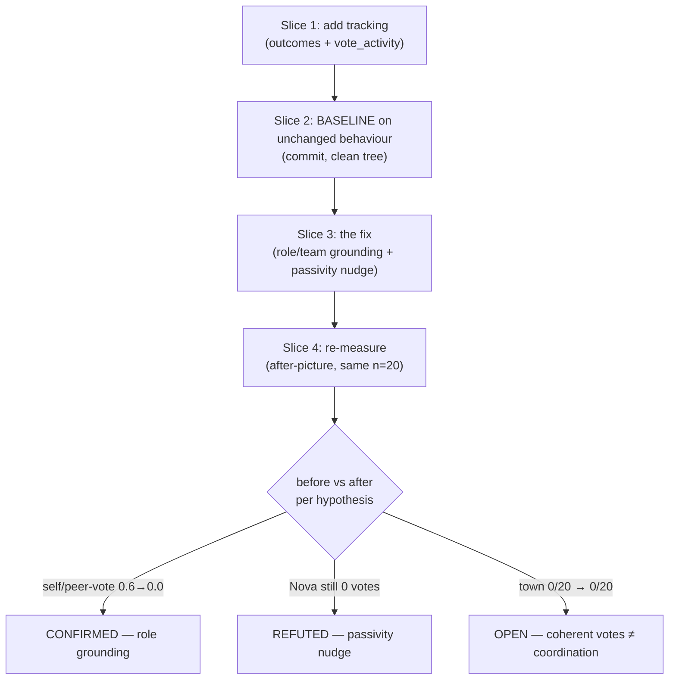

# Tutorial 013: AI Behavioral Integrity — fixing an agent's behaviour as a tested hypothesis

- **Spec:** [`context/spec/013-ai-behavioral-integrity/`](../../spec/013-ai-behavioral-integrity/)
- **Status:** Draft — **under test** (this is the rare tutorial about an *in-flight* increment: one hypothesis confirmed, one refuted, one open. That's the lesson, not a caveat.)
- **Author:** Alexey Tigarev
- **Date:** 2026-06-16
- **Prerequisites:** [`009-ai-collusion-awareness`](../009-ai-collusion-awareness/tutorial.md) (the make-gated real-model eval posture and "rigor reverses the pilot") and [`011-ai-blunder-tracking`](../011-ai-blunder-tracking/tutorial.md) (the quality ledger, Wilson CIs, the absent-≠-zero rule, and the prompt-derived speaker resolver — all of which this increment builds on or inverts).

---

## Overview

This increment does something most "fix the AI" work skips: it **treats a behaviour fix as a hypothesis and measures whether it actually worked** — before declaring victory. Spec 011's n=20 baseline had exposed three concrete pathologies (an AI voting to execute *itself* 63% of the time; a Mafioso voting to execute its own *teammate* 86% of the time; one provider that *never* calls a Day vote, so its Day phase is dead). This spec attempts to fix them by **grounding each AI in its secret role** — and extends the quality ledger to track *who wins* and *how much vote activity happens*, so the fix can be judged on evidence.

The interesting design problem isn't the prompt wording. It's the **epistemics of changing a stochastic system**: *how do you know a prompt edit helped, rather than telling yourself a story?* The answer is a discipline — **measure → baseline → fix → re-measure** — in which a fix is a hypothesis the before/after *test*, and a refuted hypothesis is a real result, not a failure. The "central technology" here is that loop, applied honestly enough that the spec's own acceptance criteria are written as hypotheses ("we attempt X; the measurement tests whether it worked").

The tutorial teaches core-outward: first the epistemic spine (a fix is a hypothesis), then the discipline that earns a trustworthy answer (baseline-before-fix), then what you have to measure to judge a *behaviour* (outcomes + activity, including how to make an *absence* speak), then the fix itself (role grounding, and the knowledge boundary it must respect), and finally the trap that nearly broke the measurement (prompt wording coupling to a parser). It ends honestly: the core fix worked, one nudge didn't, and one problem turned out deeper than prompts can reach.

---

## Concepts already covered (referenced, not re-taught)

- **`real-llm-eval-make-gated`** — the harness reaches a real model and lives behind `make`, outside the mocked suite. The before/after runs here are `make blunder-eval` invocations. (See [tutorial 009](../009-ai-collusion-awareness/tutorial.md#2-the-vehicle-a-real-model-eval-that-opts-out-of-the-mocked-suite).)
- **`rigor-reverses-noisy-pilot`** — 009/011's lesson that a well-powered measurement can overturn a cheap read. This spec lives by it: every fix is judged at n=20, not by one hand-played game. (See [tutorial 009](../009-ai-collusion-awareness/tutorial.md#7-the-twist-rigor-reverses-the-pilot).)
- **`repo-persisted-metric-ledger` + `wilson-ci-per-metric`** — the append-only `evals/blunder-ledger.yaml` and its confidence intervals; the new `outcomes`/`vote_activity` blocks are added to that same record, baseline and after-records committed to it. (See [tutorial 011](../011-ai-blunder-tracking/tutorial.md#1-from-anecdote-to-tracked-property-the-ledger).)
- **`absent-not-zero`** — 011's rule that a no-opportunity *metric* is omitted, not rendered `0.0`. This spec deliberately **inverts** it for activity tracking (below). (See [tutorial 011](../011-ai-blunder-tracking/tutorial.md#4-honest-counting-templates-and-absent-zero).)
- **`prompt-derived-attribution`** — 011's speaker resolver that reads *who is speaking* from the invoke prompt (dodging a stale-`get_state` trap). This spec nearly broke it (below). (See [tutorial 011](../011-ai-blunder-tracking/tutorial.md#3-seeing-what-the-game-throws-away).)
- **`capture-absorbed-attempt-as-metric`** — 011's proxy that counts a blunder the game rejects before it reaches state (`self_vote.initiation`). Still in play here. (See [tutorial 011](../011-ai-blunder-tracking/tutorial.md#3-seeing-what-the-game-throws-away).)

---

## What's new this increment

- [**A behaviour fix is a tested hypothesis, not a deliverable**](#1-a-fix-is-a-hypothesis-not-a-deliverable) — confirm/refute by measurement; refutation is a real result.
- [**Baseline-before-fix within one spec**](#2-earning-the-before-picture) — land tracking + commit a baseline on unchanged behaviour *before* the fix.
- [**Outcome + activity tracking, not just blunder rates**](#3-what-to-measure-to-judge-a-behaviour) — win-rate by side + vote-activity by side/day.
- [**Making absence speak: explicit-zero vs absent-omission**](#4-making-an-absence-speak) — a silent Day reads as a committed `0/0`.
- [**Role/identity grounding in the prompt**](#5-the-fix-grounding-an-ai-in-who-it-is) — inject role + team + win-condition + relationship-flag directly.
- [**The knowledge-boundary invariant**](#5-the-fix-grounding-an-ai-in-who-it-is) — disclose only what a role legitimately knows; citizens learn nothing about others.
- [**Prompt wording couples to measurement parsing**](#6-the-trap-when-a-prompt-reword-breaks-the-measurement) — rewording a prompt can silently break a parser that reads prompts.

---

## Diagram

The measure→baseline→fix→re-measure loop, with this increment's outcomes:



---

## Walkthrough

### 1. A fix is a hypothesis, not a deliverable

**Pose.** You change a prompt to stop an AI doing something dumb. How do you *know* it helped? You can't step through a non-deterministic model; "it looks better when I play" is a story, not evidence. So what does "the fix works" even mean for a stochastic agent?

**Present.** This increment's answer — the spine everything else hangs on — is to treat **a behaviour fix as a tested hypothesis**. You state the change you *expect* ("grounding the AI in its role will make it stop voting to execute itself"), then a real-model **before/after measurement confirms or refutes it**. Crucially, *refutation is a valid recorded outcome*, not a failure — it tells you the approach was insufficient and points to the next attempt. The spec is written this way on purpose; its acceptance criteria read as hypotheses, not promises:

```text
# context/spec/013-ai-behavioral-integrity/functional-spec.md — §2.5
Hypothesis — role grounding makes an AI rarely vote to execute itself. …the
before/after TESTS whether self-approval drops with a CI clearly below the
~0.63 baseline. … A refuted hypothesis is recorded honestly and points to the
next attempt rather than counting as a spec failure.
```

**Apply.** That framing is what lets this spec end *honestly mixed* without being "incomplete": role/team grounding was **confirmed** (self-execution votes 0.57→0.0, teammate-execution 0.67→0.0 on the local model), the Day-passivity nudge was **refuted** (the cloud model still never voted), and the win-rate stayed **open** (0/20 — deeper than prompts reach). All three are real findings recorded in the ledger. This is the same intellectual honesty as 009/011's **rigor-reverses-noisy-pilot**, turned from "don't trust a small sample" into "don't trust an *unmeasured* fix." Everything below exists to make that confirm-or-refute judgment trustworthy.

### 2. Earning the before-picture

**Pose.** The measurement that judges the fix (does win-rate rise? does the silent provider start voting?) is *new* — it ships in this same spec. So when the fix lands, there's no "before" recorded under the old behaviour. How do you avoid the trap of measuring only the *after* and having nothing to compare it to?

**Present.** **Baseline-before-fix within one spec.** Even though tracking and fix are one increment, the slice order forces the discipline: Slice 1 adds the new tracking *with no behaviour change*; Slice 2 **runs the eval and commits a baseline on the unchanged behaviour — on a clean tree** — *before* Slice 3 touches a single prompt. The git provenance is the proof: a baseline record carries `code.dirty: false` at the pre-fix commit, so it's genuinely attributable to the old behaviour.

```text
# context/spec/013-ai-behavioral-integrity/tasks.md — slice order
Slice 1  new tracking (outcomes + vote_activity), measurement only
Slice 2  COMMIT BASELINE on unchanged behaviour (clean tree, dirty:false)
Slice 3  the prompt fixes
Slice 4  re-measure + compare against Slice 2
```

**Apply.** In practice this meant: commit Slice 1, stash unrelated working-tree changes so the tree is truly clean, run both providers' baselines, commit *those records*, then start the fix. The after-picture (Slice 4) repeats the clean-tree dance at the fix commit. Now every metric has an honest `b3913f5` (before) and `c191a8f` (after) pair in the ledger — the **repo-persisted-metric-ledger** from 011 doing exactly the job it was built for. Without this ordering, "the fix worked" would again be a story.

### 3. What to measure to judge a behaviour

**Pose.** Spec 011 already tracks the blunder *rates*. If self-vote drops, isn't that enough? No — a rate moving doesn't tell you whether the *game* got better. An AI could stop self-voting and the town could still lose every game. What do you measure to judge a behaviour's actual effect?

**Present.** Two new per-run record blocks — **outcome + activity tracking**. `outcomes` records *who won*, by side, as a win-rate (with Wilson CIs, four buckets — `law_abiding`/`mafia`/`draw`/`no_winner` — that partition the completed games). `vote_activity` records *how much vote-initiation each side did, by game-day*. Both reuse the message-log walk and the **template-derived parsing** discipline from 011 (parse the game's own `VOTE_INITIATE_ANNOUNCE_TEMPLATE`; a reword breaks a test, not a metric), and both ride in the same ledger record:

```text
# evals/blunder-ledger.yaml — a record's new blocks
outcomes:
  law_abiding: {wins: 0, rate: 0.0, ci_low: …, ci_high: …}
  mafia:       {wins: 18, rate: 0.9, …}
  draw: 0
  no_winner: 2
vote_activity:
  by_side: {law_abiding: 20, mafia: 12}
  by_day:  {day_1: 13, day_2: 17, …}
```

**Apply.** This is what turned the baseline from "some bad rates" into a *diagnosis*. The win-rate exposed the real stakes: **the town wins 0/20 on both providers** — the blunders aren't cosmetic, they're losing the game for the town. And `vote_activity` localised *why*, differently per provider: the cloud model showed `by_side {0, 0}` (a Day with no votes at all → town can never execute a Mafioso → can't win), while the local model voted plenty (`{20, 12}`) but *incoherently* (self/peer-executing → Mafia win 0.9). Same 0/20 outcome, two different causes — visible only because we measured outcomes *and* activity, not just blunder rates.

### 4. Making an absence speak

**Pose.** The cloud model's pathology is that it does *nothing* on the Day — it never initiates a vote. But "nothing happened" is the hardest thing to measure: how do you record an event that didn't occur, so that "the Day was silent" is a fact you can see, not an absence you have to infer?

**Present.** **Explicit-zero, the deliberate inverse of 011's absent-omission.** Recall 011's rule: a blunder *metric* with no opportunities is *omitted* from the record (because a `0.0` rate over zero opportunities is misleading). `vote_activity` does the **opposite** — its `by_side` map *always* emits both sides with integer counts, zero included:

```python
# src/graphia/tools/blunder_eval.py — score_vote_activity
# by_side ALWAYS carries both keys (explicit zero) — the inverse of the
# blunder metrics' absent-omission: here the ABSENCE of Day activity is
# itself the signal, so a silent Day must read as a committed 0/0.
by_side = {"law_abiding": counts["law_abiding"], "mafia": counts["mafia"]}
```

**Apply.** So a silent-Day run renders `vote_activity: by_side {law_abiding: 0, mafia: 0}` / `by_day: {}` — a committed, visible zero, surviving all the way into the ledger viewer's `Votes (LA/M)` cell as `LA 0 / M 0` (distinct from a *blank* cell, which means "this old record predates the block"). The rule of thumb the two specs together teach: **omit a metric when zero-of-something is misleading; emit the zero when the zero *is* the finding.** Here, "Nova never votes" is the entire point — it must be a number, not a gap.

### 5. The fix: grounding an AI in who it is

**Pose.** Why does an AI vote to execute *itself*, or its own Mafia teammate? Not because the model is stupid — because at ballot time it's never *told* who it is. The prompt names the voter and the target, but not the voter's secret role, its side, or its teammates. It reasons like a bystander about names on a list. So: how do you make an AI act consistently with a role it was never reminded it has?

**Present.** **Role/identity grounding in the prompt.** Inject the actor's role, win condition, (for Mafia) the teammate list, and — at the ballot — an explicit *relationship flag* directly into every speak/ballot prompt, computed by the node from live `players` state. Don't rely on the first-night intro whisper; it scrolls out of the context window within a round or two.

```python
# src/graphia/nodes/day.py — _ballot_relationship(voter, target)
if voter.id == target.id:
    return "** {target} is YOU. Executing yourself normally loses you the game
            — vote No unless this is a deliberate self-sacrifice play. **"
if voter.role == "mafia" and target.role == "mafia":
    return "** {target} is your fellow Mafioso. … vote No unless you have a
            deliberate bus-the-teammate reason. **"
return ""   # citizen-on-anyone, or mafia-on-citizen: no relationship disclosed
```

This is the decisive change: on the local model, `self_vote.yes` went **0.57 → 0.0** and `peer_vote.yes` **0.67 → 0.0** — the grounding worked, confirming the hypothesis. (Both are *nudges*, not mechanical bans — "vote No *unless* a deliberate self-sacrifice/bus" — because the spec tolerates the rare strategic case; the goal is a CI-separated drop, not a hard zero.)

**Apply — the boundary that must not be crossed.** The grounding is governed by a hard **knowledge-boundary invariant**: it may disclose only what an actor's role *legitimately knows*. A Mafioso is told its teammates; a **Law-abiding Citizen is told its own role and goal but never any other player's allegiance** — and *never* who the other Citizens are. That's why the relationship flag's `else` branch returns `""` (a citizen voter learns nothing about the target's side) and why `_team_line` is Mafia-only. The reason is load-bearing: if townsfolk knew each other, deduction collapses — they'd find the Mafia by elimination. The tests assert a citizen's rendered prompt contains no teammate list and no allegiance label; a future "let's add a citizen ally list for symmetry" would be a game-ending regression, so it's pinned in code, not just documented.

### 6. The trap: when a prompt reword breaks the measurement

**Pose.** You reword a gameplay prompt to add the grounding. The graph still runs, the tests pass. What could you have *silently* broken — somewhere far from the prompt?

**Present.** **Prompt wording couples to measurement parsing.** Recall 011's **prompt-derived-attribution**: the harness figures out *which AI is speaking* for a captured action by parsing the speaker's name out of the day-speech prompt — it derives a regex anchor from the literal text of `DAY_SPEAK_USER_TEMPLATE`. The reworded prompt changed that literal text, and the first wording made the anchor (`, a `) one that *also matched the system prompt* ("You are a player in Graphia, a Mafia-style…"). The resolver would have silently returned `None` for every speaker — and the entire Slice-4 vote-activity attribution (the thing measuring whether the fix worked) would have quietly read zero.

```python
# the fix: make the anchor distinctive so it can't match the system prompt
# DAY_SPEAK_USER_TEMPLATE now opens:  "You are {speaker} — your secret role is …"
# so the resolver's literal anchor " — your secret role is " is unique to the
# user prompt and never spuriously matches DAY_SPEAK_SYSTEM.
```

**Apply.** It was caught only because the implementer *verified the resolver against the new prompt* — and there's now a regression test asserting `_DAY_SPEAKER_RE` matches a real day-speak prompt and does **not** match the system prompt. The transferable lesson for the eval-craft reader: **when a metric parses the model's own prompts, your prompt edits and your measurement are coupled — change one, re-verify the other.** A measurement that silently reads zero is worse than no measurement, because it *looks* like a finding. This is the dark side of the elegant prompt-parse attribution from 011: cheap and stale-proof, but coupled to wording.

---

## Try it

The fix is live; reproduce the before/after yourself:

```
# the committed records are already in the ledger — read them:
make view-ledger
#   filter to provider=ollama, compare the 'spec-013 baseline' vs 'after fix'
#   records: self-vote/peer-vote columns, win-rate, and the Votes (LA/M) cell.

# or re-run an after-picture (real model; ollama is free, bedrock costs tokens):
make blunder-eval ARGS="--provider ollama --games 20 --note 'reproduce 013 after'"
```

Watch the two findings land: the local model's `self_vote.yes` / `peer_vote.yes` at `0.0` (grounding confirmed), and the cloud model's `vote_activity by_side {0, 0}` still committed-zero (passivity refuted — the Day stays silent).

---

## Where to go next

- **The open hypotheses** (this spec's deferred backlog): the **Nova-passivity** refutation points to a mechanical fallback (force a vote when the Day goes quiet) — a Day-*flow* change that brushes the game-rules boundary; and the **town-can't-win** result (0/20 even with coherent votes) is a deeper coordination problem, likely its own spec. Both are recorded in the spec's Status note as *under test*, not closed.
- **Foundations:** the eval ledger + Wilson CIs + prompt-parse attribution in [tutorial 011](../011-ai-blunder-tracking/tutorial.md), and the make-gated real-model eval posture in [tutorial 009](../009-ai-collusion-awareness/tutorial.md).
- **Roadmap:** with the AI-quality increments paused at this honest mid-point, the next *feature* is **Phase 5 — Configurable Role Counts / Multi-Round Mafia Consensus** (`/awos:spec`). (Spec 012's Eval Ledger Viewer is completed but not yet tutorialised — tutorial slot `012` is intentionally left open for it.)
