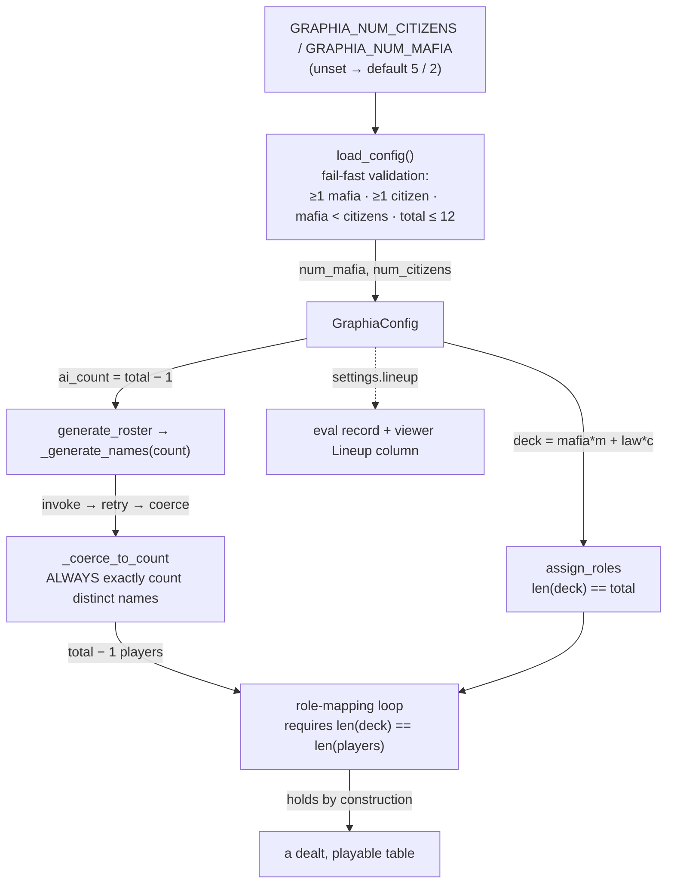

# Tutorial 014: Configurable Role Counts

- **Spec:** [`context/spec/014-configurable-role-counts/`](../../spec/014-configurable-role-counts/)
- **Status:** Reviewed
- **Author:** Alexey Tigarev
- **Date:** 2026-06-16
- **Prerequisites:** `001-playable-skeleton` (the role deal, the `Roster` schema + validation-retry, env-config), `005-play-as-role` (the `GRAPHIA_ROLE` pin), `010-local-ollama-provider` (the fail-fast-before-TUI posture), `012-eval-ledger-viewer` (the ledger viewer this surfaces the lineup in)

---

## Overview

Until now, every Graphia game opened with the same seven players: five Law-abiding Citizens and two Mafiosos, one of them the human. This increment lets you **choose the lineup** before launching — how many Citizens, how many Mafiosos — and deals the roles randomly to match. It also records which lineup an eval run used, so a measured run can be read in light of the table it was played on.

The feature sounds like a settings change, but it hides a genuinely interesting design problem, and that problem — not the env vars — is what this tutorial teaches. **Two sizes in the codebase have to agree, exactly, every game: the size of the role deck (`mafia + citizens` slots) and the number of names the AI roster needs (everyone but the human). If they ever disagree, the role-mapping loop indexes past the end of a list and the game crashes before it starts.** With a fixed lineup, both were the literal `7`/`6` and could never drift. Make the lineup configurable and you've introduced a way for them to drift — *and* you've handed the count to a small language model that is not reliably good at "give me exactly six distinct names."

So the spine of this increment is an **invariant**: derive both sizes from one config so they can't disagree, then defend that invariant on both ends — refuse an unworkable lineup up front, and put a deterministic floor under the model's name generation so it *always* yields exactly the right count. We teach that invariant first, then work outward to the validation that guards the lineup, the deck that consumes it, the schema-and-fallback that produces the names, and finally how the lineup becomes a recorded, comparable variable in the eval ledger. There's no new framework here — it's the project's existing config, LangGraph setup nodes, and flat-Pydantic structured output — so the lesson is about *holding an invariant across a stochastic boundary*.

---

## Concepts already covered (referenced, not re-taught)

- **`.env` config with typed validation** (`env-config-via-dotenv-with-validation`) — the `GraphiaConfig` dataclass + `load_config` that raise an actionable error on bad input. (See [tutorial 001](../001-playable-skeleton/tutorial.md#for-completeness--project-plumbing-and-observability).) The lineup is two more fields validated in the same place.
- **Flat structured-output schemas** (`structured-output-flat-pydantic`) and **single retry on validation error** (`validation-retry-once-with-feedback`) — the `Roster` schema and the one corrective retry. (See [tutorial 001](../001-playable-skeleton/tutorial.md).) This increment relaxes the schema and adds a floor *beneath* that retry.
- **Determinism posture as policy** (`determinism-posture-as-policy`, `pop-then-shuffle-role-deck`) — the `GRAPHIA_ROLE` pin that preserves the lineup by construction. (See [tutorial 005](../005-play-as-role/tutorial.md).) The new deck preserves that exact pin path.
- **Fail-fast preflight before the TUI** (`fail-fast-preflight-against-local-service`) — spec 010's habit of exiting with a plain message *before* the game window opens. (See [tutorial 010](../010-local-ollama-provider/tutorial.md).) Lineup validation joins that preflight.
- **Defensive dotted-get** (`defensive-dotted-get-heterogeneity`) and **column order as single source of truth** (`metric-order-single-source`) — the ledger viewer's `_dig` and `METRIC_ORDER`. (See [tutorial 012](../012-eval-ledger-viewer/tutorial.md).) The new `Lineup` column rides on both.

---

## What's new this increment

- [**One config drives a size invariant**](#1-the-spine-one-config-two-sizes-that-must-agree) — deck size and roster size both derive from one lineup, so they can't drift.
- [**Config-derived lineup with fail-fast validation**](#2-refusing-an-unworkable-lineup-before-the-game-opens) — counts come from env vars validated before the TUI; bad input exits with the rule named.
- [**A validation rule that encodes the game theory**](#2-refusing-an-unworkable-lineup-before-the-game-opens) — `mafia < citizens` is enforced because the win check favours the Mafia at parity.
- [**Config-built role deck**](#3-building-the-deck-from-the-counts-and-dealing-the-human-in) — the deck is built from the counts, dealt randomly, preserving the role-pin path.
- [**A schema that bounds, a caller that pins**](#4-a-schema-that-bounds-a-caller-that-pins) — `Roster` relaxes to a range; the prompt takes a `{count}`; exact-count enforcement moves to the caller.
- [**A deterministic coerce floor under validation-retry**](#5-the-deterministic-floor-under-a-flaky-model) — `_coerce_to_count` trims/pads to exactly N, so a flaky model can't break the invariant.
- [**Recording a controllable variable in the ledger**](#6-making-the-lineup-a-measurable-variable) — the lineup is recorded as `settings.lineup` and shown in the viewer; CLI flags route through the same config gate.

---

## Diagram

One config, two sizes, converging where they must be equal:



---

## Walkthrough

### 1. The spine: one config, two sizes that must agree

**If the table size is configurable, the role deck and the AI roster both have to be that size — exactly. How do you stop them from ever disagreeing?**

The crash you're avoiding is concrete. `assign_roles` walks the players in insertion order and assigns `roles[index]` to each. If there are more players than deck slots (or vice versa), that's an `IndexError` — or worse, a silently mis-dealt game. With a hardcoded seven-card deck and a hardcoded six-name roster the two were constants and couldn't diverge. The fix for a *configurable* table is not to validate they match after the fact; it's to make them **derive from the same number**, so divergence isn't representable.

That single number is the configured lineup. The deck is `num_mafia + num_citizens` cards; the roster is everyone but the human, `num_citizens + num_mafia − 1` names. Both expressions are the same `total`, computed from the same `GraphiaConfig`:

```python
# src/graphia/nodes/setup.py — generate_roster
config = load_config()
ai_count = config.num_citizens + config.num_mafia - 1
roster = _generate_names(ai_count)
```

```python
# src/graphia/nodes/setup.py — assign_roles
deck = ["mafia"] * config.num_mafia + ["law_abiding"] * config.num_citizens
```

This is the increment's **single-source size invariant**, and everything below is in service of it. Two of the next sections defend it directly: validation (section 2) makes sure the `total` is sane before anything runs, and the coerce floor (section 5) makes sure the roster is *exactly* `ai_count` even when the model misbehaves. The spec calls the invariant "the spine" for good reason — a regression anywhere in this chain surfaces as an `IndexError` in the loop above.

### 2. Refusing an unworkable lineup before the game opens

**A player could ask for zero Mafiosos, or three Mafiosos against two Citizens, or type `five` instead of `5`. How do you keep them from sitting through (or crashing into) a game that was unwinnable or malformed from the start?**

The project already has the answer pattern from earlier increments: **validate in `load_config` and fail fast before the TUI opens**, with a plain-language message rather than a stack trace — the same posture spec 010 used for its Ollama preflight. The lineup joins that block. Counts are parsed by a small helper that defaults when unset and exits on non-numeric input:

```python
# src/graphia/config.py — _parse_count
raw = os.environ.get(name)
if raw is None or not raw.strip():
    return default                       # unset → today's 5 / 2
try:
    return int(raw.strip())
except ValueError:
    raise SystemExit(f"{name} must be a whole number (got {raw!r}).")
```

Then four guards, each raising `SystemExit` with the broken rule spelled out: at least one Mafioso, at least one Citizen, the table within the `_MAX_TABLE_SIZE = 12` ceiling, and — the interesting one — **strictly fewer Mafiosos than Citizens**:

```python
# src/graphia/config.py — load_config (lineup validation)
if num_mafia >= num_citizens:
    raise SystemExit(
        f"GRAPHIA_NUM_MAFIA ({num_mafia}) must be strictly fewer than "
        f"GRAPHIA_NUM_CITIZENS ({num_citizens}) — otherwise the Mafia "
        "start at or above the parity that wins them the game before it begins."
    )
```

That last rule is **a validation rule that encodes the game theory**. The win check (`check_win_condition`) already declares a Mafia victory when their numbers reach the Law-abiding count — it's parity-favours-Mafia by design. So a lineup with `mafia >= citizens` isn't just unbalanced; it's *already won* before a single night. Rather than let that game open, the validator refuses it up front, with the reasoning in the message. This is the cheapest possible place to enforce a deep property of the game: a few lines of pure config parsing, run before anything else, naming exactly why a lineup is illegal. (The `_MAX_TABLE_SIZE = 12` cap is a separate, documented ceiling — it keeps a full Day round inside the AI's context window and the small model's one-shot name request modest; it's one constant, trivially raised, with a note that the context window must scale with it if it ever is.)

### 3. Building the deck from the counts (and dealing the human in)

**Given valid counts, how do you deal them randomly — including the human's role — without losing the dev/test affordance that pins the human to a side?**

The deck is the counts spelled out as cards, and the dealing logic is the same one spec 001 shipped and spec 005 refined — only the deck's *contents* changed from a literal to a config expression:

```python
# src/graphia/nodes/setup.py — assign_roles
deck = ["mafia"] * config.num_mafia + ["law_abiding"] * config.num_citizens
if config.human_role is None:
    random.shuffle(deck)
    roles = deck
else:
    assert state["human_id"] == next(iter(state["players"]))
    pinned_role = config.human_role
    deck.remove(pinned_role)          # pop the human's card…
    random.shuffle(deck)
    roles = [pinned_role, *deck]      # …deal it to seat 0, shuffle the rest
```

This is the **config-built role deck**. When no role is pinned the whole deck shuffles and the human (always seat 0) takes whatever lands there — so the human is dealt in at random within the counts, exactly as a player. When `GRAPHIA_ROLE` is set, the project's pop-then-prepend pin from [tutorial 005](../005-play-as-role/tutorial.md) is preserved verbatim: remove the pinned card, shuffle the rest, put the human's card back at seat 0. That `deck.remove(pinned_role)` is always safe now precisely *because* section 2's validation guarantees both roles have at least one card. The win conditions need no change — `check_win_condition` was already written relative to the live counts, so it just works at the new table sizes.

### 4. A schema that bounds, a caller that pins

**The roster needs exactly `total − 1` distinct names, and they come from a language model. The model's structured-output schema used to hardcode the count. How do you let the count vary?**

The project's structured-output convention (from [tutorial 001](../001-playable-skeleton/tutorial.md)) is a flat Pydantic schema bound with `with_structured_output`. The old `Roster` fixed the list length. The change here is to **relax the schema to a range and move exact-count enforcement to the caller** — the schema *bounds*, the caller *pins*:

```python
# src/graphia/llm.py — Roster
class Roster(BaseModel):
    names: list[str] = Field(min_length=1, max_length=_MAX_AI_NAMES)  # _MAX_TABLE_SIZE − 1
    # …distinct/non-empty validator kept
```

The prompt is parameterized to match, so the request scales with the lineup:

```python
# src/graphia/prompts.py — NAME_GEN_USER_TEMPLATE
"""Generate exactly {count} distinct first names for AI players.
…
Return them via the Roster schema as a `names` list of {count} strings."""
```

Why relax the schema instead of binding a fresh exact-length schema per count? Because the schema can no longer *guarantee* the count anyway — the model can return a valid-but-wrong-length list, and Bedrock Converse/Ollama both reject the discriminated or over-constrained shapes the project avoids. So the schema's job shrinks to "a non-empty list of distinct names within the table cap", and the caller takes on "exactly this many". That hand-off is what the next section is about.

### 5. The deterministic floor under a flaky model

**The model is asked for exactly N names. Sometimes it returns N−1, or a duplicate, or fails validation entirely. The size invariant from section 1 cannot tolerate "usually N". What guarantees it?**

The project already had one corrective move: a single validation-retry that re-asks with a pointed correction (tutorial 001). This increment keeps that and adds a **deterministic coerce floor beneath it**, so the result is *always* exactly N — never best-effort:

```python
# src/graphia/nodes/setup.py — _generate_names
roster = llm.invoke(messages)
if len(roster.names) == count:
    return roster                       # happy path
# …one corrective retry naming the exact count…
return _coerce_to_count(roster, count)  # last-resort floor
```

`_coerce_to_count` is a pure function (no model, fully unit-testable): it de-dupes case-insensitively, then either trims to the first `count` distinct names or pads with deterministically-distinct `Player-{k}` placeholders that skip any collision:

```python
# src/graphia/nodes/setup.py — _coerce_to_count
if len(distinct) >= count:
    return Roster(names=distinct[:count])      # too many → trim
k = 1
while len(distinct) < count:                   # too few → pad
    placeholder = f"Player-{k}"
    if placeholder.lower() not in seen:
        seen.add(placeholder.lower())
        distinct.append(placeholder)
    k += 1
return Roster(names=distinct)
```

This is the move that makes the spine *hold*. Section 1 derived `ai_count` from the config; section 5 guarantees the roster is exactly `ai_count` regardless of what the small model does. So `len(players) == total` and `len(deck) == total` are both true by construction, and the role-mapping loop in section 3 can never index out of bounds. The escalation — try, retry-with-feedback, then a pure floor — is the project's structured-output safety posture taken one step further: where 001 was willing to fall back to whatever the retry produced, a varying count means "whatever" isn't safe, so the floor is non-negotiable. (A test drives both arms: wrong-count-then-right exercises the retry; retry-still-wrong proves the coerce.)

### 6. Making the lineup a measurable variable

**Now that the table can be any shape, a measured eval run on a 4-and-1 table isn't comparable to one on 5-and-2. How do you know — later, reading the ledger — which lineup a run used?**

The lineup becomes a **recorded, comparable variable**. The eval harness writes it into each run's `settings` block, read straight off the resolved config so a `.env` or CLI override is captured faithfully:

```python
# src/graphia/tools/blunder_eval.py — run_eval settings
"lineup": {
    "num_citizens": getattr(config, "num_citizens", None),
    "num_mafia": getattr(config, "num_mafia", None),
},
```

A maintainer can sweep lineups without editing `.env` via `--citizens`/`--mafia`, and — this is the deliberate part — those flags **route through the same config choke point** rather than getting their own validation. `_apply_lineup_overrides` sets the env vars *before* `load_config()` runs, exactly like the model overrides do, so the Slice-1 fail-fast validates them: `--mafia 0` exits with the same message a bad `.env` would, no duplicate CLI checks:

```python
# src/graphia/tools/blunder_eval.py — _apply_lineup_overrides
if citizens is not None:
    os.environ["GRAPHIA_NUM_CITIZENS"] = str(citizens)
if mafia is not None:
    os.environ["GRAPHIA_NUM_MAFIA"] = str(mafia)
```

On the read side, this composes directly with [tutorial 012](../012-eval-ledger-viewer/tutorial.md). Because the viewer reads every field through `_dig`, the lineup surfaces with no migration — a `Lineup` column (`_lineup_cell` → `"5/2"`, or blank for any pre-014 record that has no `settings.lineup`) plus `citizens`/`mafia` lines in the drill-down. The column slots in *before* the metric block so it doesn't disturb the right-justify split the metric columns rely on — the same placement reasoning the Notes column used. The lineup is now a first-class, scannable dimension of the quality history: when a future repetition experiment wants to ask "does table size move the repetition rate?", the variable it would vary is already recorded next to every number.

---

## Try it

Play a non-default table — unset still gives today's 5 + 2:

```
GRAPHIA_NUM_CITIZENS=4 GRAPHIA_NUM_MAFIA=2 make play
```

Six players are dealt, roles random (including yours). Try an unworkable lineup to see the fail-fast:

```
GRAPHIA_NUM_MAFIA=3 GRAPHIA_NUM_CITIZENS=2 make play
```

→ exits before the window opens: *"GRAPHIA_NUM_MAFIA (3) must be strictly fewer than GRAPHIA_NUM_CITIZENS (2) — otherwise the Mafia start at or above the parity…"*.

Record a lineup in the ledger and read it back:

```
make blunder-eval ARGS="--provider ollama --games 2 --citizens 4 --mafia 1"
make view-ledger        # the run shows Lineup 4/1; drill in for the counts
```

The offline suite covers it all without a model: `tests/test_lineup_config.py` (validation), `tests/test_configurable_lineup.py` (deck composition + `_coerce_to_count` + `_generate_names` retry/coerce), and `tests/test_lineup_recording.py` (the `settings.lineup` record + the viewer column).

---

## Where to go next

- This closes the implemented spec chain (014 is the latest completed increment). The next *feature* on the roadmap is **Multi-Round Mafia Consensus by Pointing** — the sibling Phase 5 item, made more meaningful now that tables can carry several Mafiosos — which begins with `/awos:spec`.
- Related reading: [tutorial 012 — Eval Ledger Viewer](../012-eval-ledger-viewer/tutorial.md) for the viewer machinery the `Lineup` column rides on, and [tutorial 001 — Playable Skeleton](../001-playable-skeleton/tutorial.md) for the role deal, the `Roster` schema, and the validation-retry this increment extends.
