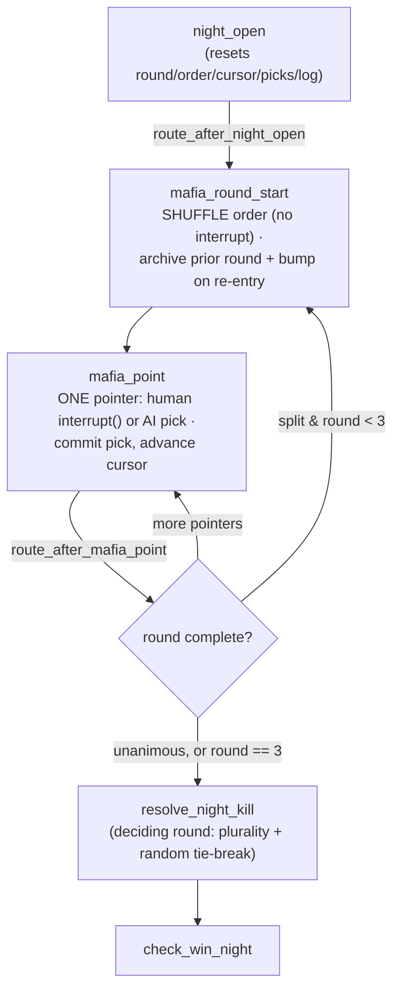

# Tutorial 015: Multi-Round Mafia Consensus by Pointing

- **Spec:** [`context/spec/015-multi-round-mafia-consensus/`](../../spec/015-multi-round-mafia-consensus/)
- **Status:** Reviewed
- **Author:** Alexey Tigarev
- **Date:** 2026-06-17
- **Prerequisites:** `001-playable-skeleton` (the state graph, `interrupt()`/resume, conditional edges, the `day_turn` self-loop, flat structured output), `005-play-as-role` & `007-fair-day-speaking-order` (the determinism posture + the fair-shuffle pattern), `013-ai-behavioral-integrity` (prompt grounding + the knowledge-boundary invariant)

---

## Overview

This increment changes one rule of the game: how the Mafia choose who dies at Night. Until now it was a single round — every Mafioso points at a target once, the most-pointed-at player dies, ties broken by a coin-flip. Two Mafiosos could split their picks and the kill was decided by luck. This increment turns the Night kill into a real act of **team consensus**: the Mafiosos point over *up to three rounds*, each one seeing the picks already made, and converge on a single victim — falling back to the old majority-with-tie-break only if they can't agree within the cap.

The mechanic is small; the interesting design problem is not. It lives entirely inside **LangGraph**, the state-graph framework Graphia is built on, and it runs straight into the framework's central constraint: **a node is re-executed *wholesale* when a human-in-the-loop `interrupt()` is resumed.** A multi-round pointing loop contains a human turn (when the human drew Mafia) *and* a non-deterministic shuffle *and* a sequence of AI model calls. Naively nesting all of that in one "do a round" node would mean that every time the human points, the round's earlier AI picks and its random order get recomputed on resume — silently drifting from what the human was just shown. So the real question this tutorial teaches is: **how do you shape a multi-actor, multi-round loop — with a human turn in the middle — so that resuming it recomputes nothing?**

The answer is a **per-pointer loop**: one actor's pick per graph super-step, with the round's randomness quarantined in its own step. We build outward from that spine — the loop topology, then the replay-safety reasoning that forces it, then the state that carries it, then termination, fairness, convergence, and finally the human-facing surface. Decorations (the modal) come last.

---

## Concepts already covered (referenced, not re-taught)

- **Replay-safe interrupt placement** — `interrupt()` goes first in a human-facing node because resume re-runs the whole node. (See [tutorial 001](../001-playable-skeleton/tutorial.md).) This increment's central section is a direct, harder application of it.
- **Conditional edges with a routing function** & **resume via `Command` payload** & **interrupt-payload → modal dispatch** — the graph's branching, the human-resume mechanism, and how a `{"kind": "point"}` payload reaches a modal. (See [tutorial 001](../001-playable-skeleton/tutorial.md).) The loop is built from these.
- **Flat structured-output schemas** & **single retry on validation error** — the `Pointing` schema and the AI pick's retry-then-fallback. (See [tutorial 001](../001-playable-skeleton/tutorial.md).) Both are reused unchanged.
- **Determinism posture as policy** & **monkeypatch the shuffle helper** — mechanical RNG via module-global `random`, pinned in tests by patching the helper. (See [tutorial 005](../005-play-as-role/tutorial.md).) The per-round order follows this exactly.
- **The Fair Day Speaking Order** — the Day phase already re-randomizes speaking order each round for fairness. (See [tutorial 007](../007-fair-day-speaking-order/tutorial.md).) The Night pointing order borrows the same idea.
- **Role/identity prompt grounding** & **the knowledge-boundary invariant** — injecting an actor's legitimate knowledge into its prompt, and *only* what its role may know. (See [tutorial 013](../013-ai-behavioral-integrity/tutorial.md).) Threading teammates' picks into the AI prompt composes with both.

---

## What's new this increment

- [**Per-pointer consensus loop**](#1-modeling-a-bounded-consensus-as-a-graph-loop) — one actor's pick per super-step, with a router choosing next-pointer / next-round / resolve.
- [**Shuffle as its own super-step**](#2-why-per-pointer-surviving-interrupt-replay) — quarantine the round's randomness in a no-`interrupt()` node so a human-resume recomputes nothing.
- [**Round-scoped loop state**](#3-carrying-the-loops-progress-in-committed-state) — the round, order, cursor, picks, and rounds-log in committed channels, reset at phase entry.
- [**Unanimity-or-cap termination, deciding-round resolution**](#4-ending-the-loop-agreement-or-the-cap) — stop on agreement or the cap; resolve from the deciding round with the old plurality+tie-break.
- [**Per-round fair re-shuffle**](#5-keeping-the-order-fair-each-round) — re-randomize the order each round so the last-mover advantage rotates.
- [**Running state in the prompt to induce convergence**](#6-making-independent-agents-converge-without-chat) — feed each AI its teammates' picks so far, by name, so they agree without chat.
- [**Mirroring the agent's context to the human**](#7-for-completeness-the-human-on-equal-footing-and-a-modal-that-fits) — show the human the same round + picks the AI sees.
- [**Content-sized modal**](#7-for-completeness-the-human-on-equal-footing-and-a-modal-that-fits) — size the point modal to its content so it shows every target on a short terminal.

---

## Diagram

The Night pointing loop — note the deliberate split between the shuffle step and the pick step:



---

## Walkthrough

### 1. Modeling a bounded consensus as a graph loop

**How do you express "several actors converge on one choice over up to K rounds, or fall back" inside a state graph?**

LangGraph already gives us the two pieces: a node can route back to itself, and a **conditional edge** (a routing function returning the next node's key) decides where to go each step. The Day phase established the shape — `day_turn` loops on itself via `route_day_turn_or_vote` until the round ends. The Night consensus reuses that shape, with one decision that defines the whole increment: **one node handles exactly one pointer per visit**, not a whole round. The loop is `mafia_round_start → mafia_point → (route) → {mafia_point | mafia_round_start | resolve_night_kill}`:

```python
# src/graphia/graph.py — build_graph (Night loop wiring)
builder.add_edge("mafia_round_start", "mafia_point")
builder.add_conditional_edges(
    "mafia_point",
    route_after_mafia_point,
    {
        "mafia_point": "mafia_point",            # next pointer, same round
        "mafia_round_start": "mafia_round_start", # split & under cap → new round
        "resolve_night_kill": "resolve_night_kill",
    },
)
```

The router itself is a **pure read** of committed state — it computes nothing, it only looks at where the loop is and picks an edge. That purity is the whole point of the **per-pointer consensus loop**: each pointer's pick is a separate graph super-step, so the framework checkpoints after every single pick. Why that matters is the next section — it's what makes a human turn in the middle of the loop safe.

### 2. Why per-pointer: surviving interrupt replay

**The human is one of the pointers. When they point, the game suspends on an `interrupt()` and resumes when they answer — and LangGraph re-executes the *entire node* on resume. What would break if a "round" were one node?**

This is the constraint **replay-safe interrupt placement** (tutorial 001) exists for, and here it bites harder than anywhere before. Picture the naive design — a single `mafia_round` node that, in a Python loop, shuffles the order, then asks each Mafioso in turn. When it reaches the human it calls `interrupt()`; the node unwinds, the human answers, and the node **runs again from the top**. The re-run re-shuffles the order (a *different* order — `random` isn't seeded) and re-invokes the LLM for every AI pointer before the human (different picks). The human just chose a target based on picks that no longer exist. State only commits when a node *returns*, so nothing computed before the interrupt survives the replay.

The fix is to make the two kinds of work that can't survive replay — the non-deterministic shuffle, and the not-yet-committed AI picks — never share a super-step with the human's `interrupt()`. So the round is split into two nodes. `mafia_round_start` does the round's *only* randomness and **contains no `interrupt()`**, so it commits the shuffled order as its own step:

```python
# src/graphia/nodes/night.py — mafia_round_start
delta["night_mafia_order"] = _shuffle_mafia_order([m.id for m in alive_mafia])
delta["night_pointer_index"] = 0
delta["night_round_picks"] = {}
return delta
```

`mafia_point` then handles one pointer, and everything before its `interrupt()` is a **pure read of committed state** — it looks up *which* pointer this is from the already-committed order and cursor, so a resume re-derives the identical pointer and the framework replays the stored answer:

```python
# src/graphia/nodes/night.py — mafia_point (human branch)
pointer_id = order[index]            # pure read: who points now
# … build prior_picks from committed state (also pure) …
value = interrupt({                  # FIRST effecting statement
    "kind": "point", "options": [...],
    "round": ..., "round_cap": NIGHT_ROUND_CAP, "prior_picks": prior_picks,
})
```

This is **shuffle as its own super-step**: the dangerous non-determinism is quarantined upstream of every interrupt, so resuming the human's turn recomputes nothing. The test suite pins exactly this — a real-driver trajectory drives a human Mafioso through two rounds and asserts the AI pointing fake's call count stays at 2 across the human's modal interrupt/resumes (no AI pick re-invoked). Per-pointer isn't an aesthetic choice; it's the only shape that keeps the human's view and the recorded picks in agreement.

### 3. Carrying the loop's progress in committed state

**If each visit handles just one pointer, how does the next visit know the order, whose turn it is, and what's been picked so far?**

It can't recompute any of that (section 2), so it must *read* it. The loop's entire progress lives in five plain **round-scoped loop state** channels on `GameState` — all plain-replace reducers, like the existing `night_picks` — and they're reset at phase entry in `night_open` so a fresh Night starts clean:

```python
# src/graphia/nodes/night.py — night_open (normal return)
"night_round": 1,            # which round (1..3)
"night_mafia_order": [],     # the round's shuffled pointer ids
"night_pointer_index": 0,    # cursor within the round
"night_round_picks": {},     # mafioso_id → target_id, current round
"night_rounds_log": [],      # completed rounds' picks (context + audit)
```

Each `mafia_point` reads `night_mafia_order[night_pointer_index]`, commits one entry into `night_round_picks`, and advances the cursor by one. The router reads the same channels to decide what's next. Because progress is in committed state rather than a Python loop variable, the loop is *resumable at any pointer* and the checkpoint records the consensus as it formed — which is what made section 2's guarantee expressible at all. This is the structural cousin of how `day_turn` keeps its `day_order`/`day_turn_index` in state rather than iterating in-node.

### 4. Ending the loop: agreement or the cap

**When does the pointing stop, and who actually dies?**

A round is complete when the cursor has passed the last pointer. At that moment the router asks one question — did everyone land on the same target? — and the answer, plus a hard cap, decides everything. This is **unanimity-or-cap termination**:

```python
# src/graphia/nodes/night.py — route_after_mafia_point (round-complete branch)
round_picks = state.get("night_round_picks", {})
unanimous = len(set(round_picks.values())) == 1
if unanimous or state.get("night_round", 1) >= NIGHT_ROUND_CAP:
    return "resolve_night_kill"
return "mafia_round_start"            # split, and rounds remain → go again
```

Resolution then reads the **deciding round** — the round that ended the loop — and applies the *unchanged* single-round rule: tally, take the plurality, break a tie at random. Early agreement and a split-all-the-way-to-the-cap both flow through the same code; the only thing that varied is which round's picks `resolve_night_kill` reads:

```python
# src/graphia/nodes/night.py — resolve_night_kill
night_picks = state.get("night_round_picks", {})   # the deciding round
counts = Counter(night_picks.values())
top_count = max(counts.values())
tied = [tid for tid, c in counts.items() if c == top_count]
victim_id = random.choice(tied) if len(tied) > 1 else tied[0]
```

Two cases fall out for free. A **lone surviving Mafioso** produces a one-element round whose picks are trivially "unanimous", so they kill immediately in one round — no special-casing. And the human's career night-kill stats keep their old meaning because `resolve_night_kill` still keys `human_picked_victim` on `night_picks[human_id]` — now the human's pick *in the deciding round* — so they count one attempt per Night regardless of how many rounds ran.

### 5. Keeping the order fair each round

**Under the unanimity rule, whoever points last in a round sees everyone else's pick before choosing — a real last-mover advantage. How do you keep that from always falling to the same Mafioso?**

The same way the Day phase keeps speaking order fair (the **Fair Day Speaking Order**, tutorial 007): re-randomize every round. `mafia_round_start` reshuffles on each entry, so the pointing order in round 2 is independent of round 1 — this is the **per-round fair re-shuffle**. The shuffle goes through one helper, the project's single Night shuffle surface, so the determinism posture (tutorial 005) applies cleanly — tests pin the order by monkeypatching exactly this function:

```python
# src/graphia/nodes/night.py — _shuffle_mafia_order
def _shuffle_mafia_order(mafia_ids: list[str]) -> list[str]:
    ids = list(mafia_ids)
    random.shuffle(ids)        # module-global RNG; no seed (architecture §6)
    return ids
```

Note the honest scope: this is a *fair shuffle*, not a guaranteed rotation. A Mafioso may, by chance, point last on more than one round — the spec says so explicitly. We remove the systematic bias, not chance itself. (And because the shuffle lives in `mafia_round_start`, it's the very non-determinism section 2 quarantined — fairness and replay-safety are the same line of code seen from two angles.)

### 6. Making independent agents converge without chat

**The Mafiosos may not chat — pointing is their only communication. So how do three independent, stochastic AI agents actually agree on a target?**

By making each one *see where its teammates have already pointed*. When it's an AI pointer's turn, `mafia_point` renders the picks so far — completed rounds from `night_rounds_log` plus the current round before this pointer — **by name**, and threads them into the pointing prompt with an instruction to converge. This is **running state in the prompt to induce convergence**, and it composes directly with role/identity grounding (tutorial 013): the prompt already tells a Mafioso its role; now it also tells it the team's emerging choice.

```python
# src/graphia/nodes/night.py — _render_prior_picks
segments.append(f"Round {round_number} — {render_round(picks)}")
# → "Round 1 — Alice → Carol, Bob → Dan; Round 2 so far — Alice → Carol"
```

```text
# src/graphia/prompts.py — MAFIA_POINT_USER_TEMPLATE (the new block)
Your Mafia teammates' picks so far this Night:
{prior_picks}
… the Mafia win by AGREEING on one target — move toward a shared choice …
```

Two guards keep this honest. The block is built *only* on the AI pointing path, which is only ever a Mafioso — so it never leaks into a Law-abiding player's prompt, respecting the **knowledge-boundary invariant** (tutorial 013): you only ever see what your role legitimately knows. And the `Pointing` schema and its single-retry-then-random fallback (tutorial 001) are untouched — convergence is a *prompt* change, not a contract change. A test asserts the round-2 prompt contains the round-1 picks by name (and that raw ids never leak); whether the model *actually* converges is non-deterministic, which is exactly why the cap-fallback (section 4) exists as the safety net.

### 7. For completeness: the human on equal footing, and a modal that fits

Two finishing touches, both small.

A human Mafioso should play the consensus with the same information the AI gets — otherwise they'd point blind while the AIs see the board. So the `mafia_point` human branch builds the *same* `_render_prior_picks` summary and ships it (plus the round number and cap) inside the `interrupt()` payload, which the point modal renders as a "Night kill — round X of 3" header and a "Teammates so far: …" line. This is **mirroring the agent's context to the human** — one helper feeds both the AI prompt and the human modal, so they can never drift apart. The resume value is unchanged (the chosen target's id), so nothing downstream notices.

That extra chrome exposed a latent UI bug, and its fix is the last concept: the point modal was a fixed `height: 40%`, with the target list filling the remainder. The new header + picks lines squeezed the list to ~1 visible row on a short terminal. The fix is a **content-sized modal** — let the dialog grow to its content, capped at the screen, and let the list size to its options:

```css
/* src/graphia/ui/widgets.py — PointingModal.DEFAULT_CSS */
PointingModal > Vertical { height: auto; max-height: 90%; min-height: 10; }
PointingModal OptionList  { height: auto; overflow-y: hidden; }
```

Now the dialog is exactly as tall as it needs to be — every target visible when they fit (the roster is at most ~11), scrolling only when the content genuinely can't fit the screen. A Pilot test mounts the modal with the round-2 context at an 18-row terminal and asserts every option renders without scrolling.

---

## Try it

Play a game with two or more Mafiosos and let yourself be drawn onto the Mafia (re-run until you are, or pin it):

```
GRAPHIA_NUM_CITIZENS=4 GRAPHIA_NUM_MAFIA=2 GRAPHIA_ROLE=mafia make play
```

At Night you'll see the point modal with "Night kill — round X of 3" and, from round 2 on, a "Teammates so far" line naming where your teammate pointed. Point against your teammate and watch a second (and maybe third) round open; agree and the Night ends immediately. The offline suite proves every path without a model: `tests/test_multi_round_consensus.py` (early agreement, round-2 convergence, cap fallback + tie, lone Mafioso, per-round reshuffle, real-driver replay-safety, the human modal display, and the short-terminal modal sizing).

---

## Where to go next

- This closes **Phase 5** (with [tutorial 014 — Configurable Role Counts](../014-configurable-role-counts/tutorial.md), the sibling feature). The next roadmap phase is **Phase 6 — AI Personas & Per-Game Memory, Asynchronous Day Chat, and the End-of-Game Payoff** — begin with `/awos:spec`.
- Related reading: [tutorial 001 — Playable Skeleton](../001-playable-skeleton/tutorial.md) for the interrupt/resume + conditional-edge foundations this loop is built from, and [tutorial 007 — Fair Day Speaking Order](../007-fair-day-speaking-order/tutorial.md) for the per-round fair-shuffle pattern the Night borrows.
