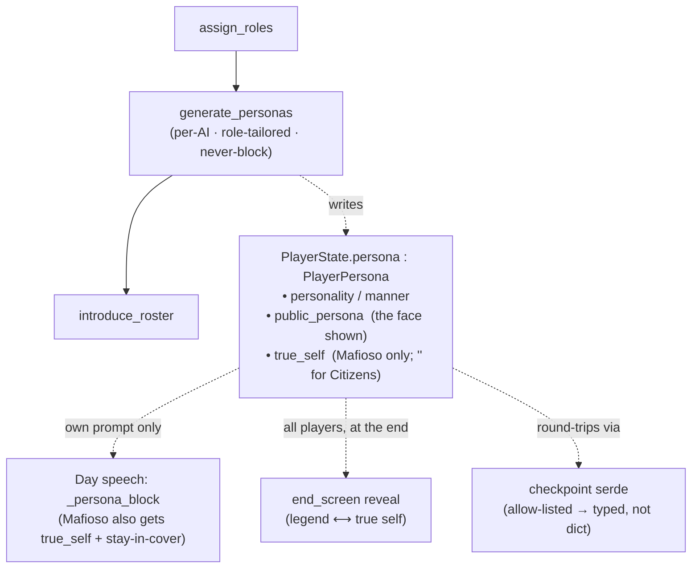

# Tutorial 016: AI Character Personas

- **Spec:** [`context/spec/016-ai-character-personas/`](../../spec/016-ai-character-personas/)
- **Status:** Reviewed
- **Author:** Alexey Tigarev
- **Date:** 2026-06-18
- **Prerequisites:** `001-playable-skeleton` (flat structured output, the validation-retry pattern, the per-game SQLite checkpointer), `013-ai-behavioral-integrity` (role/identity prompt grounding + the knowledge-boundary invariant), `014-configurable-role-counts` (the retry-then-deterministic-floor shape)

---

## Overview

This increment gives each AI player a **persona** — a personality, a backstory, and a manner of speaking, generated fresh at the start of every game — so the Day chat reads like a room of distinct characters instead of interchangeable bots. The headline idea isn't "add flavour text," though; it's a **deception model**. A Mafioso lives a double life: it carries a *true self* (it knows it's Mafia) and a *public legend* it performs to blend in with the Citizens. The interesting design question — the one a reader could plausibly ask building this from scratch — is: **how do you hand an agent a secret identity it must perform but never betray, thread it through the game without leaking it, and pay it off at the end?**

There's no new framework here. The increment composes Graphia's existing **LangGraph** machinery — flat structured-output generation, the typed `GameState`/`PlayerState`, per-node prompt assembly, and the checkpointer — into a persona layer. So this tutorial teaches core-outward from the *data model* (the two-layer persona), then how it's generated, then the two quiet **persistence gotchas** that adding a state field surfaced (both real bugs caught mid-build), then how it shapes speech without leaking, then the end-game reveal, and finally a test-isolation fix the new tests exposed. The gotchas are the most transferable part — they're what bites anyone who adds a field to a checkpointed graph state.

---

## Concepts already covered (referenced, not re-taught)

- **Flat structured-output schemas** & **single retry on validation error** — `with_structured_output(<flat Pydantic>)` and the invoke-then-corrective-retry pattern. (See [tutorial 001](../001-playable-skeleton/tutorial.md).) The persona schema and its generation reuse both.
- **Per-game SQLite checkpointer** — `SqliteSaver` round-tripping `GameState` between super-steps. (See [tutorial 001](../001-playable-skeleton/tutorial.md).) This is exactly what turned a persona into a `dict` until it was allow-listed.
- **Role/identity prompt grounding** & **the knowledge-boundary invariant** — injecting an actor's legitimate knowledge into its own prompt, and *only* what its role may know. (See [tutorial 013](../013-ai-behavioral-integrity/tutorial.md).) The persona is the voice layer that sits atop this grounding; the Mafioso's secret obeys the same boundary.
- **Deterministic floor under a validation-retry** — spec 014's `_coerce_to_count` guaranteed a result even when the model misbehaved. (See [tutorial 014](../014-configurable-role-counts/tutorial.md).) Persona generation uses the same retry-then-floor shape, with a fallback persona as the floor.

---

## What's new this increment

- [**Two-layer deception persona**](#1-the-shape-of-a-persona-a-two-layer-deception-model) — a Mafioso's `public_persona` (cover) vs `true_self`; a Citizen's single honest persona.
- [**Role-tailored creative generation with a never-block floor**](#2-generating-a-cast-creative-role-tailored-never-block) — per-actor role-specific LLM calls, invoke → retry → fallback so setup never blocks.
- [**`dataclasses.replace` for forward-proof rebuilds**](#3-carrying-a-persona-through-state-two-quiet-gotchas) — rebuild a player by replacing changed fields so new ones carry over.
- [**Checkpoint serde allow-list for a new state type**](#3-carrying-a-persona-through-state-two-quiet-gotchas) — register the dataclass or it round-trips as a `dict`.
- [**Persona as transient per-player state**](#3-carrying-a-persona-through-state-two-quiet-gotchas) — on `PlayerState`, game-scoped, no Memory store.
- [**Owner-private secret in the prompt**](#4-speaking-in-character-without-breaking-the-secret) — a Mafioso's `true_self` goes only into its own prompt, with a stay-in-cover instruction.
- [**Hidden during play, revealed at end**](#5-the-payoff-deception-revealed-at-game-end) — felt through speech during play; the explicit personas (legend vs truth) revealed only at game end.
- [**Seed RNG to de-flake an order-dependent test**](#6-for-completeness-de-flaking-the-test-the-new-tests-exposed) — `random.seed(...)` at a test's start to kill suite-ordering dependence.

---

## Diagram

The persona's lifecycle through the graph, and its two-layer shape:



---

## Walkthrough

### 1. The shape of a persona: a two-layer deception model

**How do you give an agent a character that, for a Mafioso, is a performance — a cover it must keep up while secretly being something else?**

The answer is in the *data shape*, and getting it right makes everything downstream fall out cleanly. A persona is a small frozen dataclass on `PlayerState` with four fields, and the trick is that two of them encode the double life:

```python
# src/graphia/state.py — PlayerPersona
class PlayerPersona:
    personality: str
    manner: str
    public_persona: str   # the face shown to the table — a Mafioso's cover legend, or a Citizen's honest self
    true_self: str        # a Mafioso's real backstory; empty for Citizens
```

This is the **two-layer deception persona**. `public_persona` is what the table experiences; `true_self` is what only that Mafioso (and, at the very end, the human) ever learns. A Citizen has nothing to hide, so its `true_self` is simply empty — the same shape expresses both "honest townsperson" and "Mafioso in disguise," and downstream code branches on `role == "mafia"` to decide whether the secret layer exists. The conversion from the LLM's flat output to this stored shape is where the rule lives:

```python
# src/graphia/nodes/setup.py — _to_player_persona
secret = persona.secret_backstory.strip()
if is_mafia and not secret:
    secret = f"{player.name} is secretly a Mafioso, hiding behind an ordinary cover."
return PlayerPersona(..., public_persona=persona.public_backstory.strip(),
                     true_self=secret if is_mafia else "")
```

Everything that follows — generation, prompt injection, the reveal — is just "where does each layer go, and who is allowed to see it." Hold that question; it's the spine.

### 2. Generating a cast: creative, role-tailored, never-block

**How do you produce a *distinct* persona per player, with the right shape for each role, without making game setup hostage to a flaky model?**

Graphia already had the pieces from earlier increments: **flat structured-output schemas** and a **single corrective retry** (tutorial 001), and a **deterministic floor under that retry** (tutorial 014's `_coerce_to_count`). Persona generation composes all three. It runs as a new setup node, `generate_personas`, wired to run *after* role assignment — because the prompt is **role-tailored**: a Citizen gets asked for one honest persona, a Mafioso for a legend *and* a true self. Each AI player gets its own heavyweight-LLM call (the creative tier), and the whole thing is wrapped so it can never raise:

```python
# src/graphia/nodes/setup.py — _generate_one_persona
try:
    persona = llm.invoke(messages)
    if not _persona_is_empty(persona):
        return _to_player_persona(persona, is_mafia=is_mafia, player=player)
except Exception:
    persona = None
# … one corrective retry naming the missing fields …
return _fallback_persona(player)     # deterministic, name-derived floor
```

This is **role-tailored creative generation with a never-block floor**. The catch is `except Exception` (broad), not `except ValidationError` (narrow as in name generation) — free-prose personas have no exact-shape invariant beyond non-emptiness, so *any* failure, including a missing model, drops to the fallback. That floor is doing double duty: in production it survives a model outage, and in the test suite it's why a test that *doesn't* stub the persona call still gets a (fallback) persona and stays green rather than hanging.

One subtlety worth copying: the node returns the **whole** players map, not just the AI entries it changed —

```python
# src/graphia/nodes/setup.py — generate_personas
updated: dict[str, PlayerState] = dict(players)   # start from ALL players (human included)
for pid, player in players.items():
    if player.is_human:
        continue
    updated[pid] = dataclasses.replace(player, persona=_generate_one_persona(player))
return {"players": updated}
```

because `players` is a plain *replace* channel (no merge reducer) — returning only the AI entries would drop the human from state. That `dataclasses.replace` is also the first appearance of the next section's first gotcha.

### 3. Carrying a persona through state: two quiet gotchas

**You added one field to `PlayerState`. What silently breaks?** Two things did, and both are the kind of bug that passes a unit test and fails a real game — exactly the transferable lesson of this increment.

**Gotcha one: rebuild sites drop the field.** Several nodes "change" a player by constructing a fresh `PlayerState(id=…, name=…, role=…, is_alive=…)` with every field spelled out. Add a `persona` field and every one of those constructors silently omits it — the player comes out of `assign_roles` or `resolve_night_kill` with `persona=None`. The fix is to stop spelling out fields and instead replace only what changed, so anything new rides along for free — **`dataclasses.replace` for forward-proof rebuilds**:

```python
# src/graphia/nodes/night.py — resolve_night_kill (the victim branch)
updated[pid] = dataclasses.replace(player, is_alive=False)   # persona (and any future field) carries over
```

The three rebuild sites (`assign_roles`, `resolve_vote`, `resolve_night_kill`) all moved to this form. It's a small refactor that converts "remember to thread every new field through N sites" into "you can't forget."

**Gotcha two: the checkpoint turns your object into a `dict`.** Graphia checkpoints `GameState` between super-steps (the per-game SQLite checkpointer from tutorial 001). The serializer only reconstructs *allow-listed* custom types; anything else round-trips as a plain `dict`. `PlayerState` was already on the list — `PlayerPersona` was not, so after the first checkpoint boundary `player.persona` came back as `{"personality": …}` instead of a `PlayerPersona`, and the first code to read `persona.personality` crashed with `AttributeError: 'dict' object has no attribute …`. The fix is one line — **register the new state type on the checkpoint serde allow-list**:

```python
# src/graphia/graph.py — make_checkpoint_serde
return JsonPlusSerializer(allowed_msgpack_modules=[PlayerState, PlayerPersona])
```

The function's own docstring had warned it: *"any new custom class stored in `GameState` must be added to this list or its deserialization will be blocked."* The allow-list is opt-in by design (a security posture), so every new nested state type pays this tax — and a test now round-trips a `PlayerState` carrying a `PlayerPersona` through `make_checkpoint_serde()` to assert it comes back *typed*, guarding the registration.

Both gotchas share a root: a persona is **transient per-player state**. It lives on `PlayerState` for the game and is gone when the checkpoint file is deleted — no AgentCore Memory, no `DiaryStore`, unlike diaries or career stats. That's a deliberate scoping choice (personas are game-scoped flavour, not durable data), and it's *why* the checkpoint serde — not a Memory schema — is the persistence surface that mattered.

### 4. Speaking in character without breaking the secret

**During the Day, how does a persona actually change what an AI says — and how does a Mafioso perform its cover without the secret leaking to the table?**

The persona is injected into the AI's Day-speech prompt as a *voice layer on top of* the spec-013 role grounding (role, win condition, teammates). Crucially it goes into **only that speaker's own prompt** — this is the **owner-private secret in the prompt**, and it's what makes the deception playable rather than self-defeating:

```python
# src/graphia/nodes/day.py — _persona_block
lines = ["You are playing this character — speak in this voice throughout:",
         f"- Personality: {persona.personality}",
         f"- Manner of speaking: {persona.manner}",
         f"- The public face you present at the table: {persona.public_persona}"]
if speaker.role == "mafia":
    lines.append(f"- YOUR SECRET TRUTH (never reveal): {persona.true_self} "
                 "This public face is a cover. Maintain it … NEVER reveal that you are Mafia …")
```

Every AI gets its personality, manner, and the `public_persona` it projects. A Mafioso *additionally* gets its `true_self` plus an explicit stay-in-cover instruction. Because `_persona_block` is built per-speaker and threaded only into that speaker's own `DAY_SPEAK_USER_TEMPLATE.format(...)`, the secret never appears in another player's prompt or any broadcast message — it composes directly with tutorial 013's **knowledge-boundary invariant** (an actor's prompt carries only what its role legitimately knows; here, its own secret). Tests pin the *wiring*: the Mafioso's prompt contains its `true_self` + cover line, a Citizen's doesn't, the legend string carries no allegiance tell, and the `true_self` is absent from any other speaker's prompt. Whether the model actually *keeps* its cover is non-deterministic — a measured effort, not a guarantee (the [CR 005](../../change-requests/005-ai-behaviour-acceptance-effort-not-results.md) posture), so the assertions are on the prompt, not the model's discretion.

### 5. The payoff: deception revealed at game end

**The personas are hidden all game — felt only through how characters talk. Where does the human finally learn who everyone really was?**

At the end. This is **hidden during play, revealed at end** — the inverse bookend of section 4's secrecy. `end_screen` appends a public reveal section (no `private_to`, so everyone sees it) after the winner and role reveal, and for a Mafioso it makes the deception *visible* by contrasting the legend it performed against its true self:

```python
# src/graphia/nodes/endgame.py — _persona_reveal_line
if player.role == "mafia":
    return ENDGAME_PERSONA_MAFIA_TEMPLATE.format(   # "publicly presented as … but was really a Mafioso: …"
        name=player.name, public_persona=public_persona, true_self=..., …)
return ENDGAME_PERSONA_CITIZEN_TEMPLATE.format(name=player.name, …)
```

It covers every AI player — survivors and the eliminated alike — and skips the human (no persona). A test asserts the reveal lists each persona, contrasts the Mafioso's two layers, and — the bookend check — that *no* persona text appears in any message before `end_screen`. (This is a deliberately *plain* reveal; weaving personas into a narrative recap is the separate End-of-Game Payoff item.) One small defensive detail you'll see here, `_persona_field`, tolerates a persona arriving as either a `PlayerPersona` or a `dict` — a belt-and-braces guard left in from before the section-3 serde fix made the `dict` case impossible.

### 6. For completeness: de-flaking the test the new tests exposed

**Adding this increment's tests turned a *sibling* test (spec 015's Night-replay test) red — without touching its code. Why, and what's the right fix?**

That replay test drives a full game and its trajectory depends on Graphia's **mechanical RNG** — the module-global `random` (architecture §6). It pinned the *pointing order* but not the *role-deal* shuffle, so its outcome quietly depended on how much `random` every test before it had consumed. Adding 20 new persona tests shifted that cumulative state enough to flip it. The fix isn't to chase the dependency — it's to make the test independent of suite ordering by resetting the RNG at its start, the **seed-to-de-flake** pattern architecture §6 sanctions for exactly this:

```python
# tests/test_multi_round_consensus.py — the replay test
random.seed(0)                 # role deal independent of how much `random` earlier tests consumed
monkeypatch.setenv("GRAPHIA_ROLE", "mafia")
```

The lesson generalizes: a test that consumes a process-global source (module RNG, the system clock, a shared cache) and asserts on a derived trajectory is only *accidentally* passing in isolation; it's a latent order-dependence that some future, unrelated test will expose. Seed it (or inject the dependency) so the test owns its inputs. After the fix the full suite is green under both stable and randomized ordering.

---

## Try it

Play a game (ideally as a Citizen, so you watch the AI cast rather than play one):

```
make play
```

During the Day, the AI players should each speak with a recognizable, consistent voice; you can't tell Mafia from Citizen by character alone. When the game ends, after the winner and roles, a **"Who they really were:"** section reveals each AI's persona — and for each Mafioso, the cover it performed contrasted with its true self. The offline suite proves the wiring without a model: `tests/test_personas.py` (generation, never-block fallback, the typed checkpoint round-trip, persistence through rebuilds, the Day-speech persona + no-leak, the Night-pointing flavour, and the end-only reveal).

---

## Where to go next

- The rest of **Phase 6** builds directly on personas: [the roadmap](../../product/roadmap.md)'s **Per-AI Day-Round Private Thoughts** and **Per-AI Private Diaries** will have each character reflect *in its own voice*, and the **End-of-Game Payoff** will turn this plain reveal into a Moderator-narrated story. Begin one with `/awos:spec`.
- Related reading: [tutorial 013 — AI Behavioral Integrity](../013-ai-behavioral-integrity/tutorial.md) for the prompt grounding + knowledge boundary the persona layers onto, and [tutorial 001 — Playable Skeleton](../001-playable-skeleton/tutorial.md) for the structured-output, validation-retry, and checkpointer foundations this increment composes.
