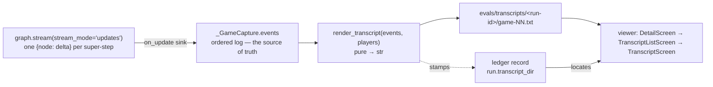

# Tutorial 017: Eval Transcript Preservation

- **Spec:** [`context/spec/017-eval-transcript-preservation/`](../../spec/017-eval-transcript-preservation/functional-spec.md)
- **Status:** Reviewed
- **Author:** Alexey Tigarev
- **Date:** 2026-06-19
- **Prerequisites:** `001-playable-skeleton`, `011-ai-blunder-tracking`, `012-eval-ledger-viewer`, `013-ai-behavioral-integrity`, `015-multi-round-mafia-consensus`, `016-ai-character-personas`

---

## Overview

Graphia measures AI quality by playing batches of real games and recording the *numbers* — repetition rate, blunder counts, win-rate by side — one row per run in a committed YAML ledger. But the games behind those numbers were thrown away: only the rates survived. When a number looked wrong (repetition stuck near a half, the town winning zero of twenty) there was no way to go read *why*. You had the verdict but not the trial.

This increment **preserves the full transcript of every measured eval game** and makes it **browsable in the eval-ledger viewer**, right next to that run's metrics — the public Day discussion and votes *and* the normally-hidden layers (who was really Mafia, what the Mafiosos privately chose at Night, each character's persona and a Mafioso's true self behind its cover).

The interesting design problem is not "format a transcript" — it's **where the events come from**. The eval already streams each game through LangGraph; the obvious move is to read the final state when the game ends. That move is *wrong*, and seeing exactly why it's wrong is the spine of this tutorial. The central technology is the same one tutorial 001 introduced — LangGraph's per-super-step **update stream** — used here not to drive a game but to *capture* one. We teach core-outward: first why the final snapshot lies and what to capture instead, then how to rebuild a readable game from that capture, then why it shows every secret, where it's stored and shared, how the viewer reads it back, and finally a real bug the feature's own smoke test exposed.

---

## Concepts already covered (referenced, not re-taught)

- **Streaming graph updates** — `graph.stream(stream_mode="updates")` emits one `{node: delta}` dict per super-step. This increment captures that stream instead of consuming it for the UI. (See [tutorial 001](../001-playable-skeleton/tutorial.md).)
- **Side-channel state snapshots** — `graph.get_state(run_config)` reads live state outside the stream; the increment is precisely about *why this is not enough* as a source of truth. (See [tutorial 001](../001-playable-skeleton/tutorial.md).)
- **Typed state with field-level reducers** — replace-reduced channels overwrite each super-step; that's why the Night pointing channels don't accumulate. (See [tutorial 001](../001-playable-skeleton/tutorial.md).)
- **Round-scoped loop state** — spec 015's per-Night pointing (`night_round_picks` / `night_rounds_log`) is reset at each Night's start; the direct cause of the snapshot problem. (See [tutorial 015](../015-multi-round-mafia-consensus/tutorial.md).)
- **Two-layer deception persona** + **hidden-then-revealed** — a Mafioso's public legend vs. its true self, revealed only at game end; the transcript surfaces both. (See [tutorial 016](../016-ai-character-personas/tutorial.md).)
- **Role/identity grounding + the knowledge-boundary invariant** — in play a Citizen never learns another's allegiance; the transcript deliberately inverts that secrecy. (See [tutorial 013](../013-ai-behavioral-integrity/tutorial.md).)
- **Repo-persisted metric ledger** + **run provenance** — the committed YAML ledger and its clean/dirty flag; the increment adds a transcript link to each record. (See [tutorial 011](../011-ai-blunder-tracking/tutorial.md).)
- **Pure data layer under a thin Textual shell**, **defensive dotted-get**, **push/pop screen drill-down with cursor restore**, **a second standalone Textual app** — the spec-012 viewer stack the browse path is built on. (See [tutorial 012](../012-eval-ledger-viewer/tutorial.md).)

---

## What's new this increment

- [**Capture the event stream, not the final snapshot**](#why-the-final-snapshot-lies) — the load-bearing decision: accumulate per-super-step deltas, because the final state keeps only the last Night.
- [**Optional per-super-step sink on the shared driver**](#tapping-the-stream-without-disturbing-it) — a keyword-only `on_update` callback that taps the stream without forking the driver.
- [**Reconstructing phase structure from a flat delta stream**](#rebuilding-the-game-from-a-flat-log) — rebuild nested Night/Day/Round structure from a flat log using the engine's own node deltas as boundaries.
- [**Rendering messages by voice**](#rebuilding-the-game-from-a-flat-log) — dispatch each message delta into a distinct voice (player, public Moderator, private whisper).
- [**A secrets-included maintainer artifact**](#showing-everything-the-game-hides) — the transcript inverts in-game secrecy on purpose, because it's for the maintainer and the future judge.
- [**Per-run transcript files with injectable roots**](#where-transcripts-live-and-who-keeps-them) — `evals/transcripts/<run-id>/game-NN.txt`, one dir per run, test-injectable.
- [**Linking a ledger record to its transcripts**](#where-transcripts-live-and-who-keeps-them) — `run.transcript_dir` on the record; the viewer derives the path from the ledger's sibling dir.
- [**Visible-and-curated, not gitignored**](#where-transcripts-live-and-who-keeps-them) — untracked files curated commit-full / delete-smoke, with a one-command cleanup.
- [**Browsing transcripts in the eval viewer**](#reading-them-back-in-the-viewer) — two new screens reusing the spec-012 drill-down, over a Textual-free loader.
- [**The early-bound default that leaked into the real ledger**](#a-default-argument-that-leaked-into-the-ledger) — a classic Python footgun the feature's smoke run exposed.

---

## Diagram



---

## Walkthrough

### Why the final snapshot lies

**Pose.** An eval finishes a game and wants to write down what happened. The obvious source is the state it already holds: `graph.get_state(run_config).values`. Why isn't the final state enough to reconstruct the whole game?

**Present.** Because Graphia's state is built from **field-level reducers** (tutorial 001), and most channels are *replace*-reduced — each super-step overwrites them. The per-Night Mafia pointing, in particular, lives in `night_round_picks` and `night_rounds_log`, which spec 015 introduced as **round-scoped loop state**: they are reset at the start of *every* Night by `night_open`. So after a three-Night game the final snapshot holds only Night 3's pointing — Nights 1 and 2 are gone. A transcript that claims to capture "all events in strict chronological order" cannot be built from a snapshot that has already forgotten most of them. The source of truth has to be the **per-super-step update stream** itself (tutorial 001's streaming updates), recorded *as it flows*. That decision — **capture the event stream, not the final snapshot** — is the spine the rest of the feature hangs from.

**Apply.** The capture accumulates one ordered list of raw per-super-step updates on the per-game capture object:

```python
# src/graphia/tools/blunder_eval.py — _GameCapture
# events: the ordered per-super-step {node: delta} log — the transcript's
# source of truth, NOT a final get_state() snapshot (which would hold only the
# last Night's pointing, the channels having been reset each Night).
events: list[dict[str, Any]] = field(default_factory=list)
```

Everything downstream — the renderer, the files, the viewer — reads this list, never `get_state`. Because each Night's pointing is captured *before* the next `night_open` clears it, every Night survives in order. The regression test for this is blunt: drive a mocked game past two Nights and assert both Nights' distinct picks are present in `events` even though the final state holds only the last.

### Tapping the stream without disturbing it

**Pose.** Capturing the stream means *not* discarding the updates the driver currently throws away. But the eval shares its drive loop with other harnesses, with the metrics scoring, and (by lineage) with normal play. How do you tap every super-step without forking the driver or perturbing anything?

**Present.** With an **optional per-super-step sink on the shared driver**. `_drive` already loops over `graph.stream(..., stream_mode="updates")`; the increment adds a keyword-only `on_update` callback that defaults to `None`. When it's `None` — every pre-existing caller — the updates are discarded exactly as before (the historical `for _ in stream: pass`). When a caller supplies it, each `{node: delta}` is handed to the sink as it streams. The tap is passive and additive: it changes no control flow, no interrupts, no scoring.

**Apply.** The seam is tiny, and its docstring records *why* it exists:

```python
# src/graphia/tools/eval_dialogue.py — _drive
def _drive(graph, run_config, payload, *, recursion_limit=400,
           on_update: Callable[[dict], None] | None = None) -> None:
    ...
    for update in graph.stream(payload, bounded, stream_mode="updates"):
        if on_update is not None:
            on_update(update)
```

The eval's per-game driver then captures by appending into the game's `events` list and threading the sink through every `_drive` call:

```python
# src/graphia/tools/blunder_eval.py — _play_one_game (capture wiring)
events: list[dict[str, Any]] = []
_drive(graph, run_config, payload, on_update=events.append)   # tap every super-step
...
return _GameCapture(..., events=events)
```

Because the sink is opt-in, the whole capture lives in the harness: the game graph, `driver.py`, normal play, and the `StreamTraceLogger` are untouched, and the existing metrics scoring still reads what it always read. This is the same discipline the project applies elsewhere — *add a seam, don't rewrite the path*.

### Rebuilding the game from a flat log

**Pose.** The capture is a flat sequence of `{node: delta}` dicts. A reader wants a *game*: Nights and Days, the speaking rounds inside a Day, the Mafiosos' pointing, the kill, who called each vote and how it landed. How do you turn a flat stream back into that nested structure — without re-running anything?

**Present.** By **reconstructing phase structure from the flat delta stream**, using the engine's *own* node-name deltas as boundaries. A pure `render_transcript(events, players, *, game_index, run_meta) -> str` walks the log once: a `night_open` delta opens a fresh `<night>`, a `day_open` delta opens a fresh `<day>`, and within a Day a *failed* `resolve_vote` opens a new `<round>` (an *executed* vote ends the Day instead). The per-Night pointing is folded in from the `mafia_round_start` / `mafia_point` deltas — reading `night_rounds_log` (the cumulative archive of finished rounds) and `night_round_picks` (the round in progress) straight from the stream, the render-side mirror of why we captured the stream at all. Alongside it, **rendering messages by voice** dispatches each `messages` delta by message type: an `AIMessage` is a player (or the human) speaking, a public `SystemMessage` is the Moderator, and a `SystemMessage` carrying `additional_kwargs["private_to"]` (tutorial 001's private channel) is a private whisper.

**Apply.** The phase walk keys entirely off node names:

```python
# src/graphia/tools/eval_transcript.py — _render_phases
if node == "night_open":
    flush(); night_index += 1; section_kind = "night"
    buf = [f"Night {night_index} begins."]
elif node == "day_open":
    flush(); day_index += 1; section_kind = "day"
    day_round_bodies = [[]]              # open the first speaking round
...
if node == "resolve_vote" and _vote_failed(delta):
    day_round_bodies.append([])          # a failed vote starts a fresh round
```

The pointing accumulator adopts each streamed channel wholesale, so multi-round consensus (tutorial 015) is shown round-by-round:

```python
# src/graphia/tools/eval_transcript.py — _accumulate_night_picks
rounds_log = delta.get("night_rounds_log")     # cumulative archive of finished rounds
if isinstance(rounds_log, list):
    rounds[:] = [dict(r) for r in rounds_log if isinstance(r, dict)]
round_picks = delta.get("night_round_picks")   # the round in progress
if isinstance(round_picks, dict):
    current_round.clear(); current_round.update(round_picks)
```

And voices are resolved from message type, with player ids mapped to display names throughout:

```python
# src/graphia/tools/eval_transcript.py — _append_messages
if isinstance(msg, AIMessage):
    buf.append(f"{msg.name or 'Unknown'}: {text}")
elif isinstance(msg, SystemMessage):
    private_to = (msg.additional_kwargs or {}).get("private_to")
    buf.append(f"Moderator (private to {_name_of(private_to, names)}): {text}"
               if private_to else f"Moderator: {text}")
```

The whole function is pure — it takes the event log plus the final `players` map (only to resolve ids to names) and returns a flat string, the same no-I/O contract as the ledger's `render_detail` / `render_record`. That purity is what makes it exhaustively unit-testable against a hand-built synthetic event log, with no model and no game.

### Showing everything the game hides

**Pose.** A live Graphia game runs on secrecy. A Law-abiding Citizen never learns anyone's allegiance (tutorial 013's knowledge-boundary invariant); Night picks travel on private channels; personas are *felt* through dialogue but only revealed at game end (tutorial 016). The transcript shows all of it — true roles, private picks, both persona layers, the private whispers verbatim. Why is exposing every secret the right call here?

**Present.** Because the transcript is **a secrets-included maintainer artifact**, not a game surface. It is produced after the game is over, for the maintainer reading why a number looks wrong and for the future LLM-as-Judge — never shown to a player mid-game. So it *deliberately inverts* the in-play secrecy that tutorials 001/013/016 work so hard to preserve. The `<setup>` roster names each player's true role and prints both persona layers — for a Mafioso, the public legend it performs **and** the true self behind it (tutorial 016's two-layer deception, here un-hidden because play is done); the private whispers are kept, not stripped.

**Apply.** The two-layer split is explicit in the roster renderer:

```python
# src/graphia/tools/eval_transcript.py — _persona_lines
if role == "mafia":
    if public:    out.append(f"    Public legend: {public}")
    if true_self: out.append(f"    True self (hidden): {true_self}")
else:
    if public:    out.append(f"    Persona: {public}")
```

A real smoke transcript shows this working: a Mafioso renders as `Aiden — Mafia` with a librarian *public legend* over an ex-enforcer *true self*, while the scripted human seat renders `(no persona recorded)` — humans aren't given personas, and the renderer's defensive fallback surfaces that rather than crashing. That defensiveness is a theme: an empty event log, a `persona=None`, a thin `run_meta` all render what's present and omit the rest, mirroring the viewer's `_dig` posture (tutorial 012).

### Where transcripts live, and who keeps them

**Pose.** The renderer returns a string per game. Where does it go on disk, how does a record point at its games, and how do transcripts get shared without every routine eval bloating the repo?

**Present.** Three concepts answer that. **Per-run transcript files with injectable roots**: each run gets one directory `evals/transcripts/<run-id>/`, holding zero-padded `game-NN.txt` files, where `<run-id>` is a filesystem-safe timestamp from `make_run_id`; the transcripts root and run-id are injectable parameters on `run_eval` so tests write into `tmp_path` and never the real store. **Linking a ledger record to its transcripts**: `run_eval` stamps `run.transcript_dir = <run-id>` onto the record — but only when at least one transcript was actually written, so a zero-game or older run omits the key — and stores the directory *name*, not an absolute path, because the viewer reconstructs the path from the ledger's location. **Visible-and-curated, not gitignored**: the transcripts are written into the tracked tree as ordinary *untracked* files that simply remain until the developer commits or deletes them — a deliberate choice of visibility-plus-curation over a silent ignore.

**Apply.** The store is resolved from the same repo root as the ledger, so the two are always siblings:

```python
# src/graphia/tools/blunder_eval.py — module constants
LEDGER_PATH = _REPO_ROOT / "evals" / "blunder-ledger.yaml"
# A sibling of the ledger; one <run-id> dir per run. Deliberately NOT gitignored.
TRANSCRIPTS_ROOT = LEDGER_PATH.parent / "transcripts"
```

and the record is linked only when there's something to point at:

```python
# src/graphia/tools/blunder_eval.py — run_eval (tail)
if wrote_any_transcript:
    result.transcript_dir = transcript_run_id    # render_record omits it otherwise
```

The curation is a *workflow discipline, not a code guarantee*: the convention is **commit the full keepers** (the n=20 baselines worth reading later) and **delete the smoke runs**, with `make clean-transcripts` dropping only the untracked run dirs (git decides what's untracked) and the assistant prompting for cleanup after a smoke. The cost of choosing visibility is real and worth stating: an uncommitted transcript dir left in the tree makes the *next* eval stamp `dirty: true` in its provenance (tutorial 011) — so the rule is clean-or-commit *before* the next measured run. This whole layer composes directly onto tutorial 011's ledger: the transcript is the missing "trial" beside the ledger's "verdict."

### Reading them back in the viewer

**Pose.** Now that a run's transcripts sit next to its ledger row, how does a maintainer get from a number to the game behind it — without leaving the viewer they already use for the metrics?

**Present.** By **browsing transcripts in the eval viewer**, which reuses the *entire* spec-012 viewer stack rather than inventing anything. The pure, Textual-free layer in `eval_ledger.py` gains three functions — `transcript_dir_for`, `list_transcripts`, `read_transcript` — plus a small `TranscriptEntry` value object; all are defensive in the project's house style (a missing `transcript_dir`, a directory not present locally, an unreadable file all resolve to *empty*, never an exception, mirroring `_dig`). The UI adds a `t` binding on the run's `DetailScreen` that opens a `TranscriptListScreen`; selecting a game pushes a read-only `TranscriptScreen` (a `VerticalScroll` over the text) with the same `Esc`/`Backspace`/`q` pop-back and cursor-restore that tutorial 012 established. A run with no transcripts shows a plain "No transcripts for this run."

**Apply.** The locate step is where the "derive the path, don't store it" decision pays off — the loader takes the ledger `Path` the viewer already holds and resolves the sibling dir:

```python
# src/graphia/eval_ledger.py — list_transcripts
directory = transcript_dir_for(record, ledger_path)   # <ledger>/../transcripts/<run-id>
if directory is None or not directory.is_dir():
    return []                                          # older record / not pulled → empty
return [TranscriptEntry(label=p.stem, path=p)
        for p in sorted(directory.glob("game-*.txt"))]
```

and the UI is a thin shell over it — the `DetailScreen` action does no path math of its own:

```python
# src/graphia/ui/ledger_viewer.py — DetailScreen.action_open_transcripts
entries = list_transcripts(self._record, self.app._path)
self.app.push_screen(TranscriptListScreen(entries))
```

Because the data layer is Textual-free and pure, the list/read logic is unit-tested without a TUI, and the screens are exercised by a Pilot test that drills in, opens a game, asserts the text is shown, backs out to the record, and — crucially — confirms the files are left **byte-unchanged**: the viewer never writes.

### A default argument that leaked into the ledger

**Pose.** The live smoke run that proved this feature also exposed something alarming: the committed ledger had quietly filled with about twenty-five phantom records — `games: 1` and `games: 2`, `duration: 0.0`, `commit: null`, all dated today. Where did they come from?

**Present.** From **an early-bound default that leaked into the real ledger** — a textbook Python footgun. `append_record` was written as `def append_record(result, run_date, ledger_path: Path = LEDGER_PATH)`. A default expression in a signature is evaluated **once, at import time**, so `ledger_path` was permanently bound to the *real* `evals/blunder-ledger.yaml`. `run_eval` calls `append_record(result, date.today().isoformat())` with no `ledger_path`, and the storage tests redirected the ledger with `monkeypatch.setattr(blunder_eval, "LEDGER_PATH", tmp)` — which rebinds the *module global* but does nothing to the default already captured in the signature. So every `pytest` run that exercised `run_eval` appended synthetic records to the committed file. (The *transcripts* were redirected correctly, via an explicit `transcripts_root` parameter — which is exactly why only the ledger leaked and the leak hid for a while.)

**Apply.** The fix is to stop binding the global in the signature and resolve it *at call time*:

```python
# src/graphia/tools/blunder_eval.py — append_record
def append_record(result, run_date, ledger_path: Path | None = None) -> Path:
    if ledger_path is None:
        ledger_path = LEDGER_PATH       # resolved now → monkeypatch.setattr(LEDGER_PATH) reaches it
    ...
```

With the default deferred, the tests' `monkeypatch.setattr` finally reaches `run_eval`'s no-arg call, and a full suite run leaves the real ledger git-clean. The transferable lesson: **a module global used as a signature default is frozen at import — if tests (or callers) need to swap it, default to `None` and resolve inside the function.** The episode also seeded a backlog item — a suite-wide autouse fixture that points `LEDGER_PATH` at `tmp_path` for the whole test session, so no future eval test can touch the real ledger even if a redirect is forgotten.

---

## Try it

Run a small real game batch and read a transcript end-to-end:

```
make blunder-eval ARGS="--provider ollama --games 2 --note 'transcript smoke'"
```

It writes `evals/transcripts/<run-id>/game-01.txt` and `game-02.txt` (and appends one ledger row). Open either file directly — it reads as a plain game from `<setup>` through the final `<night>` — or browse it in the viewer:

```
make view-ledger      # arrow to the run's row, Enter to drill in, press `t`, pick a game
```

Then clean up the smoke per the convention:

```
make clean-transcripts
```

Offline, the behaviour is locked by `tests/test_eval_transcript.py` (the pure renderer over a synthetic multi-Night/multi-round log), the multi-Night capture regression in `tests/test_blunder_eval.py`, and the viewer Pilot tests in `tests/test_ledger_model.py` / `tests/test_ledger_viewer.py`:

```
uv run pytest -q tests/test_eval_transcript.py tests/test_blunder_eval.py tests/test_ledger_model.py tests/test_ledger_viewer.py
```

---

## Where to go next

- This is the newest tutorial — there's no successor yet. The transcript produced here is the **substrate for the Phase 7 LLM-as-Judge** (the *Whole-Transcript Judge*), which will read these exact files and score each game; this increment was deliberately split out from the judge because the transcripts are useful to a human reviewer *now*, with the open AI-quality questions still unanswered.
- The next incomplete Phase 6 item on the [roadmap](../../product/roadmap.md) is the **Day-Round Moderator Recap** (the End-of-Round Day-Dynamics Nudge).
- Related reading: [tutorial 011](../011-ai-blunder-tracking/tutorial.md) (the ledger this sits beside) and [tutorial 012](../012-eval-ledger-viewer/tutorial.md) (the viewer it extends). The smoke that built this tutorial's war-story section also left two open items in [`context/backlog.md`](../../backlog.md) — the suite-wide ledger-write guard and a flaky multi-round replay test.
